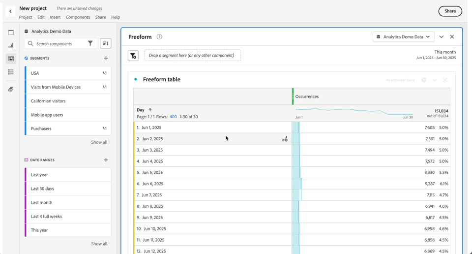

# Utiliser des composants dans un projet

Les composants représentent les données réelles de n’importe quel projet dans Analysis Workspace. Les composants comprennent les dimensions, les mesures, les segments et les périodes. Vous pouvez ajouter des composants à un projet en les faisant glisser dans des visualisations ou des panneaux.

Pour plus d’informations sur les types de composants que vous pouvez ajouter, consultez [Vue d’ensemble des composants](/help/analyze/analysis-workspace/components/analysis-workspace-components.md).

>[!TIP]
>
>Pour plus d’informations sur chaque composant, utilisez . Pour plus d’informations, consultez [Informations sur le composant](#component-info).

## Ajouter des composants à un projet

1. [Créez un projet dans Analysis Workspace](/help/analyze/analysis-workspace/build-workspace-project/create-projects.md).

1. [Ajoutez un panneau](/help/analyze/analysis-workspace/c-panels/panels.md#create-a-panel) ou [ajoutez une visualisation](/help/analyze/analysis-workspace/visualizations/freeform-analysis-visualizations.md#add-visualizations-to-a-panel) au projet dans Analysis Workspace. Si vous ajoutez un composant à un projet vierge, une visualisation de tableau à structure libre est déjà créée pour vous.

1. Sélectionnez  **[!UICONTROL Composants]** dans le panneau de boutons. Tous les composants disponibles s’affichent dans le panneau de gauche. Pour plus de détails, consultez [Interface](/help/analyze/analysis-workspace/home.md#interface).

1. Faites défiler l’écran jusqu’au composant à ajouter ou recherchez-le, puis faites-le glisser vers un panneau ou une visualisation de votre projet.

1. Vous pouvez éventuellement faire glisser un composant vers la zone de dépôt des segments dans un en-tête de panneau. Ce glisser-déposer définit le composant comme un segment et applique le segment à tout le contenu du panneau.
Pour plus d’informations sur l’utilisation de la zone de dépôt de segments sur un panneau pour segmenter votre panneau, consultez la section [Zone de dépôt](/help/analyze/analysis-workspace/c-panels/panels.md#drop-zone) de la [Présentation des panneaux](/help/analyze/analysis-workspace/c-panels/panels.md).

1. Pour des informations plus détaillées, voir les sections suivantes :

   * [Ajouter des dimensions à un projet](#add-dimensions-to-a-project)

   * [Ajouter des mesures à un projet](#add-metrics-to-a-project)

   * [Ajouter des segments à un projet](#add-segments-to-a-project)

   * [Ajouter des périodes à un projet](#add-date-ranges-to-a-project)

### Ajouter des dimensions à un projet

[Dimensions](/help/components/dimensions/overview.md) sont des variables dans Adobe Analytics qui contiennent généralement des valeurs de chaîne. En revanche, les [mesures](/help/components/calculated-metrics/cm-overview.md) contiennent des valeurs numériques liées à une dimension. Un rapport de base présente des lignes de valeurs de chaîne (dimension) en fonction d’une colonne de valeurs numériques (mesure).

1. Commencez par ajouter une dimension à votre projet dans Analysis Workspace, comme décrit dans la section [Ajouter des composants à un projet](#add-components-to-a-project).

1. Choisissez l’une des méthodes suivantes pour ajouter des dimensions et déterminer le type de données à analyser :

   

   * Faites glisser une dimension vers une visualisation (un tableau à structure libre, par exemple) dans Analysis Workspace.

   * Faites glisser une ou plusieurs dimensions du panneau de gauche vers la zone de dépôt des segments pour créer un segment rapide, comme décrit dans la section [Ajouter des segments à un projet](#add-filters-to-a-project).

1. Vous pouvez éventuellement ventiler les dimensions et les éléments de dimension dans Analysis Workspace avec d’autres composants. Pour plus d’informations, voir [Ventiler des dimensions dans Workspace](/help/analyze/analysis-workspace/components/dimensions/t-breakdown-fa.md).

Pour plus d’informations sur l’utilisation des dimensions dans Analysis Workspace, voir [Prévisualiser les dimensions](/help/analyze/analysis-workspace/components/dimensions/view-dimensions.md), [Ventiler les dimensions](/help/analyze/analysis-workspace/components/dimensions/t-breakdown-fa.md) et [Dimensions de répartition du temps](/help/analyze/analysis-workspace/components/dimensions/time-parting-dimensions.md).

### Ajouter des mesures à un projet

Les mesures vous permettent de quantifier les points de données dans Analysis Workspace. Elles sont généralement utilisées comme colonnes dans une visualisation et liées aux dimensions.

Pour ajouter une mesure à un projet dans Analysis Workspace :

1. Commencez à ajouter une mesure à votre projet dans Analysis Workspace, comme décrit dans la section [ Ajouter des composants à un projet ](#add-components-to-a-project).

1. Choisissez l’une des méthodes suivantes pour ajouter une mesure dans Analysis Workspace :

   

   * Faites glisser une mesure vers la zone de dépôt des mesures dans un tableau à structure libre vide pour afficher les tendances de cette mesure sur la période du projet.

   * Faites glisser une mesure lorsqu’une dimension est présente pour la comparer à chaque élément de dimension.

   * Faire glisser une mesure au-dessus d’un en-tête de mesure existant pour le remplacer.

   * Faites glisser une mesure à côté de la gauche ou de la droite d’un en-tête de mesure existant pour ajouter la nouvelle mesure.

   * Faites glisser une mesure au-dessus ou en dessous d’un en-tête de mesure existant pour créer un chevauchement de mesures.

Pour plus d’informations sur les mesures, voir [Mesures](/help/analyze/analysis-workspace/components/apply-create-metrics.md).

### Ajouter des segments à un projet

Les [segments](/help/components/segmentation/seg-overview.md) vous permettent d’identifier des sous-ensembles de personnes, de sessions ou d’événements en fonction de caractéristiques ou d’interactions spécifiques.

Vous pouvez utiliser des segments dans Analysis Workspace de l’une des manières suivantes :

* Ajouter des segments à un panneau
Lorsque vous ajoutez des segments à un panneau, les segments s’appliquent à tout le contenu du panneau.
Pour plus d’informations sur l’utilisation de la zone de dépôt de segments sur un panneau pour segmenter votre panneau, consultez la section [Zone de dépôt](/help/analyze/analysis-workspace/c-panels/panels.md#drop-zone) de la [Présentation des panneaux](/help/analyze/analysis-workspace/c-panels/panels.md).

* Ajouter des segments à une visualisation
Lorsque vous ajoutez des segments à une colonne d’un tableau à structure libre, les segments s’appliquent à tout le contenu de la colonne du tableau. Vous pouvez également ajouter des segments dans le cadre d’une visualisation des abandons.

* Utilisation de segments dans les composants
Lorsque vous définissez des composants tels que [mesures calculées](/help/components/calculated-metrics/workflow/c-build-metrics/metrics-with-segments.md), [annotations](/help/analyze/analysis-workspace/components/annotations/create-annotations.md#annotation-builder) ou même [segments](/help/components/segmentation/segmentation-workflow/seg-build.md) vous pouvez utiliser des segments dans le cadre de la définition.

### Ajouter des périodes à un projet

[Périodes](/help/analyze/analysis-workspace/components/calendar-date-ranges/calendar.md) déterminez la période de création de rapports dans Analysis Workspace. De plus, une plage de données peut être appliquée aux panneaux d’un projet ainsi qu’à certaines visualisations (comme le tableau à structure libre).

Par défaut, chaque panneau comprend une période. Il existe plusieurs façons de mettre à jour une période pour un panneau. Une méthode de mise à jour d’une période pour un panneau dans Analysis Workspace consiste à faire glisser un composant de période depuis le panneau de gauche :

1. Vous pouvez éventuellement ajouter une période à votre projet dans Analysis Workspace, comme décrit dans la section [Ajouter des composants à un projet](#add-components-to-a-project).

1. Effectuez un glisser-déposer d’une période du panneau de gauche sur :

   * La période en cours, pour modifier la période du panneau.

     

   * Une mesure ou une dimension dans une visualisation de tableau à structure libre. Pour plus d’informations, consultez [Utiliser des périodes](/help/analyze/analysis-workspace/components/calendar-date-ranges/calendar.md#use-date-ranges).

Pour plus d’informations sur l’utilisation et la gestion des périodes dans Analysis Workspace, consultez [Vue d’ensemble des périodes](/help/analyze/analysis-workspace/components/calendar-date-ranges/calendar.md).

## Informations sur le composant

Vous pouvez pointer sur n’importe quel composant pour afficher . Lorsque vous sélectionnez , une fenêtre contextuelle s’affiche avec des informations supplémentaires sur le composant.

Selon votre contrôle d’accès, vous pouvez :

* Accéder à la définition  [!UICONTROL Dictionnaire de données] du composant.
* Accédez au créateur de composants  à l’emplacement où le composant est défini.

<!--
# Use components in Analysis Workspace

Components make up the actual data of any project in Analysis Workspace. Components consist of dimensions, metrics, segments, and date ranges. You can add components to a project by dragging them into visualizations or panels.

For overview information about the types of components you can add, see [Components overview](/help/analyze/analysis-workspace/components/analysis-workspace-components.md).

>[!TIP]
>
>For information about each component, select the Info icon next to a component's name in the left rail of Analysis Workspace, or see the [Analytics Components Guide](/help/components/home.md).

## Begin adding components to a project

1. [Create a project in Analysis Workspace](/help/analyze/analysis-workspace/build-workspace-project/create-projects.md) if you haven't already.

1. [Add a panel](/help/analyze/analysis-workspace/c-panels/panels.md) or [add a visualization](/help/analyze/analysis-workspace/visualizations/freeform-analysis-visualizations.md#add-visualizations-to-a-panel) to the project in Analysis Workspace. 

   If you add a component to a blank project, a freeform table visualization is automatically created.

1. Select the **[!UICONTROL Components]** icon in the left rail.

   

1. Scroll to or search for the component you want to add, then drag it to a panel or visualization within your project. 

1. (Optional) Drag a component to the segment drop zone in a panel header. 

   Segments apply to all content within the panel.

   For information about how you can use the segment drop zone on a panel to filter your panel, see [Drop zone](/help/analyze/analysis-workspace/c-panels/panels.md#drop-zone) in [Panels overview](/help/analyze/analysis-workspace/c-panels/panels.md).

   

1. For more detailed information, continue with one of the following sections, depending on the component type you are adding:

   * [Add dimensions to a project](#add-dimensions-to-a-project)

   * [Add metrics to a project](#add-metrics-to-a-project)

   * [Add segments to a project](#add-segments-to-a-project)

   * [Add date ranges to a project](#add-date-ranges-to-a-project)

## Add dimensions to a project

[Dimensions](/help/components/dimensions/overview.md) are variables in Adobe Analytics that typically contain string values. Common dimensions include [Page](/help/components/dimensions/page.md), [Referring domain](/help/components/dimensions/referring-domain.md), or an [eVar](/help/components/dimensions/evar.md). In contrast, [metrics](/help/components/metrics/overview.md) contain numeric values that tie to a dimension. A basic report shows rows of string values (dimension), against a column of numeric values (metric).

1. Start adding a dimension to your project in Analysis Workspace, as described in [Begin adding components to a project](#begin-adding-components-to-a-project).

1. Choose one of the following methods to add dimensions and determine the type of data you want to analyze:

   * Drag a dimension to a visualization (such as a freeform table) in Analysis Workspace.

     
   
   * Drag one or more dimensions from the left rail onto the segment drop zone to create an ad hoc segment, as described in [Add segments to a project](#add-segments-to-a-project).

     

1. (Optional) You can break down dimensions and dimension items in Analysis Workspace with other components. 

   For more information, see [Break down dimensions](/help/analyze/analysis-workspace/components/dimensions/t-breakdown-fa.md).

For more information about how to use dimensions in Analysis Workspace, see [Preview dimensions](/help/analyze/analysis-workspace/components/dimensions/view-dimensions.md), [Break down dimensions](/help/analyze/analysis-workspace/components/dimensions/t-breakdown-fa.md), and [Time-parting dimensions](/help/analyze/analysis-workspace/components/dimensions/time-parting-dimensions.md).

## Add metrics to a project

[Metrics](/help/analyze/analysis-workspace/components/apply-create-metrics.md) allow you to quantify data points in Analysis Workspace. They are most commonly used as columns in a visualization and tied to dimensions.

To add a metric to a project in Analysis Workspace:

1. Start adding a metric to your project in Analysis Workspace, as described in [Begin adding components to a project](#begin-adding-components-to-a-project).

1. Choose one of the following methods to add a metric in Analysis Workspace:

   * Drag a metric to the metric drop zone in an empty Freeform table to see that metric trended over the project's date period. 

     

   * Drag a metric when a dimension is present to see that metric compared to each dimension item. 

   * Drag a metric on top of an existing metric header to replace it.

   * Drag a metric next to a header to see both metrics side-by-side.

For more information about how to use metrics in Analysis Workspace, see [Metrics](/help/analyze/analysis-workspace/components/apply-create-metrics.md).

## Add segments to a project

[Segments](/help/components/segmentation/seg-overview.md) allow you to identify subsets of visitors based on characteristics or specific interactions.

You can use segments in Analysis Workspace in any of the following ways:

### Add segments to a panel

When you add segments to a panel, the segments apply to all content within the panel.

For information about how you can use the segment drop zone on a panel to filter your panel, see [Drop zone](/help/analyze/analysis-workspace/c-panels/panels.md#drop-zone) in [Panels overview](/help/analyze/analysis-workspace/c-panels/panels.md).

### Add segments to a column in a freeform table

When you add segments to a column in a freeform table, the segments apply to all content within the table column.

### Use segments when creating calculated metrics

In the Calculated metric builder, you can apply segments within your metric definition. 

For more information, see [Segmented metrics](/help/components/calculated-metrics/workflow/c-build-metrics/metrics-with-segments.md).

## Add date ranges to a project

[Date ranges](/help/analyze/analysis-workspace/components/calendar-date-ranges/custom-date-ranges.md) determine the reporting time frame in Analysis Workspace, and can be applied to one or more panels within a project.

Each panel includes a date range by default. There are multiple ways to update a date range for a panel. One way to update a date range for a panel in Analysis Workspace is to drag a date range component from the left rail:

1. Start adding a date range to your project in Analysis Workspace, as described in [Begin adding components to a project](#begin-adding-components-to-a-project).

1. Drag a date range from the left rail onto the current date range in the upper-right portion of the panel.

     

For more information about how to use calendars and date ranges in Analysis Workspace, see [Calendar and date ranges overview](/help/analyze/analysis-workspace/components/calendar-date-ranges/calendar.md).

-->