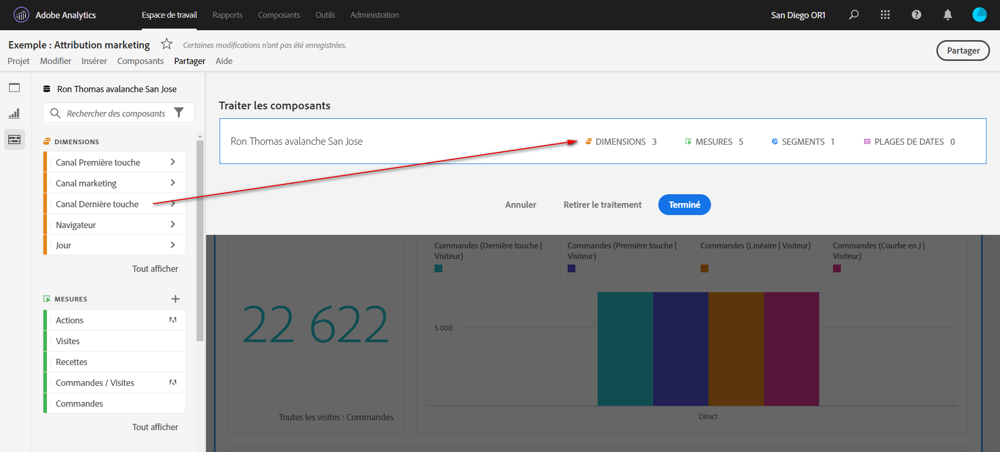

# Traitement des projets

Le traitement vous permet de limiter les composants (dimensions, mesures, segments, périodes) avant de partager un projet. Lorsqu’une personne destinataire ouvre le projet, elle voit un ensemble limité de composants que vous avez traités à sa place. Le traitement est une étape facultative mais recommandée avant de partager un projet.

>[!NOTE]
> Les profils de produit constituent le principal mécanisme contrôlant ce que voit un utilisateur. Ils sont gérés via l’Admin Console pour Adobe Experience Cloud. Le traitement est un filtre secondaire.

>[!BEGINSHADEBOX]

Voir  [Traitement des projets](https://video.tv.adobe.com/v/328084?captions=fre_fr&quality=12&learn=on){target="_blank"} pour une vidéo de démonstration.

>[!ENDSHADEBOX]

## Appliquer le traitement du projet

1. Sélectionnez **[!UICONTROL Partager]** > **[!UICONTROL Traiter les données du projet]**.
Les composants utilisés dans le projet sont automatiquement ajoutés.
Si un projet comporte plusieurs suites de rapports, une cible de dépôt de traitement s’affiche pour chaque suite de rapports du projet.
1. (Facultatif) Pour ajouter d’autres composants, faites glisser les composants à partager du panneau de gauche vers la zone de dépôt **[!UICONTROL Traiter les composants]** pour la suite de rapports.
1. Sélectionnez **[!UICONTROL Terminé]**.

Lorsqu’une personne destinataire ouvre un projet traité, elle ne voit que l’ensemble de composants traités que vous avez définis :

## Suppression du traitement du projet

Pour supprimer le traitement du projet et restaurer l’ensemble complet des composants dans le rail de gauche :

1. Sélectionnez **[!UICONTROL Partager]** > **[!UICONTROL Traiter les données du projet]**.
1. Sélectionnez **[!UICONTROL Supprimer le traitement]**.
1. Sélectionnez **[!UICONTROL Terminé]**.

## Traitement des suites de rapports virtuelles

Pour appliquer un traitement au niveau d’une suite de rapports, de sorte qu’il s’applique simultanément à de nombreux projets, vous pouvez [traiter des composants dans une suite de rapports virtuelle](/help/components/vrs/vrs-components.md).

>[!NOTE]
>
> Le traitement des suites de rapports virtuelles est toujours appliqué avant le traitement du projet. Même si votre projet traité inclut certains composants, ils sont exclus si la suite de rapports virtuelle traitée n’inclut pas ces composants.
> 

## Options de traitement des composants

Dans un projet traité ou une suite de rapports virtuelle, le destinataire a la possibilité de **[!UICONTROL Tout afficher]** composants dans le rail de gauche. [!UICONTROL Tout afficher] révèle différents ensembles de composants, en fonction des éléments suivants :

* Niveau d’autorisation de l’utilisateur ou l’utilisatrice (faisant ou non partie de l’équipe d’administration)
* Rôle du projet (personne propriétaire/éditrice ou non)
* Type de traitement appliqué (suites de rapports virtuelles ou projet)
* Composants détenus par l’utilisateur ou partagés avec lui. Les composants détenus/partagés incluent des segments, des mesures calculées et des périodes. Ils n’incluent pas les composants implémentés, tels que les eVars, les props et les événements personnalisés.

Remarque : les rôles de vue non administrateurs n’ont pas accès au rail de gauche dans un projet. Ils ont donc été omis du tableau ci-dessous.

| Type de traitement | Administrateurs | Rôle de propriétaire ou d’éditeur de projet non-administrateur | Rôle duplicata non administrateur |
|---|---|---|---|
| **Suite de rapports virtuelle sélectionnée** | Tous les composants de la suite de rapports virtuelle non traités | Composants de la suite de rapports virtuelle non traités appartenant à ce rôle ou avec lequel ils ont été partagés | Composants de la suite de rapports virtuelle non traités appartenant à ce rôle ou avec lequel ils ont été partagés |
| **Projet traité** | Tous les composants de projets non traités | Tous les composants de projets non traités | Composants de projets non traités possédés par ce rôle ou avec lequel ils ont été partagés |
| **Projet traité dans une suite de rapports virtuelle traitée** | Tous les composants non traités, affichés sous **[!UICONTROL Composants de projet non traités]** et **[!UICONTROL Composants de suites de rapports virtuelles non traités]** | Tous les composants de projet non traités ET tous les composants de suites de rapports virtuelles non traités appartenant à ce rôle ou partagés avec lui | Composants de projet et de suites de rapports virtuelles non traités appartenant à ce rôle ou partagés avec lui |
