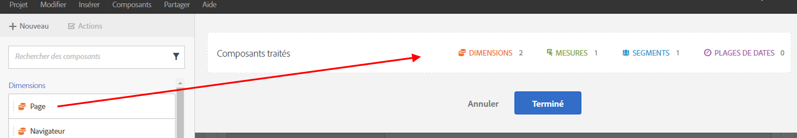
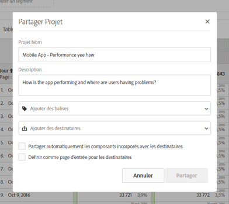

# Traitements et partages - Aperçu

Le traitement permet de limiter les composants avant de partager un projet. Vous pouvez traiter et partager un projet et ses composants avec les marketeurs et d’autres personnes qui ne sont pas des analystes de votre entreprise. Annotez et appliquez des balises aux projets.

**Vue d’ensemble des vidéos**

>[!VIDEO](https://www.youtube.com/watch?v=LJJRskdmlOg&amp;index=79&amp;t=0s&amp;list=PL2tCx83mn7GuNnQdYGOtlyCu0V5mEZ8sS)

**[!UICONTROL Workspace]** > **[!UICONTROL Share]**> **[!UICONTROL Curate Project Data]**

## Traiter les données du projet

1. Spécifiez les autorisations afin de créer et de traiter des projets.

   Before creating or curating an Analysis Workspace project, administrators must add you to a [group](https://marketing.adobe.com/resources/help/fr_FR/reference/groups.html) with the **[!UICONTROL Analysis Workspace Access]** permission enabled, or to the **[!UICONTROL All Report Access]** user group. ( **[!UICONTROL Admin]** > **[!UICONTROL User Management]** > **[!UICONTROL Groups]**).

1. [Créez et enregistrez](/help/analyze/analysis-workspace/build-workspace-project/t-freeform-project.md) un projet, puis cliquez sur **[!UICONTROL Share]** > **[!UICONTROL Curate Project Data]**.
1. Drag components you want to share from the draggable component stack on the left to the **[!UICONTROL Curated Components]** field.

   

   >[!IMPORTANT]
   >
   >Il n’est pas obligatoire de traiter les composants pour partager un projet. Vous pouvez partager un projet avec tous les composants par défaut disponibles ou avec certains composants sélectionnés. To preserve all of the default components in a project, a best practice is to create a copy of a project for yourself (using **[!UICONTROL Save As]**) prior to curating components. Une fois les composants traités dans un projet, vous n’avez plus accès aux autres composants pour ce même projet.

1. Cliquez sur **[!UICONTROL Done]**.

Le projet généré se comporte comme un projet type dans Analysis Workspace, mais uniquement avec les composants spécifiés.

## Partage d’un projet traité

Le partage rend ce projet disponible pour d’autres utilisateurs d’Analysis Workspace de votre entreprise. Tout traitement que vous avez effectué est reflété lorsque d’autres utilisateurs utilisent le projet.

1. After you curate the components of a report, click **[!UICONTROL Share]** > **[!UICONTROL Share Project]**.

   

1. Ajoutez des destinataires.
1. (Facultatif) Vous pouvez partager avec tous les destinataires les composants de projet incorporés (segments, mesures calculées et plages de dates). Une fois partagés, ces composants apparaîtront dans le menu déroulant des composants du Workspace du destinataire.

   >[!IMPORTANT]
   >
   >Ce paramètre est ponctuel ; c’est une action unique au moment du partage.

1. Vous pouvez également définir cette page comme page d’entrée pour les destinataires.

   >[!IMPORTANT]
   >
   >Ce paramètre est ponctuel ; c’est une action unique au moment du partage.

1. Cliquez sur **[!UICONTROL Share]**.

<!-- 

 <b>Annotate and tag a project</b> 
 

An alternative way to collaborate on a project is to use the Information panel. This panel will be re-introduced in an upcoming release. 
 

 
 
<ul id="ul_EFD045FD9F3B4BF8A70637B00EE0BC9C"> 
 <li id="li_EC6C5EAF9C234E76BDA7FF0226B82083">Tag reports for sharing. </li> 
 <li id="li_CF6A438C55F847F8890F8CB674CAA4F7">Specify the recipient (filter by permission group or user name), the storage folder. In-product notifications let users know that they have a shared report waiting. </li> 
 <li id="li_C8E088DA43024277908705CB0F3A142A">Write messages or report descriptions for recipients. </li> 
 <li id="li_342EB4758C344B859757E23691068FA3"> Select the dimensions, metrics, and segments to recommend to a non-analyst colleague, who can view the report you are curating and sharing. Curating the component gives the recipient access to those components, based on their permission settings. </li> 
 <li id="li_6487500F9315481599B7F3897998879F"> Add suggested items to a previously configured report. These new items exist as recommended selectable options. </li> 
</ul>

 -->

