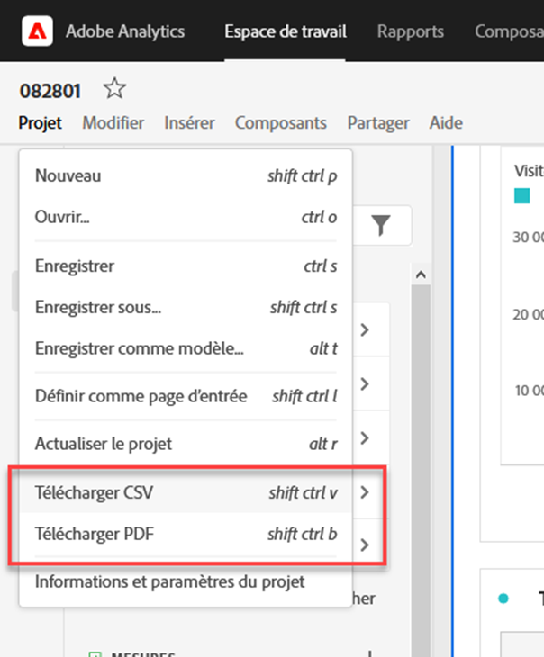
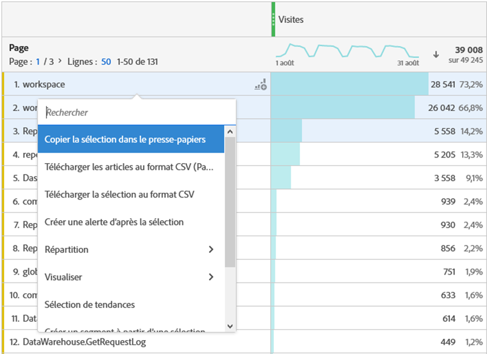
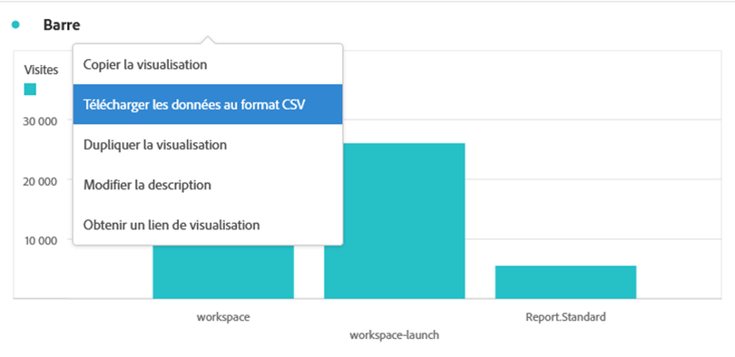
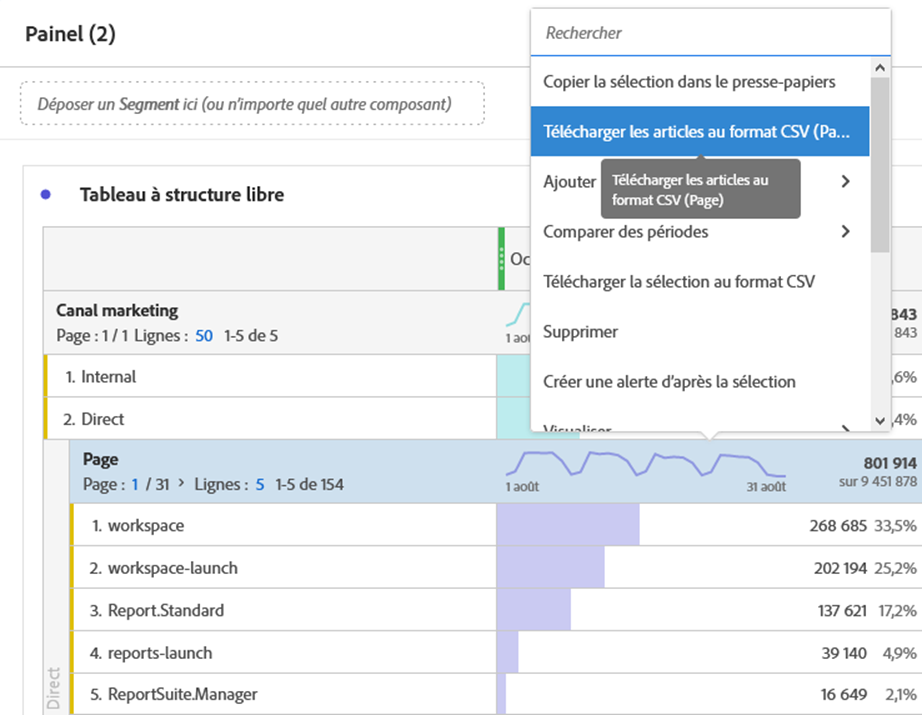
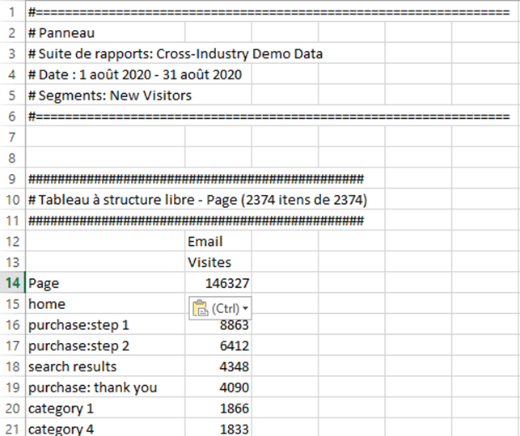

# Téléchargement de projets et de données

Vous pouvez télécharger des projets et des données Analysis Workspace sur votre appareil local. Ce téléchargement peut être un fichier de données copiées, un fichier CSV (valeurs séparées par des virgules) ou un document PDF (format de document portable).

* Sélectionnez l’option PDF si vous souhaitez que les visualisations soient incluses dans le fichier téléchargé.
* Sélectionnez les options CSV et données copiées si vous avez simplement besoin de données en texte brut.

D’autres méthodes d’exportation de données Adobe Analytics sont décrites dans le [guide d’exportation](/help/export/home.md).

## Télécharger un projet sous la forme d’un fichier PDF ou CSV {#download-project}

### Télécharger un projet sous forme de fichier PDF

Tenez compte des points suivants lorsque vous téléchargez un projet en tant que PDF :

* Ne quittez pas le projet tant qu’il n’a pas été téléchargé sur votre station de travail. Le téléchargement peut prendre plusieurs minutes, car le projet est réexécuté sur les serveurs Adobe pour que le PDF s’affiche. Vous pouvez continuer à apporter des modifications au projet pendant le rendu du téléchargement. Si le rendu d’un PDF dure plus de 5 minutes, vous êtes invité à [envoyer le PDF par e-mail](../curate-share/send-schedule-files.md) à la place.
* Les téléchargements sont générés en une seule page sans pagination.
* Le PDF contient les éléments visibles dans la page du navigateur d’Analysis Workspace. Pour éviter que le contenu ne soit tronqué, sélectionnez  pour redimensionner automatiquement les visualisations ou les panneaux aux dimensions personnalisées.
* Vous pouvez cliquer sur les [hyperliens](/help/analyze/analysis-workspace/visualizations/freeform-table/freeform-table-hyperlinks.md) des tableaux à structure libre dans le PDF téléchargé.

Pour télécharger un projet sous la forme d’un fichier PDF :

1. Sélectionnez **[!UICONTROL Projet]** > **[!UICONTROL Télécharger PDF]**.

   Une barre verte s’affiche avec le message suivant :  **[!UICONTROL Votre téléchargement a été demandé. Veuillez patienter.]**

1. Dès que votre téléchargement est prêt, une barre verte apparaît avec le message suivant :  **[!UICONTROL *Nom du projet *PDF est prêt.]**

1. Sélectionnez **[!UICONTROL Télécharger]** sur la barre verte.

   Selon les paramètres de votre navigateur, le PDF est automatiquement téléchargé vers le dossier que vous avez précédemment configuré, ou vous êtes invité à choisir un dossier dans lequel le PDF sera téléchargé.

   Le nom du fichier se compose de *nom du projet* - *nom de la suite de rapports* - *date*. Par exemple : `Example Project - Omni-Channel - Luma - Jun 30, 2025.pdf`.

### Téléchargement d’un projet au format CSV

1. Sélectionnez **[!UICONTROL Projet]** > **[!UICONTROL Télécharger CSV]**.

   Selon les paramètres de votre navigateur, le fichier CSV est automatiquement téléchargé dans un dossier que vous avez précédemment configuré, ou vous êtes invité à choisir un dossier dans lequel le fichier CSV sera téléchargé.

   Le nom du fichier se compose de *nom du projet* - *nom de la suite de rapports* - *date*. Par exemple : `Example Project - Omni-Channel - Luma - Jun 30, 2025.csv`.

## Copier les données d’une visualisation dans le presse-papiers {#copy-data}

L&#39;option **[!UICONTROL Copier dans le presse-papiers]** du menu contextuel permet de copier rapidement des données d&#39;Analysis Workspace et de les coller dans un outil tiers.

* Si vous souhaitez copier les données affichées dans le tableau, sélectionnez l’en-tête du tableau, puis sélectionnez **Copier les données dans le presse-papiers** dans le menu contextuel.
* Si vous souhaitez copier un sous-ensemble des données, effectuez une sélection dans le tableau et sélectionnez **Copier la sélection dans le presse-papiers** dans le menu contextuel.

>[!TIP]
>
>Vous pouvez utiliser la touche de raccourci **_cmd + c_** (macOS) ou **_ctrl + c_** (Windows) pour copier votre sélection dans le presse-papiers. Utilisez ensuite **_cmd + v_** (macOS) ou **_ctrl + v_** (Windows) pour coller les données.

{zoomable="yes"}

## Télécharger des données dans une visualisation sous la forme d’un fichier CSV {#download-data}

Les options Télécharger au format CSV du menu contextuel vous permettent de télécharger un tableau de données ou la source de données de toute visualisation au format CSV.

Pour ce faire, procédez comme suit :

* Dans l’en-tête d’un tableau ou d’une visualisation, sélectionnez **[!UICONTROL Télécharger les données au format CSV]** dans le menu contextuel. Cette option télécharge les données affichées dans le tableau ou la source de données sous-jacente pour une visualisation au format CSV.

<!-- Only relevant as soon as CJA supports Map visualization 
  >[!NOTE]
  >
  >  Note: the Map visualization does not support this option.
-->

* Dans un tableau, sélectionnez **[!UICONTROL Télécharger la sélection au format CSV]** dans le menu contextuel. Seule la sélection est téléchargée avec cette option, par opposition au tableau complet affiché.

## Télécharger les éléments au format CSV {#download-items}

Si vous souhaitez analyser plus de 400 lignes de données visibles dans un tableau, sélectionnez **Télécharger les éléments au format CSV (_nom du Dimension_)** dans le menu contextuel de l’en-tête du tableau ou de n’importe quelle ligne. Cette option exporte jusquʼà 50 000 éléments de dimension (selon le tri du tableau) pour la dimension sélectionnée, avec des options de tri et des filtres appliqués. Si vous sélectionnez cette option dans la partie supérieure du tableau, la première dimension du tableau est exportée.

Aucune limite n’est appliquée dans le tableau à structure libre. Pour garantir des performances optimales, il est recommandé d’utiliser cette option dans les tableaux de moins de 20 colonnes.

>[!TIP]
>
> Si votre dimension dépasse 50 000 éléments, téléchargez le fichier avec différentes mesures de tri appliquées ou appliquez un segment. Par exemple, triez les visites par ordre descendant dans un téléchargement, puis par ordre ascendant dans un second téléchargement. Cette astuce peut vous aider à récupérer des éléments à traîne longue.

Vous pouvez réaliser plusieurs tâches au sein du projet et même naviguer vers un nouveau projet Workspace dans le même onglet pendant le téléchargement est en cours. Le téléchargement est interrompu si vous ouvrez un nouvel onglet du navigateur. Le téléchargement est annulé si vous quittez complètement Workspace ou si vous fermez lʼonglet du navigateur.

### Fichier des éléments téléchargés {#items-file}

Les fonctionnalités suivantes d’un tableau à structure libre sont appliquées au fichier téléchargé :

* Tous les segments du panneau sont appliqués en tant que filtres.
* Les répartitions **au-dessus** de la dimension sélectionnée dans le tableau sont appliquées en tant que filtres au-dessus de chaque colonne.
* Les répartitions **en dessous** de la dimension sélectionnée dans le tableau sont supprimées.

### Notifications de téléchargement {#notifications}

Les notifications suivantes s’affichent au fur et à mesure des téléchargements du fichier :

* Un bleu **[!UICONTROL _Nom de la table _-_Dimension _.csv a été demandé._x _% terminé]**indiquant la progression. Pour annuler le téléchargement à tout moment, sélectionnez **[!UICONTROL Annuler le téléchargement]**. Sélectionnez  si vous souhaitez fermer le message, ce qui n’annule pas le téléchargement.
* Un **[!UICONTROL _Nom de la table _vert -_Dimension _.csv a été téléchargé]**notification d’achèvement une fois le téléchargement du fichier terminé. Le fichier est téléchargé dans le dossier des téléchargements configuré pour votre navigateur.

Si vous demandez plusieurs téléchargements à la fois, vous recevez une notification indiquant que chaque téléchargement supplémentaire est mis en file d’attente jusqu’à ce que le téléchargement précédent soit terminé.

## Questions fréquentes {#faq}

| Question | Réponse |
| --- | --- |
| Pourquoi mon PDF téléchargé ne comprend-il qu’une seule page ? | La fonctionnalité [Télécharger PDF](#download-as-csv-or-pdf) ne pagine pas les PDF téléchargés. |
| Puis-je exporter plus de 50 000 éléments avec l’option **[!UICONTROL Télécharger les éléments au format CSV]** ? | Bien que chaque téléchargement puisse contenir jusquʼà 50 000 éléments de dimension, vous pouvez modifier le tri de votre tableau pour récupérer des éléments à traîne longue ou appliquer un filtre pour télécharger des éléments plus spécifiques. |
| À quoi sert l’option **[!UICONTROL Copier la visualisation]** ? | Contrairement à [!UICONTROL **Copier les données dans le presse-papiers**] ou [!UICONTROL **Copier la sélection dans le presse-papiers**], l’option de menu contextuel **[!UICONTROL Copier la visualisation]** n’est pas une option d’exportation. Cette option vous permet de [copier une visualisation](/help/analyze/analysis-workspace/visualizations/freeform-analysis-visualizations.md#context-menu) ou [copier un panneau](/help/analyze/analysis-workspace/c-panels/panels.md#context-menu) d’un emplacement de Workspace à un autre. Par exemple, d’un panneau à un autre dans le même projet, ou d’un projet à un autre. |

<!--

# Download 

There are several ways to export data from Analysis Workspace. The method you choose depends on what set of data you want to analyze and who needs to access it.

Exported data can be in the form of copied data, CSV, or PDF. A PDF is typically preferred if you want visualizations included in the file. CSV and copied data is preferred if you simply want plain-text data.

## Download a project as CSV or PDF {#download-project}

Consider the following when downloading projects:

* When downloading projects as a CSV or PDF, the project can be saved or unsaved when you request a project download. However, only saved projects can be [scheduled](/help/analyze/analysis-workspace/curate-share/t-schedule-report.md). 

* When downloading projects as a PDF:
  * Downloads can take several minutes to export because the project is re-run on Adobe servers before rendering in PDF format. We recommend not leaving the project until the PDF downloads in your browser. However, you can continue to make changes to the project while you wait. If a PDF takes longer than 5 minutes to render, you will be prompted to email it instead.
  * Downloads are rendered as a single page with no pagination applied.
  * PDF renderings contain what is on the page in Workspace. If a project has custom-sized visualizations and panels, you need to change them to be auto-sized (button in top-right corner) so that there will be no truncated content.
  * Any [hyperlinks](/help/analyze/analysis-workspace/visualizations/freeform-table/freeform-table-hyperlinks.md) that exist within freeform tables are not functional in the downloaded PDF. 

To download a project as a CSV or PDF file:

1. Do either of the following, depending on what format you want to download the project in:

   * **PDF:** Select **[!UICONTROL Project]** > **[!UICONTROL Download PDF]**.

     Choose this option if you want the downloaded file to contain all the displayed (visible) tables and visualizations in the project.

   * **CSV:** Select **[!UICONTROL Project]** > **[!UICONTROL Download CSV]**. 

     Choose this option if you want plain-text data.

   

1. (Conditional) If you chose to download a PDF, a message is shown after the project is ready to be downloaded. Click [!UICONTROL **Download**].
1. Click the **[!UICONTROL Download this file]** icon and save the file to a folder of your choice.

## Copy data to clipboard (hotkey: cmd + c) {#copy-data}

The right-click option **[!UICONTROL Copy to clipboard]** lets you quickly copy data from Workspace and paste it in a third-party tool. 

* If you want the displayed table copied, right-click the table header and choose **Copy data to clipboard**. 
* If you want a subset of data copied, make a selection in the table and then right-click > **Copy selection to clipboard**.

>[!TIP]
>
>You can use the hotkey `Ctrl+C` to copy your selection to the clipboard, then use `Ctrl+V` to paste it into a third-party tool.

## Download data as CSV {#download-data}

The right-click option **[!UICONTROL Download data as CSV]** allows you to download a table of data or the data source of any visualization as a CSV.

* From the header of any table or visualization, right-click and choose **[!UICONTROL Download data as CSV]**. This downloads the displayed data in the table or the underlying data source for a visualization as a CSV. 

  >[!NOTE]
  >
  >  Note: the Map visualization does not support this option.

* Within a table, right-click and choose **[!UICONTROL Download selection as CSV]**. Only the selection is downloaded with this option, as opposed to the full, displayed table.

## Download items as CSV {#download-items}

If you want to analyze more than the visible 400 rows of data in a table, right-click the table header or any row and select **Download items as CSV (_Dimension name_)**. This option exports up to 50,000 dimension items (based on the table sort) for the selected dimension, with filters and segments applied. If you chose this option from the top of the table, the first dimension in the table will be exported. While no limits are enforced in the freeform table, it is recommended that the Download items option be used in tables with less than 20 columns to ensure optimal performance.

>[!TIP]
>
> If your dimension exceeds 50,000 items, download the file with different sort metrics applied or apply a filter. For example, sort descending by Visits in one download and then ascending by Visits in a second download. This tip can help you retrieve longer-tail items.

You can multi-task within the project and even navigate to a new Workspace project in the same tab while the download is in progress. The download pauses if you open a new browser tab. The download is canceled if you leave Workspace completely or close the browser tab.

### Downloaded items file 

Features of the table will be applied to the downloaded file as follows:

* All panel segments are applied as filters.
* Breakdowns **above** the selected dimension in the table are applied as filters above each column. 
* Breakdowns **below** the selected dimension in the table are removed.

In the example above, Page items are downloaded with the panel segment (New Visitors Customers) and components above (Marketing Channel = Email) applied as filters, and the components below (Mobile Device Type) removed from the downloaded CSV.

### Download notifications

As the file downloads, you will see an informational notification with the progress. At any time, you can cancel the download by clicking **[!UICONTROL Cancel download]**. Closing the toast **will not** cancel the download. 

Once the file completes, you will see a completion notification and the file will download to your browser.

If you request more than one download at a time, you will receive a notification that each additional download will be queued until the prior download completes.

## FAQ {#faq}

| Question | Answer |
| --- | --- |
| Why is my downloaded PDF one page? | Workspace does not paginate downloaded PDFs at this time. |
| Can I export more than 50,000 items with the "Download items as CSV" option? | While each download can contain up to 50,000 dimension items, you can change the sort of your table to retrieve longer tail items, or apply a filter to download more specific items. |
| What does **[!UICONTROL Copy visualization]** do? | Unlike [!UICONTROL **Copy data to clipboard**] or [!UICONTROL **Copy selection to clipboard**], the **[!UICONTROL Copy visualization]** right-click option is not an export option. It allows you to copy a visualization or panel from one place in Workspace to another. For example, from one panel to another in the same project, or from one project to another project. [Intra-linking video](https://experienceleague.adobe.com/docs/analytics-learn/tutorials/analysis-workspace/visualizations/intra-linking-in-analysis-workspace.html) |

-->