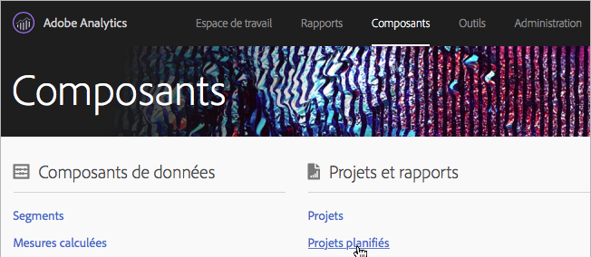
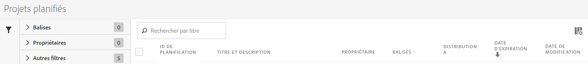

# Gestionnaire de projets planifiés

Gérez des projets planifiés d’Analysis Workspace.

**[!UICONTROL Analytics]** > **[!UICONTROL Composants]** > **[!UICONTROL Projets planifiés]**.

Dans le Gestionnaire de planification des projets, vous pouvez modifier et supprimer les livraisons répétitives de projets. Créez des calendriers de livraison afin d’envoyer les rapports par courriel vers une adresse spécifique. Vous pouvez configurer ces calendriers pour l’envoi automatique des rapports à des intervalles donnés pendant une période définie ou indéfiniment, ou arrêter la distribution d’un projet récurrent.

Le Gestionnaire de planification des projets affiche les éléments créés par un utilisateur spécifique. Si le compte d’utilisateur est désactivé dans l’application, toutes les livraisons planifiées sont interrompues.

* Modifier les projets planifiés
* Afficher l’ID de planification d’un projet (principalement utilisé à des fins de débogage)
* Rechercher des projets planifiés
* Marquer les projets planifiés
* Préciser/modifier le propriétaire d’un projet planifié
* Ajouter d’autres filtres, tels que : Approuvés, Échecs, Favoris, À moi, Tout afficher et Projets expirés.

* Définir la date d’expiration d’un projet planifié.

