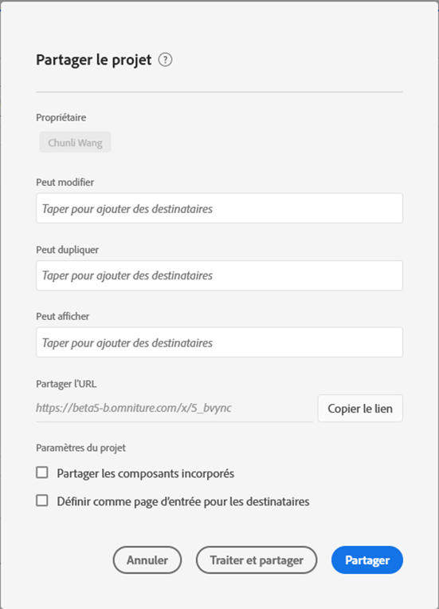

# Partage de projets {#share-projects}

>[!CONTEXTUALHELP]
>id="workspace_shareprojects"
>title="Partage de projets"
>abstract="Vous pouvez partager l’un de ces rôles de projet avec d’autres utilisateurs et utilisatrices de votre entreprise."

Vous pouvez partager un projet Analysis Workspace avec les types de personnes suivants :

* Personnes et groupes de votre organisation ayant accès à Adobe Analytics

  Vous pouvez partager l’accès Modifier, Dupliquer ou Afficher

* Personnes et groupes de votre entreprise qui n’ont pas accès à Adobe Analytics

  Les personnes destinataires ont un accès en lecture seule

* Personnes en dehors de votre organisation

  Les personnes destinataires ont un accès en lecture seule

Les [traitements](curate.md) appliqués avant le partage sont répercutés lorsque les personnes destinataires ouvrent le projet.

>[!BEGINSHADEBOX]

Voir  [Partager des projets](https://video.tv.adobe.com/v/40030?quality=12&learn=on&captions=fre_fr){target="_blank"} pour une vidéo de démonstration.

>[!ENDSHADEBOX]

## Partager avec des utilisateurs et des groupes de votre organisation {#Add}

Vous pouvez partager un projet avec des utilisateurs, des utilisatrices ou des groupes Analysis Workspace existants de votre organisation. Les utilisateurs et utilisatrices avec lesquels vous partagez le projet doivent disposer au préalable d’un accès à Adobe Analytics.

Vous pouvez partager un rôle spécifique avec des utilisateurs et utilisatrices ou des groupes, ainsi que partager un lien.

* [Partager un rôle de projet spécifique](#share-a-specific-project-role)

* [Partager un lien vers un projet](#share-a-link-to-a-project)

## Partager un rôle de projet spécifique

Lorsque vous partagez un rôle de projet spécifique avec des utilisateurs et utilisatrices et des groupes de votre organisation, tenez compte des points suivants :

* Les rôles de projet (**[!UICONTROL Modifier l’original]**, **[!UICONTROL Modifier la copie]** et **[!UICONTROL Lecture seule]**) s’appliquent à l’utilisateur ou à l’utilisatrice et à un ID de projet spécifique. Les rôles de projet ne dépendent pas des autorisations d’utilisation gérées dans l’[Admin Console d’Adobe Experience Cloud](https://experienceleague.adobe.com/docs/core-services/interface/manage-users-and-products/admin-getting-started.html?lang=fr).

* Dans Adobe Analytics, les groupes sont définis par profils de produits dans l’[Admin Console d’Adobe Experience Cloud](https://experienceleague.adobe.com/docs/core-services/interface/manage-users-and-products/admin-getting-started.html?lang=fr). Les administrateurs et administratrices peuvent partager des projets avec n’importe quel groupe, y compris « Tous ». Les personnes ne disposant pas de droit d’administration peuvent partager des projets avec des groupes dont elles sont membres, à l’exception de « Tous ».

* Si un utilisateur ou une utilisatrice reçoit plusieurs rôles, le rôle le plus élevé s’applique. Cela peut se produire si la personne est ajouté à la fois en tant que personne individuelle et en tant que membre d’un groupe. Par exemple, si une personne reçoit le rôle **[!UICONTROL Modifier l’original]** en tant que personne individuelle et le rôle **[!UICONTROL Lecture seule]** en tant que personne membre d’un groupe, elle recevra une expérience de projet **[!UICONTROL Modifier l’original]**.

* Les administrateurs et administratrices se voyant attribuer un rôle **[!UICONTROL Modifier la copie]** ou **[!UICONTROL Lecture seule]** bénéficient de ces expériences limitées lorsqu’ils ouvrent un projet. Une personne chargée de l’administration peut remplacer son rôle pour **[!UICONTROL Modifier l’original]** en partageant le projet avec elle-même, puis en accordant le rôle **Modifier**, comme décrit dans la procédure suivante.

* Si plusieurs projets sont sélectionnés pour le partage, des personnes destinataires seront ajoutées à la liste existante de personnes destinataires pour chaque projet.

  Par exemple, le projet A est déjà partagé avec les personnes destinataires 1, 2 et 3, tandis que le projet B est déjà partagé avec les personnes destinataires 4, 5 et 6.

  Les projets A et B sont ensuite partagés avec les personnes destinataires 4 et 7. La nouvelle liste de partage pour le projet A est désormais 1, 2, 3, 4 et 7, tandis que la nouvelle liste de partage pour le projet B est 4, 5, 6 et 7.

Pour partager un rôle de projet spécifique avec des utilisateurs et utilisatrices ou des groupes de votre organisation, procédez comme suit :

1. Dans Adobe Analytics, sélectionnez l’onglet [!UICONTROL **Workspace**], puis [!UICONTROL **Projets**] dans le rail de gauche.

1. Cochez la case en regard d’un ou plusieurs projets que vous souhaitez partager, puis sélectionnez [!UICONTROL **Partager**].

   Ou

   Pour partager un projet individuel uniquement, vous pouvez ouvrir le projet que vous souhaitez partager, puis sélectionner **[!UICONTROL Partager]** > **[!UICONTROL Partager avec les utilisateurs et utilisatrices Workspace]**.
Si des modifications n’ont pas enregistrées, on vous invite d’abord à enregistrer votre projet.

   La boîte de dialogue Partage de projets s’affiche. Les sections [!UICONTROL **Partager par lien**] et [!UICONTROL **Paramètres**] de la boîte de dialogue ne sont visibles que lors du partage d’un seul projet.

   

1. Ajoutez des personnes destinataires ou des groupes de personnes destinataires dans l’un des champs de rôle disponibles :

   **Modifier l’original :** les personnes destinataires peuvent **[!UICONTROL enregistrer]** les modifications dans un projet et agir en tant que personnes copropriétaires. Ce rôle est utile si vous souhaitez cogérer un projet avec d’autres collègues. Cela comprend la modification, la suppression et la modification des listes de destinataires pour un projet partagé.  Remarque : Analysis Workspace ne prend actuellement pas en charge la collaboration en direct. Il est donc recommandé qu’un seul utilisateur modifie un projet à la fois. Si les projets sont enregistrés en même temps, la dernière version est conservée.

   **Modifier la copie :** les personnes destinataires peuvent **[!UICONTROL enregistrer sous]** et ont accès au rail de gauche. Les interactions avec le projet ne sont pas limitées dans ce rôle. Ce rôle est utile si vous souhaitez partager un projet avec des utilisateurs et utilisatrices qui comprennent les données de votre organisation et comment utiliser Analysis Workspace, mais que vous ne souhaitez pas que votre projet soit modifié.

   **Lecture seule :** les personnes destinataires ne peuvent pas **[!UICONTROL enregistrer]** ou **[!UICONTROL enregistrer sous]** et n’ont pas accès au rail de gauche. Les interactions avec le projet sont également limitées. Ce rôle est utile si vous souhaitez partager un projet avec des utilisateurs et utilisatrices qui connaissent moins bien la structure de données de votre organisation, Analysis Workspace ou Adobe Analytics en général. Cependant, vous souhaitez tout de même que les utilisateurs et utilisatrices consomment des données et des insights dans un environnement sûr. En savoir plus sur l’[expérience de projet Lecture seule](/help/analyze/analysis-workspace/curate-share/view-only-projects.md).

1. (Conditionnel) Si vous partagez un seul projet, choisissez d’activer les options suivantes lors du partage du projet :

   * **Partager les composants intégrés au projet :** partagez avec l’ensemble des destinataires les segments, mesures calculées et périodes. Une fois partagés, ces composants apparaîtront dans le menu déroulant des composants de l’espace de travail de destination. Ce paramètre n’est pas persistant, il s’applique une seule fois, au moment du partage du projet.

   * **Définir comme page de destination pour les destinataires :** définit cette page comme page de destination pour les destinataires. Ce paramètre n’est pas persistant, il s’applique une seule fois, au moment du partage du projet.

1. Sélectionnez **[!UICONTROL Partager]**. (Si le projet a déjà été partagé, sélectionnez [!UICONTROL **Mettre à jour**].)

   Ou

   Sélectionnez **[!UICONTROL Traiter et partager]** pour appliquer automatiquement le traitement du projet. (Si le projet a déjà été partagé, sélectionnez **[!UICONTROL Traitement et mise à jour]**.) En savoir plus sur le [traitement du projet](https://experienceleague.adobe.com/docs/analytics/analyze/analysis-workspace/curate-share/curate.html?lang=fr).

## Partager un lien vers un projet

Lorsque vous partagez un lien comme décrit dans cette section, tenez compte des points suivants :

* Les destinataires qui utilisent le lien doivent se connecter à Adobe Analytics avant d’accéder au projet.

* Si la personne destinataire ne se voit pas attribuer un rôle et reçoit un [lien partageable](https://experienceleague.adobe.com/docs/analytics/analyze/analysis-workspace/curate-share/shareable-links.html?lang=fr) vers le projet, elle se verra attribuer un rôle par défaut. Les personnes chargées de l’administration reçoivent **[!UICONTROL Modifier l’original]** et les autres reçoivent **[!UICONTROL Modifier la copie]**.

Pour partager le lien du projet avec les utilisateurs et utilisatrices de votre organisation, procédez comme suit :

1. Enregistrez le projet. Si des modifications n’ont pas enregistrées, on vous invite à enregistrer votre projet avant de partager un lien.

1. Sélectionnez **[!UICONTROL Partager]** > **[!UICONTROL Partager avec les utilisateurs et utilisatrices Workspace]**, puis sélectionnez **[!UICONTROL Copier]** en regard du champ **[!UICONTROL Partager par lien]**.

   

1. Partagez le lien avec les utilisateurs et utilisatrices de votre organisation. Vous pouvez par exemple le coller dans un e-mail, sur un site web interne, etc.

## Partager un projet avec n’importe quelle personne (pas de connexion nécessaire) {#share-public-link}

>[!CONTEXTUALHELP]
>id="workspace_share_with_anyone_require_aec_authentication"
>title="Exiger une authentification Experience Cloud"
>abstract="Votre organisation exige que les utilisateurs et utilisatrices se connectent à Experience Cloud pour pouvoir utiliser ce lien."

Vous pouvez accorder un [accès en lecture seule](/help/analyze/analysis-workspace/curate-share/view-only-projects.md) vers les projets Analysis Workspace avec des personnes qui n’ont pas accès à Adobe Analytics. Cela peut inclure les personnes suivantes :

* Personnes en dehors de votre organisation

* Personnes de votre organisation qui n’ont pas accès à Adobe Analytics

>[!NOTE]
>
>Tenez compte des points suivants lors du partage d’un projet Analysis Workspace avec des personnes qui n’ont pas accès à Adobe Analytics :
>
>* La possibilité de partager un projet de cette manière peut être désactivée par l’administrateur ou l’administratrice Analytics, comme décrit dans la section [Préférences](/help/analyze/analysis-workspace/user-preferences.md). Si vous ne pouvez pas partager un projet comme décrit dans cette section, cela signifie que votre administrateur ou votre administratrice Analytics a désactivé cette fonctionnalité.
>
>* Les projets comportant plus de 50 visualisations étendues ne peuvent pas être partagés avec des personnes qui n’ont pas accès à Adobe Analytics.
>
>* Les personnes avec lesquelles vous partagez le projet peuvent afficher les filtres qui ont été appliqués au projet pendant le [traitement](curate.md).
> 
>* Les personnes avec lesquelles vous effectuez le partage peuvent modifier la période du projet. La période que vous définissez pour le projet s’affiche par défaut.
>
>* Un projet peut devenir inaccessible si de nombreuses personnes tentent d’accéder simultanément à un lien donné. Par défaut, plus de 190 personnes peuvent accéder à un seul lien toutes les 5 minutes. Si votre organisation atteint cette limite, patientez 5 minutes, puis tentez à nouveau d’accéder au lien.

>[!BEGINSHADEBOX]

Voir  [Partager un lien avec tout le monde](https://video.tv.adobe.com/v/3452452?quality=12&learn=on&captions=fre_fr){target="_blank"} pour une vidéo de démonstration.

>[!ENDSHADEBOX]

Pour partager un projet Analysis Workspace avec des personnes qui n’ont pas accès à Adobe Analytics :

1. Ouvrez le projet Analysis Workspace que vous souhaitez partager.

1. Cliquez sur **[!UICONTROL Partager]** > **[!UICONTROL Partager avec n’importe quelle personne]**.

   Si des modifications n’ont pas enregistrées, on vous invite à enregistrer votre projet.

   <!-- Add screen shot of new modal -->

1. Activez l’option **[!UICONTROL Le lien est actif]**, le cas échéant.

   Cette option crée un lien vers le projet qui peut être partagé avec tout le monde. Vous pouvez désactiver l’accès au projet à tout moment en désactivant cette option.

   La personne propriétaire du projet est également propriétaire de ce lien. La propriété du lien ne peut être transférée à une autre personne que lorsque la propriété du projet est transférée, comme décrit dans la section [Transférer les ressources utilisateur ou définir l’expiration du compte](/help/admin/admin/user-management2/users-assets.md) dans le guide d’administration d’Analytics.

1. Indiquez si l’option de sécurité suivante doit être activée (cette option peut être contrôlée par votre administrateur ou administratrice Analytics) :

   * **[!UICONTROL Exiger une authentification Experience Cloud] :**

     Lorsque cette option est activée, les seules personnes qui peuvent accéder au projet sont celles qui peuvent se connecter à l’organisation Adobe Experience Cloud dans laquelle le projet que vous partagez a été créé. Toutefois, les personnes avec lesquelles vous partagez vos données n’ont pas nécessairement besoin d’avoir accès à Adobe Analytics.

     Les administrateurs et administratrices d’Analytics peuvent configurer cette préférence pour l’entreprise, comme décrit dans [Préférences](/help/analyze/analysis-workspace/user-preferences.md). Selon la manière dont les administrateurs et administratrices ont configuré cette option, vous pouvez rencontrer les scénarios suivants :

      * Si cette option n’est pas visible, c’est que l’administrateur ou l’administratrice Analytics n’a pas activé cette fonctionnalité.

      * Si cette option est activée, mais non utilisée, votre administrateur ou administratrice Analytics exige l’authentification Experience Cloud pour toute personne accédant aux projets Analysis Workspace.

1. En regard du champ **[!UICONTROL Partager avec tout le monde (pas de connexion nécessaire)]**, cliquez sur l’icône **Copier le lien**  pour copier le lien dans le presse-papiers de votre système.

1. Partagez le lien avec les personnes que vous souhaitez voir accéder au projet. Par exemple, vous pouvez coller le lien dans un e-mail.

   Toute personne avec laquelle vous partagez le lien peut visualiser le projet Analysis Workspace.

1. (Facultatif) Vous pouvez cliquer sur l’icône **Générer un lien**  pour supprimer l’accès des personnes qui ont précédemment reçu un lien vers le projet. Un nouveau lien est généré, que vous pouvez partager avec les personnes que vous souhaitez voir accéder au projet.

1. Sélectionnez **[!UICONTROL Fermer]** pour fermer la boîte de dialogue de partage. Vos modifications sont automatiquement enregistrées.

## Afficher les projets partagés avec vous

Lorsqu’une personne partage un projet avec vous en [partageant un rôle de projet spécifique](#share-a-specific-project-role), vous pouvez accéder aux projets partagés à partir de l’[onglet Projets sur la page de destination d’Analytics](/help/analyze/landing.md#navigate-the-projects-tab).

Lorsqu’une personne partage un projet avec vous en partageant un lien (à partir de l’[onglet Partage de projets](#share-a-link-to-a-project) ou en utilisant un lien [partager avec tout le monde](#share-a-project-with-anyone-no-login-required)), vous devez utiliser le lien qui a été partagé avec vous pour accéder au projet. Par exemple, le lien peut avoir été partagé dans un e-mail, sur un site web interne, etc.

## Partager des composants intégrés

Vous pouvez partager les composants incorporés qui font partie de votre projet.

>[!BEGINSHADEBOX]

Voir  [Partager les composants incorporés](https://video.tv.adobe.com/v/327496?quality=12&learn=on&captions=fre_fr){target="_blank"} pour une vidéo de démonstration.

>[!ENDSHADEBOX]

## Questions fréquentes {#FAQs}

| Question | Réponse |
| --- | --- |
| Que se passe-t-il si deux éditeurs enregistrent un projet en même temps ? | Les modifications ne sont pas fusionnées et la dernière version enregistrée du projet sera conservée. Analysis Workspace ne prend actuellement pas en charge la collaboration en direct. |
| Que se passe-t-il si un destinataire reçoit un rôle en tant qu’individu et un autre rôle en tant que membre d’un groupe ? | Si un destinataire reçoit plusieurs rôles, il obtient toujours l’expérience la plus élevée. Par exemple, si une personne destinataire reçoit le rôle **[!UICONTROL Modifier l’original]** en tant que personne individuelle et le rôle **[!UICONTROL Lecture seule]** en tant que personne membre d’un groupe, elle reçoit l’expérience de projet **[!UICONTROL Modifier l’original]**. |
| Quelle expérience obtient un destinataire s’il ouvre un lien de projet ? | Les destinataires reçoivent le rôle que vous leur avez attribué dans le modal de partage. Si une personne destinataire ne se voit pas attribuer de rôle et qu’elle reçoit un lien vers le projet (**[!UICONTROL Partager]** > **[!UICONTROL Partager avec les utilisateurs et utilisatrices Workspace]**, puis sélectionner **[!UICONTROL Copier]** en regard du champ **[!UICONTROL Partager par lien]**), elle sera placée dans un rôle par défaut. Les administrateurs et administratrices reçoivent le rôle **[!UICONTROL Modifier l’original]** et les autres personnes le rôle **[!UICONTROL Modifier la copie]**. |
