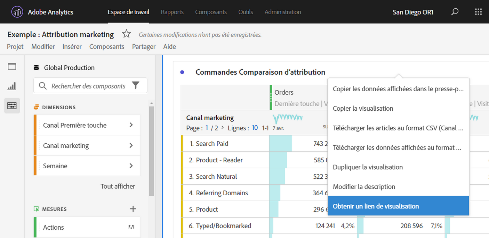
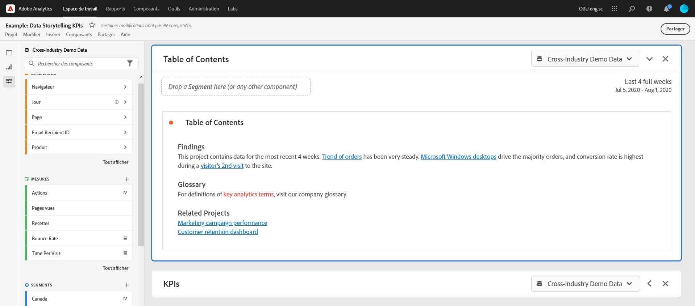

# Création de liens partageables

Analysis Workspace offre de nombreuses méthodes pour partager un projet avec les utilisateurs, notamment la possibilité d’obtenir un lien vers un projet ou une partie spécifique d’un projet. Certains types de liens requièrent que le destinataire se connecte à Adobe Analytics avant d’accéder au projet, contrairement à d’autres.

## Obtention d’un lien de projet à partager avec d’autres utilisateurs de Workspace {#project-link}

Pour partager un lien vers un projet, accédez au projet que vous souhaitez partager, puis sélectionnez Aller à [!UICONTROL **Partager**] > [!UICONTROL **Partage avec les utilisateurs de Workspace**] > [!UICONTROL **Partager par lien**]. Les utilisateurs avec lesquels vous partagez le lien doivent se connecter.

Si le destinataire du lien n’a pas reçu de [rôle de projet](https://experienceleague.adobe.com/docs/analytics/analyze/analysis-workspace/curate-share/share-projects.html?lang=fr), les administrateurs reçoivent **[!UICONTROL Peut modifier]** et les non-administrateurs reçoivent **[!UICONTROL Peut dupliquer]** expériences.

## Obtenir un lien en lecture seule à partager avec n’importe qui

{{release-limited-testing-section}}

Vous pouvez partager un lien en lecture seule vers les projets Analysis Workspace avec des personnes qui n’ont pas accès à Adobe Analytics. Les utilisateurs avec lesquels vous partagez le lien ne sont pas tenus de se connecter.

Pour plus d’informations, reportez-vous à la section &quot;Partage d’un projet avec quiconque (aucune connexion requise)&quot; de l’article. [Partage de projets](/help/analyze/analysis-workspace/curate-share/share-projects.md).

## Obtention du lien vers le panneau ou la visualisation {#panel-link}

Vous pouvez également partager un lien vers une partie spécifique d’un projet, telle qu’un panneau ou une visualisation individuelle. On parle parfois d’intra-liens. Cela peut s’avérer utile pour attirer l’attention de vos utilisateurs et utilisatrices sur les points clés du projet.

* Dans n’importe quel en-tête de panneau, cliquez avec le bouton droit sur **[!UICONTROL Obtenir un lien vers le panneau]**
* Dans n’importe quel tableau ou en-tête de visualisation, cliquez avec le bouton droit sur **[!UICONTROL Obtenir un lien vers la visualisation]**

[Regardez la vidéo](https://experienceleague.adobe.com/docs/analytics-learn/tutorials/analysis-workspace/visualizations/intra-linking-in-analysis-workspace.html?lang=fr) sur les méthodes de création de liens et utilisez-les pour diriger les destinataires vers des parties spécifiques de votre projet.

## Utilisation de liens dans une table des matières {#TOC}

Pour tirer parti des différentes options de lien, il est conseillé de toujours inclure une table des matières dans la partie supérieure de votre projet Workspace. Dans la table des matières, vous pouvez créer des liens vers d’autres projets pertinents, des panneaux et des visualisations spécifiques. Cela facilite la navigation pour le destinataire du projet.

[Regardez la vidéo](https://experienceleague.adobe.com/docs/analytics-learn/tutorials/analysis-workspace/navigating-workspace-projects/create-a-toc-in-analysis-workspace.html?lang=fr) sur les méthodes de création d’une table des matières à l’aide de liens et de l’éditeur de texte enrichi de Workspace.

