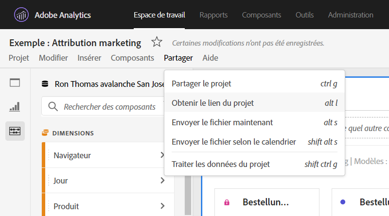

# Création de liens partageables

Analysis Workspace offre de nombreuses méthodes pour partager un projet avec les utilisateurs, notamment la possibilité d’obtenir un lien vers un projet ou une partie spécifique d’un projet. Pour la plupart des types de liens, les utilisateurs qui reçoivent un lien doivent se connecter à Adobe Analytics avant d’accéder au projet.

## Obtention du lien du projet {#project-link}

Pour partager un lien vers le projet complet, accédez à **[!UICONTROL Partager > Obtenir le lien du projet]**. Si le destinataire du lien ne s’est pas vu attribuer un [rôle de projet](https://experienceleague.adobe.com/docs/analytics/analyze/analysis-workspace/curate-share/share-projects.html?lang=fr), les administrateurs reçoivent les expériences **[!UICONTROL Peut modifier]** et les non-administrateurs reçoivent les expériences **[!UICONTROL Peut dupliquer]**.

## Obtention du lien vers le panneau ou la visualisation {#panel-link}

Vous pouvez également partager un lien vers une partie spécifique d’un projet, telle qu’un panneau ou une visualisation individuelle. On parle parfois d’intra-liens. Cela peut s’avérer utile pour attirer l’attention de vos utilisateurs sur les informations clés du projet.

* Dans n’importe quel en-tête de panneau, cliquez avec le bouton droit sur **[!UICONTROL Obtenir un lien vers le panneau]**
* Dans n’importe quel tableau ou en-tête de visualisation, cliquez avec le bouton droit sur **[!UICONTROL Obtenir un lien vers la visualisation]**

[Regardez la vidéo](https://experienceleague.adobe.com/docs/analytics-learn/tutorials/analysis-workspace/visualizations/intra-linking-in-analysis-workspace.html?lang=fr) sur les méthodes de création de liens et utilisez-les pour diriger les destinataires vers des parties spécifiques de votre projet.

## Utilisation de liens dans une table des matières {#TOC}

Pour tirer parti des différentes options de lien, il est conseillé de toujours inclure une table des matières dans la partie supérieure de votre projet Workspace. Dans la table des matières, vous pouvez créer des liens vers d’autres projets pertinents, des panneaux et des visualisations spécifiques. Cela facilite la navigation pour le destinataire du projet.

[Regarder la vidéo](https://experienceleague.adobe.com/docs/analytics-learn/tutorials/analysis-workspace/navigating-workspace-projects/create-a-toc-in-analysis-workspace.html?lang=fr) sur la création d’une table des matières à l’aide de liens et de l’éditeur de texte enrichi de Workspace.

