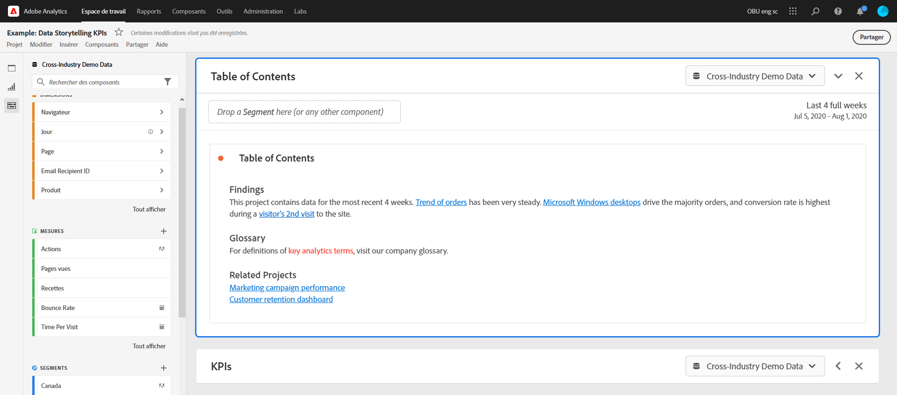
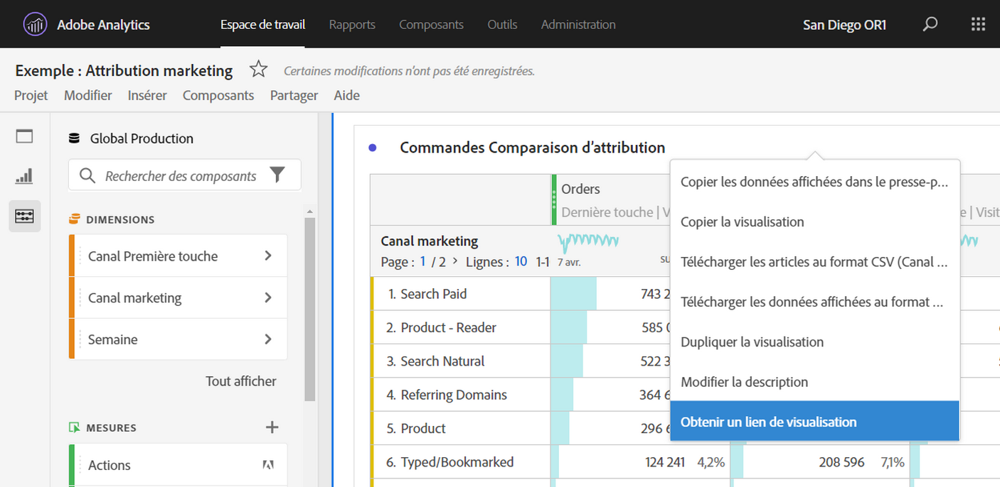

# Création de liens partageables

Analysis Workspace offre de nombreuses méthodes pour partager un projet avec les utilisateurs, notamment la possibilité d’obtenir un lien vers un projet ou une partie spécifique d’un projet. Certains types de liens requièrent que la personne destinataire se connecte à Adobe Analytics avant d’accéder au projet, contrairement à d’autres.

## Obtenir un lien de projet à partager avec d’autres utilisateurs et utilisatrices de Workspace {#project-link}

Pour partager un lien vers un projet, accédez au projet à partager, puis sélectionnez **[!UICONTROL Partager]** > **[!UICONTROL Obtenir le lien du projet]** (ou **[!UICONTROL Partager]** > **[!UICONTROL Partager avec les utilisateurs Workspace]** > **[!UICONTROL Partager par lien]**). Les utilisateurs et utilisatrices avec qui vous partagez le lien doivent se connecter.

Si le destinataire du lien n’a pas reçu de [rôle de projet](/help/analyze/analysis-workspace/curate-share/share-projects.md), les administrateurs reçoivent les expériences **[!UICONTROL Modifier l’original]** et les non-administrateurs reçoivent **[!UICONTROL Modifier la copie]**.

## Obtenir un lien en lecture seule à partager avec n’importe qui

Vous pouvez partager un lien en lecture seule vers les projets Analysis Workspace avec des personnes qui n’ont pas accès à Adobe Analytics.

Pour plus d’informations, voir [Partager avec tout le monde](/help/analyze/analysis-workspace/curate-share/share-projects.md#share-a-project-with-anyone-no-login-required).

## Obtenir un lien vers un panneau ou une visualisation {#panel-link}

Vous pouvez également partager un lien vers une partie spécifique d’un projet, telle qu’un panneau ou une visualisation individuelle. On parle parfois d’intra-liens. Cela peut s’avérer utile pour attirer l’attention de vos utilisateurs et utilisatrices sur les points clés du projet.

* Dans le menu contextuel d’un en-tête de panneau, sélectionnez **[!UICONTROL Obtenir le lien du panneau]**
* Dans le menu contextuel d’un en-tête de visualisation, sélectionnez **[!UICONTROL Obtenir le lien de la visualisation]**

[Regardez la vidéo](https://experienceleague.adobe.com/docs/analytics-learn/tutorials/analysis-workspace/visualizations/intra-linking-in-analysis-workspace.html?lang=fr) sur les méthodes de création de liens et utilisez-les pour diriger les destinataires vers des parties spécifiques de votre projet.

## Utilisation de liens dans une table des matières {#TOC}

Pour tirer parti des différentes options de lien, il est conseillé de toujours inclure une table des matières dans la partie supérieure de votre projet Workspace. Dans la table des matières, vous pouvez créer des liens vers d’autres projets pertinents, des panneaux et des visualisations spécifiques. Cela facilite la navigation pour le destinataire du projet.

[Regardez la vidéo](https://experienceleague.adobe.com/docs/analytics-learn/tutorials/analysis-workspace/navigating-workspace-projects/create-a-toc-in-analysis-workspace.html?lang=fr) sur les méthodes de création d’une table des matières à l’aide de liens et de l’éditeur de texte enrichi de Workspace.

<!--
# Create shareable links

Analysis Workspace offers many ways to share a project to your users, including the ability to get a link to a project or a specific part of a project. Some link types require the recipient to log in to Adobe Analytics before accessing the project, while others do not. 

## Get a project link to share with other Workspace users {#project-link} 

To share a link to a project, go to the project you want to share, then select go to [!UICONTROL **Share**] > [!UICONTROL **Share with Workspace users**] > [!UICONTROL **Share by link**]. Users you share the link with are required to log in. 

If the recipient of the link has not been assigned a [project role](/help/analyze/analysis-workspace/curate-share/share-projects.md), admins receive **[!UICONTROL Edit original]** and non-admins receive **[!UICONTROL Edit copy]** experiences.

## Get a read-only link to share with anyone

You can share a read-only link to Analysis Workspace projects with people who don't have access to Adobe Analytics. Users you share the link with are not required to log in. 

For more information, see "Share a project with anyone (no login required)" in the article [Share projects](/help/analyze/analysis-workspace/curate-share/share-projects.md).

## Get panel or visualization link {#panel-link} 

You can also share a link to a specific part of a project, such as a panel or individual visualization. This is sometimes referred to as intra-linking. This can be useful to draw your users' attention to key insights within the project.  

* From any panel header, right-click **[!UICONTROL Get panel link]** 
* From any table or visualization header, right-click **[!UICONTROL Get visualization link]** 

[Watch the video](https://experienceleague.adobe.com/docs/analytics-learn/tutorials/analysis-workspace/visualizations/intra-linking-in-analysis-workspace.html) on how to create links and use them to drive recipients to specific parts of your project. 

-->