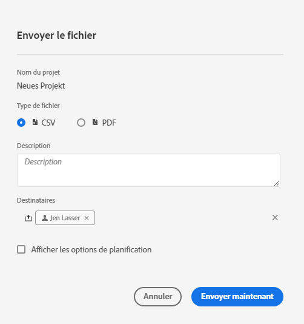
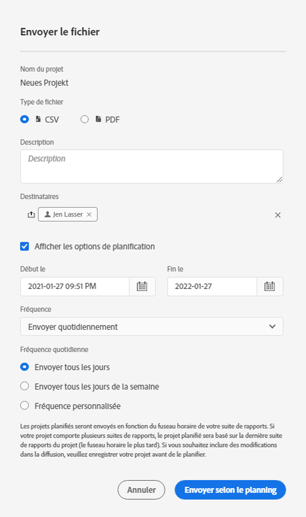

# Envoyer et planifier des projets

Vous pouvez envoyer des projets Adobe Analytics sous forme de fichiers à des utilisateurs sélectionnés par e-mail. Vous pouvez envoyer des fichiers ad hoc ou configurer les fichiers à envoyer selon un planning. Les fichiers peuvent être envoyés au format CSV ou PDF.

Toutes les balises appliquées au projet sont automatiquement appliquées à l’export.

D’autres méthodes d’exportation des données Adobe Analytics sont également disponibles, comme décrit dans la section [Présentation de l’exportation](/help/export/home.md).

## Envoyer le fichier

Pour envoyer un fichier ad hoc aux destinataires par e-mail :

1. Sélectionnez **[!UICONTROL Partager] > [!UICONTROL Envoyer le fichier]**.
1. Spécifiez le type de fichier :
   * [!UICONTROL **CSV**] : choisissez cette option si vous souhaitez des données en texte brut.
   * [!UICONTROL **PDF**] : choisissez cette option si vous souhaitez que le fichier téléchargé contienne tous les tableaux et visualisations affichés (visibles) dans le projet.
1. (Facultatif) Utilisez **[!UICONTROL Description]** pour ajouter une description à inclure dans l’e-mail.
1. Ajoutez des destinataires ou des groupes. Vous pouvez également saisir des adresses e-mail.
1. (Facultatif) Sélectionnez **[!UICONTROL Afficher les options de planification]** pour [planifier une exportation de fichier](#schedule-file-export).
1. Cliquez sur **[!UICONTROL Envoyer maintenant]**. Sélectionnez **[!UICONTROL Annuler]** pour annuler.

## Planifier l’export de fichier {#schedule}

Pour envoyer un fichier selon un planning aux destinataires par e-mail

1. Sélectionnez **[!UICONTROL Partager] > [!UICONTROL Planifier l’exportation de fichier]**.
1. Spécifiez le type de fichier :
   * [!UICONTROL **CSV**] : choisissez cette option si vous souhaitez des données en texte brut.
   * [!UICONTROL **PDF**] : choisissez cette option si vous souhaitez que le fichier téléchargé contienne tous les tableaux et visualisations affichés (visibles) dans le projet.
1. (Facultatif) Utilisez **[!UICONTROL Description]** pour ajouter une description à inclure dans l’e-mail.
1. Ajoutez des destinataires ou des groupes. Vous pouvez également saisir des adresses e-mail.
1. (Uniquement pour les clients Healthcare Shield) Indiquez un mot de passe pour [protéger par mot de passe un rapport planifié](#password-protect-a-new-scheduled-project).
1. Assurez-vous que **[!UICONTROL Afficher les options de planification]** est sélectionné.
1. Sélectionnez une **[!UICONTROL Fréquence]**. Vous pouvez choisir entre :

   | Fréquence | Options |
   |---|---|
   | **[!UICONTROL Envoyer par heure]** | Saisissez une valeur pour **[!UICONTROL Envoyer toutes les heures]**. |
   | **[!UICONTROL Envoyer quotidiennement]** | Sélectionnez une **[!UICONTROL Fréquence quotidienne]** : **[!UICONTROL Envoyer tous les jours]**, **[!UICONTROL Envoyer tous les jours de la semaine]** ou **[!UICONTROL Fréquence personnalisée]**. Si vous sélectionnez **[!UICONTROL Fréquence personnalisée]**, saisissez une valeur pour **[!UICONTROL Envoyer tous les jours]**. |
   | **[!UICONTROL Envoyer une fois par semaine]** | Saisissez une valeur pour **[!UICONTROL Envoyer toutes les semaines]**. Sélectionnez ensuite un **[!UICONTROL Jour de la semaine]**. |
   | **[!UICONTROL Envoyer mensuellement par jour de la semaine]** | Sélectionnez un **[!UICONTROL Jour de la semaine]** et un **[!UICONTROL Semaine du mois]**. |
   | **[!UICONTROL Envoyer mensuellement par jour du mois]** | Sélectionnez une valeur dans **[!UICONTROL Envoyer ce jour du mois]**. |
   | **[!UICONTROL Envoyer annuellement par jour du mois]** | Sélectionnez un **[!UICONTROL Jour de la semaine]**, une **[!UICONTROL Semaine du mois]** et une **[!UICONTROL Mensuel de l’année]**. |
   | **[!UICONTROL Envoyer annuellement par date spécifique]** | Sélectionnez un **[!UICONTROL Mois de l’année]** et sélectionnez une valeur dans **[!UICONTROL Envoyer ce jour du mois]**. |

1. Saisissez une date de début dans **[!UICONTROL À partir du]**. Vous pouvez également sélectionner  pour choisir une date de début dans le calendrier.

1. Saisissez une date de fin dans **[!UICONTROL Se terminant le]**. Vous pouvez également sélectionner  pour choisir une date de fin dans le calendrier.
1. Sélectionnez **[!UICONTROL Envoyer selon le calendrier]**. Sélectionnez **[!UICONTROL Annuler]** pour annuler.

## Gestionnaire de projets planifiés {#manager}

Les projets Analysis Workspace planifiés peuvent être gérés à partir de l’interface principale, en utilisant **[!UICONTROL Composants]** > **[!UICONTROL Projets planifiés]**. Pour plus d’informations, consultez [Projets planifiés](/help/components/scheduled-projects-manager.md).

<!--
# Schedule projects

From the Workspace **Share menu**, you can send Analysis Workspace projects using email to selected recipients. Files can be sent in CSV or PDF format. After you share scheduled projects, you can edit the schedule settings to modify the frequency, receipient list, or file type using the Scheduled Projects manager.

## Send file now

To send a file immediately to recipients via email:

1. Click **[!UICONTROL Share] > [!UICONTROL Export file]**.
1. Specify the file type:
   * [!UICONTROL **CSV**]: Choose this option if you want plain-text data.
   * [!UICONTROL **PDF**]: Choose this option if you want the downloaded file to contain all the displayed (visible) tables and visualizations in the project.
1. (Optional) Add a description to include in the email to explain the file being received. 
1. Add recipients or groups. Email addresses can also be entered. 
1. Click **[!UICONTROL Send Now]**.
1. (Optional) Click **[!UICONTROL Show scheduling options]** to specify a delivery schedule.

## Send file on schedule

To send a file on a recurring schedule to recipients via email:

1. Click **[!UICONTROL Share] > [!UICONTROL Schedule file export]**.
1. Specify the file type (CSV or PDF).
1. (Optional) Add a description that will be included in the email to explain the file being received. 
1. Add recipients or groups. Email addresses can also be entered. 
1. Specify the range the schedule should be delivered over by modifying Starting on and Ending on inputs. The end date must be within a year from the day the schedule is created or modified.
1. Specify the delivery frequency. Each frequency allows for different customizations. 
1. Click **[!UICONTROL Send on schedule]**.

## Manage scheduled projects

When you manage scheduled projects, you can edit and delete recurring project schedules:

*  Change the file type (.csv or PDF)
*  Update the project description
*  Add or remove recipients
*  Change the frequency

Scheduled Analysis Workspace projects can be managed under **Analytics > Components > Scheduled Projects**.

For more information, see [Scheduled projects](/help/components/scheduled-projects-manager.md)
-->
