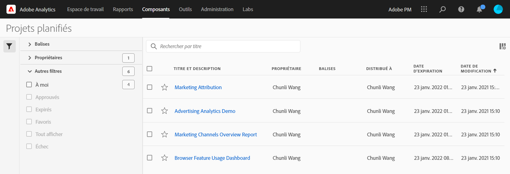

# Projets planifiés

Dans le menu **** Partager de Workspace, vous pouvez envoyer des projets Analysis Workspace par courrier électronique aux destinataires sélectionnés. Les fichiers peuvent être envoyés au format CSV ou PDF.

## Envoyer le fichier maintenant

Pour envoyer un fichier immédiatement aux destinataires par courriel :

1. Click **Share > Send File Now**.
1. Spécifiez le type de fichier (CSV ou PDF).
1. (Facultatif) Ajoutez une description qui sera incluse dans le courrier électronique pour expliquer le fichier reçu.
1. ajoutez des destinataires ou des groupes. Les adresses électroniques peuvent également être saisies.
1. Cliquez sur **Envoyer maintenant**.
1. (Facultatif) Cliquez sur **Afficher les options** de planification pour spécifier une planification de diffusion.

## Envoyer le fichier selon le calendrier

Pour envoyer un fichier selon un calendrier récurrent aux destinataires par courriel :

1. Click **Share > Send File on Schedule**.
1. Spécifiez le type de fichier (CSV ou PDF).
1. (Facultatif) Ajoutez une description qui sera incluse dans le courrier électronique pour expliquer le fichier reçu.
1. ajoutez des destinataires ou des groupes. Les adresses électroniques peuvent également être saisies.
1. Spécifiez la plage dans laquelle la planification doit être remise en modifiant les valeurs de début et de fin sur les entrées. La date de fin doit être comprise dans l&#39;année qui suit la création ou la modification de la planification.
1. Spécifiez la fréquence de diffusion. Chaque fréquence permet différentes personnalisations.
1. Cliquez sur **Envoyer selon la planification**.

## Gestionnaire de projets planifiés

Les projets Analysis Workspace planifiés peuvent être gérés sous **Analytics > Composants > Projets** planifiés.

Dans le Gestionnaire de projets planifiés, vous pouvez modifier et supprimer des planifications de projets récurrentes. Recherchez un calendrier dans la barre de recherche ou en utilisant les options de filtre dans le rail de gauche. Vous pouvez filtrer par balise, planifications approuvées, propriétaires, etc.

Les actions courantes suivantes sont répertoriées dans le Gestionnaire de projets planifiés :

| Action | Description |
|---|---|
| **Modifier le planning** | Cliquez sur le titre de la planification pour mettre à jour ses paramètres de diffusion. |
| **Supprimer le planning** | Sélectionnez le projet planifié dans la liste, puis cliquez sur Supprimer dans le menu. Cela supprimera le calendrier sélectionné pour le projet ; le projet lui-même ne sera pas supprimé. |
| **Balises d’Ajoute** | Sélectionnez le projet planifié dans la liste, puis choisissez &quot;Balise&quot; ou &quot;Approuver&quot; pour organiser vos planifications et faciliter leur recherche. |
| **Vue des planifications en échec** | Accédez au rail de gauche > Autres filtres > Impossible d&#39;afficher les planifications qui ont échoué. |
| **Planifications de vue expirées** | Accédez au rail de gauche > Autres filtres > Expiré pour afficher les planifications qui ont expiré. Cliquez sur le titre de la planification pour configurer une nouvelle planification de la livraison. |
| **ID de planification de la vue** | Accédez aux options de colonne en haut à droite et ajoutez la colonne ID de planification au tableau. L’ID planifié est souvent utile pour le débogage. |

Le Gestionnaire de planification des projets affiche les éléments créés par un utilisateur spécifique. Si le compte d’utilisateur est désactivé dans l’application, toutes les livraisons planifiées sont interrompues. La propriété du projet planifié peut être **transférée** à un nouvel utilisateur sous **Administration > Utilisateurs et ressources Analytics > Transférer des ressources**.
