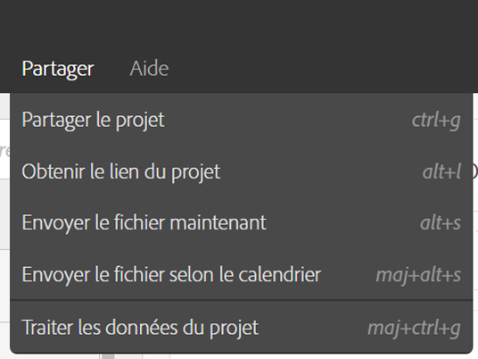
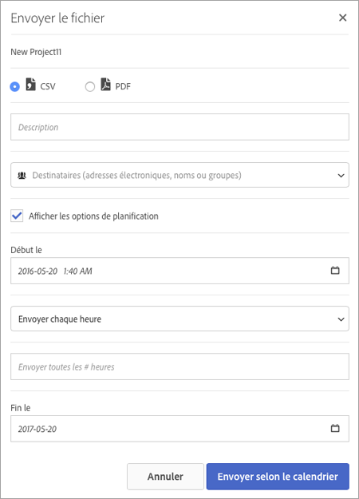

# Envoi d’un fichier – Planification de la livraison d’un projet

Envoyez un projet Analysis Workspace par courrier électronique ou planifiez une livraison.

1. [Créez un projet Analysis Workspace](https://marketing.adobe.com/resources/help/fr_FR/analytics/analysis-workspace/t_freeform_project.html) et enregistrez-le.
1. Cliquez sur **[!UICONTROL Partager]** > **[!UICONTROL Envoyer le fichier selon le calendrier]**.

   

1. Sur la page [!UICONTROL Envoyer le fichier], sélectionnez le format de fichier (CSV ou PDF).

   

1. Ajoutez des adresses électroniques de destinataires ou leur nom et cliquez sur **[!UICONTROL Envoyer maintenant]**.
1. (Facultatif) Cliquez sur **[!UICONTROL Afficher les options de planification]** pour planifier une livraison et cliquez sur **[!UICONTROL Envoyer selon le calendrier]**.
1. Gérez les projets planifiés dans **[!UICONTROL Composants]** > [Projets planifiés](/help/analyze/analysis-workspace/curate-share/schedule-projects.md).
