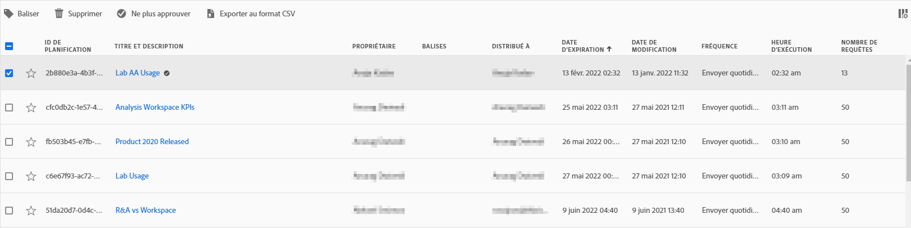

# Planification de projets

Dans le **menu Partager** de Workspace, vous pouvez envoyer des projets Analysis Workspace par courrier électronique aux destinataires sélectionnés. Les fichiers peuvent être envoyés au format CSV ou PDF.

## Envoyer le fichier maintenant

Pour envoyer un fichier immédiatement aux destinataires par courrier électronique :

1. Cliquez sur **[!UICONTROL Partager] > [!UICONTROL Exporter le fichier]**.
1. Spécifiez le type de fichier (CSV ou PDF).
1. (Facultatif) Ajoutez une description qui sera incluse dans le courrier électronique pour décrire le fichier reçu.
1. Ajoutez des destinataires ou des groupes. Vous pouvez également saisir les adresses électroniques.
1. Cliquez sur **[!UICONTROL Envoyer maintenant]**.
1. (Facultatif) Cliquez sur **[!UICONTROL Afficher les options de planification]** pour planifier une livraison.

## Envoyer le fichier selon le calendrier

Pour envoyer un fichier selon un calendrier récurrent aux destinataires par courrier électronique :

1. Cliquez sur **[!UICONTROL Partager] > [!UICONTROL Planification de l’exportation du fichier]**.
1. Spécifiez le type de fichier (CSV ou PDF).
1. (Facultatif) Ajoutez une description qui sera incluse dans le courrier électronique pour décrire le fichier reçu.
1. Ajoutez des destinataires ou des groupes. Vous pouvez également saisir les adresses électroniques.
1. Précisez la période pendant laquelle la livraison doit être effectuée en modifiant les entrées Début le et Fin le. La date de fin doit se situer dans un délai d’un an à compter du jour de la création ou de la modification de la planification.
1. Spécifiez la fréquence de livraison. Chaque fréquence offre différentes personnalisations.
1. Cliquez sur **[!UICONTROL Envoyer selon le calendrier]**.

## Gestionnaire de projets planifiés

Les projets Analysis Workspace planifiés peuvent être gérés sous **Analytics > Composants > Projets planifiés**.

Dans le Gestionnaire de projets planifiés, vous pouvez modifier et supprimer les calendriers de projets récurrents. Utilisez la barre de recherche ou les options de filtre dans le rail de gauche pour rechercher un calendrier. Vous pouvez filtrer par balise, calendriers approuvés, propriétaires, etc.

| Champ | Description |
| --- | --- |
| [!UICONTROL Favoris] | Sélectionnez l’icône en forme d’étoile pour marquer ce planning comme favori. |
| [!UICONTROL Identifiant de planification] | Cet identifiant est principalement utilisé à des fins de débogage. |
| [!UICONTROL Titre et description] | Titre et description de ce projet. |
| [!UICONTROL Propriétaire] | Personne qui a créé le projet et qui en est le propriétaire. |
| [!UICONTROL Balises] | (facultatif) Le balisage est un moyen efficace d’organiser les projets. Tous les utilisateurs peuvent créer des balises et en appliquer une ou plusieurs à un projet. Néanmoins, vous ne pouvez afficher les balises que pour les projets que vous possédez ou qui ont été partagés avec vous. |
| [!UICONTROL Distribué à] | Le ou les destinataires de ce projet planifié. |
| [!UICONTROL Date d’expiration] | Pour toute fréquence de projet planifiée, vous pouvez définir la date d’expiration jusqu’à un an à l’avenir. |
| [!UICONTROL Fréquence] | Fréquence à laquelle vous souhaitez envoyer ce projet planifié au(x) destinataire(s). |
| [!UICONTROL Heure d’exécution] | Heure à laquelle ce projet planifié est envoyé. |
| [!UICONTROL Nombre de requêtes] | Nombre de requêtes concernant ce projet. |

## Actions courantes

Actions courantes du Gestionnaire de projets planifiés :

| Action | Description |
|---|---|
| **[!UICONTROL Modifier le planning]** | Cliquez sur le titre du planning pour mettre à jour les paramètres de livraison. |
| **[!UICONTROL Supprimer le planning]** | Sélectionnez le projet planifié dans la liste, puis cliquez sur Supprimer dans le menu. Cela supprime le planning sélectionné pour le projet ; le projet lui-même n’est pas supprimé. |
| **[!UICONTROL Ajout de balises]** | Sélectionnez le projet planifié dans la liste, puis « Balise » ou « Approuver » pour organiser vos plannings et faciliter les recherches. |
| **[!UICONTROL Afficher les plannings échoués]** | Accédez au rail de gauche > Autres filtres > Échec pour afficher les plannings qui ont échoué. |
| **[!UICONTROL Afficher les plannings expirés]** | Accédez au rail de gauche > Autres filtres > Expiré pour afficher les plannings qui ont expiré. Cliquez sur le titre du planning pour configurer un nouveau planning de diffusion. |
| **[!UICONTROL Afficher l’ID de planning]** | Accédez aux options relatives aux colonnes dans le coin supérieur droit et ajoutez la colonne ID de planning dans le tableau. L’ID planifié est souvent utile pour le débogage. |

Le Gestionnaire de planification des projets affiche les éléments créés par un utilisateur spécifique. Si le compte d’utilisateur est désactivé dans l’application, toutes les livraisons planifiées sont interrompues. La propriété du projet planifié peut être **transférée** à un nouvel utilisateur sous **Admin > Utilisateurs et ressources Analytics > Transférer les ressources**.
