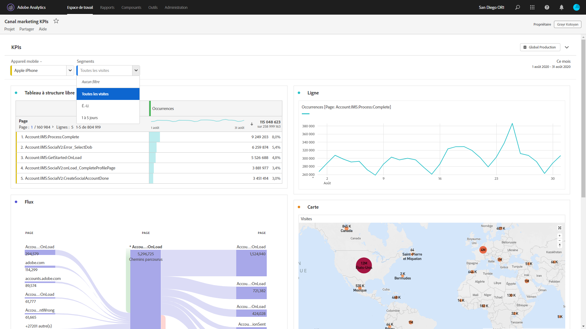

# Projets en lecture seule

Vous pouvez partager des projets « en lecture seule » avec des destinataires via le [processus de partage de projets](/help/analyze/analysis-workspace/curate-share/share-projects.md). Les destinataires placés dans le rôle Peut afficher profiteront d’une expérience de projet plus limitée. Cela peut être utile si vous partagez un projet avec des utilisateurs et utilisatrices qui connaissent moins bien la structure de données de votre organisation, Analysis Workspace ou Adobe Analytics en général, tout en souhaitant qu’ils consomment des données et des informations dans un environnement sûr.

Notez que vous pouvez modifier la période du calendrier du panneau, même dans les projets en lecture seule.

>[!BEGINSHADEBOX]

Voir  [Projets en lecture seule](https://video.tv.adobe.com/v/36206?quality=12&learn=on){target="_blank"} pour une vidéo de démonstration.

>[!ENDSHADEBOX]

## Interactions désactivées

Les interactions désactivées dans un projet en lecture seule sont les suivantes :

* Rail de gauche masqué
* Suite de rapports
* Filtrage à structure libre
* Nombre de lignes visibles de la structure libre
* Paramètres de ligne, de colonne ou de visualisation à structure libre
* Segments de panneau
* Menus Modifier, Insérer et Composant
* Conseils relatifs à Workspace

## Interactions activées

Voici quelques-unes des interactions activées les plus intéressantes dans un projet en lecture seule :

| Zone | Interactions activées |
| --- | --- |
| Tableaux à structure libre | <ul><li>Pagination et tri</li><li>Survol</li><li>Sélection de cellules qui mettent à jour les visualisations liées</li><li>Clic droit > Obtenir un lien vers la visualisation</li><li>Clic droit > Copier dans le Presse-papiers</li></ul> |
| Visualisations | <ul><li>Clic pour activer/désactiver la légende</li><li>Survol</li><li>Clic droit > Obtenir un lien vers la visualisation</li><li>Réduire/Développer</li><li>Flux - développer les nœuds de flux</li><li>Carte - zoom</li></ul> |
| Panneaux | <ul><li>Filtres déroulants interactifs</li><li>Clic droit > Obtenir un lien vers le panneau</li><li>Réduire/Développer</li></ul> |
| Projet | <ul><li>Inspection de toutes les icônes d’informations</li><li>Menu Projet - Nouveau, Ouvrir, Définir comme page de destination, Actualiser, Télécharger CSV/PDF, Informations et paramètres limités du projet</li><li>Menu Partager - Obtenir le lien du projet, Envoyer le fichier maintenant</li><li>Menu Aide - Toutes les actions à l’exception des options Conseils et Débogueur</li></ul> |
