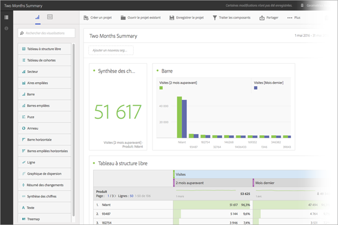
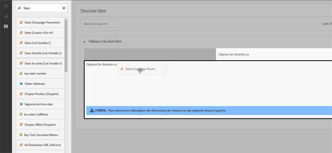
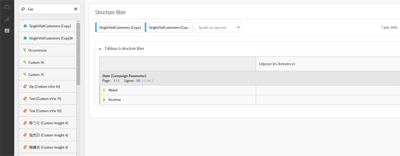
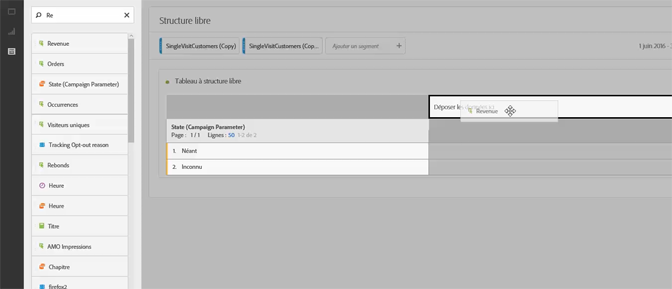
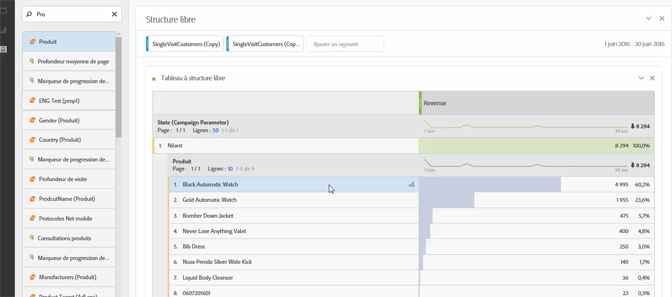
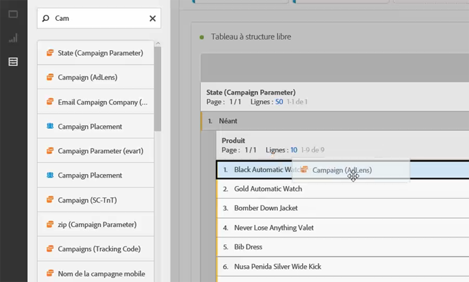
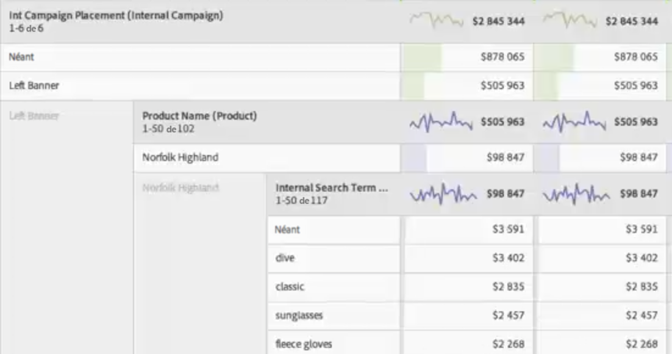

# Cas d’utilisation d’Analysis Workspace

Exemples d’utilisation des tableaux de données et des segments et suggestions d’utilisation d’Analysis Workspace.

Effectuez des recherches directement dans vos données afin de répondre à des questions spécifiques et de compiler des commentaires sur les interactions de vos clients et les intérêts d’audience. Dans un environnement à structure libre, vous pouvez appliquer des dimensions, des mesures et des segments au fil du temps afin de récupérer directement les données ciblées. Concevez votre analyse afin de personnaliser vos questions spécifiques, puis publiez les informations dans des rapports et des visualisations complexes qui pourront être partagés et facilement interprétés par tous les utilisateurs, même les plus pressés.

**Exemples**

* En tant qu’entreprise de médias, vous souhaitez comparer vos nouveaux visiteurs, vos visiteurs réguliers et vos visiteurs les plus fidèles afin d’observer l’évolution de la consommation du contenu au fil du temps pour chaque segment.
* Comparez les taux de conversion des mots-clés liés à la marque ou non.
* Ventilez les pages vues par recherche interne, recherche externe, page d’entrée, etc. afin de comprendre pourquoi des termes liés ou non à la marque produisent des résultats différents.
* Comparez les colonnes ou les lignes d’un jour à l’autre afin d’analyser la croissance pour plusieurs mesures.
* Exécutez une requête simple, par exemple rebonds selon une dimension.

## Exemple de vente au détail  {#section_9EFDEF038CAD4954BCFB118A8F33A96F}

Supposons que vous soyez un analyste marketing pour un vendeur au détail d’équipement de plein air et que vous deviez étudier les performances d’une promotion récente pour Pâques et formuler des recommandations sur la manière d’optimiser les campagnes sur site. Cet exemple explique comment comparer les données sur les recettes de la campagne pour différents segments et ajouter des ventilations afin d’approfondir davantage l’analyse de la campagne.

1. Sélectionnez la suite de rapports appropriée.
1. Recherchez, par exemple, la dimension Positionnements de campagne internes et faites-la glisser dans la section de gauche de la trame du tableau (ces données généreront les lignes du tableau).

   

1. Cliquez maintenant sur l’icône de segment à gauche et faites glisser d’autres segments de fidélisation des clients sur le côté droit de la trame. Vous allez comparer instantanément les segments les uns par rapport aux autres. Ceci constituera les colonnes du tableau.

   

1. Cliquez sur l’icône Événements (Mesures) à gauche et ajoutez la mesure des recettes sous chaque segment. Remarquez la manière dont le rapport est automatiquement généré. Vous pouvez maintenant commencer à comparer les recettes de campagne pour ces segments de clients.

   

1. Si maintenant vous souhaitez savoir quels produits seront les plus efficaces dans l’emplacement de la bannière de gauche sur vos pages, ventilez la bannière de gauche par nom de produit. Il vous suffit de cliquer sur l’icône Dimensions et de faire glisser la dimension du nom de produit sur le haut de la bannière de gauche.

   

1. Vous pouvez approfondir davantage encore l’analyse. Vous pouvez demander quels termes de recherche sont employés par les visiteurs pour accéder à votre produit le plus vendeur, Norfolk Highland. Il vous suffit pour cela de faire glisser la dimension Terme de recherche interne en haut du nom du produit :

   

   Un nouveau résultat de ventilation s’affiche :

   

   Vous avez déjà ventilé les données de manière à générer des recommandations et des ventes croisées pour vos équipes de marchandisage afin de mettre en œuvre d’autres campagnes et de générer davantage de recettes pour votre entreprise. Vous pouvez créer d’autres ventilations jusqu’à obtenir les résultats attendus.

   À présent, vous pouvez  [partager](/help/analyze/analysis-workspace/curate-share/curate.md) le rapport avec ces équipes de marchandisage.

