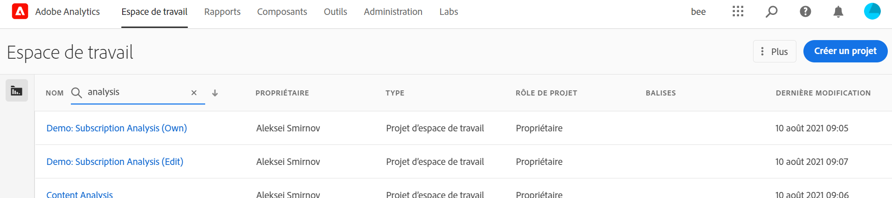
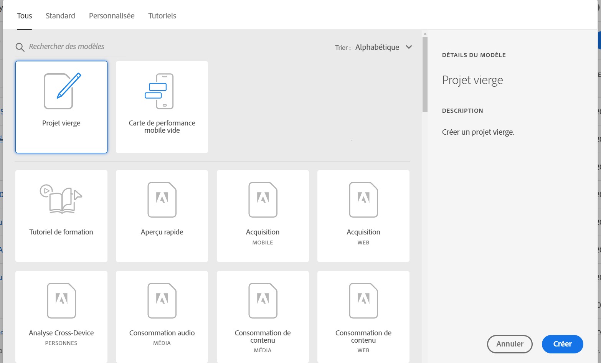

# Aperçu d’Analysis Workspace

Analysis Workspace est un outil de navigation flexible qui vous permet de créer rapidement des analyses et de partager des informations. L’interface par glisser-déposer vous permet de concevoir votre analyse, d’ajouter des visualisations pour donner vie aux données, de traiter un jeu de données, de partager et de planifier des projets avec toute personne de votre organisation.

Si vous ne disposez que de quelques minutes, regardez ce bref aperçu pour découvrir l’ensemble des possibilités.

>[!VIDEO](https://video.tv.adobe.com/v/26266/?quality=12)

## Connexion à Adobe Analytics {#login}

Pour commencer à utiliser Analysis Workspace, connectez-vous à Adobe Analytics en accédant à [experience.adobe.com/analytics](http://experience.adobe.com/analytics). Si vous n’avez pas encore sélectionné de projet spécifique, vous accédez à la page d’accueil de la liste de projets Workspace.

## Utilisation du tutoriel de formation {#training-tutorial}

Une fois votre connexion effectuée, votre première étape doit être le tutoriel de formation Analysis Workspace, qui vous guide tout au long de la terminologie et des étapes courantes pour créer votre première analyse dans Workspace. Pour commencer le tutoriel, cliquez sur **[!UICONTROL Créer un projet]**, puis sélectionnez **Tutoriel de formation** dans la fenêtre modale du nouveau projet.

## Créer un nouveau projet {#new-project}

Une fois le tutoriel terminé, vous êtes prêt à commencer à créer votre premier projet. La **fenêtre modale du nouveau projet** vous offre différentes options pour démarrer votre analyse. Vous pouvez choisir de commencer à partir d’un projet vide ou à partir d’une [fiche d’évaluation mobile vide](https://docs.adobe.com/content/help/fr-FR/analytics/analyze/mobapp/curator.html), selon que vous prévoyez de partager votre analyse à partir du navigateur ou de l’application mobile des tableaux de bord Adobe Analytics.

Vous pouvez également commencer votre analyse à partir de **modèles** prédéfinis, soit des modèles standard fournis par Adobe, soit des modèles personnalisés créés par votre organisation. Plusieurs modèles différents sont disponibles, selon l’analyse ou le cas pratique que vous avez en tête. [En savoir plus](https://docs.adobe.com/content/help/fr-FR/analytics/analyze/analysis-workspace/build-workspace-project/starter-projects.html) sur les différentes options de modèle disponibles.

## Créer votre analyse {#analysis}

Dans votre projet Workspace, **les panneaux, les tableaux, les visualisations et les composants** sont accessibles à partir du rail de gauche. Ce sont les blocs de construction de votre projet.

### Composants

Les **composants** sont les dimensions, les mesures, les segments ou les périodes, et ils peuvent tous être combinés dans un **[!UICONTROL tableau à structure libre]** pour commencer à répondre à la question que vous vous posez. Veillez à vous familiariser avec chaque [type de composant](/help/analyze/analysis-workspace/components/analysis-workspace-components.md) avant de poursuivre votre analyse. Une fois que vous maîtrisez la terminologie des composants, vous pouvez commencer à faire glisser et à déposer des éléments pour [créer votre analyse](https://docs.adobe.com/content/help/fr-FR/analytics/analyze/analysis-workspace/build-workspace-project/t-freeform-project.html) dans un **[!UICONTROL tableau à structure libre]**.

### Visualisations

Les **visualisations**, telles qu’un graphique à barres ou en courbes, sont ensuite superposées aux données pour leur donner vie. Dans le rail de l’extrême gauche, sélectionnez l’icône **[!UICONTROL Visualisations]** du milieu pour afficher la liste complète des [visualisations](https://docs.adobe.com/content/help/fr-FR/analytics/analyze/analysis-workspace/visualizations/freeform-analysis-visualizations.html) disponibles.

### Panneaux

Les **panneaux** permettent d’organiser votre analyse au sein d’un projet et peuvent contenir de nombreux tableaux et visualisations. Analysis Workspace fournit de nombreux panneaux qui génèrent un ensemble complet d’analyses basées sur quelques entrées d’utilisateurs. Dans le rail de l’extrême gauche, sélectionnez l’icône **[!UICONTROL Panneaux]** du dessus pour afficher la liste complète des [panneaux](https://docs.adobe.com/content/help/fr-FR/analytics/analyze/analysis-workspace/panels/panels.html) disponibles.

## Ressources supplémentaires {#resources}

* Adobe propose des centaines de [tutoriels de formation vidéo Analytics](https://docs.adobe.com/content/help/en/analytics-learn/tutorials/overview.html).
* Voir [Nouveautés d’Analysis Workspace](/help/analyze/analysis-workspace/new-features-in-analysis-workspace.md) pour des mises à jour des nouvelles fonctionnalités.
