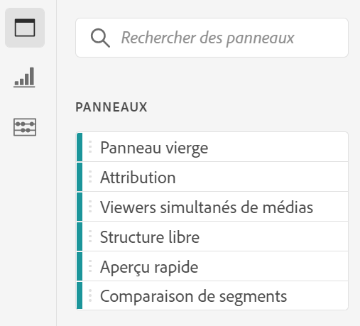
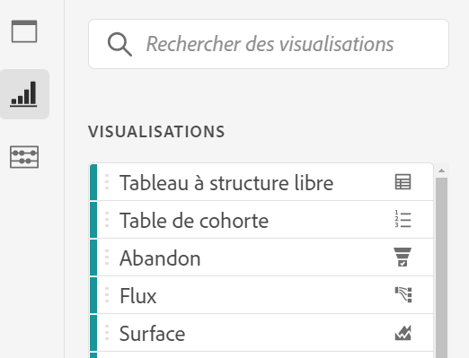
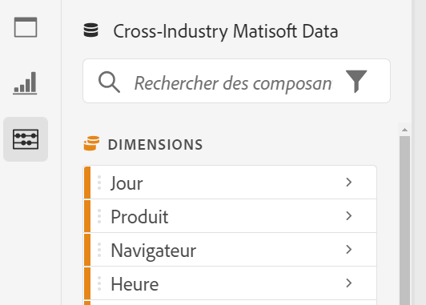
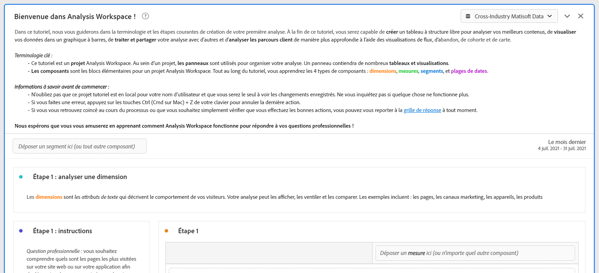

# Aperçu d’Analysis Workspace

Analysis Workspace vous permet de créer rapidement des analyses pour recueillir des informations, puis de les partager avec d’autres personnes. L’interface de navigateur par glisser-déposer vous permet de concevoir votre analyse, d’ajouter des visualisations pour donner vie aux données, de traiter un jeu de données et de partager et de planifier des projets avec toute personne de votre choix.

La vidéo suivante présente une rapide vue d’ensemble de ce qui est possible.

>[!VIDEO](https://video.tv.adobe.com/v/26266/?quality=12)

## Zones d’Analysis Workspace

L’image suivante et le tableau qui l’accompagne décrivent certaines des principales zones d’Analysis Workspace :

| Emplacement dans l’image | Nom et fonction |
|---------|----------|
| A | **Rail à l’extrême gauche :** contient des onglets pour l’ajout de panneaux, de visualisations et de composants à Analysis Workspace. Contient également l’icône du dictionnaire de données utilisée pour ouvrir le dictionnaire de données. |
| B | **Rail de gauche :** selon l’onglet sélectionné dans le rail à l’extrême gauche, cette zone contient des panneaux, des visualisations ou des composants particuliers. |
| C | **Zone de travail :** il s’agit de la zone principale dans laquelle vous faites glisser le contenu des rails de gauche pour créer votre projet. Le projet se met à jour dynamiquement lorsque vous ajoutez des panneaux, des visualisations et des composants à la zone de travail. |
| D | **Menu déroulant Suite de rapports :** pour chaque panneau d’Analysis Workspace, le menu déroulant Suite de rapports vous permet de choisir la suite de rapports à utiliser comme source de données. |

## Fonctionnalités d’Analysis Workspace {#analysis}

Voici quelques-unes des principales fonctionnalités disponibles dans Analysis Workspace :

### Panneaux

Les **panneaux** permettent d’organiser votre analyse au sein d’un projet et peuvent contenir de nombreux tableaux et visualisations. Analysis Workspace fournit de nombreux panneaux qui génèrent un ensemble complet d’analyses basées sur quelques entrées d’utilisateurs. Dans le rail de l’extrême gauche, sélectionnez l’icône **[!UICONTROL Panneaux]** supérieure pour afficher la liste complète des panneaux disponibles.

Pour en savoir plus sur les panneaux, voir [Vue d’ensemble des panneaux](https://experienceleague.adobe.com/docs/analytics/analyze/analysis-workspace/panels/panels.html?lang=fr).

### Visualisations

Des **visualisations**, par exemple un graphique à barres ou linéaire, peuvent être utilisées pour donner vie aux données visuellement. Dans le rail de l’extrême gauche, sélectionnez l’icône **[!UICONTROL Visualisations]** du milieu pour afficher la liste complète des visualisations disponibles.

Pour en savoir plus sur les visualisations, voir [Vue d’ensemble des visualisations](https://experienceleague.adobe.com/docs/analytics/analyze/analysis-workspace/visualizations/freeform-analysis-visualizations.html?lang=fr).

### Composants

Les composants d’Analysis Workspace se composent des éléments suivants :

* Dimensions

* Mesures

* Segments

* Périodes

Pour en savoir plus sur chacun de ces types de composants, voir [Vue d’ensemble des composants](/help/analyze/analysis-workspace/components/analysis-workspace-components.md).

Chacun de ces types de composants peut être ajouté à une visualisation (un tableau à structure libre, par exemple) pour commencer à répondre aux questions de votre entreprise.

Après avoir compris la terminologie des composants, vous pouvez les faire glisser dans les visualisations (y compris les tableaux à structure libre) pour [créer votre analyse](/help/analyze/analysis-workspace/build-workspace-project/freeform-overview.md).

### Dictionnaire de données

Le dictionnaire de données d’Analysis Workspace permet aux utilisateurs et utilisatrices, et aux administrateurs et administratrices, de suivre et de mieux comprendre les composants dans leur environnement Analytics.

Pour en savoir plus sur le dictionnaire de données, voir [Vue d’ensemble du dictionnaire de données](/help/analyze/analysis-workspace/components/data-dictionary/data-dictionary-overview.md).

### Sources de données

Synchronisez les visualisations pour contrôler quel tableau de données ou source de données correspond à une visualisation. Voici plus d’informations sur la manière dont vous pouvez [gérer des sources de données](/help/analyze/analysis-workspace/visualizations/t-sync-visualization.md).

## Commencer à utiliser Analysis Workspace

### Connexion à Adobe Analytics {#login}

Pour commencer à utiliser Analysis Workspace, connectez-vous à Adobe Analytics en accédant à [experience.adobe.com/analytics](https://experience.adobe.com/analytics). La page Projets d’Analysis Workspace s’affiche par défaut. Si un projet spécifique a été sélectionné, il s’affiche par défaut.

### Créer un projet {#new-project}

Dans Analysis Workspace, une analyse est appelée [projet](/help/analyze/analysis-workspace/build-workspace-project/freeform-overview.md).

Dans Analysis Workspace, vous pouvez créer un projet comme décrit dans la section [Créer des projets](/help/analyze/analysis-workspace/build-workspace-project/create-projects.md).

Les projets peuvent être organisés en dossiers et sous-dossiers, comme décrit dans la section [Dossiers dans Analysis Workspace](/help/analyze/analysis-workspace/build-workspace-project/workspace-folders/about-folders.md).

### Enregistrer et partager un projet

Lorsque vous créez une analyse dans Analysis Workspace, votre travail est [enregistré automatiquement](/help/analyze/analysis-workspace/build-workspace-project/save-projects.md).

Une fois que vous avez terminé de créer le projet et que celui-ci collecte des informations exploitables, il est prêt à être utilisé par d’autres personnes. Vous pouvez partager le projet avec des utilisateurs ou utilisatrices, et des groupes de votre organisation, ou même avec des personnes en dehors de votre organisation. Pour plus d’informations sur le partage d’un projet, voir [Partager des projets](/help/analyze/analysis-workspace/curate-share/share-projects.md).

## Ressources supplémentaires {#resources}

* Adobe propose des centaines de [tutoriels de formation vidéo Analytics](https://experienceleague.adobe.com/docs/analytics-learn/tutorials/overview.html?lang=fr).
* Pour obtenir plus dʼinformations sur les nouvelles fonctionnalités, reportez-vous à la page [Notes de mise à jour dʼAdobe Experience Cloud](https://experienceleague.adobe.com/docs/release-notes/experience-cloud/current.html?lang=fr#analytics).
* Pour vous familiariser avec Analysis Workspace, utilisez le modèle de tutoriel de formation sur Analysis Workspace. Ce modèle vous guide dans la terminologie et les étapes courantes de création de votre première analyse dans Workspace. Pour commencer le tutoriel :
   1. Dans l’onglet [!UICONTROL **Workspace**] d’Adobe Analytics, sélectionnez **[!UICONTROL Formation]** sur la gauche.
   1. Sélectionnez **[!UICONTROL Ouvrir le tutoriel]**.
      

