# Nouveautés d’Analysis Workspace

## Mars 2020

Nouvelles fonctionnalités publiées le 12 mars 2020.

| Fonctionnalité | Description |
|--- |--- |
| Prise en charge de plusieurs suites de rapports dans Workspace | Vous pouvez désormais importer côte à côte les données de plusieurs suites de rapports dans un projet unique afin de  les données de plusieurs suites de rapports. [En savoir plus...](https://docs.adobe.com/content/help/en/analytics/analyze/analysis-workspace/build-workspace-project/multiple-report-suites.html) |
| Modèle de didacticiel de formation | Ce nouveau modèle standard vous guide tout au long de la terminologie commune et des étapes nécessaires à la création de votre premier   dans Workspace. Il est disponible sous forme de modèle standard dans le modal Nouveau projet et remplace l’exemple de projet qui existe aujourd’hui pour les nouveaux utilisateurs qui n’ont pas d’autres projets dans leur liste. [En savoir plus...](/help/analyze/analysis-workspace/build-workspace-project/starter-projects.md) |

## Février 2020

Nouvelles fonctionnalités publiées le 20 février 2020.

| Fonctionnalité | Description |
|--- |--- |
| Nouveau modèle Workspace pour les organisations qui utilisent Analytics sur plusieurs périphériques | Ce modèle montre l&#39;efficacité de l&#39;ADC à assembler les visites et vous informe sur les dimensions et les mesures exclusives de l&#39;ADC. Une suite de rapports utilisant CDA est requise. Voir [Configuration d’Analytics sur l’ensemble des appareils](https://docs.adobe.com/content/help/en/analytics/components/cda/cda-setup.html) pour plus d’informations. |
| Nouvelles touches d’accès rapide dans Workspace | <ul><li>Réduire/Développer tous les panneaux : `alt + m`</li><li>Réduire/Développer le panneau actif : `alt + ctrl + m`</li><li>Rechercher dans le rail de gauche : `ctrl + /`</li><li>Accéder au panneau suivant : `alt + Right Key`</li><li>Accéder au panneau précédent : `alt + Left Key`</li></ul>[En savoir plus...](https://docs.adobe.com/content/help/en/analytics/analyze/analysis-workspace/build-workspace-project/fa-shortcut-keys.html) |
| Autres améliorations de Workspace | <ul><li>Lorsqu’un panneau ou une visualisation est déposé dans Workspace, le rail de gauche passe désormais automatiquement aux composants pour un flux de travail plus fluide.</li><li>Les composants de modèle peuvent désormais être utilisés (balisés, favoris, approuvés, par exemple).</li><li>Le de mesures et de segments filtrés  le bouton + pour ajouter un nouveau composant si vous ne trouvez pas ce dont vous avez besoin.</li></ul> |
| Débogueur Workspace | Le débogueur Workspace a été ajouté au menu Aide, ce qui vous permet de l’activer plus facilement pour le débogage des requêtes Workspace. [En savoir plus...](https://www.adobe.io/apis/experiencecloud/analytics/docs.html#!AdobeDocs/analytics-2.0-apis/master/reporting-tricks.md) |

## Janvier 2020

Nouvelles fonctionnalités au jeudi 16 janvier 2020.

| Fonctionnalité | Description |
|--- |--- |
| [Créateur de tableau à structure libre](https://docs.adobe.com/content/help/en/analytics/analyze/analysis-workspace/visualizations/freeform-table.html) | Une fois le générateur de tableau activé, vous pouvez faire glisser et déposer de nombreuses dimensions, ventilations, mesures et segments afin de créer des tableaux qui répondent à des problématiques professionnelles plus complexes. Les données ne seront pas mises à jour immédiatement, Instead, updates occur after you click **[!UICONTROL Build]**, saving you time once you know what table you want to construct. En outre, cette fonctionnalité offre les options suivantes :<ul><li>**Aperçu** : vous pouvez prévisualiser le format d’un tableau avant de passer du temps à générer des données réelles.</li><li>**Paramètres flexibles pour les rangées et la ventilation** : vous pouvez définir les niveaux de rangée et de ventilation pour chaque ligne de dimension. Auparavant, Workspace imposait des valeurs par défaut qui ne pouvaient pas être modifiées après le renvoi des données.</li><li>**Ventilation par position** : vous pouvez définir des rangées de dimension sur _ventilation par position_ et non _par élément spécifique_ (valeur par défaut).</li><li>**Agencement manuel des rangées statiques** : vous pouvez agencer manuellement les rangées statiques afin que les rangées du tableau s’affichent exactement comme vous en avez besoin. Auparavant, les lignes statiques pouvaient être triées uniquement par colonne de mesure ou par ordre alphabétique.</li></ul> |

## Octobre 2019

Améliorations publiées le 10 octobre 2019.

| Amélioration | Description |
|--- |--- |
| Mise à jour des totaux des tableaux à structure libre | Les tableaux à structure libre comprennent désormais deux totaux, a **[!UICONTROL Table total]** et a **[!UICONTROL Grand total]**. La ligne Total du tableau tient compte des [filtres de rapport](https://docs.adobe.com/content/help/en/analytics/analyze/analysis-workspace/build-workspace-project/pagination-filtering-sorting.html) appliqués. Avant la mise à jour, seule la segmentation affectait les totaux. [En savoir](https://docs.adobe.com/content/help/en/analytics/analyze/analysis-workspace/build-workspace-project/workspace-totals.html) plusEn outre, **[!UICONTROL Show Totals]** et **[!UICONTROL Show Grand Total]** des options ont été ajoutées à **[!UICONTROL Column Settings]**. Avec cette modification des totaux de forme libre, les visualisations dépendantes seront mises à jour (par exemple, **[!UICONTROL Summary Number]** visualisations liées), ainsi que les données CSV et PDF exportées. |
| Option de suppression pour Non spécifié/Aucun | La possibilité de supprimer facilement « Non spécifié (Aucun) » a été ajoutée en tant qu’option des filtres de rapport. |
| Abandon des composants de granularité violets | Les composants temporels de granularité violets (minute, heure, jour, semaine, mois, trimestre, année) ont été abandonnés. Les composants temporels violets se sont toujours comportés exactement comme leurs homologues de dimension orange, ce changement simplifiera donc l’expérience. **Aucune action** n’est nécessaire si vous avez déjà utilisé l’un des composants temporels violets. Grâce à ce changement, la section violette **[!UICONTROL Time]** a également été renommée **[!UICONTROL Date Ranges]**. |

## Août 2019

Amélioration publiée le 8 août 2019.

| Amélioration | Description |
|--- |--- |
| Limite des éléments pour le filtre déroulant augmentée de 50 à 200 | La limite des éléments pouvant être placés dans un filtre déroulant a été augmentée de 50 à 200. Cette amélioration prend en charge divers cas d’utilisation, tels que l’ajout à un filtre de tous les pays (195) ou de tous les États et provinces (52). |

## Juillet 2019

Améliorations publiées le 18 juillet 2019.

| Amélioration | Description |
|--- |--- |
| Améliorations de l’analyse des cohortes | De nouveaux [paramètres d’analyse des cohortes](https://docs.adobe.com/content/help/en/analytics/analyze/analysis-workspace/visualizations/cohort-table/t-cohort.html) ont été ajoutés : <ul><li>Afficher uniquement le pourcentage</li><li>Arrondir le pourcentage à l’entier le plus proche</li><li>Afficher une ligne de pourcentage moyenne</li></ul> |
| Afficher les éléments des 18 derniers mois | Dans le rail de gauche, les utilisateurs ont maintenant la possibilité d’_afficher les éléments des 18 derniers mois_. Auparavant, la période de recherche arrière était de 6 mois au maximum. Il est ainsi plus facilite d’effectuer une comparaison de pages ou de campagnes de l’année passée, jusqu’à 18 mois en arrière. |
| Nouveau modèle Analysis Workspace | Un nouveau modèle appelé [Magento : Marketing et commerce](https://docs.adobe.com/content/help/en/analytics/analyze/analysis-workspace/build-workspace-project/starter-projects.html) a été ajouté à Analysis Workspace. Il est destiné aux clients d’e-commerce Magento, mais tout détaillant peut l’utiliser pour obtenir des informations uniques sur ses activités commerciales. |

## Juin 2019

Amélioration publiée le 13 juin 2019.

| Amélioration | Description |
|--- |--- |
| Nouveaux filtres prêts à l’emploi | Ajout de nouveaux filtres prêts à l’emploi dans la zone de recherche du rail gauche. Outre ce que vous voyez aujourd’hui (Dimensions, Mesures, Approuvé, etc.), de nouveaux filtres tels que Mesures calculées, Attributs du client, eVars, Props, Vidéo, etc. ont été ajoutés afin de faciliter la recherche des composants dont vous avez besoin. |

## Mai 2019

Amélioration publiée le 9 mai 2019.

| Amélioration | Description |
|--- |--- |
| Un nouveau paramètre a été ajouté aux paramètres de visualisation de flux : Inclure les instances de répétition. | [Paramètres de flux](/help/analyze/analysis-workspace/visualizations/c-flow/flow-settings.md) |

## Avril 2019

Amélioration publiée le 11 avril 2019.

| Amélioration | Description |
|--- |--- |
| Améliorations apportées aux bonnes pratiques en matière d’optimisation | [Optimisation des performances](/help/analyze/analysis-workspace/new-features-in-analysis-workspace.md) |

## Janvier 2019

Nouvelles fonctionnalités et améliorations au 17 janvier 2019.

| Fonctionnalité | Description |
|--- |--- |
| [Analyse des cohortes](/help/analyze/analysis-workspace/visualizations/cohort-table/cohort-analysis.md) | Les améliorations considérables apportées à l’analyse des cohortes vous permettent :<ul><li>d’appliquer à un segment des mesures d’inclusion et de retour de manière séparée ; </li><li>d’afficher l’attrition au lieu de la fidélisation ;</li><li>d’afficher les tables de latence (temps écoulé avant et après un évènement d’inclusion) ;</li><li>de personnaliser les dimensions des cohortes (vers des groupes de visiteurs basés sur une eVar et pas seulement sur une heure) ;</li><li>de calculer la rétention/la perte de clientèle sur la base de la période précédente et non de la cohorte d’origine ; </li><li>d’ajouter plusieurs mesures dans les champs d’inclusion et de retour, ainsi que d’appliquer des segments ; (Les mesures calculées ne sont pas prises en charge)</li></ul> |
| [Densité d’affichage](/help/analyze/analysis-workspace/build-workspace-project/view-density.md) | Le nouveau paramètre vous permet de voir plus de données sur un seul écran en réduisant l’espacement vertical du rail gauche, dans les tableaux à structure libre et dans les tableaux de cohortes. Accessible via Projet > Informations et paramètres du projet. |
| [Prise en charge de variables à valeurs multiples dans l’Attribution IQ](attribution-iq.md) | Certaines dimensions dans Analytics peuvent contenir plusieurs valeurs pour un seul accès, telles que les variables de liste (listVars), la variable product, les propriétés de liste (list props) ou l’eVar de marchandisage. Analysis Workspace vous permet d’appliquer l’Attribution IQ à n’importe quel type de ces variables au niveau de l’accès. |
| Améliorations des performances | Amélioration de la vitesse de ventilation des visualisations : les projets comportant de nombreuses ventilations se chargeront plus rapidement. |

## Novembre 2018

Nouvelles fonctionnalités et améliorations au 1er novembre 2018.

| Fonctionnalité | Description |
|--- |--- |
| [Traitement des suites de rapports virtuelles et des projets – améliorations](/help/analyze/analysis-workspace/curate-share/curate-projects-vrs.md) | Ces améliorations ont en fait été introduites en octobre 2018. Des modifications ont été apportées quant aux composants visibles aux administrateurs et aux non-administrateurs dans les suites de rapports virtuelles et les projets Workspace traités.   Auparavant, les composants non traités étaient visibles par tous en cliquant sur Afficher tous les composants. La mise à jour de l’expérience de traitement permet de mieux contrôler les composants visibles.  |

## Octobre 2018

Nouvelles fonctionnalités et améliorations au 11 octobre 2018.

<table id="table_3DDC812B2F66416F868004416D248BF3"> 
 <thead> 
  <tr> 
   <th colname="col1" class="entry"> Fonctionnalité </th> 
   <th colname="col2" class="entry"> Description </th> 
  </tr> 
 </thead>
 <tbody> 
  <tr> 
   <td colname="col1"> 
<b>Gestion des listes déroulantes des panneaux</b> 
 </td> 
   <td colname="col2"> 
Nous avons apporté quelques modifications aux listes déroulantes des panneaux, qui ont été introduites dans la version principale de septembre. Lorsque vous cliquez avec le bouton droit sur une liste déroulante, vous pouvez maintenant : 
 
    <ul id="ul_4BDEC66EEB2243628FE32B43E377E5BD"> 
     <li id="li_EF8277BE972540D3B2604D82BC7C0918">supprimer une liste déroulante (cette option est toujours présente) ; </li> 
     <li id="li_6A991208F2744274817DBE1E9D1B443F">supprimer une étiquette (si une étiquette est affichée) ; </li> 
     <li id="li_5C1CFC465C2E41D2B35E8841EFDC82AA">ajouter une étiquette (si aucune étiquette n’est affichée). </li> 
    </ul> </td> 
  </tr> 
  <tr> 
   <td colname="col1"> 
<b>Liens dans les info-bulles des panneaux et des visualisations</b> 
 </td> 
   <td colname="col2"> 
Nous avons ajouté des liens vers les vidéos et la documentation pertinentes aux info-bulles des panneaux et des visualisations. 
 </td> 
  </tr> 
 </tbody> 
</table>

## Septembre 2018

Nouvelles fonctionnalités et améliorations au 13 septembre 2018.

<table id="table_137719BFA03C44A78FDE872DF8B228A4"> 
 <thead> 
  <tr> 
   <th colname="col1" class="entry"> Fonctionnalité </th> 
   <th colname="col2" class="entry"> Description </th> 
  </tr> 
 </thead>
 <tbody> 
  <tr> 
   <td colname="col1"> 
<b>Listes déroulantes du panneau</b> 
 </td> 
   <td colname="col2"> 
La zone de liste du panneau propose désormais une fonction déroulante. Les listes déroulantes permettent aux utilisateurs finaux d’interagir avec les données d’un projet de manière contrôlée. Exemple : supposons que vous disposiez de plusieurs versions d’un projet afin d’effectuer du reporting spécifique à chaque pays. Vous pouvez désormais réduire ces projets dans un projet unique et ajouter une liste déroulante contenant les pays. 
 </td> 
  </tr> 
  <tr> 
   <td colname="col1"> 
<b>Palettes de couleurs</b> 
 </td> 
   <td colname="col2"> 
Vous pouvez désormais modifier le modèle de couleurs utilisé dans Workspace en choisissant une autre palette de couleurs ou en spécifiant votre propre palette. Cela affecte de nombreux éléments dans Workspace, y compris la plupart des visualisations. Elle n’a <b>AUCUNE</b> incidence sur le Résumé des changements, le formatage conditionnel dans les tableaux à structure libre et la visualisation des cartes. 
 
Remarque : la prise en charge des palettes de couleurs n’est pas activée pour Internet Explorer 11. 
 </td> 
  </tr> 
  <tr> 
   <td colname="col1"> 
<b>Nouveau modèle : Consommation audio</b> 
 </td> 
   <td colname="col2"> 
Voir <a href="https://marketing.adobe.com/resources/help/en_US/sc/appmeasurement/hbvideo/media-workspace-templates.html"  > Audio Analytics</a>. 
 </td> 
  </tr> 
 </tbody> 
</table>
## Août 2018

Nouvelles fonctionnalités et améliorations au 9 août 2018.

<table id="table_DD77C02344414DCD9AC0A6A22E648B72"> 
 <thead> 
  <tr> 
   <th colname="col1" class="entry"> Fonctionnalité </th> 
   <th colname="col2" class="entry"> Description </th> 
  </tr> 
 </thead>
 <tbody> 
  <tr> 
   <td colname="col1"> 
<b>Guides de zones de dépôt</b> 
 </td> 
   <td colname="col2"> 
Ces guides vous aident à comprendre plus facilement le résultat de chaque action de glisser-déposer. Par exemple, quand vous passez votre curseur sur une colonne, nous affichons des options comme Ajouter, Remplacer, Filtrer par ou Ventilation. 
 
Des guides jaunes/rouges ont également été ajoutés afin de vous alerter quand vous exécutez une action non recommandée ou non autorisée, par exemple lorsque vous empilez deux mesures l’une au-dessus de l’autre (ce qui génère des données incorrectes). 
 </td> 
  </tr> 
  <tr> 
   <td colname="col1"> 
<b>Option Ajouter un panneau vierge</b> 
 </td> 
   <td colname="col2"> 
Ajout d’un symbole plus (+) sous le panneau de départ afin de faciliter l’ajout d’autres panneaux. 
 </td> 
  </tr> 
 </tbody> 
</table>

## Juillet 2018

Nouvelles fonctionnalités et améliorations au 19 juillet 2018.

<table id="table_336E121310204DC492EA004F40830B0F"> 
 <thead> 
  <tr> 
   <th colname="col1" class="entry"> Fonctionnalité </th> 
   <th colname="col2" class="entry"> Description </th> 
  </tr> 
 </thead>
 <tbody> 
  <tr> 
   <td colname="col1"> 
<b> <a href="attribution-iq.md"  > Attribution IQ </a> </b> 
 </td> 
   <td colname="col2"> 
Attribution IQ vous permet de réaliser des analyses plus complexes et plus intelligentes de la performance marketing. De nouveaux modèles d’attribution peuvent être utilisés pour les mesures dans Analysis Workspace (dans n’importe quel tableau ou ventilation) et pour les mesures calculées. Un nouveau panneau d’attribution vous permet une meilleure visualisation et comparaison. 
 </td> 
  </tr> 
  <tr> 
   <td colname="col1"> 
<b> Améliorations du rail de gauche </b> 
 </td> 
   <td colname="col2"> 
Améliorations apportées au rail de gauche pour le rendre plus intuitif et simple d’utilisation : 
 
    <ul id="ul_087BEDF4338946DA857CD82CB69F98C2"> 
     <li id="li_C751AACAC60442DC93118F0819F8EEA7"> apport de la fonction Créer (+) pour les composants (mesures, segments, dates) alignés avec les en-têtes ; </li> 
     <li id="li_DE2EB184A02D4CE58C23F518DB85EFDD"> ajout de « + Afficher tout » à la fin de chaque liste de section pour indiquer qu’il y a plus de 5 options ; </li> 
     <li id="li_5208F3C6026647B09F4A85131B175175">apparition des actions (comme les balises, les favoris) avec les icônes lorsque des composants sont sélectionnés ; </li> 
     <li id="li_11E601488A844515928231E09889BC54">Améliorations esthétiques de l’interface utilisateur. </li> 
    </ul> </td> 
  </tr> 
  <tr> 
   <td colname="col1"> 
<b>Totaux pour les mesures calculées </b> 
 </td> 
   <td colname="col2"> 
Lorsque cela est possible, nous affichons désormais les totaux pour les mesures calculées, y compris les pourcentages 
 </td> 
  </tr> 
  <tr> 
   <td colname="col1"> 
<b>Nouveau <a href="/help/analyze/analysis-workspace/components/calendar-date-ranges/calendar.md"  > paramètre prédéfini de la </a>période </b> 
 </td> 
   <td colname="col2"> 
Ajout de « Treize dernières semaines complètes » aux paramètres prédéfinis de la période dans Analysis Workspace. 
 </td> 
  </tr> 
 </tbody> 
</table>

## Juin 2018

Nouvelles fonctionnalités et améliorations au 14 juin 2018.

<table id="table_57035A06D99447A6BE6ED825A648ED3F"> 
 <thead> 
  <tr> 
   <th colname="col1" class="entry"> Fonctionnalité </th> 
   <th colname="col2" class="entry"> Description </th> 
  </tr> 
 </thead>
 <tbody> 
  <tr> 
   <td colname="col1"> 
<b> <a href="/help/analyze/analysis-workspace/components/dimensions/view-dimensions.md"  > Colonnes de dimension dynamiques </a> </b> 
 </td> 
   <td colname="col2"> 
Auparavant, lorsqu’une dimension était glissée sur une colonne, nous affichions les 5 premières valeurs pour les dimensions non temporelles (et 15 pour les dimensions temporelles) et gardions ces valeurs statiques (c’est-à-dire que les 5 valeurs choisies ne changeaient jamais). 
 
Désormais, nous affichons par défaut des valeurs dynamiques plutôt que statiques, avec la possibilité de les transformer en valeurs statiques. Remarques : 
 
    <ul id="ul_C802BC32CB084E30B4E58E9E90B9A63D"> 
     <li id="li_452466AB416F4737B532849C604BD4CC">Cliquez sur (i) sur la dimension dynamique pour afficher le classement (sur 5) et le type de dimension. </li> 
     <li id="li_588F6199E38D47869AC855A4C2A4D1B7">Au fur et à mesure des mises à jour de vos données, les colonnes de dimension dynamiques se mettront à jour pour afficher les éléments de dimension 5/15 actuels. </li> 
     <li id="li_19D47638D4D94416B0DAD2B2FB835ABE">Si vous copiez ou déplacez une colonne de dimension dynamique, elle deviendra statique. </li> 
     <li id="li_B95411689AE04774B7B9BA128F2DB96F">Lorsque vous survolez une colonne de dimension statique, une icône en forme de verrou indique que la dimension est statique. </li> 
    </ul> </td> 
  </tr> 
  <tr> 
   <td colname="col1"> 
<b>Fenêtre modale des nouvelles fonctionnalités Workspace </b> 
 </td> 
   <td colname="col2"> 
À l’instar des astuces du jour introduites le mois dernier, cette fenêtre modale affiche de nouvelles fonctionnalités Workspace la première fois que vous vous connectez à Workspace après une nouvelle mise à jour. 
 </td> 
  </tr> 
 </tbody> 
</table>

## Mai 2018

Nouvelles fonctionnalités et améliorations au 10 mai 2018.

<table id="table_EE4C690A178B4F80BDAF2BB4424D6020"> 
 <thead> 
  <tr> 
   <th colname="col1" class="entry"> Fonctionnalité </th> 
   <th colname="col2" class="entry"> Description </th> 
  </tr> 
 </thead>
 <tbody> 
  <tr> 
   <td colname="col1"> 
<b>Conseils du jour</b> 
 </td> 
   <td colname="col2"> 
Nous proposons des conseils du jour (accompagnés d’une courte vidéo) dans le coin inférieur droit de l’interface. Leur but est de vous familiariser avec les nombreuses fonctionnalités très intéressantes d’Analysis Workspace. Vous pouvez ignorer ces Conseils ou y accéder en cliquant sur  Aide  &gt;  Conseils  à n’importe quel moment. 
 
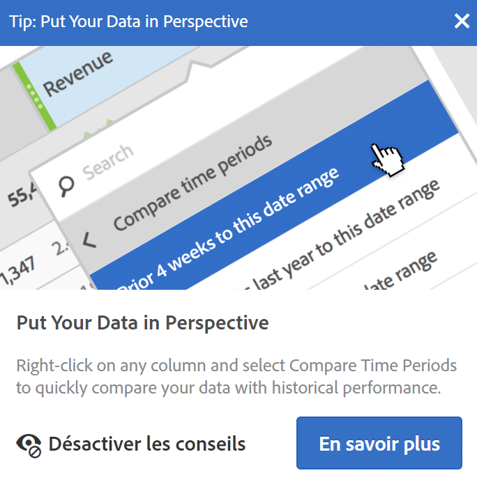 
 </td> 
  </tr> 
  <tr> 
   <td colname="col1"> 
<b> <a href="/help/analyze/analysis-workspace/components/t-freeform-project-segment.md"  > Modèles de segments </a> et <a href="/help/analyze/analysis-workspace/components/apply-create-metrics.md"  > modèles de mesures calculées </a></b> 
 </td> 
   <td colname="col2"> 
Le rail gauche affiche maintenant des modèles de segments et de mesures calculées. 
 </td> 
  </tr> 
  <tr> 
   <td colname="col1"> 
<b>Possibilité de faire défiler tout en faisant glisser des composants</b> 
 </td> 
   <td colname="col2"> 
Vous pouvez maintenant faire défiler vers le haut ou vers le bas tout en faisant glisser des composants vers un nouvel emplacement. 
 </td> 
  </tr> 
  <tr> 
   <td colname="col1"> 
<b>Informations supplémentaires sur  <a href="/help/analyze/analysis-workspace/virtual-analyst/c-anomaly-detection/view-anomalies.md"  > les anomalies </a></b> 
 </td> 
   <td colname="col2"> 
Lorsque vous passez votre curseur sur une anomalie d’un graphique en courbes, la date et la valeur brute de l’anomalie s’affichent désormais dans les informations. 
 </td> 
  </tr> 
 </tbody> 
</table>

## Avril 2018

Nouvelles fonctionnalités et améliorations au 12 avril 2018.

<table id="table_B9E784CD14A1453EB360FCCDC612250F"> 
 <thead> 
  <tr> 
   <th colname="col1" class="entry"> Fonctionnalité </th> 
   <th colname="col2" class="entry"> Description </th> 
  </tr> 
 </thead>
 <tbody> 
  <tr> 
   <td colname="col1"> 
 <a href="/help/analyze/analysis-workspace/build-workspace-project/column-row-settings/column-settings.md"  > Retour à la ligne du texte d’en-tête activé par défaut </a> 
 </td> 
   <td colname="col2"> 
La configuration de colonnes sur Retour à la ligne du texte d’en-tête est désormais activée par défaut pour les tables de forme libre. 
 </td> 
  </tr> 
  <tr> 
   <td colname="col1"> 
 <a href="/help/analyze/analysis-workspace/build-workspace-project/column-row-settings/table-settings.md"  > Nouvelle configuration des lignes </a> 
 </td> 
   <td colname="col2"> 
Le nouveau paramètre de  Calcul des pourcentages par ligne  oblige le tableau à structure libre à calculer les pourcentages des cellules par ligne, et non pas par colonne. Cette fonctionnalité est particulièrement utile pour les pourcentages de tendance. Par exemple, cela permet de voir la façon dont la valeur d’une dimension se positionne par rapport au reste sur la durée. Elle est activée par défaut lorsque vous cliquez sur l’icône Visualiser. 
 </td> 
  </tr> 
  <tr> 
   <td colname="col1"> 
 <a href="/help/analyze/analysis-workspace/visualizations/freeform-analysis-visualizations.md#section_D3BB5042A92245D8BF6BCF072C66624B"  > Paramètre d’affichage « 100 % empilé »</a> 
 </td> 
   <td colname="col2"> 
Un nouveau paramètre d’affichage appliqué aux graphiques à zones empilées, à barres empilées ou à barres horizontales empilées offre un aperçu « 100 % empilé » du diagramme, ce qui vous permet d’évaluer les proportions relatives. 
 
 
 </td> 
  </tr> 
  <tr> 
   <td colname="col1"> 
 <a href="/help/analyze/analysis-workspace/virtual-analyst/overview.md"  > La détection des anomalies et l’analyse des contributions </a> sont désormais uniquement disponibles dans Analysis Workspace. 
 </td> 
   <td colname="col2"> 
La détection des anomalies et l’analyse des contributions ont été supprimées de l’ensemble de fonctionnalités Reports &amp; Analytics et sont désormais disponibles uniquement via Analysis Workspace. 
 
Remarque : les clients Adobe Analytics Select et Adobe Analytics Foundation ne profitent que d’une détection des anomalies « à granularité journalière » dans Workspace. 
 </td> 
  </tr> 
 </tbody> 
</table>

## Mars 2018

Nouvelles fonctionnalités et améliorations au 8 mars 2018.

<table id="table_580CF2C1322E4FB78870BE2B1F497B2F"> 
 <thead> 
  <tr> 
   <th colname="col1" class="entry"> Fonctionnalité </th> 
   <th colname="col2" class="entry"> Description </th> 
  </tr> 
 </thead>
 <tbody> 
  <tr> 
   <td colname="col1"> 
 <a href="/help/analyze/analysis-workspace/build-workspace-project/column-row-settings/column-settings.md"  > Retour à la ligne du texte de l’en-tête </a> 
 </td> 
   <td colname="col2"> 
Vous pouvez désormais renvoyer à la ligne le texte de l’en-tête dans les tableaux à structure libre afin de rendre les en-têtes plus lisibles et les tableaux plus faciles à partager. Nous avons ajouté dans les paramètres de colonne une option intitulée « Renvoyer à la ligne le texte d’en-tête » . Cette option est particulièrement utile pour le rendu .pdf et pour les mesures dont le nom est long. 
 </td> 
  </tr> 
  <tr> 
   <td colname="col1"> 
 <a href="/help/analyze/analysis-workspace/components/apply-create-metrics.md"  > Menu contextuel permettant de créer une mesure </a> 
 </td> 
   <td colname="col2"> 
Afin de faciliter la création rapide de mesures calculées, l’option Créer une mesure d’après la sélection a été ajoutée au menu contextuel dans les tableaux à structure libre. Cette option s’affiche lorsqu’une ou plusieurs cellules de colonne d’en-tête sont sélectionnées. 
 </td> 
  </tr> 
  <tr> 
   <td colname="col1"> 
 <a href="/help/analyze/analysis-workspace/visualizations/map-visualization.md"  > Améliorations de la visualisation des cartes </a> 
 </td> 
   <td colname="col2"> 
Pour pouvoir afficher des comparaisons d’une période à l’autre (par exemple, d’une année à l’autre) dans la visualisation des cartes, nous avons ajouté les améliorations suivantes : 
 
    <ul id="ul_F570E6AB174C45788620CF50E2742A08"> 
     <li id="li_746E329037764644A9CCF79161C26350">La visualisation des cartes peut désormais afficher des nombres négatifs. Par exemple, si vous tracez une mesure d’une année à l’autre, la carte peut afficher -33 % sur New York. </li> 
     <li id="li_E05F0380627044E6A4E8A60C98494BF7">Avec les mesures de type « pourcentage », le regroupement effectue la moyenne des pourcentages. </li> 
     <li id="li_44C04306EA1B413E91B8256B340D5296">Un nouveau jeu de couleurs : positif/négatif (vert/rouge). </li> 
    </ul> </td> 
  </tr> 
  <tr> 
   <td colname="col1"> 
 <a href="/help/analyze/analysis-workspace/build-workspace-project/starter-projects.md"  > Mise à jour des modèles personnalisés </a> 
 </td> 
   <td colname="col2"> 
Pour les modèles personnalisés récemment publiés : 
 
    <ul id="ul_787F48253F454163B99F6DD50F199FE2"> 
     <li id="li_828DD547DDB54A81B9FFB9FE92790F6C">Ajout d’une icône de modèle en haut du projet (près du titre) pour aider à différencier le mode d’édition de modèles de l’utilisation d’un modèle comme point de départ d’un projet. </li> 
     <li id="li_EEAA4D115CB74A57BABD524B2561E0CC">Autorisation des non-administrateurs à créer (enregistrer sous) et à modifier des modèles de projet Workspace, à condition qu’ils aient reçu l’autorisation Créer/traiter des projets dans Analysis Workspace. (   Admin &gt;  Gestion utilisateur  &gt;  Groupes  &gt;  Modifier l’accès à tous les rapports  &gt;  Personnaliser les outils Analytics  &gt;  Créer/traiter des projets dans Analysis Workspace  ). </li> 
    </ul> </td> 
  </tr> 
 </tbody> 
</table>

## Février 2018

Nouvelles fonctionnalités et améliorations au 8 février 2018.

<table id="table_824BBE4A554B4DB092ADA9044383D0FA"> 
 <thead> 
  <tr> 
   <th colname="col1" class="entry"> Fonctionnalité </th> 
   <th colname="col2" class="entry"> Description </th> 
  </tr> 
 </thead>
 <tbody> 
  <tr> 
   <td colname="col1"> 
 <a href="/help/analyze/analysis-workspace/build-workspace-project/starter-projects.md#create-custom-template"  > Modèles Workspace personnalisés </a> 
 </td> 
   <td colname="col2"> 
Vous pouvez désormais créer vos propres modèles Workspace et les enregistrer afin que d’autres utilisateurs de votre organisation puissent commencer par les données dont ils ont besoin. 
 </td> 
  </tr> 
  <tr> 
   <td colname="col1"> 
 <a href="/help/analyze/analysis-workspace/build-workspace-project/t-freeform-project.md"  > Fenêtre modale Nouveau projet </a> 
 </td> 
   <td colname="col2"> 
Cliquez sur « Nouveau projet » pour ouvrir un nouvel écran vous permettant de démarrer à partir : 
 
    <ul id="ul_FE90E6B9AF334A029D66A43901F8FA0B"> 
     <li id="li_F1DFD9AE140C4E5B849D4C522D5968DB">d’un projet vierge ; </li> 
     <li id="li_23BD391D68674C299858A97BFE10598B">d’un modèle Workspace standard (intégré) ; ou </li> 
     <li id="li_04D84FE375B84BF88843AA0D43A234BF">d’un modèle Workspace personnalisé (voir ci-dessus). </li> 
    </ul> </td> 
  </tr> 
  <tr> 
   <td colname="col1"> 
Prise en charge du clic droit pour copier 
 </td> 
   <td colname="col2"> 
Nous avons ajouté une option « Copier dans le Presse-papiers » accessible par clic droit vous permettant de copier des cellules/tableaux. 
 </td> 
  </tr> 
  <tr> 
   <td colname="col1"> 
 <a href="/help/analyze/analysis-workspace/build-workspace-project/column-row-settings/column-settings.md"  > % des colonnes amélioré </a> 
 </td> 
   <td colname="col2"> 
Le « pourcentage du total » affiché dans les colonnes était plafonné à 100 %, même lorsque, dans certains scénarios, le total des lignes représentait plus de 100 % du total (avec les moyennes, par exemple). 
 
Nous affichons désormais les pourcentages supérieurs à 100 % pour plus de précision. Nous avons également rehaussé le plafond supérieur à 1 000 % afin de garantir que les colonnes puissent s’adapter à une largeur trop importante. 
 </td> 
  </tr> 
  <tr> 
   <td colname="col1"> 
 <a href="/help/analyze/analysis-workspace/build-workspace-project/column-row-settings/column-settings.md#section_3DD847151DA14914888A70FC4FD7BDFB"  > Activation de la mise en forme conditionnelle sur les ventilations </a> 
 </td> 
   <td colname="col2"> 
L’application d’une mise en forme conditionnelle (couleurs, etc.) dans les tableaux à structure libre est désormais activée automatiquement sur les ventilations, sauf si des limites « personnalisées » sont sélectionnées. 
 </td> 
  </tr> 
  <tr> 
   <td colname="col1"> 
Modifications de la vue <a href="/help/analyze/analysis-workspace/components/calendar-date-ranges/calendar.md"  > Calendrier </a> par défaut 
 </td> 
   <td colname="col2"> 
Par défaut, le calendrier Workspace affiche désormais le mois en cours et le mois dernier, à la place du mois en cours et du mois suivant. 
 </td> 
  </tr> 
  <tr> 
   <td colname="col1"> 
Amélioration des couleurs de survol/sélection dans les tableaux Workspace 
 </td> 
   <td colname="col2"> 
La différence de couleurs lorsque vous survolez une cellule d’un tableau à structure libre et lorsque vous cliquez dessus a été accentuée. 
 </td> 
  </tr> 
 </tbody> 
</table>

## Janvier 2018

Nouvelles fonctionnalités et améliorations au 18 janvier 2018.

<table id="table_7A2E678577F94BDABB1276C826E6554F"> 
 <thead> 
  <tr> 
   <th colname="col1" class="entry"> Fonctionnalité </th> 
   <th colname="col2" class="entry"> Description </th> 
  </tr> 
 </thead>
 <tbody> 
  <tr> 
   <td colname="col1"> 
Plus d’<a href="/help/analyze/analysis-workspace/build-workspace-project/pagination-filtering-sorting.md"  >options de filtrage </a> des éléments de dimensions dans les tables à structure libre 
 </td> 
   <td colname="col2"> 
Les options de filtrage (avancé) pour les éléments de dimensions suivantes ont été ajoutées (en plus des options préexistantes « contient » et « ne contient pas ») : 
 
    <ul id="ul_869B3E943E304C0282D56AD96BB79E18"> 
     <li id="li_81A49BA0CA3041C7AB892FAD2D129E5A">Contient tous les termes </li> 
     <li id="li_2AB564F917844F82839A91949D0B684A">Contient n’importe quel terme </li> 
     <li id="li_16C7938EDC8F422EA006FB63F2881EF1">Contient l’expression </li> 
     <li id="li_5130EBE9A7A54CCFA313F3C3C268B367">Ne contient aucun terme </li> 
     <li id="li_861825154EDC49EBA57514FD0A2AE462">Ne contient pas l’expression </li> 
     <li id="li_5364BFB73ECF4B92A6663693ABD4BCF5">Est égal </li> 
     <li id="li_1EBF3119B6364842A35D39BAD645F4AF">N’est pas égal à </li> 
     <li id="li_487886E0A6EC4245A0E85D2E8B4A20FB">Commence par </li> 
     <li id="li_A73F54DFBAAB44D4A4134342A3124E47">Se termine par </li> 
    </ul> </td> 
  </tr> 
  <tr> 
   <td colname="col1"> 
 <a href="/help/analyze/analysis-workspace/visualizations/freeform-analysis-visualizations.md#section_05B7914D4C9E443F97E2BFFDEC70240C"  > Copie-collage des visualisations/panneaux </a> à l’échelle des panneaux et des projets 
 </td> 
   <td colname="col2"> 
Désormais, vous pouvez cliquer avec le bouton droit de la souris sur une visualisation ou un panneau pour le copier, puis le coller (« insérer ») à un autre emplacement du projet ou dans un autre projet. 
 
Utilisez cette fonction pour créer des blocs de construction (visualisations ou panneaux prédéfinis) qui pourront être copiés dans d’autres projets afin de démarrer plus rapidement, avec des données spécifiques à votre entreprise. 
 </td> 
  </tr> 
  <tr> 
   <td colname="col1"> 
 <a href="/help/analyze/analysis-workspace/build-workspace-project/starter-projects.md"  > Nouveaux modèles Mobile pour les composants de « messagerie » et de « position » </a> 
 </td> 
   <td colname="col2"> 
Deux nouveaux modèles de projet ont été ajoutés : 
 
    <ul id="ul_2F5976C849474A2B8A6BCDA2559F2855"> 
     <li id="li_51B7830E062A4CFDBDF219C56249A733">Un nouveau modèle de projet Mobile pour la « messagerie », axé sur les performances de la messagerie in-app et push. </li> 
     <li id="li_D2FB258EF3AF4EB19CEB258D08F4EBBE">Un nouveau modèle de projet Mobile pour le composant de « position », qui comprend une carte présentant les données de positionnement. </li> 
    </ul> </td> 
  </tr> 
  <tr> 
   <td colname="col1"> 
Amélioration du redimensionnement des colonnes 
 </td> 
   <td colname="col2"> 
Lorsque vous redimensionnez la colonne la plus à gauche, Workspace conserve désormais les pourcentages de largeur des autres colonnes (il ne se contente pas d’ajuster la largeur de la colonne suivante à droite). Ce changement accélère la création de tableaux pour l’analyse et le partage. 
 </td> 
  </tr> 
  <tr> 
   <td colname="col1"> 
Affichage de <a href="/help/analyze/analysis-workspace/visualizations/freeform-table.md"  > 400 lignes </a> dans un tableau 
 </td> 
   <td colname="col2"> 
Vous pouvez maintenant afficher 400 lignes dans un tableau (au lieu de 200), ce qui permet d’obtenir des tendances sur 365 jours. 
 </td> 
  </tr> 
  <tr> 
   <td colname="col1"> 
 Prise en charge de la <a href="/help/analyze/analysis-workspace/visualizations/map-visualization.md"  > visualisation des cartes </a> au format PDF 
 </td> 
   <td colname="col2"> 
La visualisation des cartes, introduite en octobre 2017, peut maintenant être générée au format PDF. 
 </td> 
  </tr> 
  <tr> 
   <td colname="col1"> 
 <a href="/help/analyze/analysis-workspace/build-workspace-project/t-freeform-project.md"  > Liens internes relatifs </a> lors de la copie et de l’enregistrement en tant que projet 
 </td> 
   <td colname="col2"> 
Auparavant, lorsque vous copiiez un projet ou utilisiez l’option « Enregistrer sous », tous les liens internes enregistrés dans le projet pointaient vers le projet d’origine, et non vers le projet copié. 
 
Désormais, une fois le projet copié ou enregistré sous, les liens internes dépendent du projet dans lequel ils apparaissent. 
 </td> 
  </tr> 
  <tr> 
   <td colname="col1"> 
Analyse des contributions : <a href="https://marketing.adobe.com/resources/help/en_US/analytics/contribution/ca_main.html"  > notification des jetons </a> 
 </td> 
   <td colname="col2"> 
Si votre entreprise possède un nombre limité de jetons d’analyse des contributions, l’IU Analysis Workspace présente maintenant une notification lorsque vous en utilisez un. Elle indique également combien de jetons il vous reste.  
 
(Utilisateurs administrateurs : vous pouvez désigner qui peut utiliser ces jetons en modifiant les autorisations des groupes. L’autorisation est appelée « Détection des anomalies et analyse des contributions » sous  Analytics  &gt;  Admin  &gt;  Gestion des utilisateurs  &gt;  Modifier les groupes  &gt;  Modifier l’accès à tous les rapports  &gt;  Personnaliser les outils de suites de rapports  &gt;  Outils et rapports. )  
 </td> 
  </tr> 
  <tr> 
   <td colname="col1"> 
Fichiers CSV contenant des caractères à plusieurs octets 
 </td> 
   <td colname="col2"> Il est maintenant possible d’ouvrir dans MS Excel les fichiers CSV envoyés par courrier électronique contenant des caractères à plusieurs octets. </td> 
  </tr> 
  <tr> 
   <td colname="col1"> 
Améliorations apportées aux numéros d’événement, d’eVar et de prop 
 </td> 
   <td colname="col2"> 
Les numéros d’événement, d’eVar et de prop, ajoutés aux noms des dimensions dans le rail de gauche (en 2017), s’affichent uniquement lorsque vous <b>recherchez</b> le composant. 
 
(S’applique également au créateur de suites de rapports virtuelles.) 
 </td> 
  </tr> 
  <tr> 
   <td colname="col1"> 
Améliorations apportées à Aucun/Non spécifié 
 </td> 
   <td colname="col2"> 
Le comportement des attributs Aucun/Non spécifié dans Analysis Workspace a été modifié, de sorte qu’il soit cohérent avec le composant Reports &amp; Analytics, le créateur de segments et le menu des valeurs de dimensions dans Analysis Workspace. 
 
En d’autres termes, la valeur indiquera Non spécifié plutôt que Aucun dans la plupart des projets dans Analysis Workspace. 
 </td> 
  </tr> 
 </tbody> 
</table>

## Novembre 2017

Nouvelles fonctionnalités au 9 novembre 2017.

<table id="table_C502E81253634E6CBAE7F12C7B62F7B6"> 
 <thead> 
  <tr> 
   <th colname="col1" class="entry"> Fonctionnalité </th> 
   <th colname="col2" class="entry"> Description </th> 
  </tr> 
 </thead>
 <tbody> 
  <tr> 
   <td colname="col1"> 
Liste des composants incompatibles 
 </td> 
   <td colname="col2"> 
Il arrive que certains des composants inclus dans un projet ne soient pas inclus dans la suite de rapports. Le message « Suite de rapports non compatible » qui s’affiche (lors du chargement d’un projet ou du basculement vers une suite de rapports) répertorie désormais les composants non compatibles. 
 </td> 
  </tr> 
 </tbody> 
</table>

## Octobre 2017

Nouvelles fonctionnalités au 26 octobre 2017.

<table id="table_892279F2B4AF4DB38C64AA9AFC5657A7"> 
 <thead> 
  <tr> 
   <th colname="col1" class="entry"> Fonctionnalité </th> 
   <th colname="col2" class="entry"> Description </th> 
  </tr> 
 </thead>
 <tbody> 
  <tr> 
   <td colname="col1"> 
 <a href="/help/analyze/analysis-workspace/visualizations/map-visualization.md"  > Visualisation des cartes </a> 
 </td> 
   <td colname="col2"> 
La nouvelle visualisation des cartes d’Analysis Workspace vous permet d’afficher facilement les interactions de vos clients en fonction de leur localisation. Grâce aux affichages macro (global) et micro (ville), vous pouvez facilement effectuer un zoom avant ou arrière pour de nombreux niveaux hiérarchiques afin d’afficher les groupes d’utilisateurs selon les régions. 
 
Vous pouvez visualiser les données de localisation via les adresses IP (pour les jeux de données non mobiles) ou donner vie aux données de latitude et de longitude (pour les clients utilisant le SDK mobile) dans Analysis Workspace.  
 </td> 
  </tr> 
  <tr> 
   <td colname="col1"> 
 <a href="/help/analyze/analysis-workspace/visualizations/line.md"  > Sélecteur de granularité pour les visualisations permettant un suivi des tendances </a> 
 </td> 
   <td colname="col2"> 
Vous pouvez désormais basculer facilement d’une granularité de temps à une autre lorsque la dimension de la source de données est une dimension temporelle. Les granularités peuvent être changées à partir d’une liste déroulante dans les paramètres de visualisation. 
 </td> 
  </tr> 
  <tr> 
   <td colname="col1"> 
 <a href="/help/analyze/analysis-workspace/components/t-freeform-project-segment.md"  > Intégralité des dimensions et événements dans la zone de chute des segments </a> 
 </td> 
   <td colname="col2"> 
Auparavant, vous pouviez uniquement déposer des éléments de dimension, des plages de dates ou des segments dans les zones de chute des segments. Désormais, vous pouvez déposer l’intégralité d’une dimension ou d’un événement dans ces zones. Dans les deux cas, Analysis Workspace créera des segments de chute « existe ». 
 
Exemples : « Déposer où eVar1 existe » ou « Déposer où event1 existe ». 
 
Remarque : Vous ne pouvez pas déposer de mesures calculées dans une zone de segments. Seules les dimensions/mesures pour lesquelles vous pouvez créer des segments peuvent être déposées dans une zone de segments. 
 </td> 
  </tr> 
  <tr> 
   <td colname="col1"> 
 <a href="/help/analyze/analysis-workspace/visualizations/t-sync-visualization.md"  > Visualisations connectées mentionnées dans les paramètres de source de données </a> 
 </td> 
   <td colname="col2"> 
Si des visualisations sont connectées à une table à structure libre ou de cohortes, le point supérieur gauche (paramètres de source de données) recensera désormais les visualisations connectées. Le passage du curseur mettra en surbrillance la visualisation associée à laquelle vous pourrez accéder par un simple clic. 
 
Par ailleurs, une case à cocher « Afficher/Masquer la table de données » permet d’afficher ou de masquer la table de données. 
 </td> 
  </tr> 
  <tr> 
   <td colname="col1"> 
 <a href="/help/analyze/analysis-workspace/build-workspace-project/t-freeform-project.md"  > Dimension Event# ajoutée aux noms d’événement du rail gauche </a> 
 </td> 
   <td colname="col2"> 
Avant octobre 2017, les dimensions evar# et prop# avaient été ajoutées aux noms des dimensions et vous pouviez en rechercher les numéros. La même fonctionnalité est désormais disponible pour les événements. 
 
Exemple : « Souscriptions » apparaît désormais dans le rail de gauche comme « Souscriptions (événement1) ». 
 
Remarque : 
 
    <ul id="ul_5DF85C65F7004539949DDC4F23922296"> 
     <li id="li_A685834B4914460D87568583BB39C474">Le numéro de l’événement ne s’affiche pas dans la table (afin de conserver des titres courts). </li> 
     <li id="li_D742D04470244633900335B7F5A79FD9">Pour des raisons de cohérence, les numéros des dimensions props et eVars ne sont plus affichés dans les tableaux non plus. </li> 
    </ul> </td> 
  </tr> 
  <tr> 
   <td colname="col1"> 
 <a href="/help/analyze/analysis-workspace/build-workspace-project/t-freeform-project.md"  > Classement par défaut des dimensions prêtes à l’emploi dans l’ordre logique </a> 
 </td> 
   <td colname="col2"> 
L’ordre de classement par défaut de certaines dimensions prêtes à l’emploi a été mis à jour dans les cas suivants : 
 
    <ul id="ul_B9C0C761F39E43A4977EC028F4D4525C"> 
     <li id="li_FE72ADDCD32A4FF7907462726D6E7758">Lorsqu’elles sont déposées dans une table à structure libre. </li> 
     <li id="li_5D78DD0DCB7347AC85E260F53109010C">Lorsqu’elles s’affichent dans le rail de gauche. </li> 
    </ul> 
Par exemple, si la dimension « Heure du jour » est déposée dans une table, elle sera triée par heure, de 00h à 23h. Vous avez toujours la possibilité de les classer en fonction de n’importe quelle colonne de mesures. 
 </td> 
  </tr> 
  <tr> 
   <td colname="col1"> 
 <a href="/help/analyze/analysis-workspace/virtual-analyst/c-anomaly-detection/view-anomalies.md"  > Option permettant d’accorder un intervalle de confiance à partir du redimensionnement d’un graphique </a> 
 </td> 
   <td colname="col2"> 
L’intervalle de confiance Détection des anomalies ne met pas automatiquement à l’échelle l’axe des ordonnées d’une visualisation afin de rendre le graphique potentiellement plus lisible. 
 
Vous avez désormais la possibilité de configurer l’intervalle de confiance pour qu’il mette le graphique à l’échelle. 
 </td> 
  </tr> 
  <tr> 
   <td colname="col1"> 
 <a href="/help/components/c-alerts/alert-manager.md"  > Alertes : ajout de l’option <b>Renouveler</b> </a> 
 </td> 
   <td colname="col2"> 
Dans le gestionnaire d’alertes, lorsqu’une ou plusieurs alertes sont sélectionnées, elles peuvent être renouvelées en cliquant sur Renouveler. 
 
Cela prolonge leur date d’expiration d’un an à partir du moment où vous avez cliqué sur l’option  Renouveler , quelle que soit leur date d’expiration d’origine. 
 </td> 
  </tr> 
  <tr> 
   <td colname="col1"> 
Amélioration de l’interface utilisateur 
 </td> 
   <td colname="col2"> 
    <ul id="ul_645B43AC6F554353B887DD58F0AA86E8"> 
     <li id="li_05B16A84008E4DA3A5DE91AF3C942D55">Panneau vierge : toutes les visualisations peuvent être ajoutées à ce panneau, telles que les cartes, abandons, flux, histogrammes, cohortes et diagrammes de Venn. Vous avez la possibilité d’enregistrer ce panneau en tant que statut de commencement d’un projet par défaut. </li> 
     <li id="li_9F1ED138DB0E453DA6BD4B4A512492CC">Le nouveau style du rail de gauche rend les panneaux, les visualisations et les composants plus visibles et accessibles. </li> 
     <li id="li_5DF6177F0EFD4D4D9D432768DEA3F37D">Table à structure libre : les tables à structure libre vierges afficheront désormais un GIF animé reproduisant le modèle de glisser-déposer d’Analysis Workspace. </li> 
    </ul> </td> 
  </tr> 
 </tbody> 
</table>

## Septembre 2017

Nouvelles fonctionnalités au 21 septembre 2017.

<table id="table_DC0DA93B8A3B481080FCB2BA8F985753"> 
 <thead> 
  <tr> 
   <th colname="col1" class="entry"> Fonctionnalité </th> 
   <th colname="col2" class="entry"> Description </th> 
  </tr> 
 </thead>
 <tbody> 
  <tr> 
   <td colname="col1"> 
 <a href="/help/analyze/analysis-workspace/components/dimensions/time-parting-dimensions.md"  > Dimensions de répartition du temps dans Analysis Workspace </a> 
 </td> 
   <td colname="col2"> 
Des dimensions prêtes à l’emploi reposant sur l’horodatage ont été ajoutées dans Analysis Workspace. Notamment : 
 
    <ul id="ul_9BDBC0B344504E85840040E493873A47"> 
     <li id="li_826A8CBF4FDB4C98AC176C7145C09DB2">Heure de la journée (par ex. 01, 12, 15, 23) </li> 
     <li id="li_FD6AAD4D3F544224A757D8124F973BE5">Matin/après-midi (par ex. matin après-midi) </li> 
     <li id="li_5CAE35FB8E3E490A8FCF72DF8AC619CC">Jour de la semaine (par ex. lundi, mardi, mercredi, etc.) </li> 
     <li id="li_930DFC6BFCC740A392EC7FA859FF0E73">Week-end/Jour ouvrable (par ex. week-end, jour de la semaine) </li> 
     <li id="li_C09F8BF8C598498392732C183C5BB720">Jour du mois (par ex. 1, 2, ... 30, 31) </li> 
     <li id="li_E80A8932C32B4410A9BC703090FB5CFF">Mois de l’année (par ex. janvier, février, mars) </li> 
     <li id="li_67620F09B58244B2B17317E0DB97067A">Jour de l’année (par ex. jour 1, jour 2 , etc.) </li> 
     <li id="li_A96CD77357064FC19D92EFA8244560D6">Trimestre de l’année (par ex. T1, T2, etc.) </li> 
    </ul> </td> 
  </tr> 
  <tr> 
   <td colname="col1"> 
 <a href="/help/analyze/analysis-workspace/build-workspace-project/column-row-settings/column-settings.md"  > Gestion de plusieurs colonnes à la fois dans des tableaux à structure libre </a> 
 </td> 
   <td colname="col2"> 
Vous pouvez désormais modifier les paramètres de plusieurs colonnes à la fois. Sélectionnez plusieurs colonnes et cliquez sur l’icône des paramètres de n’importe laquelle de ces colonnes. Toute modification que vous apportez s’applique à toutes les colonnes comportant des cellules sélectionnées. 
 </td> 
  </tr> 
  <tr> 
   <td colname="col1"> 
 <a href="/help/analyze/analysis-workspace/visualizations/c-flow/multi-dimensional-flow.md"  > Flux : libellé interdimensionnel </a> 
 </td> 
   <td colname="col2"> 
Un nouveau libellé de dimension dans la partie supérieure de chaque colonne Flux rend l’utilisation de plusieurs dimensions dans une visualisation de flux plus intuitive. 
 </td> 
  </tr> 
  <tr> 
   <td colname="col1"> 
 <a href="/help/analyze/analysis-workspace/visualizations/histogram.md#section_09D774C584864D4CA6B5672DC2927477"  > Méthode de comptage des accès de l’histogramme </a> 
 </td> 
   <td colname="col2"> 
Auparavant, il existait 2 méthodes de comptage dans la visualisation d’un histogramme : Visite et Visiteur (par défaut). 
 
Vous pouvez désormais utiliser une troisième méthode de calcul, « Accès », comme conteneur de segments. « Occurrences » est utilisé comme mesure de l’axe des ordonnées dans le tableau à structure libre. 
 </td> 
  </tr> 
  <tr> 
   <td colname="col1"> 
 Bouton Effacer tout pour la configuration de la comparaison des segments et l’analyse des contributions 
 </td> 
   <td colname="col2"> 
Au lieu de supprimer manuellement chaque élément, vous pouvez désormais effacer tous les éléments dans les zones suivantes de l’Workspace : 
 
    <ul id="ul_73E06D64CDCA4E83B9FEC2FD99D41CD3"> 
     <li id="li_A51EF8FADFA04CC19FD79C1675597659"> <a href="/help/analyze/analysis-workspace/virtual-analyst/contribution-analysis/run-contribution-analysis.md#section_F6932F4BF74544B5872164E7B1E0C6FC"  > Composants exclus de l’analyse des contributions </a> </li> 
     <li id="li_30E612D5A7584484967260931DB9E30E"> <a href="/help/analyze/analysis-workspace/c-panels/c-segment-comparison/segment-comparison.md"> Composants exclus de la comparaison des segments </a> </li> 
    </ul> </td> 
  </tr> 
  <tr> 
   <td colname="col1"> 
 <a href="/help/analyze/analysis-workspace/visualizations/summary-number-change.md"  >Noms mis à jour pour les types d’affichage Résumé des changements</a> 
 </td> 
   <td colname="col2"> 
Deux options actuelles du résumé des changements ont été renommées afin de clarifier leur signification : 
 
    <ul id="ul_7301D1C73E72424F911EE8DAAD9247A0"> 
     <li id="li_89D94632E0C94263A84887AF5B360E27">Afficher la modification &gt; Afficher la modification du pourcentage </li> 
     <li id="li_D48EB4055019449DAF2998CB9A5D23DF">Afficher la différence &gt; Afficher la différence brute </li> 
    </ul> </td> 
  </tr> 
  <tr> 
   <td colname="col1"> 
 <a href="/help/analyze/analysis-workspace/visualizations/summary-number-change.md"  > Nombre de décimales supplémentaires pour les changements/chiffres de résumé abrégés </a> 
 </td> 
   <td colname="col2"> 
Antérieurement, les visualisations de synthèse des chiffres/résumé des changements abrégé(e) n’affichaient aucun nombre de décimales. 
 
Vous pouvez désormais choisir 0 à 3 nombres de décimales afin d’améliorer vos rapports. 
 </td> 
  </tr> 
 </tbody> 
</table>

## Août 2017

Nouvelles fonctionnalités au 17 août 2017.

<table id="table_C29887097C894B1C91AD7086F0DAEC73"> 
 <thead> 
  <tr> 
   <th colname="col1" class="entry"> Fonctionnalité </th> 
   <th colname="col2" class="entry"> Description </th> 
  </tr> 
 </thead>
 <tbody> 
  <tr> 
   <td colname="col1"> 
 <a href="/help/analyze/analysis-workspace/build-workspace-project/t-freeform-project.md"  > Balisage d’un projet pendant l’enregistrement </a> 
 </td> 
   <td colname="col2"> 
Vous pouvez maintenant ajouter des balises à un projet tout en enregistrant ce dernier. 
 </td> 
  </tr> 
  <tr> 
   <td colname="col1"> 
 <a href="/help/analyze/analysis-workspace/build-workspace-project/freeform-overview.md"  > Colonne Balises dans une page de liste de projets </a> 
 </td> 
   <td colname="col2"> 
Nous avons ajouté une colonne Balises à la page de liste des projets de l’Workspace. Cette colonne répertorie les balises de chaque projet. 
 </td> 
  </tr> 
  <tr> 
   <td colname="col1"> 
 <a href="/help/analyze/analysis-workspace/visualizations/c-flow/flow.md"  > Exportation des visualisations du flux au format .CSV </a> 
 </td> 
   <td colname="col2"> 
Vous pouvez télécharger des visualisations du flux sous forme de fichiers .csv, ce qui permet d’analyser les résultats du flux dans Microsoft Excel (sous forme d’un tableau) ou un autre logiciel. 
 </td> 
  </tr> 
  <tr> 
   <td colname="col1"> 
 <a href="/help/components/c-alerts/intellligent-alerts.md"  > Alertes intelligentes : intervalles de confiance supplémentaires </a> 
 </td> 
   <td colname="col2"> 
En ce qui concerne les alertes basées sur la détection des anomalies, deux nouveaux niveaux de confiance (99,75 % et 99,9 %) ont été ajoutés. Les paramètres par défaut de certaines sélections de granularité ont également été modifiés : 
 
    <ul id="ul_EB1F07A4D2204D57B2DDD9838CE4F5D9"> 
     <li id="li_542AAACE703F4EBFBD91F11F5ABC2929">horaire : maintenant 99,75 % </li> 
     <li id="li_D01E4598FB33473FAAC5D60441FD081B"> quotidien : maintenant 99 % </li> 
    </ul> </td> 
  </tr> 
 </tbody> 
</table>

## Juillet 2017

Nouvelles fonctionnalités au 20 juillet 2017.

<table id="table_64E3A9960F314E2F9FFC738696EACDF7"> 
 <thead> 
  <tr> 
   <th colname="col1" class="entry"> Fonctionnalité </th> 
   <th colname="col2" class="entry"> Description </th> 
  </tr> 
 </thead>
 <tbody> 
  <tr> 
   <td colname="col1"> 
<b> <a href="/help/analyze/analysis-workspace/visualizations/text.md"  > Éditeur de texte enrichi </a></b> 
 </td> 
   <td colname="col2"> 
Permet de modifier les paramètres de police (gras, italique, etc.) et le lien hypertexte dans les visualisations de zone de texte et les descriptions des panneaux/visualisations. 
 </td> 
  </tr> 
  <tr> 
   <td colname="col1"> 
<b> <a href="/help/analyze/analysis-workspace/analysis-workspace-features.md#section_253EA04E067F4A29A8B54CE2B7631086"  > Intra-liens (liens de visualisation rapide) </a></b> 
 </td> 
   <td colname="col2"> 
La création d’<b>intra-liens</b> permet de renvoyer depuis une zone de texte à des panneaux et visualisations spécifiques au sein d’un projet, par exemple pour créer une table des matières de projet. Ces liens peuvent être partagés comme n’importe quel lien de projet, afin de rediriger un utilisateur vers une visualisation ou un panneau spécifique au sein d’un projet. De nouvelles options contextuelles, nommées « Obtenir un lien vers le panneau » et « Obtenir un lien vers la visualisation », ont été ajoutées. 
 </td> 
  </tr> 
  <tr> 
   <td colname="col1"> 
<b> <a href="/help/analyze/analysis-workspace/visualizations/freeform-analysis-visualizations.md#section_94F1988CB4B9434BA1D9C6034062C3DE"  > Modification des étiquettes de légende </a></b> 
 </td> 
   <td colname="col2"> 
Permet de renommer les séries dans les légendes de visualisation (Abandons, Surface, Aires empilées, Barre, Barres empilées, Anneau, Histogramme, Barre horizontale, Barres empilées horizontales, Ligne, Graphique de dispersion et Venn) afin de créer un environnement plus convivial. 
 
Il <b>n’est pas</b> possible de modifier les légendes pour les visualisations suivantes : Treemap, Puce, Résumé des changements, Synthèse des chiffres, Texte, Structure libre, Histogramme, Cohorte ou Flux. 
 </td> 
  </tr> 
  <tr> 
   <td colname="col1"> 
<b> <a href="/help/analyze/analysis-workspace/visualizations/t-sync-visualization.md"  >Mises à jour de la fonction « Gérer les sources de données » </a></b> 
 </td> 
   <td colname="col2"> 
Nous avons modifié la façon dont les sources de données (qui permettent de générer les visualisations) sont gérées. Il n’existe plus de table masquée distincte lorsque vous verrouillez votre source de données sur une table. 
 
Dorénavant, le visuel reste associé à la table à partir de laquelle vous l’avez créé. Cette modification permettra également de résoudre un bogue au niveau des tables liées en direct, en raison duquel lorsque vous modifiez la granularité, l’ancienne granularité est rétablie au chargement suivant du projet. 
 </td> 
  </tr> 
  <tr> 
   <td colname="col1"> 
<b> <a href="/help/analyze/analysis-workspace/virtual-analyst/contribution-analysis/run-contribution-analysis.md"  > Possibilité de mettre en évidence une anomalie spécifique </a></b> 
 </td> 
   <td colname="col2"> 
Nous mettons désormais l’anomalie en évidence au moyen d’un point bleu dans l’analyse des contributions et les projets avec alertes intelligentes qui y sont liés. Ceci permet d’indiquer plus clairement l’anomalie en cours d’analyse. 
 </td> 
  </tr> 
  <tr> 
   <td colname="col1"> 
<b> « Obtenir le lien du projet » pour les connexions Experience Cloud</b> 
 </td> 
   <td colname="col2"> 
Auparavant, si vous étiez connecté à Experience Cloud et que vous accédiez à Analytics, la fonction  Partager &gt; Obtenir le lien du projet   n’était pas accessible. Nous avons corrigé ce problème. Vous devez toujours enregistrer le projet avant de pouvoir cliquer sur cette option. 
 </td> 
  </tr> 
  <tr> 
   <td colname="col1"> 
<b> <a href="/help/analyze/analysis-workspace/curate-share/schedule-projects.md"  >Filtre Projets expirés dans le gestionnaire de projets planifiés</a></b> 
 </td> 
   <td colname="col2"> 
Vous pouvez désormais filtrer les projets expirés dans le gestionnaire de projets planifiés. Vous pouvez ensuite décider de redémarrer ou de supprimer ces projets. 
 </td> 
  </tr> 
 </tbody> 
</table>

## Juin 2017

Nouvelles fonctionnalités au 8 juin 2017.

<table id="table_5B859A64363A44A98FC55E7AFB3C1D0C"> 
 <thead> 
  <tr> 
   <th colname="col1" class="entry"> Fonctionnalité </th> 
   <th colname="col2" class="entry"> Description </th> 
  </tr> 
 </thead>
 <tbody> 
  <tr> 
   <td colname="col1"> Améliorations apportées aux <b> <a href="/help/analyze/analysis-workspace/visualizations/fallout/configuring-fallout.md"  >Abandons</a></b> </td> 
   <td colname="col2"> 
    <ul id="ul_8A979BC0BE0F4D008F68B019A2D83A08"> 
     <li id="li_C8093834980B43A094FA9E2A7906E135">Nombre de segments illimité pour la comparaison </li> 
     <li id="li_45D709C9B04F4E6A9BD94FD03E0C80FA">Possibilité de nommer et gérer plus facilement les groupes de points de contact (ajout, suppression, déplacement, etc.) </li> 
     <li id="li_BC609CDFD9AA4EB081987922DB318040">Clic droit &gt;  Tendance % points de contact  : calcule la tendance du pourcentage total d’abandons </li> 
     <li id="li_C72BB725368644DDA3FCE479A918CDB3">Clic droit &gt; Tendance % tous points de contact : calcule la tendance de tous les pourcentages des points de contact de l’abandon (sauf  Toutes les visites  si inclus) sur le même graphique. </li> 
     <li id="li_40D0A8B481B04F21BEC0A4E421C77865">Possibilité de limiter les points de contact individuels pour la prochaine procédure au sein du chemin (par opposition à un aspect définitif). </li> 
    </ul> </td> 
  </tr> 
  <tr> 
   <td colname="col1"> Améliorations apportées aux <a href="/help/analyze/analysis-workspace/visualizations/c-flow/flow-settings.md"  > <b>flux</b> </a> </td> 
   <td colname="col2"> 
    <ul id="ul_54675DB3F59E4B24AF0C8F6E6AB2F3C1"> 
     <li id="li_DEF7D9BF03CD4A2D86A4BDD89FB3731A">Ajout d’un nouveau paramètre de visualisation appelé  Désactiver la troncation des étiquettes  (valeur par défaut = non coché). </li> 
    </ul> </td> 
  </tr> 
  <tr> 
   <td colname="col1"> <b> <a href="/help/analyze/analysis-workspace/components/calendar-date-ranges/calendar.md"  > Modifications du calendrier</a></b> </td> 
   <td colname="col2"> Modifications apportées au calendrier pour l’aligner sur le calendrier des Reports &amp; Analytics : 
    <ul id="ul_BD706B07369F4339BF4925F22FEC1C7F"> 
     <li id="li_33A47BAAD3C04C8784D2FC00A6F6782E">Le premier clic démarre une sélection de plage de dates. Mettez en surbrillance la période dans l’une ou l’autre direction puis cliquez pour sélectionner la fin de la plage de dates. Si vous maintenez la touche Maj enfoncée (ou faites un clic droit) lorsque vous cliquez sur la première date, celle-ci est ajoutée à la plage. </li> 
     <li id="li_C3BEC56ABCED482C82A41EA0550B3077">Extension des périodes de retour en arrière pour les divers éléments de date flottante (par exemple, permettre aux jours de remonter jusqu’à deux ans) </li> 
    </ul> </td> 
  </tr> 
  <tr> 
   <td colname="col1"> 
<b>Amélioration de la recherche d’éléments de dimension</b> 
 </td> 
   <td colname="col2"> 
    <ul id="ul_E955585818FF4553A869003B94DDB697"> 
     <li id="li_A37D2DB6290842578FE752DD8E712B73">Amélioration de la vitesse </li> 
     <li id="li_BADFD0FF3D574F1C8F19EFB37F95969C">Option  Afficher les principaux éléments des 6 derniers mois  qui extrait davantage de données, si nécessaire </li> 
    </ul> </td> 
  </tr> 
  <tr> 
   <td colname="col1"> 
<b> <a href="/help/analyze/analysis-workspace/build-workspace-project/column-row-settings/column-settings.md"  > Case Utiliser des limites en pourcentage </a></b> 
 </td> 
   <td colname="col2"> 
    <ul id="ul_7B6B794EDF874A4D87770AB9BAB42F33"> 
     <li id="li_0B403D892320434FBAD9A7F7B808947C"> Une case à cocher a été ajoutée pour indiquer les limites de pourcentages, notamment pour les estimations faites en pourcentage (fonctionne également avec les estimations qui ne sont pas exprimées en pourcentage). </li> 
    </ul> </td> 
  </tr> 
  <tr> 
   <td colname="col1"> 
<b>Améliorations apportées au gestionnaire de composants</b> 
 </td> 
   <td colname="col2"> 
    <ul id="ul_BB22F84ABFB04685A9752AD4BDE6E60A"> 
     <li id="li_B3D460C15C454911A9D7254F50815355">Ajout de dates d’expiration pour les alertes et les projets planifiés </li> 
    </ul> </td> 
  </tr> 
  <tr> 
   <td colname="col1"> 
<b> <a href="/help/components/c-alerts/alert-manager.md"  > Améliorations apportées au gestionnaire d’alertes</a> </b> 
 </td> 
   <td colname="col2"> 
    <ul id="ul_72464DC499744290BA37DB3B1E143F74"> 
     <li id="li_C687F0A3A99F4CC39B482BDA0F7B75DD">Ajout de la possibilité d’activer/désactiver des alertes. </li> 
     <li id="li_F7415EE7DF29417FAF416594E36A38A4">Ajout d’une colonne activée/désactivée. </li> 
     <li id="li_61B3A60A2AFB4BD0AA4D83803AB95B1E">Ajout d’un filtre pour les alertes activées/désactivées. </li> 
    </ul> </td> 
  </tr> 
  <tr> 
   <td colname="col1"> 
Nouvelles <b>  <a href="/help/analyze/analysis-workspace/build-workspace-project/fa-shortcut-keys.md"  > touches de raccourci </a></b> 
 </td> 
   <td colname="col2"> 
Ajout des raccourcis suivants : 
 
    <ul id="ul_5AE965D910DA4883BC2067CDFDBBA75A"> 
     <li id="li_6DBD6DFB9CA54F89B9A0627F3B1D5928">alt + shift + 1 = Accéder au volet Panneaux </li> 
     <li id="li_1B7E7C1115A84DB8A1BC07EA1C3AB15F">alt + shift + 2 = Accéder au volet Visualisations </li> 
     <li id="li_1BDB09DDEEDC4E7DB0D1C08A4E02A613">alt + shift + 3 = Accéder au volet Composants </li> 
    </ul> </td> 
  </tr> 
 </tbody> 
</table>

## Avril 2017

Nouvelles fonctionnalités au 20 avril 2017.

<table id="table_53EEFB870ED943F5BFD71FAB2DBCE49B"> 
 <thead> 
  <tr> 
   <th colname="col1" class="entry"> Fonctionnalité </th> 
   <th colname="col2" class="entry"> Description </th> 
  </tr> 
 </thead>
 <tbody> 
  <tr> 
   <td colname="col1"> 
 <a href="/help/analyze/analysis-workspace/build-workspace-project/starter-projects.md"  > Modèle Personnes </a> 
 </td> 
   <td colname="col2"> 
Remarque : Le modèle Personnes et la mesure Personnes associée peuvent être utilisés uniquement dans le cadre d’<a href="https://marketing.adobe.com/resources/help/en_US/mcdc/mcdc-people.html"  >Adobe Experience Cloud Device Co-op</a>. 
 
Le modèle repose sur la mesure Personnes, qui est une version dédupliquée de la mesure Visiteurs uniques. La mesure Personnes permet d’évaluer à quelle fréquence les internautes utilisent différents appareils pour interagir avec votre marque. 
 </td> 
  </tr> 
  <tr> 
   <td colname="col1"> 
Améliorations apportées à l’option Annuler/Rétablir 
 </td> 
   <td colname="col2"> 
Ces listes indiquent ce que vous pouvez et ne pouvez pas  <a href="/help/analyze/analysis-workspace/build-workspace-project/undo-redo.md"  > annuler/rétablir dans Analysis Workspace</a>. 
 </td> 
  </tr> 
 </tbody> 
</table>

## Février 2017

Nouvelles fonctionnalités au 16 février 2017 :

<table id="table_227D3668E9FD4FF4A1906FC619DCAFBF"> 
 <thead> 
  <tr> 
   <th colname="col1" class="entry"> Fonctionnalité </th> 
   <th colname="col2" class="entry"> Description </th> 
  </tr> 
 </thead>
 <tbody> 
  <tr> 
   <td colname="col1"> 
 <a href="/help/analyze/analysis-workspace/build-workspace-project/column-row-settings/table-settings.md"  > Ventilation par position </a> 
 </td> 
   <td colname="col2"> 
Cette option permet de ventiler les données selon la position dans le tableau. Exemple : « Je veux toujours ventiler les sept premières lignes d’un tableau à structure libre ». Désormais, lorsque vous créez un tableau à structure libre, une case à cocher permet d’activer la fonction Ventilation par position. Ce paramètre est désactivé par défaut. 
 
Auparavant, la liste des valeurs de la ventilation était « verrouillée ». Par conséquent, si par exemple vous aviez une ventilation de  date  par  page , vous obteniez une liste des 50 premières pages pour la période sélectionnée. 
 
Si vous enregistriez ce rapport puis l’exécutiez à nouveau un mois plus tard, il est probable que les 50 premières pages auraient changé. Toutefois, Analysis Workspace « faisait confiance » aux résultats de la ventilation d’origine et renvoyait les mêmes pages, avec pour période le mois en cours. 
 </td> 
  </tr> 
 </tbody> 
</table>

## Janvier 2017

Nouvelles fonctionnalités au jeudi 19 janvier 2017:

<table id="table_0AB06B81BFA34521A9BF1150E64663C3"> 
 <thead> 
  <tr> 
   <th colname="col1" class="entry"> Fonctionnalité </th> 
   <th colname="col2" class="entry"> Description </th> 
  </tr> 
 </thead>
 <tbody> 
  <tr> 
   <td colname="col1"> 
 <a href="/help/analyze/analysis-workspace/curate-share/download-send.md"  > Envoi et téléchargement d’un PDF sans avoir à enregistrer le projet </a> 
 </td> 
   <td colname="col2"> 
Vous pouvez désormais envoyer et télécharger un PDF dans Workspace sans avoir à enregistrer le projet. Le nom du fichier PDF correspond au nom actuel du projet. Le PDF téléchargé inclut les modifications non enregistrées dans le projet. Notez que vous ne pouvez pas programmer de projets non enregistrés. (Vous pouvez également envoyer et télécharger des fichiers CSV non enregistrés, mais vous ne pouvez pas les programmer.) 
 </td> 
  </tr> 
  <tr> 
   <td colname="col1"> 
 <a href="/help/analyze/analysis-workspace/curate-share/curate.md"  > Partage automatique des composants du projet </a> 
 </td> 
   <td colname="col2"> 
Vous avez désormais la possibilité de partager automatiquement les composants du projet (segments, mesures calculées et plages de dates) avec l’ensemble des destinataires. Une fois partagés, ces composants apparaîtront dans le menu déroulant des composants du Workspace du destinataire. 
 </td> 
  </tr> 
  <tr> 
   <td colname="col1"> 
Visualisation des abandons au format CSV 
 </td> 
   <td colname="col2"> 
La visualisation des abandons au format CSV est maintenant prise en charge. 
 </td> 
  </tr> 
  <tr> 
   <td colname="col1"> 
 <a href="/help/analyze/analysis-workspace/components/t-freeform-project-segment.md"  > Périodes dans les segments </a> 
 </td> 
   <td colname="col2"> 
Déposez les plages de dates dans les zones de dépôt de segments (par exemple, les zones de dépôt de segments du panneau, les zones de dépôt des segments de visualisation d’abandons, etc.). Les plages de dates sont automatiquement transformées en segments. Les plages de dates peuvent être personnalisées ou non, mais cela ne s’applique pas aux granularités (par exemple, heure, jour, semaine, mois, trimestre, année). 
 </td> 
  </tr> 
  <tr> 
   <td colname="col1"> 
 <a href="/help/analyze/analysis-workspace/components/calendar-date-ranges/time-comparison.md"  > Ajout d’une période à chaque colonne d’un tableau </a> 
 </td> 
   <td colname="col2"> 
Vous pouvez désormais ajouter une période à chaque colonne d’un tableau, ce qui permet d’ajouter une période différente de celle configurée pour votre calendrier. Cette fonctionnalité offre un autre moyen de comparer les dates. Vous pouvez également harmoniser les dates de chaque colonne afin qu’elles commencent toutes à partir de la même ligne. 
 </td> 
  </tr> 
 </tbody> 
</table>

## Novembre 2016

Nouvelles fonctionnalités au 10 novembre 2016 :

<table id="table_9B2B9CC7A3574A99A716BF1C9745E32B"> 
 <thead> 
  <tr> 
   <th colname="col1" class="entry"> Fonctionnalité </th> 
   <th colname="col2" class="entry"> Description </th> 
  </tr> 
 </thead>
 <tbody> 
  <tr> 
   <td colname="col1"> 
 <a href="/help/analyze/analysis-workspace/components/calendar-date-ranges/time-comparison.md"  > Comparaison des dates </a> 
 </td> 
   <td colname="col2"> 
La nouvelle fonctionnalité de comparaison de dates permet de choisir n’importe quelle colonne et de créer une comparaison de dates courante : d’un trimestre à l’autre, d’un mois à l’autre, etc. 
 
Les comparaisons de dates incluent automatiquement une  colonne des différences, qui montre l’évolution en pourcentage. 
 </td> 
  </tr> 
 </tbody> 
</table>

## Octobre 2016

Nouvelles fonctionnalités au 20 octobre 2016 :

<table id="table_56258080C60F480AA83E1D5DE7D2C782"> 
 <thead> 
  <tr> 
   <th colname="col1" class="entry"> Nouvelle fonctionnalité </th> 
   <th colname="col2" class="entry"> Comment l’utiliser </th> 
  </tr> 
 </thead>
 <tbody> 
  <tr> 
   <td colname="col1"> <b> <a href="/help/analyze/analysis-workspace/visualizations/fallout/fallout-flow.md"  > Analyse des abandons </a></b> </td> 
   <td colname="col2"> 
La nouvelle option d’abandons intègre la fonction d’entonnoir marketing à Analysis Workspace. Un entonnoir permet d’identifier où les clients abandonnent une campagne marketing ou s’ils dévient d’un chemin de conversion défini lors de leur interaction avec votre site web ou votre campagne intercanaux. L’analyse des abandons permet d’élaborer des entonnoirs fiables dotés de nouvelles visualisations et de la flexibilité inhérente à Analysis Workspace en vue d’identifier la conversion pour les mesures de succès clés. L’analyse des abandons permet ce qui suit : 
 
 
 
    <ul id="ul_E7C8255BA5D84F74ABBC6CC0E148DFB0"> 
     <li id="li_B7AC104F2A9348DCB2BCAA2FC9D3F3E6">Faire glisser, déposer et réorganiser les étapes de l’entonnoir (points de contact) </li> 
     <li id="li_CC85524BC64546CD84794CC02C24CF21">Analyser des abandons multidimensionnels (combiner et associer des valeurs issues de différentes dimensions et mesures) </li> 
     <li id="li_FA59CEE0211E4894B9109FF6A2FA3F80">Identifier les prochaines étapes afin de savoir où se rendent les clients juste après avoir abandonné le site </li> 
    </ul> 
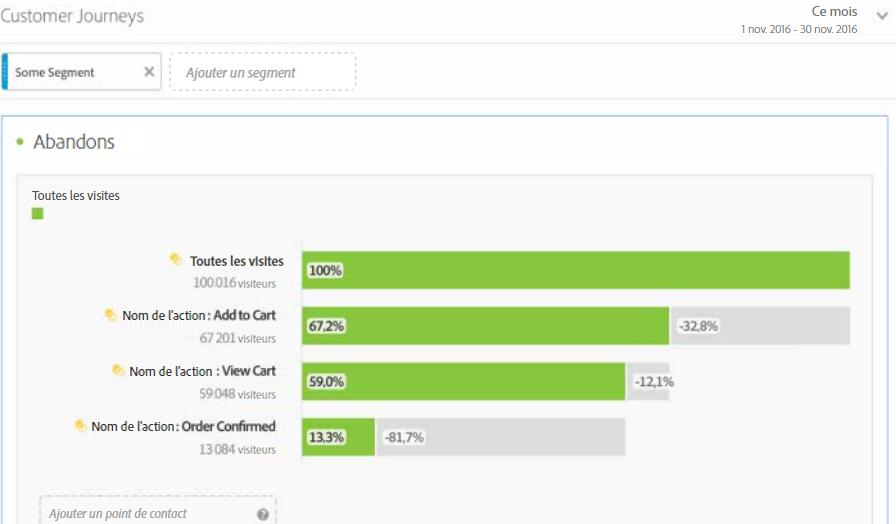 
 </td> 
  </tr> 
  <tr> 
   <td colname="col1"> <b> <a href="/help/analyze/analysis-workspace/visualizations/c-flow/flow.md"  > Visualisation de flux </a></b> </td> 
   <td colname="col2"> 
Grâce à la nouvelle fonction de flux, vous pouvez suivre le flux/parcours des clients dans vos sites et applications au moyen de nouvelles visualisations flexibles dans Analysis Workspace, afin de découvrir de quelle façon se déplacent les clients et progressent dans vos sites et applications. Grâce au flux, vous pouvez : 
 
 
 
    <ul id="ul_F1D4A99743664CB3B17E9485CF5E72FC"> 
     <li id="li_0F7AF953EAB746DC95032FF9A533E560">Visualiser le parcours des clients dans vos ressources </li> 
     <li id="li_697A47BE06CF4284ACA3DBE4CA4012BF">Analyser les étapes suivant immédiatement l’entrée, la sortie ou un élément de dimension spécifique dans le parcours d’un client </li> 
     <li id="li_D13AD928AC434D599D43836FB334B14D">Créer de manière dynamique un segment d’utilisateurs en désignant un point spécifique dans un chemin donné </li> 
    </ul> 
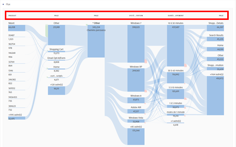 
 </td> 
  </tr> 
  <tr> 
   <td colname="col1"> <b> <a href="/help/components/c-alerts/intellligent-alerts.md"  >Alertes intelligentes </a></b> </td> 
   <td colname="col2"> 
Grâce aux alertes intelligentes du nouveau système d’alerte d’Adobe Analytics, vous pouvez créer et gérer des alertes dans Analysis Workspace, prévisualiser les alertes et gérer les contributions. Vous pouvez : 
 
 
 
    <ul id="ul_02BD64D3047942009880B8F1DA1F2A40"> 
     <li id="li_01504AABBC514DF38354683843222541">Créer des alertes en fonction des anomalies (seuils de 90 %, 95 % ou 99 % ; % de changement ; au-dessus/au-dessous). </li> 
     <li id="li_9BFE2B4C429D441287F1A37A08E62A40">Prévisualiser le nombre de fois où une alerte sera déclenchée. </li> 
     <li id="li_08D310196581483DB499C00358835B73">Envoyer des alertes par e-mail ou par SMS, avec des liens pour générer automatiquement les projets Analysis Workspace. </li> 
     <li id="li_2ADF9465EE474CDB839ED867662CCE6F">Créer des alertes « empilées » qui présentent plusieurs mesures dans une seule alerte. </li> 
    </ul> 
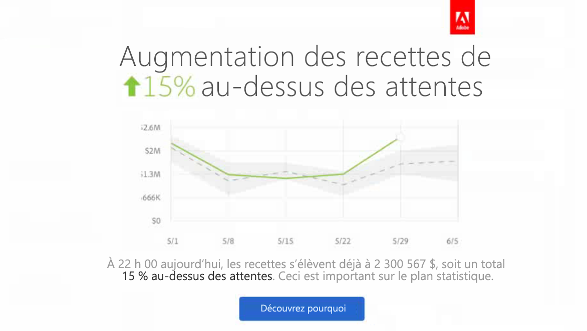 
 </td> 
  </tr> 
  <tr> 
   <td colname="col1"> <b> <a href="/help/analyze/analysis-workspace/virtual-analyst/c-anomaly-detection/anomaly-detection.md"  > Détection des anomalies et analyse des contributions </a></b> </td> 
   <td colname="col2"> 
Permet de savoir si une modification des données de tendances est significative et quelle en est la cause. 
 
La détection des anomalies et l’analyse des contributions sont désormais des processus principaux d’Analysis Workspace. 
 
Important : L’analyse des contributions est réservée aux clients d’Adobe Analytics Premium. 
 
Vous pouvez : 
 
 
 
    <ul id="ul_9CEE47788F3640838D8598F2E2C020D6"> 
     <li id="li_787236BB5EA545B8833B311C06C24337">Détecter de manière automatique les anomalies de données significatives sur le plan statistique </li> 
     <li id="li_2FB3D94DEEF14DD5ADA6AD69E15F243D">Exécuter l’analyse des contributions par rapport à n’importe quelle anomalie quotidienne et l’incorporer à votre projet Analysis Workspace </li> 
    </ul> 
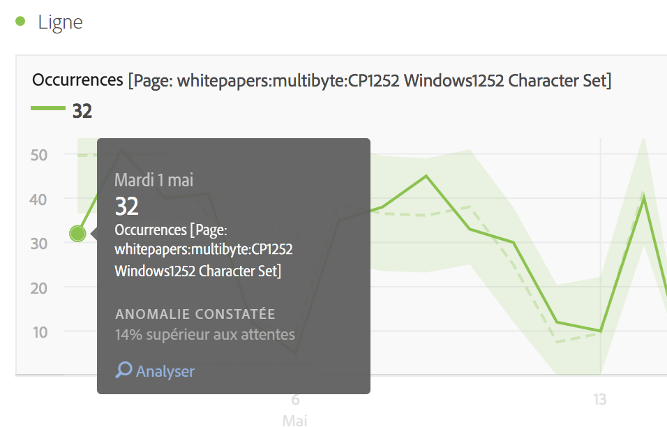 
 
 
 </td> 
  </tr> 
  <tr> 
   <td colname="col1"> <b> <a href="/help/analyze/analysis-workspace/build-workspace-project/starter-projects.md"  > Projets de lancement </a></b> </td> 
   <td colname="col2"> Afin de familiariser les utilisateurs avec Analysis Workspace, nous avons créé des modèles de projet prédéfinis pour des problèmes courants, tels que : 
 
 
    <ul id="ul_603F5ACC16F74D53AEB9F762FAC91656"> 
     <li id="li_6B3F2E5D4B044EC19D45E5501E33DB91">Fidélisation des utilisateurs </li> 
     <li id="li_7240EE8852FC4642B3AD4837C990A775">Acquisition des applications mobiles </li> 
    </ul> 
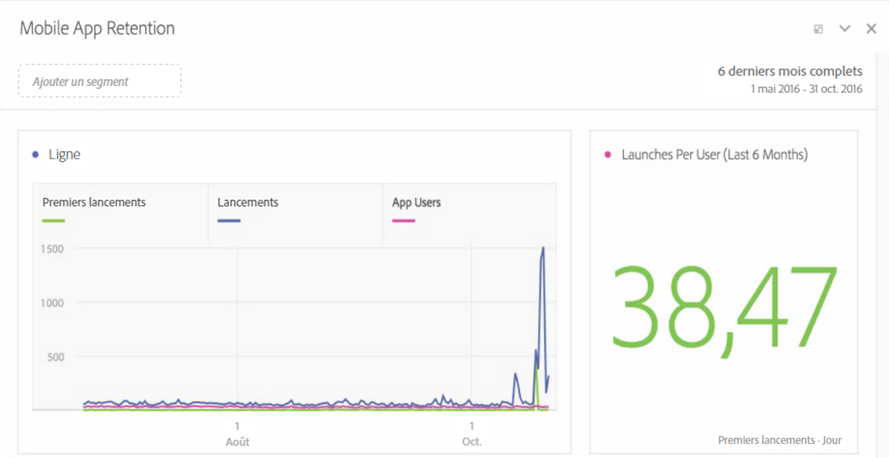 
 </td> 
  </tr> 
  <tr> 
   <td colname="col1"> <b> <a href="/help/analyze/analysis-workspace/visualizations/freeform-analysis-visualizations.md">Visualisation Histogramme </a></b> </td> 
   <td colname="col2"> 
Dans les histogrammes, les utilisateurs peuvent observer la façon dont leurs clients se répartissent pour n’importe quel événement de succès. Vous pouvez personnaliser les intervalles et leur taille en fonction d’une répartition donnée et identifier ainsi les utilisateurs à forte et à faible valeurs. 
 
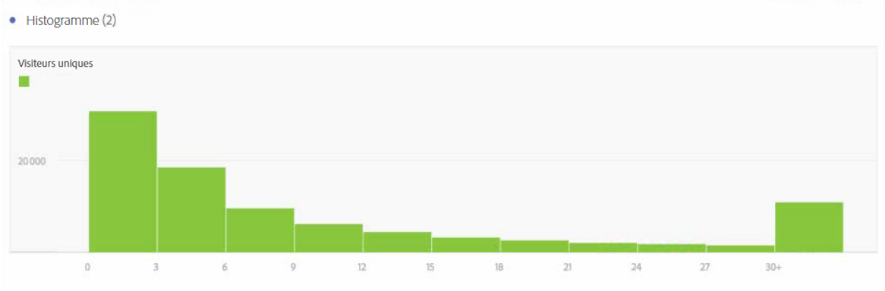 
 </td> 
  </tr> 
  <tr> 
   <td colname="col1"> Mises à jour diverses </td> 
   <td colname="col2"> 
    <ul id="ul_2585F74DC7754C819017F280E16BF06F"> 
     <li id="li_412446013E7F42DBB1BF50F9E2C4D92F"> 
      <!--AN-124610: -->Ajout du paramètre « Compter les instances de répétition » au niveau du projet ( Projet  &gt; Informations et paramètres du projet ). Ce paramètre indique si des instances de répétition sont comptabilisées dans les rapports. S’il existe plusieurs valeurs consécutives pour la même variable, vous pouvez les comptabiliser comme une seule instance ou comme plusieurs instances de la variable. </li> 
     <li id="li_480E1B307C62418CBC2F50ADE32B9EE9">Ajout d’un nouveau bouton nommé « Appliquer à tous les panneaux », situé à côté des boutons « Annuler » et « Exécuter » dans le calendrier. « Exécuter » devient « Appliquer ». Si vous cliquez sur le nouveau bouton, la période sélectionnée pour le panneau en cours, ainsi que pour tous les autres panneaux du projet, est modifiée. </li> 
     <li id="li_4D10DFE307344D06AA60792FABE5B57E"> 
      <!--AN-124168: -->Dans le rail de navigation de gauche, ajout d’un bouton « Actions » qui présente les actions suivantes : Baliser, Favori, Approuver, <b>Partager (nouveauté).</b>, <b>Supprimer (nouveauté)</b>. </li> 
     <li id="li_946EC05568D4447193E9307546DF6F9B">Ajout d’un filtre dans la barre de recherche pour que vous puissiez filtrer les balises, les favoris, les éléments approuvés et les composants. </li> 
     <li id="li_4EA118ACCD3B4F88B0ECF72717F631FA">Ajout d’une icône de prévisualisation sur les lignes manuelles (et non sur les lignes dynamiques qui répertorient les éléments de dimension) afin que vous puissiez prévisualiser les segments, les mesures et les périodes. </li> 
     <li id="li_81D5241EA3FD49CEA0E9F412837D87A8"> 
      <!--AN-128702: -->Mise à jour du lien YouTube des didacticiels Analysis Workspace : <a href="https://www.youtube.com/playlist?list=PL2tCx83mn7GuNnQdYGOtlyCu0V5mEZ8sS"  >https://www.youtube.com/playlist?list=PL2tCx83mn7GuNnQdYGOtlyCu0V5mEZ8sS</a>. </li> 
     <li id="li_D81DB98C49664D2884CCCC1DB0058CD8"> 
      <!--AN-124004:-->Nous avons ajouté pour les visualisations une option accessible par un clic droit dans le menu contextuel, nommée  Recommencer  (compatible avec Flux, Venn, Histogramme). Elle supprime la configuration de la visualisation en cours et ouvre un nouveau panneau dans lequel vous pouvez reconfigurer cette dernière. </li> 
     <li id="li_84632BFCE1794B49A31FF45067FA04B7">Un nouveau paramètre de visualisation nommé « Légende visible » permet de masquer le texte des détails de filtre pour la visualisation de Synthèse des chiffres/Résumé des changements. </li> 
     <li id="li_EE8C48642DD54A04B08F4222F9565BF6">Dans les visualisations Résumé des changements, un nouveau paramètre permet d’afficher la différence entre les deux pourcentages. Si vous sélectionnez cette option pour les valeurs hors pourcentage, un nombre s’affiche. </li> 
     <li id="li_17AAABCA7B3A477182FB70453CA2EEBB">Ajustement du nombre de lignes pour les dimensions temporelles. </li> 
     <li id="li_35A91D50CD514CD0B939C24AEEC64BF4">Mise à jour de l’aspect du rail de navigation de gauche dans le créateur de segments et le créateur de mesures calculées afin qu’il ressemble davantage à l’interface d’Analysis Workspace. </li> 
    </ul> </td> 
  </tr> 
 </tbody> 
</table>

## Juin 2016

Nouvelles fonctionnalités au 16 juin 2016 :

* [Nouvelle autorisation](https://marketing.adobe.com/resources/help/en_US/reference/groups.html) de groupe qui permet aux administrateurs d’autoriser ou de refuser l’accès à l’onglet **[!UICONTROL Analytics]** > **[!UICONTROL Workspace]** pour les utilisateurs. Depuis le 16 juin 2016, tous les utilisateurs ont accès à cet onglet. Pour refuser l’accès, il vous suffit de supprimer les utilisateurs du groupe Analysis Workspace Access (Accès à Analysis Workspace).
* Le [Panneau Comparaison des segments](/help/analyze/analysis-workspace/c-panels/c-segment-comparison/segment-comparison.md) détecte les différences les plus importantes sur le plan statistique entre deux segments, au moyen d’une analyse automatisée de chaque mesure et dimension auxquelles vous avez accès.
* [Nouvelle structure du menu Projets](/help/analyze/analysis-workspace/build-workspace-project/freeform-overview.md) : le menu supérieur est réorganisé et plus extensible. Par exemple, la création d’un **panneau de cohortes** nécessite maintenant de créer un panneau vierge et de le faire glisser dans une visualisation du tableau de cohortes.
* [Nouveau rail de gauche](/help/analyze/analysis-workspace/build-workspace-project/freeform-overview.md) : panneaux, visualisations, composants
* Un nouveau [type de visualisation de Venn](/help/analyze/analysis-workspace/visualizations/venn.md) permet de faire glisser jusqu’à trois segments et une mesure et de générer un diagramme de Venn.
* Le graphique en courbes [Sélection de tendances](/help/analyze/analysis-workspace/analysis-workspace-features.md#section_34930C967C104C2B9092BA8DCF2BF81A) sur un tableau de classement est désormais lié.
* [Icône Créer un visuel](/help/analyze/analysis-workspace/visualizations/freeform-analysis-visualizations.md) : lorsque vous cliquez sur cette icône, le programme devine votre prochaine action (graphique à barres, de Venn...).
* Fonction [Lignes manuelles](/help/analyze/analysis-workspace/build-workspace-project/column-row-settings/manual-vs-dynamic-rows.md) étendue
* Zone de dépôt [Ajouter un segment](/help/analyze/analysis-workspace/components/t-freeform-project-segment.md)
* Mises à jour mineures :

   * Possibilité de supprimer toutes les visualisations dans un panneau et tous les panneaux dans un projet. (Auparavant, vous deviez conserver au moins une visualisation ou un panneau.)
   * Changements des  [raccourcis clavier](/help/analyze/analysis-workspace/build-workspace-project/fa-shortcut-keys.md) (touches d’accès rapide) afin de faciliter le travail dans Analysis Workspace.
   * Changements des styles : polices plus petites dans les visualisations ; nuances de couleur sur les lignes ; déplacement du sélecteur de dates vers le bas (sur les panneaux).

## Avril 2016

Nouvelles fonctionnalités au 21 avril 2016 :

<table id="table_2649645FDED84B71952F741ABB3FC20E"> 
 <thead> 
  <tr> 
   <th colname="col1" class="entry"> Fonctionnalité </th> 
   <th colname="col2" class="entry"> Description </th> 
  </tr> 
 </thead>
 <tbody> 
  <tr> 
   <td colname="col1"> Envoyer un fichier </td> 
   <td colname="col2"> 
Envoyez un projet Analysis Workspace par courrier électronique ou planifiez une livraison. Voir <a href="/help/analyze/analysis-workspace/curate-share/t-schedule-report.md"  >Envoi d’un fichier – Planification de la livraison d’un projet</a>. 
 </td> 
  </tr> 
  <tr> 
   <td colname="col1"> Télécharger un PDF </td> 
   <td colname="col2"> 
Dans le menu Action, vous pouvez télécharger un projet Analysis Workspace au format PDF (s’apparente au téléchargement d’un fichier au format CSV). 
 </td> 
  </tr> 
 </tbody> 
</table>

## Janvier 2016

Nouvelles fonctionnalités au 21 janvier 2016.

* [Annulation des actions](/help/analyze/analysis-workspace/new-features-in-analysis-workspace.md#section_12890C393D5E4FC8A3CF050318BD8482)
* [Lien vers ce projet](/help/analyze/analysis-workspace/new-features-in-analysis-workspace.md#section_453E70F7409F4501B8E976A0D18C9A46)
* [Visualisations sous la forme de graphique à puces, graphique de dispersion et Treemap](/help/analyze/analysis-workspace/new-features-in-analysis-workspace.md#section_B19EA50EBF5546E99D3A142827153FD6)
* [Fonction Enregistrer sous pour les segments, les mesures et les dates](/help/analyze/analysis-workspace/new-features-in-analysis-workspace.md#section_04C8B10A0751453AAE5F1BC35938C6CE)
* [Bouton Ajouter un nouveau segment](/help/analyze/analysis-workspace/new-features-in-analysis-workspace.md#section_85CC88C02C79456EA2B41F2BFBB64FC4)
* [Mise en forme conditionnelle](/help/analyze/analysis-workspace/new-features-in-analysis-workspace.md#section_5775B505D83041408B8C3EAEC5D7C32B)
* [Aperçu des dimensions](/help/analyze/analysis-workspace/new-features-in-analysis-workspace.md#section_F519EBF889B244E8B25BB6BA2833325A)
* [Légende visible](/help/analyze/analysis-workspace/new-features-in-analysis-workspace.md#section_28D10D86CAE343AB838808C1DD2E7983)
* [Axe Y de l’ancre à zéro](/help/analyze/analysis-workspace/new-features-in-analysis-workspace.md#section_83DF5DE79EF04F9F8DCB3154F5E799B3)
* [Nom du projet dans le titre de l’onglet](/help/analyze/analysis-workspace/new-features-in-analysis-workspace.md#section_497C61A030984BCCA2CEA553312C3226)
* [Transfert de la propriété du projet](/help/analyze/analysis-workspace/new-features-in-analysis-workspace.md#section_989C2CCB80B5408EB85E6B12C8D943E3)

## Annulation des actions {#section_12890C393D5E4FC8A3CF050318BD8482}

Vous pouvez désormais annuler la plupart des actions exécutées dans Analysis Workspace.

To undo, click **[!UICONTROL Undo]** from the action menu.

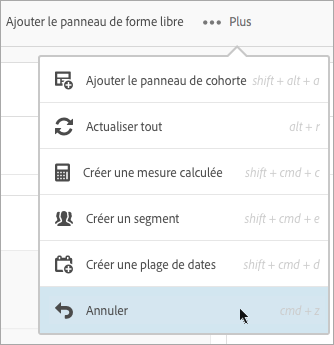

Vous pouvez également utiliser les [raccourcis clavier](/help/analyze/analysis-workspace/build-workspace-project/fa-shortcut-keys.md) Windows et Mac standard (ctrl ou cmd + z) pour Annuler.

*`Undo`* est particulièrement utile lors de l’annulation de ventilations dans le tableau.

Actions *`not`* inutilisables :

* Changing the configuration of a [!UICONTROL Cohort Table] (such as dragging metrics, changing values). Vous pouvez toutefois cliquer **[!UICONTROL Undo]** après avoir cliqué **[!UICONTROL Run]**.

* Le redimensionnement ou le déplacement des panneaux et sous-panneaux.

Actions qui suppriment votre historique des annulations :

* L’enregistrement du projet.
* La modification de la suite de rapports.

## Lien vers ce projet {#section_453E70F7409F4501B8E976A0D18C9A46}

In a project, click **[!UICONTROL Link to This Project]** from the Actions menu to email a saved project&#39;s URL to other users. Les destinataires peuvent modifier et enregistrer un projet partagé de la sorte. Sinon, ces projets sont en lecture seule.

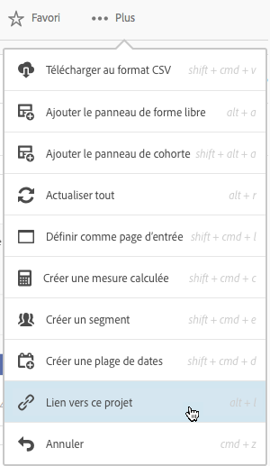

> [!NOTE] Le partage de liens de rapports n’est pas disponible si votre entreprise utilise l’authentification unique (qu’il s’agisse de l’authentification unique héritée ou de la connexion par Experience Cloud).

## Visualisations sous la forme de graphique à puces, graphique de dispersion et Treemap {#section_B19EA50EBF5546E99D3A142827153FD6}

Les nouvelles visualisations suivantes sont disponibles dans la version de janvier 2016.

**Graphique à puces**

Vous pouvez comparer ou mesurer une valeur qui vous intéresse par rapport à d’autres plages de performances (objectifs).

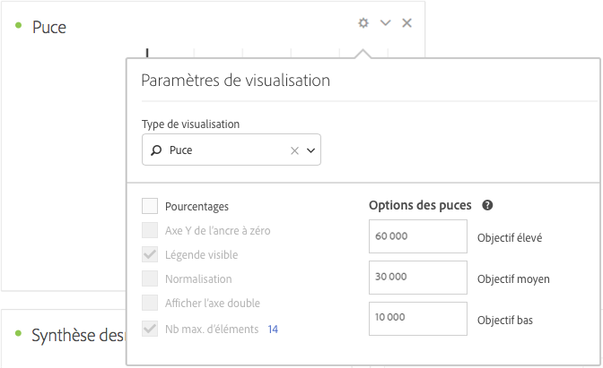

Le graphique à puces dispose d’une seule mesure principale (par exemple, le cumul annuel jusqu’à ce jour des recettes), compare cette mesure à une ou plusieurs autres mesures afin d’enrichir sa signification (par exemple, comparaison avec les recettes cibles) et affiche la comparaison dans le contexte de plages de performances qualitatives (par exemple, élevées, moyennes et faibles). You can specify goal ranges in [!UICONTROL Visualization Settings].

**Graphique de dispersion**

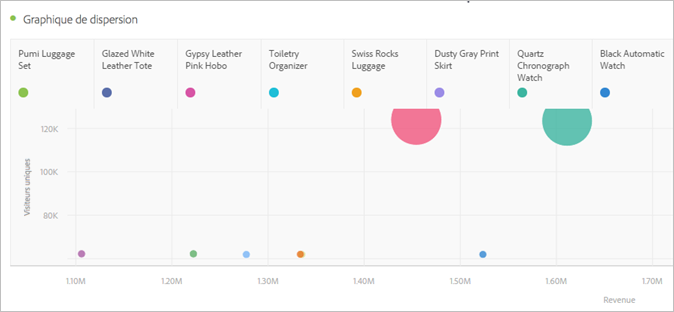

Présente les impressions diffusées et le nombre d’utilisateurs uniques qui ont vu ces impressions. La taille de chaque point de données fournit une indication visuelle du nombre de fois moyen auquel un observateur a été exposé à une publicité. La taille et les données varient selon les dimensions, les plages de dates et les filtres que vous sélectionnez.

> [!NOTE] Un tableau associé à un graphique de dispersion requiert au moins deux colonnes. La première colonne définit l’axe des abscisses (X) et la deuxième colonne, l’axe des ordonnées (Y). Si une troisième colonne est disponible, le graphique de dispersion l’utilise pour déterminer le rayon du point. En d’autres termes, les colonnes *1*, *2* et *3* correspondent à *X*, à *Y* et au *rayon du point*.

**Treemap**

Présente les données hiérarchiques (structurées en arbre) sous la forme d’un ensemble de rectangles imbriqués. Chaque branche de l’arbre se voit affectée d’un rectangle qui est découpé en une mosaïque de plus petits rectangles représentant les sous-branches.

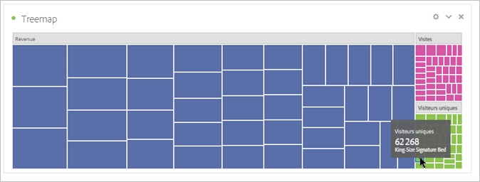

Lorsque les dimensions couleur et taille sont corrélées d’une manière ou d’une autre avec la structure de l’arbre, il est souvent facile de distinguer des motifs qui seraient difficiles à repérer par d’autres moyens, par exemple si une certaine couleur est particulièrement pertinente. Un autre avantage des graphiques Treemap est qu’ils, par essence, maximisent l’utilisation de l’espace.

## Fonction Enregistrer sous pour les segments, les mesures et les dates  {#section_04C8B10A0751453AAE5F1BC35938C6CE}

When editing an existing (saved) segment the Analysis Workspace Segment Builder, click **[!UICONTROL Save As]** to make a copy.

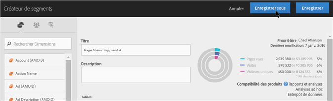

The new segment displays in the [!UICONTROL Segments] group in the [!UICONTROL Components] panel.

*`Save As`* est également disponible pour les [!UICONTROL Calculated Metric Builder] et [!UICONTROL Date Range Builder].

## Bouton Ajouter un nouveau segment {#section_85CC88C02C79456EA2B41F2BFBB64FC4}

The **[!UICONTROL Add New Segment]** button has been added to the location where you drag-and-drop segments onto a project.

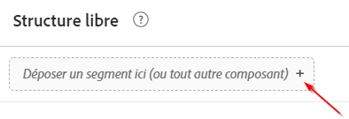

Ceci s’avère pratique si vous préférez créer des segments directement quand vous travaillez dans un projet, plutôt que d’utiliser le panneau [!UICONTROL Segment].

## Mise en forme conditionnelle  {#section_5775B505D83041408B8C3EAEC5D7C32B}

Dans les paramètres de colonne, vous pouvez appliquer une mise en forme conditionnelle aux données des cellules.

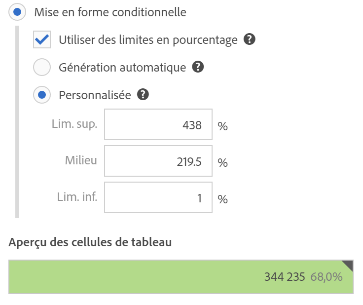

<table id="table_4285E6982FBD4B66AC95AAF6C5C7B347"> 
 <thead> 
  <tr> 
   <th colname="col1" class="entry"> Élément </th> 
   <th colname="col2" class="entry"> Description </th> 
  </tr> 
 </thead>
 <tbody> 
  <tr> 
   <td colname="col1"> Mise en forme conditionnelle </td> 
   <td colname="col2"> 
 Applique les couleurs suivantes aux cellules, selon la valeur des données : 
 
    <ul id="ul_97E3AD5F6B41460C882D8B4EE0A8C77A"> 
     <li id="li_88874B4250224DE781C03E4A5931D6A2">Vert : valeurs élevées </li> 
     <li id="li_B4863F967C7544D7AA2847696FB85525">Jaune : valeurs moyennes </li> 
     <li id="li_5B06D7CD0C39437898DA55EA653A1124">Rouge : faibles valeurs </li> 
    </ul> 
Le remplacement d’une dimension du tableau réinitialise les limites de la mise en forme conditionnelle. Le remplacement d’une mesure recalcule les limites de cette colonne (lorsqu’une mesure se trouve sur l’axe des abscisses et une dimension sur l’axe des ordonnées). 
 </td> 
  </tr> 
  <tr> 
   <td colname="col1"> Génération automatique </td> 
   <td colname="col2"> 
Génère automatiquement des limites pour la mise en forme conditionnelle. La limite supérieure est la valeur la plus élevée de cette colonne. La limite inférieure est la valeur la plus faible et la valeur moyenne est la moyenne entre les limites supérieure et inférieure. 
 </td> 
  </tr> 
  <tr> 
   <td colname="col1"> Personnalisé </td> 
   <td colname="col2"> 
Vous pouvez affecter manuellement les valeurs des champs  Limite supérieure ,  Milieu  et  Limite inférieure  pour la mise en forme conditionnelle. Vous disposez ainsi de la flexibilité nécessaire pour déterminer si la valeur d’une colonne devient bonne, moyenne ou mauvaise. 
 </td> 
  </tr> 
 </tbody> 
</table>

## Aperçu des dimensions  {#section_F519EBF889B244E8B25BB6BA2833325A}

Dans le panneau du composant [!UICONTROL Dimensions]Dimension, vous pouvez placer le pointeur de la souris sur l’icône d’informations située en regard d’une dimension pour afficher l’aperçu des cinq premières 

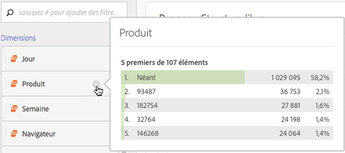

## Légende visible  {#section_28D10D86CAE343AB838808C1DD2E7983}

Dans [!UICONTROL Visualization Settings] l’ **[!UICONTROL Legend Visible]** option, affiche ou masque la légende d’une visualisation.

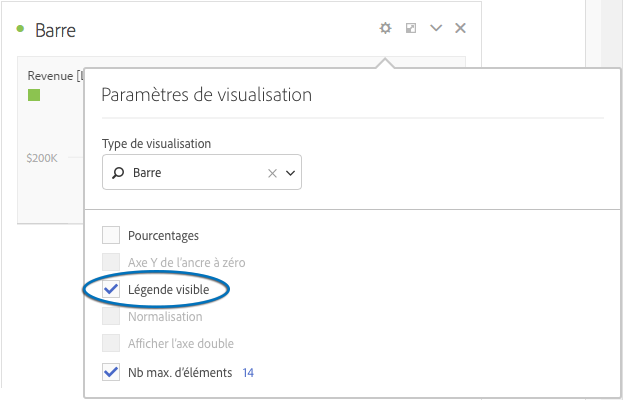

## Axe Y de l’ancre à zéro {#section_83DF5DE79EF04F9F8DCB3154F5E799B3}

Selon les chiffres des graphiques en courbes et des diagrammes de surface, la partie inférieure de l’axe des ordonnées (Y) peut ne pas être zéro. L’activation **[!UICONTROL Anchor Y Axis at Zero]** de [!UICONTROL Visualization Settings] l’axe des ordonnées force l’axe des ordonnées sur zéro, afin d’obtenir un de tendances plus précis. Les exemples suivants présentent les modifications d’un diagramme des recettes en fonction de l’activation ou de la désactivation de ce paramètre.

**Option Axe Y de l’ancre à zéro désactivée**

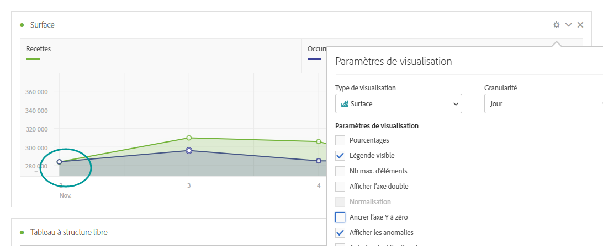

**Option Axe Y de l’ancre à zéro activée**

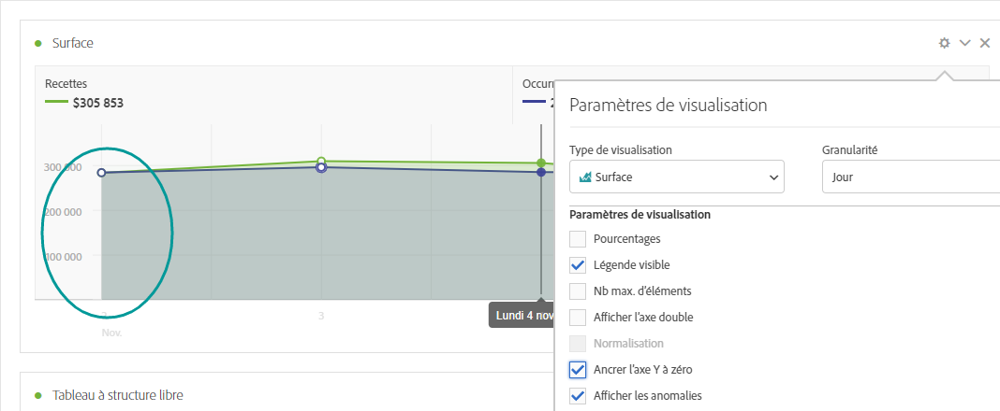

## Nom du projet dans le titre de l’onglet  {#section_497C61A030984BCCA2CEA553312C3226}

Lors de l’enregistrement d’un projet, le titre sur l’onglet du navigateur s’affiche comme suit : « `<Project Name>` - Analysis Workspace ». Ceci s’avère pratique si vous ouvrez plusieurs projets dans plusieurs onglets de navigateur.

## Transfert de la propriété du projet  {#section_989C2CCB80B5408EB85E6B12C8D943E3}

Les administrateurs peuvent transférer les projets [!UICONTROL Analysis Workspace] d’un utilisateur à un autre.

Accédez à **[!UICONTROL Admin]** > **[!UICONTROL User Management]** > **[!UICONTROL Transfer]** pour transférer des projets.
