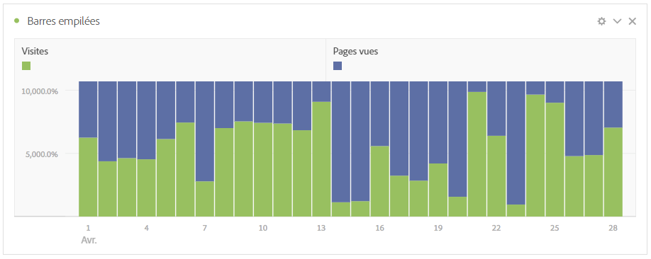

# Nouveautés d’Analysis Workspace

## Mars 2020

Nouvelles fonctionnalités publiées le 12 mars 2020.

| Fonctionnalité | Description |
|--- |--- |
| Prise en charge de plusieurs suites de rapports dans Workspace | Vous pouvez désormais importer côte à côte les données de plusieurs suites de rapports dans un projet unique afin de  les données de plusieurs suites de rapports. [En savoir plus...](https://docs.adobe.com/content/help/fr-FR/analytics/analyze/analysis-workspace/build-workspace-project/multiple-report-suites.html) |
| Modèle de didacticiel de formation | Ce nouveau modèle standard vous guide tout au long de la terminologie commune et des étapes nécessaires à la création de votre premier   dans Workspace. Il est disponible sous forme de modèle standard dans le modal Nouveau projet et remplace l’exemple de projet qui existe aujourd’hui pour les nouveaux utilisateurs qui n’ont pas d’autres projets dans leur liste. [En savoir plus...](/help/analyze/analysis-workspace/build-workspace-project/starter-projects.md) |

## Février 2020

Nouvelles fonctionnalités publiées le 20 février 2020.

| Fonctionnalité | Description |
|--- |--- |
| Nouveau modèle Workspace pour les organisations qui utilisent Analytics sur plusieurs périphériques | Ce modèle montre l&#39;efficacité de l&#39;ADC à assembler les visites et vous informe sur les dimensions et les mesures exclusives de l&#39;ADC. Une suite de rapports utilisant CDA est requise. Voir [Configuration d’Analytics sur l’ensemble des appareils](https://docs.adobe.com/content/help/fr-FR/analytics/components/cda/cda-setup.html) pour plus d’informations. |
| Nouvelles touches d’accès rapide dans Workspace | <ul><li>Réduire/Développer tous les panneaux : `alt + m`</li><li>Réduire/Développer le panneau actif : `alt + ctrl + m`</li><li>Rechercher dans le rail de gauche : `ctrl + /`</li><li>Accéder au panneau suivant : `alt + Right Key`</li><li>Accéder au panneau précédent : `alt + Left Key`</li></ul>[En savoir plus...](https://docs.adobe.com/content/help/fr-FR/analytics/analyze/analysis-workspace/build-workspace-project/fa-shortcut-keys.html) |
| Autres améliorations de Workspace | <ul><li>Lorsqu’un panneau ou une visualisation est déposé dans Workspace, le rail de gauche passe désormais automatiquement aux composants pour un flux de travail plus fluide.</li><li>Les composants de modèle peuvent désormais être utilisés (balisés, favoris, approuvés, par exemple).</li><li>Le de mesures et de segments filtrés  le bouton + pour ajouter un nouveau composant si vous ne trouvez pas ce dont vous avez besoin.</li></ul> |
| Débogueur Workspace | Le débogueur Workspace a été ajouté au menu Aide, ce qui vous permet de l’activer plus facilement pour le débogage des requêtes Workspace. [En savoir plus...](https://www.adobe.io/apis/experiencecloud/analytics/docs.html#!AdobeDocs/analytics-2.0-apis/master/reporting-tricks.md) |

## Janvier 2020

Nouvelles fonctionnalités au jeudi 16 janvier 2020.

| Fonctionnalité | Description |
|--- |--- |
| [Créateur de tableau à structure libre](https://docs.adobe.com/content/help/fr-FR/analytics/analyze/analysis-workspace/visualizations/freeform-table.html) | Une fois le générateur de tableau activé, vous pouvez faire glisser et déposer de nombreuses dimensions, ventilations, mesures et segments afin de créer des tableaux qui répondent à des problématiques professionnelles plus complexes. Les données ne seront pas mises à jour immédiatement, Instead, updates occur after you click **[!UICONTROL Build]**, saving you time once you know what table you want to construct. En outre, cette fonctionnalité offre les options suivantes :<ul><li>**Aperçu** : vous pouvez prévisualiser le format d’un tableau avant de passer du temps à générer des données réelles.</li><li>**Paramètres flexibles pour les rangées et la ventilation** : vous pouvez définir les niveaux de rangée et de ventilation pour chaque ligne de dimension. Auparavant, Workspace imposait des valeurs par défaut qui ne pouvaient pas être modifiées après le renvoi des données.</li><li>**Ventilation par position** : vous pouvez définir des rangées de dimension sur _ventilation par position_ et non _par élément spécifique_ (valeur par défaut).</li><li>**Agencement manuel des rangées statiques** : vous pouvez agencer manuellement les rangées statiques afin que les rangées du tableau s’affichent exactement comme vous en avez besoin. Auparavant, les lignes statiques pouvaient être triées uniquement par colonne de mesure ou par ordre alphabétique.</li></ul> |

## Octobre 2019

Améliorations publiées le 10 octobre 2019.

| Amélioration | Description |
|--- |--- |
| Mise à jour des totaux des tableaux à structure libre | Les tableaux à structure libre comprennent désormais deux totaux, a **[!UICONTROL Table total]** et a **[!UICONTROL Grand total]**. La ligne Total du tableau tient compte des [filtres de rapport](https://docs.adobe.com/content/help/fr-FR/analytics/analyze/analysis-workspace/build-workspace-project/pagination-filtering-sorting.html) appliqués. Avant la mise à jour, seule la segmentation affectait les totaux. [En savoir](https://docs.adobe.com/content/help/fr-FR/analytics/analyze/analysis-workspace/build-workspace-project/workspace-totals.html) plusEn outre, **[!UICONTROL Show Totals]** et **[!UICONTROL Show Grand Total]** des options ont été ajoutées à **[!UICONTROL Column Settings]**. Avec cette modification des totaux de forme libre, les visualisations dépendantes seront mises à jour (par exemple, **[!UICONTROL Summary Number]** visualisations liées), ainsi que les données CSV et PDF exportées. |
| Option de suppression pour Non spécifié/Aucun | La possibilité de supprimer facilement « Non spécifié (Aucun) » a été ajoutée en tant qu’option des filtres de rapport. |
| Abandon des composants de granularité violets | Les composants temporels de granularité violets (minute, heure, jour, semaine, mois, trimestre, année) ont été abandonnés. Les composants temporels violets se sont toujours comportés exactement comme leurs homologues de dimension orange, ce changement simplifiera donc l’expérience. **Aucune action** n’est nécessaire si vous avez déjà utilisé l’un des composants temporels violets. Grâce à ce changement, la section violette **[!UICONTROL Time]** a également été renommée **[!UICONTROL Date Ranges]**. |

## Août 2019

Amélioration publiée le 8 août 2019.

| Amélioration | Description |
|--- |--- |
| Limite des éléments pour le filtre déroulant augmentée de 50 à 200 | La limite des éléments pouvant être placés dans un filtre déroulant a été augmentée de 50 à 200. Cette amélioration prend en charge divers cas d’utilisation, tels que l’ajout à un filtre de tous les pays (195) ou de tous les États et provinces (52). |

## Juillet 2019

Améliorations publiées le 18 juillet 2019.

| Amélioration | Description |
|--- |--- |
| Améliorations de l’analyse des cohortes | De nouveaux [paramètres d’analyse des cohortes](https://docs.adobe.com/content/help/fr-FR/analytics/analyze/analysis-workspace/visualizations/cohort-table/t-cohort.html) ont été ajoutés : <ul><li>Afficher uniquement le pourcentage</li><li>Arrondir le pourcentage à l’entier le plus proche</li><li>Afficher une ligne de pourcentage moyenne</li></ul> |
| Afficher les éléments des 18 derniers mois | Dans le rail de gauche, les utilisateurs ont maintenant la possibilité d’_afficher les éléments des 18 derniers mois_. Auparavant, la période de recherche arrière était de 6 mois au maximum. Il est ainsi plus facilite d’effectuer une comparaison de pages ou de campagnes de l’année passée, jusqu’à 18 mois en arrière. |
| Nouveau modèle Analysis Workspace | Un nouveau modèle appelé [Magento : Marketing et commerce](https://docs.adobe.com/content/help/fr-FR/analytics/analyze/analysis-workspace/build-workspace-project/starter-projects.html) a été ajouté à Analysis Workspace. Il est destiné aux clients d’e-commerce Magento, mais tout détaillant peut l’utiliser pour obtenir des informations uniques sur ses activités commerciales. |

## Juin 2019

Amélioration publiée le 13 juin 2019.

| Amélioration | Description |
|--- |--- |
| Nouveaux filtres prêts à l’emploi | Ajout de nouveaux filtres prêts à l’emploi dans la zone de recherche du rail gauche. Outre ce que vous voyez aujourd’hui (Dimensions, Mesures, Approuvé, etc.), de nouveaux filtres tels que Mesures calculées, Attributs du client, eVars, Props, Vidéo, etc. ont été ajoutés afin de faciliter la recherche des composants dont vous avez besoin. |

## Mai 2019

Amélioration publiée le 9 mai 2019.

| Amélioration | Description |
|--- |--- |
| Un nouveau paramètre a été ajouté aux paramètres de visualisation de flux : Inclure les instances de répétition. | [Paramètres de flux](/help/analyze/analysis-workspace/visualizations/c-flow/flow-settings.md) |

## Avril 2019

Amélioration publiée le 11 avril 2019.

| Amélioration | Description |
|--- |--- |
| Améliorations apportées aux bonnes pratiques en matière d’optimisation | [Optimisation des performances](/help/analyze/analysis-workspace/new-features-in-analysis-workspace.md) |

## Janvier 2019

Nouvelles fonctionnalités et améliorations au 17 janvier 2019.

| Fonctionnalité | Description |
|--- |--- |
| [Analyse des cohortes](/help/analyze/analysis-workspace/visualizations/cohort-table/cohort-analysis.md) | Les principales améliorations apportées à la  Cohort vous permettent de :<ul><li>Appliquez séparément des mesures d’inclusion de segment et de retour. </li><li>Montrez l&#39;unité au lieu de la rétention.</li><li>Afficher les tableaux de latence (durée écoulée avant et après un  d’inclusion).</li><li>Personnalisez la dimension de cohorte (pour regrouper les en fonction d’une eVar, et pas seulement du temps).</li><li>de calculer la rétention/la perte de clientèle sur la base de la période précédente et non de la cohorte d’origine ; </li><li>d’ajouter plusieurs mesures dans les champs d’inclusion et de retour, ainsi que d’appliquer des segments ; (Les mesures calculées ne sont pas prises en charge)</li></ul> |
| [Densité d’affichage](/help/analyze/analysis-workspace/build-workspace-project/view-density.md) | Le nouveau paramètre vous permet de voir plus de données sur un seul écran en réduisant l’espacement vertical du rail gauche, dans les tableaux à structure libre et dans les tableaux de cohortes. Accessible via Projet > Informations et paramètres du projet. |
| [Prise en charge de variables à valeurs multiples dans l’Attribution IQ](attribution-iq.md) | Certaines dimensions dans Analytics peuvent contenir plusieurs valeurs pour un seul accès, telles que les variables de liste (listVars), la variable product, les propriétés de liste (list props) ou l’eVar de marchandisage. Analysis Workspace vous permet d’appliquer l’Attribution IQ à n’importe quel type de ces variables au niveau de l’accès. |
| Amélioration des performances | Améliorations de la vitesse des visualisations de ventilation : les projets avec de nombreuses ventilations se chargent plus rapidement. |

## Novembre 2018

Nouvelles fonctionnalités et améliorations publiées le 1er novembre 2018.

| Fonctionnalité | Description |
|--- |--- |
| [Traitement des suites de rapports virtuelles et des projets – améliorations](/help/analyze/analysis-workspace/curate-share/curate-projects-vrs.md) | Ces améliorations ont en fait été introduites en octobre 2018. Des modifications ont été apportées quant aux composants visibles aux administrateurs et aux non-administrateurs dans les suites de rapports virtuelles et les projets Workspace traités.   Auparavant, les composants non traités étaient visibles par tous en cliquant sur Afficher tous les composants. La mise à jour de l’expérience de traitement permet de mieux contrôler les composants visibles.  |

## Octobre 2018

Nouvelles fonctionnalités et améliorations publiées le 11 octobre 2018.

<table id="table_3DDC812B2F66416F868004416D248BF3"> 
 <thead> 
  <tr> 
   <th colname="col1" class="entry"> Fonctionnalité </th> 
   <th colname="col2" class="entry"> Description </th> 
  </tr> 
 </thead>
 <tbody> 
  <tr> 
   <td colname="col1"> 
<b>Gestion des listes déroulantes de panneaux</b> 
 </td> 
   <td colname="col2"> 
Nous avons apporté quelques modifications à la gestion des listes déroulantes des groupes spéciaux, qui ont été introduites dans le document de référence de septembre. Lorsque vous cliquez avec le bouton droit de la souris sur la liste déroulante, vous pouvez désormais 
 
    <ul id="ul_4BDEC66EEB2243628FE32B43E377E5BD"> 
     <li id="li_EF8277BE972540D3B2604D82BC7C0918">Supprimez une liste déroulante (cette option est toujours présente). </li> 
     <li id="li_6A991208F2744274817DBE1E9D1B443F">Supprimez une étiquette (si une étiquette s’affiche). </li> 
     <li id="li_5C1CFC465C2E41D2B35E8841EFDC82AA">Ajouter une étiquette (si aucune étiquette n’est affichée). </li> 
    </ul> </td> 
  </tr> 
  <tr> 
   <td colname="col1"> 
<b>Liens dans les info-bulles des panneaux et des visualisations</b> 
 </td> 
   <td colname="col2"> 
Nous avons ajouté des liens vers les vidéos et la documentation pertinentes aux info-bulles des panneaux et des visualisations. 
 </td> 
  </tr> 
 </tbody> 
</table>

## Septembre 2018

Nouvelles fonctionnalités et améliorations publiées le 13 septembre 2018.

<table id="table_137719BFA03C44A78FDE872DF8B228A4"> 
 <thead> 
  <tr> 
   <th colname="col1" class="entry"> Fonctionnalité </th> 
   <th colname="col2" class="entry"> Description </th> 
  </tr> 
 </thead>
 <tbody> 
  <tr> 
   <td colname="col1"> 
<b>Listes déroulantes de panneau</b> 
 </td> 
   <td colname="col2"> 
La zone de dépôt de panneau dispose désormais de fonctionnalités de liste déroulante. Les listes déroulantes permettent aux utilisateurs finaux d’interagir avec les données d’un projet de manière contrôlée. Exemple : Supposons que vous disposez de plusieurs versions d’un projet pour fournir des  spécifiques à un pays. Vous pouvez maintenant réduire ces projets en un seul projet et les ajouter dans une liste déroulante de pays à la place. 
 </td> 
  </tr> 
  <tr> 
   <td colname="col1"> 
<b>Palettes de couleurs</b> 
 </td> 
   <td colname="col2"> 
Vous pouvez désormais modifier le modèle de couleurs utilisé dans Workspace, en choisissant une autre palette de couleurs ou en spécifiant votre propre palette. Cela affecte de nombreuses choses dans Workspace, y compris la plupart des visualisations. Elle <b>n’affecte PAS</b> la visualisation Résumé des changements, la mise en forme conditionnelle dans les tableaux à structure libre et la visualisation Carte. 
 
Remarque : la prise en charge des palettes de couleurs n’est pas activée pour Internet Explorer 11. 
 </td> 
  </tr> 
  <tr> 
   <td colname="col1"> 
<b>Nouveau modèle : Consommation audio</b> 
 </td> 
   <td colname="col2"> 
Voir <a href="https://marketing.adobe.com/resources/help/fr_FR/sc/appmeasurement/hbvideo/media-workspace-templates.html"  > Audio Analytics</a>. 
 </td> 
  </tr> 
 </tbody> 
</table>
## Août 2018

Nouvelles fonctionnalités et améliorations au 9 août 2018.

<table id="table_DD77C02344414DCD9AC0A6A22E648B72"> 
 <thead> 
  <tr> 
   <th colname="col1" class="entry"> Fonctionnalité </th> 
   <th colname="col2" class="entry"> Description </th> 
  </tr> 
 </thead>
 <tbody> 
  <tr> 
   <td colname="col1"> 
<b>Guides de la zone de dépôt</b> 
 </td> 
   <td colname="col2"> 
Ces guides vous aident à comprendre plus facilement le résultat de chaque action de glisser-déposer. Par exemple, lorsque vous passez la souris sur une colonne, des éléments tels que Ajouter, Remplacer, Filtrer par et Ventilation s’affichent. 
 
Nous avons également ajouté des repères jaunes/rouges qui vous avertissent lorsque vous effectuez une action non recommandée ou interdite, comme l’empilement de deux mesures les unes par-dessus les autres (ce qui entraîne l’affichage de données non valides). 
 </td> 
  </tr> 
  <tr> 
   <td colname="col1"> 
<b>Option Ajouter panneau vierge</b> 
 </td> 
   <td colname="col2"> 
Nous avons ajouté un symbole + sous le panneau de démarrage pour faciliter l’ajout de panneaux supplémentaires. 
 </td> 
  </tr> 
 </tbody> 
</table>

## Juillet 2018

Nouvelles fonctionnalités et améliorations au 19 juillet 2018.

<table id="table_336E121310204DC492EA004F40830B0F"> 
 <thead> 
  <tr> 
   <th colname="col1" class="entry"> Fonctionnalité </th> 
   <th colname="col2" class="entry"> Description </th> 
  </tr> 
 </thead>
 <tbody> 
  <tr> 
   <td colname="col1"> 
<b> <a href="attribution-iq.md"  > Attribution IQ </a> </b> 
 </td> 
   <td colname="col2"> 
Attribution IQ vous permet de réaliser des analyses plus complexes et plus intelligentes de la performance marketing. De nouveaux modèles d’attribution peuvent être utilisés sur les mesures dans  espace de travail  (sur n’importe quel tableau ou sur n’importe quelle ventilation) et dans les mesures calculées. Un nouveau panneau Attribution permet une meilleure visualisation et comparaison. 
 </td> 
  </tr> 
  <tr> 
   <td colname="col1"> 
<b> Améliorations apportées au rail de gauche </b> 
 </td> 
   <td colname="col2"> 
Améliorations apportées au rail de gauche pour le rendre plus intuitif et plus facile à utiliser : 
 
    <ul id="ul_087BEDF4338946DA857CD82CB69F98C2"> 
     <li id="li_C751AACAC60442DC93118F0819F8EEA7"> Rend la fonction Créer (+) pour les composants (mesures, segments, dates) en ligne avec les en-têtes. </li> 
     <li id="li_DE2EB184A02D4CE58C23F518DB85EFDD"> Ajout de "+ Voir tout" au bas de chaque de section afin de rendre visible qu’il existe plus de 5 options. </li> 
     <li id="li_5208F3C6026647B09F4A85131B175175">Actions surfacées (comme balise, favori) avec des icônes lorsque des composants sont sélectionnés. </li> 
     <li id="li_11E601488A844515928231E09889BC54">Amélioration esthétique de l’interface utilisateur. </li> 
    </ul> </td> 
  </tr> 
  <tr> 
   <td colname="col1"> 
<b>Totaux des mesures calculées </b> 
 </td> 
   <td colname="col2"> 
Lorsque cela est possible, nous affichons maintenant les totaux pour les mesures calculées, y compris pour les pourcentages. 
 </td> 
  </tr> 
  <tr> 
   <td colname="col1"> 
<b>Nouveau <a href="/help/analyze/analysis-workspace/components/calendar-date-ranges/calendar.md"  > paramètre prédéfini de plage de </a>dates </b> 
 </td> 
   <td colname="col2"> 
Ajout de l’option "13 dernières semaines complètes" aux paramètres prédéfinis de la plage de dates dans  espace de travail . 
 </td> 
  </tr> 
 </tbody> 
</table>

## Juin 2018

Nouvelles fonctionnalités et améliorations au 14 juin 2018.

<table id="table_57035A06D99447A6BE6ED825A648ED3F"> 
 <thead> 
  <tr> 
   <th colname="col1" class="entry"> Fonctionnalité </th> 
   <th colname="col2" class="entry"> Description </th> 
  </tr> 
 </thead>
 <tbody> 
  <tr> 
   <td colname="col1"> 
<b> <a href="/help/analyze/analysis-workspace/components/dimensions/view-dimensions.md"  > Colonnes de dimension dynamiques </a> </b> 
 </td> 
   <td colname="col2"> 
Auparavant, lorsqu’une dimension était déposée sur une colonne, nous affichions les 5 premières valeurs pour les dimensions non temporelles (et 15 pour les dimensions temporelles) et conservions ces valeurs statiques (c’est-à-dire que les 5 valeurs sélectionnées n’avaient jamais changé). 
 
Désormais, par défaut, nous affichons des valeurs dynamiques au lieu de valeurs statiques, avec la possibilité de les transformer en valeurs statiques. Autres points à noter : 
 
    <ul id="ul_C802BC32CB084E30B4E58E9E90B9A63D"> 
     <li id="li_452466AB416F4737B532849C604BD4CC">Cliquez sur (i) sur la dimension dynamique pour afficher le classement (1 sur 5 en haut) et le type de dimension. </li> 
     <li id="li_588F6199E38D47869AC855A4C2A4D1B7">Au fur et à mesure que vos données sont mises à jour, les colonnes de dimension dynamique se mettent à jour pour afficher les éléments de dimension 5/15 actuels. </li> 
     <li id="li_19D47638D4D94416B0DAD2B2FB835ABE">Une colonne de dimension dynamique copiée ou déplacée devient statique. </li> 
     <li id="li_B95411689AE04774B7B9BA128F2DB96F">Lorsque vous passez la souris sur une colonne de dimension statique, une icône de verrouillage s’affiche, indiquant que la dimension est statique. </li> 
    </ul> </td> 
  </tr> 
  <tr> 
   <td colname="col1"> 
<b>Nouvelles fonctionnalités de Workspace modales </b> 
 </td> 
   <td colname="col2"> 
Tout comme les conseils du jour introduits le mois dernier, ce module présente les nouvelles fonctionnalités de Workspace la première fois que vous vous connectez à Workspace après une nouvelle version. 
 </td> 
  </tr> 
 </tbody> 
</table>

## Mai 2018

Nouvelles fonctionnalités et améliorations au 10 mai 2018.

<table id="table_EE4C690A178B4F80BDAF2BB4424D6020"> 
 <thead> 
  <tr> 
   <th colname="col1" class="entry"> Fonctionnalité </th> 
   <th colname="col2" class="entry"> Description </th> 
  </tr> 
 </thead>
 <tbody> 
  <tr> 
   <td colname="col1"> 
<b>Conseils du jour</b> 
 </td> 
   <td colname="col2"> 
Nous fournissons des conseils du jour (avec une courte vidéo) dans le coin inférieur droit de l'interface. Ces conseils sont destinés à vous familiariser avec une multitude de fonctionnalités  de l’espace de travail . Vous pouvez ignorer ces Conseils ou y accéder en cliquant sur  Aide  &gt;  Conseils  à n’importe quel moment. 
 
 
 </td> 
  </tr> 
  <tr> 
   <td colname="col1"> 
<b> <a href="/help/analyze/analysis-workspace/components/t-freeform-project-segment.md"  > Modèles de segments </a> et <a href="/help/analyze/analysis-workspace/components/apply-create-metrics.md"  > modèles de mesures calculées </a></b> 
 </td> 
   <td colname="col2"> 
Le rail de gauche affiche désormais les modèles de segments et les modèles de mesures calculées. 
 </td> 
  </tr> 
  <tr> 
   <td colname="col1"> 
<b>Possibilité de faire défiler les composants tout en les faisant glisser</b> 
 </td> 
   <td colname="col2"> 
Vous pouvez désormais faire défiler l’écran vers le haut et vers le bas tout en faisant glisser des composants vers un nouvel emplacement. 
 </td> 
  </tr> 
  <tr> 
   <td colname="col1"> 
<b>Informations supplémentaires sur  <a href="/help/analyze/analysis-workspace/virtual-analyst/c-anomaly-detection/view-anomalies.md"  > les anomalies </a></b> 
 </td> 
   <td colname="col2"> 
Lorsque vous passez la souris sur une anomalie dans un graphique en courbes, les informations indiquent désormais la date et la valeur brute de l’anomalie. 
 </td> 
  </tr> 
 </tbody> 
</table>

## Avril 2018

Nouvelles fonctionnalités et améliorations au 12 avril 2018.

<table id="table_B9E784CD14A1453EB360FCCDC612250F"> 
 <thead> 
  <tr> 
   <th colname="col1" class="entry"> Fonctionnalité </th> 
   <th colname="col2" class="entry"> Description </th> 
  </tr> 
 </thead>
 <tbody> 
  <tr> 
   <td colname="col1"> 
 <a href="/help/analyze/analysis-workspace/build-workspace-project/column-row-settings/column-settings.md"  > Retour à la ligne du texte d’en-tête activé par défaut </a> 
 </td> 
   <td colname="col2"> 
La configuration de colonnes sur Retour à la ligne du texte d’en-tête est désormais activée par défaut pour les tables de forme libre. 
 </td> 
  </tr> 
  <tr> 
   <td colname="col1"> 
 <a href="/help/analyze/analysis-workspace/build-workspace-project/column-row-settings/table-settings.md"  > Nouvelle configuration des lignes </a> 
 </td> 
   <td colname="col2"> 
Le nouveau paramètre de  Calcul des pourcentages par ligne  oblige le tableau à structure libre à calculer les pourcentages des cellules par ligne, et non pas par colonne. Cette fonctionnalité est particulièrement utile pour les pourcentages de tendance. Par exemple, cela permet de voir la façon dont la valeur d’une dimension se positionne par rapport au reste sur la durée. Elle est activée par défaut lorsque vous cliquez sur l’icône Visualiser. 
 </td> 
  </tr> 
  <tr> 
   <td colname="col1"> 
 <a href="/help/analyze/analysis-workspace/visualizations/freeform-analysis-visualizations.md#section_D3BB5042A92245D8BF6BCF072C66624B"  > Paramètre d’affichage « 100 % empilé »</a> 
 </td> 
   <td colname="col2"> 
Un nouveau paramètre d’affichage appliqué aux graphiques à zones empilées, à barres empilées ou à barres horizontales empilées offre un aperçu « 100 % empilé » du diagramme, ce qui vous permet d’évaluer les proportions relatives. 
 
 
 </td> 
  </tr>
  <tr> 
   <td colname="col1"> 
 <a href="/help/analyze/analysis-workspace/virtual-analyst/overview.md"  > La détection des anomalies et l’analyse des contributions </a> sont désormais uniquement disponibles dans Analysis Workspace. 
 </td> 
   <td colname="col2"> 
La détection des anomalies et l’analyse des contributions ont été supprimées de l’ensemble de fonctionnalités Reports &amp; Analytics et sont désormais disponibles uniquement via Analysis Workspace. 
 
Remarque : les clients Adobe Analytics Select et Adobe Analytics Foundation ne profitent que d’une détection des anomalies « à granularité journalière » dans Workspace. 
 </td> 
  </tr> 
 </tbody> 
</table>

## Mars 2018

Nouvelles fonctionnalités et améliorations au 8 mars 2018.

<table id="table_580CF2C1322E4FB78870BE2B1F497B2F"> 
 <thead> 
  <tr> 
   <th colname="col1" class="entry"> Fonctionnalité </th> 
   <th colname="col2" class="entry"> Description </th> 
  </tr> 
 </thead>
 <tbody> 
  <tr> 
   <td colname="col1"> 
 <a href="/help/analyze/analysis-workspace/build-workspace-project/column-row-settings/column-settings.md"  > Retour à la ligne du texte de l’en-tête </a> 
 </td> 
   <td colname="col2"> 
Vous pouvez désormais renvoyer à la ligne le texte de l’en-tête dans les tableaux à structure libre afin de rendre les en-têtes plus lisibles et les tableaux plus faciles à partager. Nous avons ajouté dans les paramètres de colonne une option intitulée « Renvoyer à la ligne le texte d’en-tête » . Cette option est particulièrement utile pour le rendu .pdf et pour les mesures dont le nom est long. 
 </td> 
  </tr> 
  <tr> 
   <td colname="col1"> 
 <a href="/help/analyze/analysis-workspace/components/apply-create-metrics.md"  > Menu contextuel permettant de créer une mesure </a> 
 </td> 
   <td colname="col2"> 
Afin de faciliter la création rapide de mesures calculées, l’option Créer une mesure d’après la sélection a été ajoutée au menu contextuel dans les tableaux à structure libre. Cette option s’affiche lorsqu’une ou plusieurs cellules de colonne d’en-tête sont sélectionnées. 
 </td> 
  </tr> 
  <tr> 
   <td colname="col1"> 
 <a href="/help/analyze/analysis-workspace/visualizations/map-visualization.md"  > Améliorations de la visualisation des cartes </a> 
 </td> 
   <td colname="col2"> 
Pour afficher les comparaisons d’une période à l’autre (par exemple, d’une année à l’autre) dans la visualisation de la carte, nous avons ajouté les améliorations suivantes : 
 
    <ul id="ul_F570E6AB174C45788620CF50E2742A08"> 
     <li id="li_746E329037764644A9CCF79161C26350">La visualisation de la carte peut désormais afficher des nombres négatifs. Par exemple, si vous tracez une mesure d’une année sur l’autre, la carte peut afficher -33 % sur New York. </li> 
     <li id="li_E05F0380627044E6A4E8A60C98494BF7">Avec des mesures de type "pourcentage", la mise en grappe fait la moyenne des pourcentages. </li> 
     <li id="li_44C04306EA1B413E91B8256B340D5296">Un nouveau modèle de couleurs : Positif/Négatif (vert/rouge) </li> 
    </ul> </td> 
  </tr> 
  <tr> 
   <td colname="col1"> 
 <a href="/help/analyze/analysis-workspace/build-workspace-project/starter-projects.md"  > Mise à jour des modèles personnalisés </a> 
 </td> 
   <td colname="col2"> 
Pour les modèles personnalisés récemment publiés, nous avons 
 
    <ul id="ul_787F48253F454163B99F6DD50F199FE2"> 
     <li id="li_828DD547DDB54A81B9FFB9FE92790F6C">Ajout d’une icône de modèle en haut du projet (près du titre) pour aider à différencier le mode de modification du modèle de l’utilisation d’un modèle comme point de départ d’un projet. </li> 
     <li id="li_EEAA4D115CB74A57BABD524B2561E0CC">Autorisation des non-administrateurs à créer (enregistrer sous) et à modifier des modèles de projet Workspace, à condition qu’ils aient reçu l’autorisation Créer/traiter des projets dans Analysis Workspace. (   Admin &gt;  Gestion utilisateur  &gt;  Groupes  &gt;  Modifier l’accès à tous les rapports  &gt;  Personnaliser les outils Analytics  &gt;  Créer/traiter des projets dans Analysis Workspace  ). </li> 
    </ul> </td> 
  </tr> 
 </tbody> 
</table>

## Février 2018

Nouvelles fonctionnalités et améliorations au 8 février 2018.

<table id="table_824BBE4A554B4DB092ADA9044383D0FA"> 
 <thead> 
  <tr> 
   <th colname="col1" class="entry"> Fonctionnalité </th> 
   <th colname="col2" class="entry"> Description </th> 
  </tr> 
 </thead>
 <tbody> 
  <tr> 
   <td colname="col1"> 
 <a href="/help/analyze/analysis-workspace/build-workspace-project/starter-projects.md#create-custom-template"  > Modèles Workspace personnalisés </a> 
 </td> 
   <td colname="col2"> 
Vous pouvez désormais créer vos propres modèles Workspace et les enregistrer afin que d’autres utilisateurs de votre organisation puissent commencer par les données dont ils ont besoin. 
 </td> 
  </tr> 
  <tr> 
   <td colname="col1"> 
 <a href="/help/analyze/analysis-workspace/build-workspace-project/t-freeform-project.md"  > Fenêtre modale Nouveau projet </a> 
 </td> 
   <td colname="col2"> 
Cliquez sur « Nouveau projet » pour ouvrir un nouvel écran vous permettant de démarrer à partir : 
 
    <ul id="ul_FE90E6B9AF334A029D66A43901F8FA0B"> 
     <li id="li_F1DFD9AE140C4E5B849D4C522D5968DB">d’un projet vierge ; </li> 
     <li id="li_23BD391D68674C299858A97BFE10598B">un modèle d’espace de travail standard (intégré), ou </li> 
     <li id="li_04D84FE375B84BF88843AA0D43A234BF">un modèle Workspace personnalisé (voir ci-dessus) </li> 
    </ul> </td> 
  </tr> 
  <tr> 
   <td colname="col1"> 
Prise en charge de la copie par clic droit 
 </td> 
   <td colname="col2"> 
Nous avons ajouté une option "Copier dans le Presse-papiers" avec le bouton droit de la souris pour vous permettre de copier de manière cohérente des cellules/tableaux. 
 </td> 
  </tr> 
  <tr> 
   <td colname="col1"> 
 <a href="/help/analyze/analysis-workspace/build-workspace-project/column-row-settings/column-settings.md"  > % des colonnes amélioré </a> 
 </td> 
   <td colname="col2"> 
Le « pourcentage du total » affiché dans les colonnes était plafonné à 100 %, même lorsque, dans certains scénarios, le total des lignes représentait plus de 100 % du total (avec les moyennes, par exemple). 
 
Pour être plus précis, nous présentons maintenant des pourcentages supérieurs à 100 %. Nous déplaçons également la limite supérieure à 1 000 % pour nous assurer que les colonnes peuvent augmenter en largeur trop grande. 
 </td> 
  </tr> 
  <tr> 
   <td colname="col1"> 
 <a href="/help/analyze/analysis-workspace/build-workspace-project/column-row-settings/column-settings.md#section_3DD847151DA14914888A70FC4FD7BDFB"  > Activation de la mise en forme conditionnelle sur les ventilations </a> 
 </td> 
   <td colname="col2"> 
L’application d’une mise en forme conditionnelle (couleurs, etc.) dans les tableaux à structure libre est désormais activée automatiquement sur les ventilations, sauf si des limites « personnalisées » sont sélectionnées. 
 </td> 
  </tr> 
  <tr> 
   <td colname="col1"> 
Modifications de la vue <a href="/help/analyze/analysis-workspace/components/calendar-date-ranges/calendar.md"  > Calendrier </a> par défaut 
 </td> 
   <td colname="col2"> 
Par défaut, le calendrier Workspace affiche désormais le mois en cours et le mois dernier, plutôt que le mois en cours et le mois suivant. 
 </td> 
  </tr> 
  <tr> 
   <td colname="col1"> 
Amélioration des couleurs de survol/sélection dans les tableaux Workspace 
 </td> 
   <td colname="col2"> 
La différence de couleur entre le fait de survoler une cellule d’un tableau à structure libre et le fait de cliquer sur une cellule est devenue plus nette. 
 </td> 
  </tr> 
 </tbody> 
</table>

## Janvier 2018

Nouvelles fonctionnalités et améliorations au 18 janvier 2018.

<table id="table_7A2E678577F94BDABB1276C826E6554F"> 
 <thead> 
  <tr> 
   <th colname="col1" class="entry"> Fonctionnalité </th> 
   <th colname="col2" class="entry"> Description </th> 
  </tr> 
 </thead>
 <tbody> 
  <tr> 
   <td colname="col1"> 
Plus d’<a href="/help/analyze/analysis-workspace/build-workspace-project/pagination-filtering-sorting.md"  >options de filtrage </a> des éléments de dimensions dans les tables à structure libre 
 </td> 
   <td colname="col2"> 
Ces options de filtrage (avancées) pour les éléments de dimension ont été ajoutées (outre les options existantes "contient" et "ne contient pas") : 
 
    <ul id="ul_869B3E943E304C0282D56AD96BB79E18"> 
     <li id="li_81A49BA0CA3041C7AB892FAD2D129E5A">Contient tous les termes </li> 
     <li id="li_2AB564F917844F82839A91949D0B684A">Contient n’importe quel terme </li> 
     <li id="li_16C7938EDC8F422EA006FB63F2881EF1">Contient l’expression </li> 
     <li id="li_5130EBE9A7A54CCFA313F3C3C268B367">Ne contient aucun terme </li> 
     <li id="li_861825154EDC49EBA57514FD0A2AE462">Ne contient pas l’expression </li> 
     <li id="li_5364BFB73ECF4B92A6663693ABD4BCF5">Est égal à </li> 
     <li id="li_1EBF3119B6364842A35D39BAD645F4AF">N’est pas égal à </li> 
     <li id="li_487886E0A6EC4245A0E85D2E8B4A20FB">Commence par </li> 
     <li id="li_A73F54DFBAAB44D4A4134342A3124E47">Se termine par </li> 
    </ul> </td> 
  </tr> 
  <tr> 
   <td colname="col1"> 
 <a href="/help/analyze/analysis-workspace/visualizations/freeform-analysis-visualizations.md#section_05B7914D4C9E443F97E2BFFDEC70240C"  > Copie-collage des visualisations/panneaux </a> à l’échelle des panneaux et des projets 
 </td> 
   <td colname="col2"> 
Vous pouvez désormais cliquer avec le bouton droit de la souris et copier une visualisation ou un panneau, puis coller ("insérer") un élément copié à un autre emplacement du projet ou dans un autre projet. 
 
Vous pouvez utiliser cette fonctionnalité pour créer des "blocs de création" (visualisations/panneaux prédéfinis) qui peuvent être copiés dans d’autres projets pour démarrer plus rapidement, avec des données propres à votre entreprise. 
 </td> 
  </tr> 
  <tr> 
   <td colname="col1"> 
 <a href="/help/analyze/analysis-workspace/build-workspace-project/starter-projects.md"  > Nouveaux modèles Mobile pour les composants de « messagerie » et de « position » </a> 
 </td> 
   <td colname="col2"> 
Deux nouveaux modèles de projet ont été ajoutés : 
 
    <ul id="ul_2F5976C849474A2B8A6BCDA2559F2855"> 
     <li id="li_51B7830E062A4CFDBDF219C56249A733">Un nouveau modèle de projet Mobile pour "Messagerie" axé sur les performances de la messagerie in-app et push. </li> 
     <li id="li_D2FB258EF3AF4EB19CEB258D08F4EBBE">Un nouveau modèle de projet Mobile pour "Emplacement" qui inclut une carte présentant les données d’emplacement. </li> 
    </ul> </td> 
  </tr> 
  <tr> 
   <td colname="col1"> 
Amélioration du redimensionnement des colonnes 
 </td> 
   <td colname="col2"> 
Lors du redimensionnement de la colonne la plus à gauche, Workspace conserve maintenant les pourcentages de largeur du reste des colonnes (et non pas simplement ajuster la largeur de colonne suivante sur la droite). Cette modification accélère la création de tableaux pour   et le partage. 
 </td> 
  </tr> 
  <tr> 
   <td colname="col1"> 
Affichage de <a href="/help/analyze/analysis-workspace/visualizations/freeform-table.md"  > 400 lignes </a> dans un tableau 
 </td> 
   <td colname="col2"> 
Vous pouvez maintenant afficher 400 lignes dans un tableau (au lieu de 200), ce qui permet d’obtenir des tendances sur 365 jours. 
 </td> 
  </tr> 
  <tr> 
   <td colname="col1"> 
 Prise en charge de la <a href="/help/analyze/analysis-workspace/visualizations/map-visualization.md"  > visualisation des cartes </a> au format PDF 
 </td> 
   <td colname="col2"> 
La visualisation des cartes, introduite en octobre 2017, peut maintenant être générée au format PDF. 
 </td> 
  </tr> 
  <tr> 
   <td colname="col1"> 
 <a href="/help/analyze/analysis-workspace/build-workspace-project/t-freeform-project.md"  > Liens internes relatifs </a> lors de la copie et de l’enregistrement en tant que projet 
 </td> 
   <td colname="col2"> 
Auparavant, lorsque vous copiiez un projet ou utilisiez l’option « Enregistrer sous », tous les liens internes enregistrés dans le projet pointaient vers le projet d’origine, et non vers le projet copié. 
 
Désormais, une fois le projet copié ou enregistré sous, les liens internes dépendent du projet dans lequel ils apparaissent. 
 </td> 
  </tr> 
  <tr> 
   <td colname="col1"> 
Analyse des contributions : <a href="https://marketing.adobe.com/resources/help/fr_FR/analytics/contribution/ca_main.html"  > notification des jetons </a> 
 </td> 
   <td colname="col2"> 
Si votre dispose d’un nombre limité de jetons  de contributions, l’interface utilisateur de l’espace de travail de affiche désormais une notification lorsque vous consommez un jeton. Elle indique également combien de jetons il vous reste.  
 
(Utilisateurs administrateurs : vous pouvez désigner qui peut utiliser ces jetons en modifiant les autorisations des groupes. L’autorisation est appelée « Détection des anomalies et analyse des contributions » sous  Analytics  &gt;  Admin  &gt;  Gestion des utilisateurs  &gt;  Modifier les groupes  &gt;  Modifier l’accès à tous les rapports  &gt;  Personnaliser les outils de suites de rapports  &gt;  Outils et rapports. )  
 </td> 
  </tr> 
  <tr> 
   <td colname="col1"> 
Fichiers CSV avec caractères au revoir multiples 
 </td> 
   <td colname="col2"> Les fichiers CSV envoyés par courrier électronique contenant des caractères multi-octets peuvent désormais être ouverts dans MS Excel. </td> 
  </tr> 
  <tr> 
   <td colname="col1"> 
Modifications apportées aux #, eVar# et prop# 
 </td> 
   <td colname="col2"> 
Les #, eVar# et prop#, qui ont été ajoutés aux noms de dimension dans le rail de gauche (en 2017), n’apparaîtront que lorsque vous <b>cherchez</b> le composant. 
 
(S’applique également au créateur de suites de rapports virtuelles.) 
 </td> 
  </tr> 
  <tr> 
   <td colname="col1"> 
Modifications apportées à Aucun/Non spécifié 
 </td> 
   <td colname="col2"> 
Modification du fonctionnement de Aucun/Non spécifié dans  Espace de travail  afin qu’il soit cohérent avec les Rapports et analyses, le Créateur de segments et le menu des valeurs de dimension dans  Espace de travail de. 
 
Cela signifie que la valeur s’affichera sous la forme "Non spécifié" au lieu de "Aucun" dans la plupart des projets de   Workspace. 
 </td> 
  </tr> 
 </tbody> 
</table>

## Novembre 2017

Nouvelle fonctionnalité publiée le 09 novembre 2017.

<table id="table_C502E81253634E6CBAE7F12C7B62F7B6"> 
 <thead> 
  <tr> 
   <th colname="col1" class="entry"> Fonctionnalité </th> 
   <th colname="col2" class="entry"> Description </th> 
  </tr> 
 </thead>
 <tbody> 
  <tr> 
   <td colname="col1"> 
 de composants incompatibles 
 </td> 
   <td colname="col2"> 
Parfois, certains composants inclus dans un projet ne sont pas inclus dans la suite de rapports. Le message « Suite de rapports non compatible » qui s’affiche (lors du chargement d’un projet ou du basculement vers une suite de rapports) répertorie désormais les composants non compatibles. 
 </td> 
  </tr> 
 </tbody> 
</table>

## Octobre 2017

Nouvelles fonctionnalités au 26 octobre 2017.

<table id="table_892279F2B4AF4DB38C64AA9AFC5657A7"> 
 <thead> 
  <tr> 
   <th colname="col1" class="entry"> Fonctionnalité </th> 
   <th colname="col2" class="entry"> Description </th> 
  </tr> 
 </thead>
 <tbody> 
  <tr> 
   <td colname="col1"> 
 <a href="/help/analyze/analysis-workspace/visualizations/map-visualization.md"  > Visualisation des cartes </a> 
 </td> 
   <td colname="col2"> 
La nouvelle visualisation des cartes d’Analysis Workspace vous permet d’afficher facilement les interactions de vos clients en fonction de leur localisation. Grâce aux affichages macro (global) et micro (ville), vous pouvez facilement effectuer un zoom avant ou arrière pour de nombreux niveaux hiérarchiques afin d’afficher les groupes d’utilisateurs selon les régions. 
 
Vous pouvez visualiser les données de localisation via les adresses IP (pour les jeux de données non mobiles) ou donner vie aux données de latitude et de longitude (pour les clients utilisant le SDK mobile) dans Analysis Workspace.  
 </td> 
  </tr> 
  <tr> 
   <td colname="col1"> 
 <a href="/help/analyze/analysis-workspace/visualizations/line.md"  > Sélecteur de granularité pour les visualisations permettant un suivi des tendances </a> 
 </td> 
   <td colname="col2"> 
Vous pouvez désormais facilement basculer entre les granularités temporelles lorsque la dimension de la source de données est une dimension temporelle. Vous pouvez changer de granularité à partir d’une liste déroulante dans les paramètres de visualisation. 
 </td> 
  </tr> 
  <tr> 
   <td colname="col1"> 
 <a href="/help/analyze/analysis-workspace/components/t-freeform-project-segment.md"  > Intégralité des dimensions et événements dans la zone de chute des segments </a> 
 </td> 
   <td colname="col2"> 
Auparavant, vous pouviez uniquement déposer des éléments de dimension, des plages de dates ou des segments dans des zones de dépôt de segments. Vous pouvez désormais déposer une dimension complète ou un  de dans la zone de dépôt de segments. Dans les deux cas,   Workspace créera des segments d’accès "existe". 
 
Exemples : "Accès là où l’eVar1 existe" ou "Accès là où l’1 existe". 
 
Remarque : Vous ne pouvez pas déposer de mesures calculées dans une zone de segments. Seules les dimensions/mesures pour lesquelles vous pouvez créer des segments peuvent être déposées dans une zone de segments. 
 </td> 
  </tr> 
  <tr> 
   <td colname="col1"> 
 <a href="/help/analyze/analysis-workspace/visualizations/t-sync-visualization.md"  > Visualisations connectées mentionnées dans les paramètres de source de données </a> 
 </td> 
   <td colname="col2"> 
Si des visualisations sont connectées à un tableau à structure libre ou à un tableau de cohortes, le point supérieur gauche (Paramètres de source de données) est désormais  des visualisations connectées. Le survol met en surbrillance la visualisation liée, et cliquer dessus vous y mènera. 
 
En outre, une case à cocher "Afficher/Masquer le tableau de données" permet d’afficher ou de masquer le tableau de données. 
 </td> 
  </tr> 
  <tr> 
   <td colname="col1"> 
 <a href="/help/analyze/analysis-workspace/build-workspace-project/t-freeform-project.md"  > Dimension Event# ajoutée aux noms d’événement du rail gauche </a> 
 </td> 
   <td colname="col2"> 
Avant octobre 2017, evar# et prop# étaient ajoutés aux noms des dimensions et vous pouviez effectuer une recherche sur ces nombres. La même fonctionnalité est désormais disponible pour les  de. 
 
Exemple : " " apparaît désormais dans le rail de gauche comme " (1)". 
 
N’oubliez pas : 
 
    <ul id="ul_5DF85C65F7004539949DDC4F23922296"> 
     <li id="li_A685834B4914460D87568583BB39C474">Le numéro du  ne s’affiche pas dans le tableau (pour que les titres restent courts). </li> 
     <li id="li_D742D04470244633900335B7F5A79FD9">Pour plus de cohérence, les props et les eVars n’affichent plus leurs nombres dans les tableaux non plus. </li> 
    </ul> </td> 
  </tr> 
  <tr> 
   <td colname="col1"> 
 <a href="/help/analyze/analysis-workspace/build-workspace-project/t-freeform-project.md"  > Classement par défaut des dimensions prêtes à l’emploi dans l’ordre logique </a> 
 </td> 
   <td colname="col2"> 
L’ordre de tri par défaut de certaines dimensions prêtes à l’emploi a été mis à jour dans les cas suivants : 
 
    <ul id="ul_B9C0C761F39E43A4977EC028F4D4525C"> 
     <li id="li_FE72ADDCD32A4FF7907462726D6E7758">Lorsqu’ils sont déplacés dans un tableau à structure libre. </li> 
     <li id="li_5D78DD0DCB7347AC85E260F53109010C">Lorsqu’ils sont affichés dans le rail de gauche. </li> 
    </ul> 
Par exemple, si "Heure du jour" est déposé dans une table, elle sera triée de 12h à 23h. Vous avez toujours la possibilité de trier selon n’importe quelle colonne de mesure. 
 </td> 
  </tr> 
  <tr> 
   <td colname="col1"> 
 <a href="/help/analyze/analysis-workspace/virtual-analyst/c-anomaly-detection/view-anomalies.md"  > Option permettant d’accorder un intervalle de confiance à partir du redimensionnement d’un graphique </a> 
 </td> 
   <td colname="col2"> 
L’intervalle de fiabilité de la détection des anomalies n’effectue pas automatiquement une mise à l’échelle de l’axe des ordonnées d’une visualisation pour rendre le graphique potentiellement plus lisible. 
 
Vous avez désormais la possibilité d’autoriser l’intervalle de confiance à mettre le graphique à l’échelle. 
 </td> 
  </tr> 
  <tr> 
   <td colname="col1"> 
 <a href="/help/components/c-alerts/alert-manager.md"  > Alertes : ajout de l’option <b>Renouveler</b> </a> 
 </td> 
   <td colname="col2"> 
Dans le gestionnaire d’alertes, lorsqu’une ou plusieurs alertes sont sélectionnées, elles peuvent être renouvelées en cliquant sur Renouveler. 
 
Cela prolonge leur date d’expiration d’un an à partir du moment où vous avez cliqué sur l’option  Renouveler , quelle que soit leur date d’expiration d’origine. 
 </td> 
  </tr> 
  <tr> 
   <td colname="col1"> 
Améliorations de l’interface utilisateur 
 </td> 
   <td colname="col2"> 
    <ul id="ul_645B43AC6F554353B887DD58F0AA86E8"> 
     <li id="li_05B16A84008E4DA3A5DE91AF3C942D55">Panneau vierge : Nous  désormais en surlignant toutes les visualisations que vous pouvez ajouter au panneau, telles que Carte, Abandon, Flux, Histogramme, Cohort et Venn. Vous avez la possibilité d’enregistrer ce panneau comme état de démarrage par défaut du projet. </li> 
     <li id="li_9F1ED138DB0E453DA6BD4B4A512492CC">La nouvelle mise en forme du rail de gauche rend les panneaux, les visualisations et les composants du rail de gauche plus visibles et plus utilisables. </li> 
     <li id="li_5DF6177F0EFD4D4D9D432768DEA3F37D">Tableau à structure libre : Les tableaux à structure libre vierges affichent désormais un fichier GIF animé qui illustre le paradigme de glisser-déposer de   Workspace. </li> 
    </ul> </td> 
  </tr> 
 </tbody> 
</table>

## Septembre 2017

Nouvelles fonctionnalités au 21 septembre 2017.

<table id="table_DC0DA93B8A3B481080FCB2BA8F985753"> 
 <thead> 
  <tr> 
   <th colname="col1" class="entry"> Fonctionnalité </th> 
   <th colname="col2" class="entry"> Description </th> 
  </tr> 
 </thead>
 <tbody> 
  <tr> 
   <td colname="col1"> 
 <a href="/help/analyze/analysis-workspace/components/dimensions/time-parting-dimensions.md"  > Dimensions de répartition du temps dans Analysis Workspace </a> 
 </td> 
   <td colname="col2"> 
Les dimensions basées sur l’horodatage ont été ajoutées prêtes à l’emploi dans  Workspace . Les dimensions incluent : 
 
    <ul id="ul_9BDBC0B344504E85840040E493873A47"> 
     <li id="li_826A8CBF4FDB4C98AC176C7145C09DB2">Heure du jour (p. ex. 01, 12, 15, 23) </li> 
     <li id="li_FD6AAD4D3F544224A757D8124F973BE5">AM/PM (p. ex. AM PM) </li> 
     <li id="li_5CAE35FB8E3E490A8FCF72DF8AC619CC">Jour de la semaine (par exemple lundi, mardi, mercredi, etc.) </li> 
     <li id="li_930DFC6BFCC740A392EC7FA859FF0E73">Week-end/Jour de la semaine (p. ex. week-end, jour de la semaine) </li> 
     <li id="li_C09F8BF8C598498392732C183C5BB720">Jour du mois (p. ex. 1, 2, .... 30, 31) </li> 
     <li id="li_E80A8932C32B4410A9BC703090FB5CFF">Mois de l’année (par exemple, janvier, février, mars) </li> 
     <li id="li_67620F09B58244B2B17317E0DB97067A">Jour de l'année (par exemple Jour 1, Jour 2, etc.) </li> 
     <li id="li_A96CD77357064FC19D92EFA8244560D6">Trimestre de l'année (par ex. 1er trimestre, 2e trimestre, etc.) </li> 
    </ul> </td> 
  </tr> 
  <tr> 
   <td colname="col1"> 
 <a href="/help/analyze/analysis-workspace/build-workspace-project/column-row-settings/column-settings.md"  > Gestion de plusieurs colonnes à la fois dans des tableaux à structure libre </a> 
 </td> 
   <td colname="col2"> 
Vous pouvez désormais modifier les paramètres de plusieurs colonnes à la fois. Il vous suffit de sélectionner plusieurs colonnes et de cliquer sur l'icône des paramètres de l'une de ces colonnes. Toute modification apportée s’applique à toutes les colonnes contenant des cellules sélectionnées. 
 </td> 
  </tr> 
  <tr> 
   <td colname="col1"> 
 <a href="/help/analyze/analysis-workspace/visualizations/c-flow/multi-dimensional-flow.md"  > Flux : libellé interdimensionnel </a> 
 </td> 
   <td colname="col2"> 
Un nouveau libellé de dimension dans la partie supérieure de chaque colonne Flux rend l’utilisation de plusieurs dimensions dans une visualisation de flux plus intuitive. 
 </td> 
  </tr> 
  <tr> 
   <td colname="col1"> 
 <a href="/help/analyze/analysis-workspace/visualizations/histogram.md#section_09D774C584864D4CA6B5672DC2927477"  > Méthode de comptage des accès de l’histogramme </a> 
 </td> 
   <td colname="col2"> 
Auparavant, il existait 2 méthodes de comptage dans une visualisation Histogramme : Visite et (par défaut). 
 
Vous pouvez désormais utiliser une troisième méthode de comptage, "Accès", comme de segments. « Occurrences » est utilisé comme mesure de l’axe des ordonnées dans le tableau à structure libre. 
 </td> 
  </tr> 
  <tr> 
   <td colname="col1"> 
 Bouton Effacer tout pour la configuration de la comparaison des segments et l’analyse des contributions 
 </td> 
   <td colname="col2"> 
Au lieu de supprimer manuellement chaque élément, vous pouvez désormais effacer tous les éléments dans les zones suivantes de l’Workspace : 
 
    <ul id="ul_73E06D64CDCA4E83B9FEC2FD99D41CD3"> 
     <li id="li_A51EF8FADFA04CC19FD79C1675597659"> <a href="/help/analyze/analysis-workspace/virtual-analyst/contribution-analysis/run-contribution-analysis.md#section_F6932F4BF74544B5872164E7B1E0C6FC"  > Composants exclus de l’analyse des contributions </a> </li> 
     <li id="li_30E612D5A7584484967260931DB9E30E"> <a href="/help/analyze/analysis-workspace/c-panels/c-segment-comparison/segment-comparison.md"> Composants exclus de la comparaison des segments </a> </li> 
    </ul> </td> 
  </tr> 
  <tr> 
   <td colname="col1"> 
 <a href="/help/analyze/analysis-workspace/visualizations/summary-number-change.md"  >Noms mis à jour pour les types d’affichage Résumé des changements</a> 
 </td> 
   <td colname="col2"> 
Deux options de changement de résumé actuelles ont été renommées pour clarifier leur signification : 
 
    <ul id="ul_7301D1C73E72424F911EE8DAAD9247A0"> 
     <li id="li_89D94632E0C94263A84887AF5B360E27">Afficher la modification &gt; Afficher la modification du pourcentage </li> 
     <li id="li_D48EB4055019449DAF2998CB9A5D23DF">Afficher la différence &gt; Afficher la différence brute </li> 
    </ul> </td> 
  </tr> 
  <tr> 
   <td colname="col1"> 
 <a href="/help/analyze/analysis-workspace/visualizations/summary-number-change.md"  > Nombre de décimales supplémentaires pour les changements/chiffres de résumé abrégés </a> 
 </td> 
   <td colname="col2"> 
Auparavant, les visualisations abrégées du nombre de résumés/des modifications affichaient 0 décimale. 
 
Vous pouvez désormais choisir entre 0 et 3 décimales pour améliorer vos . 
 </td> 
  </tr> 
 </tbody> 
</table>

## Août 2017

Nouvelles fonctionnalités au 17 août 2017.

<table id="table_C29887097C894B1C91AD7086F0DAEC73"> 
 <thead> 
  <tr> 
   <th colname="col1" class="entry"> Fonctionnalité </th> 
   <th colname="col2" class="entry"> Description </th> 
  </tr> 
 </thead>
 <tbody> 
  <tr> 
   <td colname="col1"> 
 <a href="/help/analyze/analysis-workspace/build-workspace-project/t-freeform-project.md"  > Balisage d’un projet pendant l’enregistrement </a> 
 </td> 
   <td colname="col2"> 
Vous pouvez maintenant ajouter des balises à un projet tout en enregistrant ce dernier. 
 </td> 
  </tr> 
  <tr> 
   <td colname="col1"> 
 <a href="/help/analyze/analysis-workspace/build-workspace-project/freeform-overview.md"  > Colonne Balises dans une page de liste de projets </a> 
 </td> 
   <td colname="col2"> 
Nous avons ajouté une colonne Balises à la page de liste des projets de l’Workspace. Cette colonne répertorie les balises de chaque projet. 
 </td> 
  </tr> 
  <tr> 
   <td colname="col1"> 
 <a href="/help/analyze/analysis-workspace/visualizations/c-flow/flow.md"  > Exportation des visualisations du flux au format .CSV </a> 
 </td> 
   <td colname="col2"> 
Vous pouvez télécharger des visualisations du flux sous forme de fichiers .csv, ce qui permet d’analyser les résultats du flux dans Microsoft Excel (sous forme d’un tableau) ou un autre logiciel. 
 </td> 
  </tr> 
  <tr> 
   <td colname="col1"> 
 <a href="/help/components/c-alerts/intellligent-alerts.md"  > Alertes intelligentes : intervalles de confiance supplémentaires </a> 
 </td> 
   <td colname="col2"> 
Pour les alertes basées sur la détection des anomalies, deux nouveaux niveaux de confiance (99,75 % et 99,9 %) ont été ajoutés. Les valeurs par défaut de certaines sélections de granularité ont également changé : 
 
    <ul id="ul_EB1F07A4D2204D57B2DDD9838CE4F5D9"> 
     <li id="li_542AAACE703F4EBFBD91F11F5ABC2929">horaire : 99,75 % aujourd'hui </li> 
     <li id="li_D01E4598FB33473FAAC5D60441FD081B"> quotidien : maintenant 99 % </li> 
    </ul> </td> 
  </tr> 
 </tbody> 
</table>

## Juillet 2017

Nouvelles fonctionnalités au 20 juillet 2017.

<table id="table_64E3A9960F314E2F9FFC738696EACDF7"> 
 <thead> 
  <tr> 
   <th colname="col1" class="entry"> Fonctionnalité </th> 
   <th colname="col2" class="entry"> Description </th> 
  </tr> 
 </thead>
 <tbody> 
  <tr> 
   <td colname="col1"> 
<b> <a href="/help/analyze/analysis-workspace/visualizations/text.md"  > Éditeur de texte enrichi </a></b> 
 </td> 
   <td colname="col2"> 
Permet de modifier les paramètres de police (gras, italique, etc.) et le lien hypertexte dans les visualisations de zone de texte et les descriptions des panneaux/visualisations. 
 </td> 
  </tr> 
  <tr> 
   <td colname="col1"> 
<b> <a href="/help/analyze/analysis-workspace/analysis-workspace-features.md#section_253EA04E067F4A29A8B54CE2B7631086"  > Intra-liens (liens de visualisation rapide) </a></b> 
 </td> 
   <td colname="col2"> 
<b>La liaison</b> automatique vous permet de créer un lien vers des panneaux et des visualisations spécifiques d’un projet à partir d’une zone de texte, par exemple pour créer une table des matières du projet. Ces liens peuvent être partagés comme n’importe quel lien de projet, afin de rediriger un utilisateur vers une visualisation ou un panneau spécifique au sein d’un projet. De nouvelles options contextuelles, nommées « Obtenir un lien vers le panneau » et « Obtenir un lien vers la visualisation », ont été ajoutées. 
 </td> 
  </tr> 
  <tr> 
   <td colname="col1"> 
<b> <a href="/help/analyze/analysis-workspace/visualizations/freeform-analysis-visualizations.md#section_94F1988CB4B9434BA1D9C6034062C3DE"  > Modification des étiquettes de légende </a></b> 
 </td> 
   <td colname="col2"> 
Vous permet de renommer des séries dans les légendes de visualisation (Abandon, Zone, Zone empilée, Barre, Graphique à barres empilées, Abeille, Histogramme, Barre horizontale, Graphique à barres horizontales empilées, Ligne, Diffusion et Venn) afin de rendre les visuels plus consommables. 
 
La modification des légendes <b>ne s’applique pas</b> à : visualisations Treemap, Bullet, Summary Change or Number, Text, Freeform, Histogram, Cohort ou Flux. 
 </td> 
  </tr> 
  <tr> 
   <td colname="col1"> 
<b> <a href="/help/analyze/analysis-workspace/visualizations/t-sync-visualization.md"  >Mises à jour de la fonction « Gérer les sources de données » </a></b> 
 </td> 
   <td colname="col2"> 
Nous avons modifié la façon dont les sources de données (qui permettent de générer les visualisations) sont gérées. Il n’existe plus de tableaux distincts et masqués lorsque vous verrouillez votre source de données sur un tableau. 
 
Au lieu de cela, nous garderons le visuel lié à la table à partir de laquelle vous l'avez créé. Cela corrigera également un bogue avec les tableaux liés en direct, où vous changez la granularité, puis revenez à l’ancienne granularité lors du prochain chargement du projet. 
 </td> 
  </tr> 
  <tr> 
   <td colname="col1"> 
<b> <a href="/help/analyze/analysis-workspace/virtual-analyst/contribution-analysis/run-contribution-analysis.md"  > Possibilité de mettre en évidence une anomalie spécifique </a></b> 
 </td> 
   <td colname="col2"> 
Nous mettons maintenant en évidence l'anomalie avec un point bleu dans  contribution  et les projets d'alerte intelligents qui y sont liés. Ceci permet d’indiquer plus clairement l’anomalie en cours d’analyse. 
 </td> 
  </tr> 
  <tr> 
   <td colname="col1"> 
<b> « Obtenir le lien du projet » pour les connexions Experience Cloud</b> 
 </td> 
   <td colname="col2"> 
Auparavant, si vous étiez connecté à Experience Cloud et que vous accédiez à Analytics, la fonction  Partager &gt; Obtenir le lien du projet   n’était pas accessible. Nous avons corrigé ce problème. Vous devez toujours enregistrer le projet avant de pouvoir cliquer sur cette option. 
 </td> 
  </tr> 
  <tr> 
   <td colname="col1"> 
<b> <a href="/help/analyze/analysis-workspace/curate-share/schedule-projects.md"  >Filtre Projets expirés dans le gestionnaire de projets planifiés</a></b> 
 </td> 
   <td colname="col2"> 
Vous pouvez désormais filtrer les projets expirés dans le gestionnaire de projets planifiés. Vous pouvez ensuite décider de redémarrer ou de supprimer ces projets. 
 </td> 
  </tr> 
 </tbody> 
</table>

## Juin 2017

Nouvelles fonctionnalités au 8 juin 2017.

<table id="table_5B859A64363A44A98FC55E7AFB3C1D0C"> 
 <thead> 
  <tr> 
   <th colname="col1" class="entry"> Fonctionnalité </th> 
   <th colname="col2" class="entry"> Description </th> 
  </tr> 
 </thead>
 <tbody> 
  <tr> 
   <td colname="col1"> Améliorations apportées aux <b> <a href="/help/analyze/analysis-workspace/visualizations/fallout/configuring-fallout.md"  >Abandons</a></b> </td> 
   <td colname="col2"> 
    <ul id="ul_8A979BC0BE0F4D008F68B019A2D83A08"> 
     <li id="li_C8093834980B43A094FA9E2A7906E135">Segments illimités pour la comparaison </li> 
     <li id="li_45D709C9B04F4E6A9BD94FD03E0C80FA">Possibilité de nommer et de gérer plus facilement les groupes de points de contact (ajout, suppression, déplacement, etc.) </li> 
     <li id="li_BC609CDFD9AA4EB081987922DB318040">Clic droit &gt;  Tendance % points de contact  : calcule la tendance du pourcentage total d’abandons </li> 
     <li id="li_C72BB725368644DDA3FCE479A918CDB3">Clic droit &gt; Tendance % tous points de contact : calcule la tendance de tous les pourcentages des points de contact de l’abandon (sauf  Toutes les visites  si inclus) sur le même graphique. </li> 
     <li id="li_40D0A8B481B04F21BEC0A4E421C77865">Possibilité de limiter les points de contact individuels pour la prochaine procédure au sein du chemin (par opposition à un aspect définitif). </li> 
    </ul> </td> 
  </tr> 
  <tr> 
   <td colname="col1"> Améliorations apportées aux <a href="/help/analyze/analysis-workspace/visualizations/c-flow/flow-settings.md"  > <b>flux</b> </a> </td> 
   <td colname="col2"> 
    <ul id="ul_54675DB3F59E4B24AF0C8F6E6AB2F3C1"> 
     <li id="li_DEF7D9BF03CD4A2D86A4BDD89FB3731A">Ajout d’un nouveau paramètre de visualisation appelé  Désactiver la troncation des étiquettes  (valeur par défaut = non coché). </li> 
    </ul> </td> 
  </tr> 
  <tr> 
   <td colname="col1"> <b> <a href="/help/analyze/analysis-workspace/components/calendar-date-ranges/calendar.md"  > Modifications du calendrier</a></b> </td> 
   <td colname="col2"> Modifications apportées au calendrier pour l’aligner sur le calendrier de Reports &amp; Analytics : 
    <ul id="ul_BD706B07369F4339BF4925F22FEC1C7F"> 
     <li id="li_33A47BAAD3C04C8784D2FC00A6F6782E">Le premier clic  une sélection de plage de dates. Mettez ensuite la plage en surbrillance dans l’une ou l’autre direction jusqu’au deuxième clic, qui sélectionne la fin de la plage de dates. Si vous maintenez la touche Maj enfoncée (ou cliquez avec le bouton droit de la souris sur la première date), elle s’ajoute à la plage. </li> 
     <li id="li_C3BEC56ABCED482C82A41EA0550B3077">Périodes de rétrospective prolongées pour les divers éléments de date de roulement (p. ex., permettre aux jours de remonter jusqu'à deux ans) </li> 
    </ul> </td> 
  </tr> 
  <tr> 
   <td colname="col1"> 
<b>Amélioration de la recherche des éléments de dimension</b> 
 </td> 
   <td colname="col2"> 
    <ul id="ul_E955585818FF4553A869003B94DDB697"> 
     <li id="li_A37D2DB6290842578FE752DD8E712B73">Vitesse accrue </li> 
     <li id="li_BADFD0FF3D574F1C8F19EFB37F95969C">Option  Afficher les principaux éléments des 6 derniers mois  qui extrait davantage de données, si nécessaire </li> 
    </ul> </td> 
  </tr> 
  <tr> 
   <td colname="col1"> 
<b> <a href="/help/analyze/analysis-workspace/build-workspace-project/column-row-settings/column-settings.md"  > Case Utiliser des limites en pourcentage </a></b> 
 </td> 
   <td colname="col2"> 
    <ul id="ul_7B6B794EDF874A4D87770AB9BAB42F33"> 
     <li id="li_0B403D892320434FBAD9A7F7B808947C"> Ajout d’une case à cocher pour indiquer les seuils de pourcentage, en particulier pour les mesures basées sur les pourcentages (fonctionne également avec les mesures non basées sur les pourcentages). </li> 
    </ul> </td> 
  </tr> 
  <tr> 
   <td colname="col1"> 
<b>Améliorations </b>du Gestionnaire de composants 
 </td> 
   <td colname="col2"> 
    <ul id="ul_BB22F84ABFB04685A9752AD4BDE6E60A"> 
     <li id="li_B3D460C15C454911A9D7254F50815355">Ajout de dates d’expiration pour les alertes et les projets planifiés </li> 
    </ul> </td> 
  </tr> 
  <tr> 
   <td colname="col1"> 
<b> <a href="/help/components/c-alerts/alert-manager.md"  > Améliorations apportées au gestionnaire d’alertes</a> </b> 
 </td> 
   <td colname="col2"> 
    <ul id="ul_72464DC499744290BA37DB3B1E143F74"> 
     <li id="li_C687F0A3A99F4CC39B482BDA0F7B75DD">Ajout de la possibilité d’activer/désactiver des alertes. </li> 
     <li id="li_F7415EE7DF29417FAF416594E36A38A4">Ajout d’une colonne activée/désactivée. </li> 
     <li id="li_61B3A60A2AFB4BD0AA4D83803AB95B1E">Ajout d’un filtre pour les alertes activées/désactivées. </li> 
    </ul> </td> 
  </tr> 
  <tr> 
   <td colname="col1"> 
Nouvelles <b>  <a href="/help/analyze/analysis-workspace/build-workspace-project/fa-shortcut-keys.md"  > touches de raccourci </a></b> 
 </td> 
   <td colname="col2"> 
Ajout des raccourcis suivants : 
 
    <ul id="ul_5AE965D910DA4883BC2067CDFDBBA75A"> 
     <li id="li_6DBD6DFB9CA54F89B9A0627F3B1D5928">alt + maj + 1 = Atteindre le volet Panneaux </li> 
     <li id="li_1B7E7C1115A84DB8A1BC07EA1C3AB15F">alt + maj + 2 = Aller au volet Visualisations </li> 
     <li id="li_1BDB09DDEEDC4E7DB0D1C08A4E02A613">alt + maj + 3 = Aller au volet Composants </li> 
    </ul> </td> 
  </tr> 
 </tbody> 
</table>

## Avril 2017

Nouvelles fonctionnalités au 20 avril 2017.

<table id="table_53EEFB870ED943F5BFD71FAB2DBCE49B"> 
 <thead> 
  <tr> 
   <th colname="col1" class="entry"> Fonctionnalité </th> 
   <th colname="col2" class="entry"> Description </th> 
  </tr> 
 </thead>
 <tbody> 
  <tr> 
   <td colname="col1"> 
 <a href="/help/analyze/analysis-workspace/build-workspace-project/starter-projects.md"  > Modèle Personnes </a> 
 </td> 
   <td colname="col2"> 
Remarque : Le modèle Personnes et la mesure Personnes associée peuvent être utilisés uniquement dans le cadre d’<a href="https://marketing.adobe.com/resources/help/fr_FR/mcdc/mcdc-people.html"  >Adobe Experience Cloud Device Co-op</a>. 
 
Le modèle est basé sur la mesure Personnes, qui est une version dédupliquée de la mesure uniques. La mesure Personnes fournit une mesure de la fréquence à laquelle les consommateurs utilisant plusieurs périphériques interagissent avec votre marque. 
 </td> 
  </tr> 
  <tr> 
   <td colname="col1"> 
Améliorations de l’option Annuler/Rétablir 
 </td> 
   <td colname="col2"> 
Ces listes indiquent ce que vous pouvez et ne pouvez pas  <a href="/help/analyze/analysis-workspace/build-workspace-project/undo-redo.md"  > annuler/rétablir dans Analysis Workspace</a>. 
 </td> 
  </tr> 
 </tbody> 
</table>

## Février 2017

Nouvelle fonctionnalité publiée le 16 février 2017 :

<table id="table_227D3668E9FD4FF4A1906FC619DCAFBF"> 
 <thead> 
  <tr> 
   <th colname="col1" class="entry"> Fonctionnalité </th> 
   <th colname="col2" class="entry"> Description </th> 
  </tr> 
 </thead>
 <tbody> 
  <tr> 
   <td colname="col1"> 
 <a href="/help/analyze/analysis-workspace/build-workspace-project/column-row-settings/table-settings.md"  > Ventilation par position </a> 
 </td> 
   <td colname="col2"> 
Cette option permet de ventiler les données selon la position dans le tableau. Exemple : « Je veux toujours ventiler les sept premières lignes d’un tableau à structure libre ». Désormais, lorsque vous créez un tableau à structure libre, une case à cocher permet d’activer la fonction Ventilation par position. Ce paramètre est désactivé par défaut. 
 
Auparavant, la liste des valeurs de la ventilation était « verrouillée ». Par conséquent, si par exemple vous aviez une ventilation de  date  par  page , vous obteniez une liste des 50 premières pages pour la période sélectionnée. 
 
Si vous enregistriez ce rapport puis l’exécutiez à nouveau un mois plus tard, il est probable que les 50 premières pages auraient changé.   Workspace a toutefois "approuvé" les résultats de la ventilation d’origine et renvoyé les mêmes pages, mais avec le mois en cours comme période. 
 </td> 
  </tr> 
 </tbody> 
</table>

## Janvier 2017

Nouvelles fonctionnalités au jeudi 19 janvier 2017:

<table id="table_0AB06B81BFA34521A9BF1150E64663C3"> 
 <thead> 
  <tr> 
   <th colname="col1" class="entry"> Fonctionnalité </th> 
   <th colname="col2" class="entry"> Description </th> 
  </tr> 
 </thead>
 <tbody> 
  <tr> 
   <td colname="col1"> 
 <a href="/help/analyze/analysis-workspace/curate-share/download-send.md"  > Envoi et téléchargement d’un PDF sans avoir à enregistrer le projet </a> 
 </td> 
   <td colname="col2"> 
Vous pouvez désormais envoyer et télécharger un PDF dans l’espace de travail sans avoir à enregistrer le projet. Le nom du fichier PDF correspond au nom actuel du projet. Le PDF téléchargé inclut les modifications non enregistrées dans le projet. Notez que vous ne pouvez pas planifier des projets non enregistrés. (Vous pouvez également envoyer et télécharger des fichiers CSV non enregistrés, mais vous ne pouvez pas les planifier.) 
 </td> 
  </tr> 
  <tr> 
   <td colname="col1"> 
 <a href="/help/analyze/analysis-workspace/curate-share/curate.md"  > Partage automatique des composants du projet </a> 
 </td> 
   <td colname="col2"> 
Vous avez désormais la possibilité de partager automatiquement les composants du projet (segments, mesures calculées et plages de dates) avec l’ensemble des destinataires. Une fois partagés, ces composants apparaîtront dans le menu déroulant des composants du Workspace du destinataire. 
 </td> 
  </tr> 
  <tr> 
   <td colname="col1"> 
Visualisation des abandons au format CSV 
 </td> 
   <td colname="col2"> 
Ajout de la prise en charge de la visualisation Abandons au format CSV. 
 </td> 
  </tr> 
  <tr> 
   <td colname="col1"> 
 <a href="/help/analyze/analysis-workspace/components/t-freeform-project-segment.md"  > Périodes dans les segments </a> 
 </td> 
   <td colname="col2"> 
Vous pouvez déposer des plages de dates dans les zones de dépôt de segments (par exemple, les zones de dépôt de segments de panneau, les zones de dépôt de segments de visualisation des abandons, etc.). Les plages de dates sont automatiquement transformées en segments. Les plages de dates peuvent être personnalisées et non personnalisées, mais pas des granularités telles que Heure/Jour/Semaine/Mois/Trimestre/Année. 
 </td> 
  </tr> 
  <tr> 
   <td colname="col1"> 
 <a href="/help/analyze/analysis-workspace/components/calendar-date-ranges/time-comparison.md"  > Ajout d’une période à chaque colonne d’un tableau </a> 
 </td> 
   <td colname="col2"> 
Vous pouvez désormais ajouter une période à chaque colonne d’un tableau, ce qui vous permet d’ajouter une période différente de celle définie pour votre calendrier. Cette fonctionnalité est une autre façon de comparer les dates. Vous pouvez également aligner les dates de chaque colonne sur toutes les  du sur la même ligne. 
 </td> 
  </tr> 
 </tbody> 
</table>

## Novembre 2016

Nouvelle fonctionnalité publiée le 10 novembre 2016 :

<table id="table_9B2B9CC7A3574A99A716BF1C9745E32B"> 
 <thead> 
  <tr> 
   <th colname="col1" class="entry"> Fonctionnalité </th> 
   <th colname="col2" class="entry"> Description </th> 
  </tr> 
 </thead>
 <tbody> 
  <tr> 
   <td colname="col1"> 
 <a href="/help/analyze/analysis-workspace/components/calendar-date-ranges/time-comparison.md"  > Comparaison des dates </a> 
 </td> 
   <td colname="col2"> 
La nouvelle fonctionnalité de comparaison de dates permet de choisir n’importe quelle colonne et de créer une comparaison de dates courante : d’un trimestre à l’autre, d’un mois à l’autre, etc. 
 
Les comparaisons de dates incluent automatiquement une  colonne des différences, qui montre l’évolution en pourcentage. 
 </td> 
  </tr> 
 </tbody> 
</table>

## Octobre 2016

Nouvelles fonctionnalités au 20 octobre 2016 :

<table id="table_56258080C60F480AA83E1D5DE7D2C782"> 
 <thead> 
  <tr> 
   <th colname="col1" class="entry"> Nouvelle fonctionnalité </th> 
   <th colname="col2" class="entry"> Comment l’utiliser </th> 
  </tr> 
 </thead>
 <tbody> 
  <tr> 
   <td colname="col1"> <b> <a href="/help/analyze/analysis-workspace/visualizations/fallout/fallout-flow.md"  > Analyse des abandons </a></b> </td> 
   <td colname="col2"> 
La nouvelle fonctionnalité d’abandon introduit la fonctionnalité d’entonnoir marketing dans   Workspace. Un entonnoir permet d’identifier où les clients abandonnent une campagne marketing ou s’ils dévient d’un chemin de conversion défini lors de leur interaction avec votre site web ou votre campagne intercanaux. Les abandons  les  vous permettent de créer des entonnoirs robustes avec de nouvelles visualisations et la flexibilité inhérente à l’espace de travail de pour identifier les conversions pour les mesures de réussite clés.  d’abandons  vous permet de 
 
 
 
    <ul id="ul_E7C8255BA5D84F74ABBC6CC0E148DFB0"> 
     <li id="li_B7AC104F2A9348DCB2BCAA2FC9D3F3E6">Faire glisser, déposer et réorganiser les étapes de l'entonnoir (points de contact) </li> 
     <li id="li_CC85524BC64546CD84794CC02C24CF21">Analyser les abandons multidimensionnels (combiner et faire correspondre des valeurs issues de différentes dimensions et mesures) </li> 
     <li id="li_FA59CEE0211E4894B9109FF6A2FA3F80">Identifier les étapes suivantes pour savoir où se rendent les clients immédiatement après l'abandon </li> 
    </ul> 
 
 </td> 
  </tr> 
  <tr> 
   <td colname="col1"> <b> <a href="/help/analyze/analysis-workspace/visualizations/c-flow/flow.md"  > Visualisation de flux </a></b> </td> 
   <td colname="col2"> 
La nouvelle fonctionnalité de flux vous permet de  flux/parcours des clients dans les sites/applications au moyen de visualisations nouvelles, mises à jour et flexibles dans  Espace de travail  afin de découvrir comment les clients se déplacent et progressent dans leurs sites/applications. Le flux vous permet de 
 
 
 
    <ul id="ul_F1D4A99743664CB3B17E9485CF5E72FC"> 
     <li id="li_0F7AF953EAB746DC95032FF9A533E560">Visualiser le parcours des clients dans les ressources </li> 
     <li id="li_697A47BE06CF4284ACA3DBE4CA4012BF">Analyser les étapes suivantes immédiates à partir de l’entrée, de la sortie ou d’un élément de dimension spécifique dans le parcours du client </li> 
     <li id="li_D13AD928AC434D599D43836FB334B14D">Créer dynamiquement un segment d’utilisateurs en désignant un point spécifique dans un chemin choisi </li> 
    </ul> 
 
 </td> 
  </tr> 
  <tr> 
   <td colname="col1"> <b> <a href="/help/components/c-alerts/intellligent-alerts.md"  >Alertes intelligentes </a></b> </td> 
   <td colname="col2"> 
Grâce aux alertes intelligentes du nouveau système d’alerte d’Adobe Analytics, vous pouvez créer et gérer des alertes dans Analysis Workspace, prévisualiser les alertes et gérer les contributions. Vous pouvez : 
 
 
 
    <ul id="ul_02BD64D3047942009880B8F1DA1F2A40"> 
     <li id="li_01504AABBC514DF38354683843222541">Créer des alertes basées sur des anomalies (seuils de 90 %, 95 % ou 99 %) ; % de changement; ci-dessus/ci-dessous). </li> 
     <li id="li_9BFE2B4C429D441287F1A37A08E62A40"> la fréquence à laquelle une alerte se déclenche. </li> 
     <li id="li_08D310196581483DB499C00358835B73">Envoyer des alertes par e-mail ou par SMS, avec des liens pour générer automatiquement les projets Analysis Workspace. </li> 
     <li id="li_2ADF9465EE474CDB839ED867662CCE6F">Créer des alertes « empilées » qui présentent plusieurs mesures dans une seule alerte. </li> 
    </ul> 
 
 </td> 
  </tr> 
  <tr> 
   <td colname="col1"> <b> <a href="/help/analyze/analysis-workspace/virtual-analyst/c-anomaly-detection/anomaly-detection.md"  > Détection des anomalies et analyse des contributions </a></b> </td> 
   <td colname="col2"> 
Permet de savoir si une modification des données de tendances est significative et quelle en est la cause. 
 
La détection des anomalies et l’analyse des contributions sont désormais des processus principaux d’Analysis Workspace. 
 
Important : L’analyse des contributions est réservée aux clients d’Adobe Analytics Premium. 
 
Vous pouvez : 
 
 
 
    <ul id="ul_9CEE47788F3640838D8598F2E2C020D6"> 
     <li id="li_787236BB5EA545B8833B311C06C24337">Détectez automatiquement les anomalies de données significatives sur le plan statistique dans vos données. </li> 
     <li id="li_2FB3D94DEEF14DD5ADA6AD69E15F243D">Exécutez le de  de contribution  par rapport à toute anomalie quotidienne et incorporez-le dans votre projet d’espace de travail de . </li> 
    </ul> 
 
 
 
 </td> 
  </tr> 
  <tr> 
   <td colname="col1"> <b> <a href="/help/analyze/analysis-workspace/build-workspace-project/starter-projects.md"  > Projets de lancement </a></b> </td> 
   <td colname="col2"> Pour faciliter la prise en main de   Workspace par les utilisateurs, nous avons créé des modèles de projet prédéfinis pour les problèmes courants de l’entreprise, tels que : 
 
 
    <ul id="ul_603F5ACC16F74D53AEB9F762FAC91656"> 
     <li id="li_6B3F2E5D4B044EC19D45E5501E33DB91">Rétention des utilisateurs </li> 
     <li id="li_7240EE8852FC4642B3AD4837C990A775">Acquisition des applications mobiles </li> 
    </ul> 
 
 </td> 
  </tr> 
  <tr> 
   <td colname="col1"> <b> <a href="/help/analyze/analysis-workspace/visualizations/freeform-analysis-visualizations.md">Visualisation Histogramme </a></b> </td> 
   <td colname="col2"> 
Les histogrammes permettent aux utilisateurs de voir la répartition des utilisateurs dans n’importe quel  de réussite. Vous pouvez personnaliser les intervalles et les tailles des intervalles en fonction de n’importe quelle distribution et identifier les utilisateurs à forte et faible valeur. 
 
 
 </td> 
  </tr> 
  <tr> 
   <td colname="col1"> Mises à jour diverses </td> 
   <td colname="col2"> 
    <ul id="ul_2585F74DC7754C819017F280E16BF06F"> 
     <li id="li_412446013E7F42DBB1BF50F9E2C4D92F"> 
      <!--AN-124610: -->Ajout du paramètre « Compter les instances de répétition » au niveau du projet ( Projet  &gt; Informations et paramètres du projet ). Ce paramètre indique si les instances de répétition sont comptabilisées dans les rapports. Si vous disposez de plusieurs valeurs séquentielles pour la même variable, vous pouvez les compter comme une seule instance ou comme plusieurs instances de la variable. </li> 
     <li id="li_480E1B307C62418CBC2F50ADE32B9EE9">Ajout d’un nouveau bouton intitulé "Appliquer à tous les panneaux" en regard de "Annuler" et "Exécuter" dans le calendrier. Modification de "Run" en "Apply". Si vous cliquez sur le nouveau bouton, la plage de dates sélectionnée pour le panneau actuel est modifiée, mais également pour tous les autres panneaux du projet. </li> 
     <li id="li_4D10DFE307344D06AA60792FABE5B57E"> 
      <!--AN-124168: -->Dans le rail de navigation de gauche, ajout d’un bouton « Actions » qui présente les actions suivantes : Baliser, Favori, Approuver, <b>Partager (nouveauté).</b>, <b>Supprimer (nouveau !)</b>. </li> 
     <li id="li_946EC05568D4447193E9307546DF6F9B">Ajout d’un filtre à la barre de recherche qui vous permet de filtrer les balises, les favoris, les éléments approuvés et les composants. </li> 
     <li id="li_4EA118ACCD3B4F88B0ECF72717F631FA">Ajout d’une icône de  aux lignes manuelles (et non aux lignes dynamiques qui  les éléments de dimension) qui vous permet de des segments, des mesures et des plages de dates. </li> 
     <li id="li_81D5241EA3FD49CEA0E9F412837D87A8"> 
      <!--AN-128702: -->Mise à jour du lien YouTube des didacticiels Analysis Workspace : <a href="https://www.youtube.com/playlist?list=PL2tCx83mn7GuNnQdYGOtlyCu0V5mEZ8sS"  >https://www.youtube.com/playlist?list=PL2tCx83mn7GuNnQdYGOtlyCu0V5mEZ8sS</a>. </li> 
     <li id="li_D81DB98C49664D2884CCCC1DB0058CD8"> 
      <!--AN-124004:-->Nous avons ajouté pour les visualisations une option accessible par un clic droit dans le menu contextuel, nommée  Recommencer  (compatible avec Flux, Venn, Histogramme). Elle supprime la configuration de la visualisation en cours et ouvre un nouveau panneau dans lequel vous pouvez reconfigurer cette dernière. </li> 
     <li id="li_84632BFCE1794B49A31FF45067FA04B7">Un nouveau paramètre de visualisation nommé « Légende visible » permet de masquer le texte des détails de filtre pour la visualisation de Synthèse des chiffres/Résumé des changements. </li> 
     <li id="li_EE8C48642DD54A04B08F4222F9565BF6">Dans les visualisations Résumé des changements, un nouveau paramètre permet d’afficher la différence entre les deux pourcentages. Si vous sélectionnez cette option pour les valeurs hors pourcentage, un nombre s’affiche. </li> 
     <li id="li_17AAABCA7B3A477182FB70453CA2EEBB">Ajustement du nombre de lignes pour les dimensions temporelles. </li> 
     <li id="li_35A91D50CD514CD0B939C24AEEC64BF4">Mise à jour de l’aspect du rail de navigation de gauche dans le créateur de segments et le créateur de mesures calculées afin qu’il ressemble à   Workspace. </li> 
    </ul> </td> 
  </tr> 
 </tbody> 
</table>

## Juin 2016

Nouvelles fonctionnalités au 16 juin 2016 :

* [Nouvelle autorisation](https://marketing.adobe.com/resources/help/fr_FR/reference/groups.html) de groupe qui permet aux administrateurs d’autoriser ou de refuser l’accès à l’onglet **[!UICONTROL Analytics]** > **[!UICONTROL Workspace]** pour les utilisateurs. Depuis le 16 juin 2016, tous les utilisateurs ont l’autorisation d’accéder à cet onglet. Pour refuser l’accès, il vous suffit de supprimer des utilisateurs du groupe d’accès à l’espace de travail  .
* The [Segment Comparison Panel](/help/analyze/analysis-workspace/c-panels/c-segment-comparison/segment-comparison.md)discovers the most statistically significant differences between any two segments through an automated analysis of every single metric and dimension you have access to.
* [Nouvelle structure](/help/analyze/analysis-workspace/build-workspace-project/freeform-overview.md) du menu Projets qui réorganise le menu supérieur et le rend plus extensible. Par exemple, la création d’un **nouveau panneau** de cohorte implique désormais la création d’un panneau vierge et le glissement dans une visualisation Tableau de cohortes.
* [Nouveau rail](/help/analyze/analysis-workspace/build-workspace-project/freeform-overview.md)gauche : Panneaux, Visualisations, Composants
* Un nouveau [type de visualisation de Venn](/help/analyze/analysis-workspace/visualizations/venn.md) permet de faire glisser jusqu’à trois segments et une mesure et de générer un diagramme de Venn.
* Le graphique en courbes [Sélection de tendances](/help/analyze/analysis-workspace/analysis-workspace-features.md#section_34930C967C104C2B9092BA8DCF2BF81A) sur un tableau de classement est désormais lié.
* [Icône Créer un visuel](/help/analyze/analysis-workspace/visualizations/freeform-analysis-visualizations.md) : lorsque vous cliquez sur cette icône, le programme devine votre prochaine action (graphique à barres, de Venn...).
* Fonctionnalité des lignes  manuelles étendue
* [Ajouter Zone de dépôt Segment](/help/analyze/analysis-workspace/components/t-freeform-project-segment.md)
* Mises à jour mineures :

   * Possibilité de supprimer toutes les visualisations dans un panneau et tous les panneaux dans un projet. (Auparavant, vous deviez conserver au moins une visualisation ou un panneau.)
   * Changes to the [shortcut keys](/help/analyze/analysis-workspace/build-workspace-project/fa-shortcut-keys.md) (hotkeys) that can facilitate work with Analysis Workspace.
   * Changements des styles : polices plus petites dans les visualisations ; nuances de couleur sur les lignes ; déplacement du sélecteur de dates vers le bas (sur les panneaux).

## Avril 2016

Nouvelles fonctionnalités au 21 avril 2016 :

<table id="table_2649645FDED84B71952F741ABB3FC20E"> 
 <thead> 
  <tr> 
   <th colname="col1" class="entry"> Fonctionnalité </th> 
   <th colname="col2" class="entry"> Description </th> 
  </tr> 
 </thead>
 <tbody> 
  <tr> 
   <td colname="col1"> Envoyer un fichier </td> 
   <td colname="col2"> 
Envoyez un projet Analysis Workspace par courrier électronique ou planifiez une livraison. Voir <a href="/help/analyze/analysis-workspace/curate-share/t-schedule-report.md"  >Envoi d’un fichier – Planification de la livraison d’un projet</a>. 
 </td> 
  </tr> 
  <tr> 
   <td colname="col1"> Télécharger PDF </td> 
   <td colname="col2"> 
Dans le menu Action, vous pouvez télécharger un projet   Workspace au format PDF (similaire au téléchargement au format CSV). 
 </td> 
  </tr> 
 </tbody> 
</table>

## Janvier 2016

Nouvelles fonctionnalités au 21 janvier 2016.

* [Annulation des actions](/help/analyze/analysis-workspace/new-features-in-analysis-workspace.md#section_12890C393D5E4FC8A3CF050318BD8482)
* [Lien vers ce projet](/help/analyze/analysis-workspace/new-features-in-analysis-workspace.md#section_453E70F7409F4501B8E976A0D18C9A46)
* [Visualisations sous la forme de graphique à puces, graphique de dispersion et Treemap](/help/analyze/analysis-workspace/new-features-in-analysis-workspace.md#section_B19EA50EBF5546E99D3A142827153FD6)
* [Fonction Enregistrer sous pour les segments, les mesures et les dates](/help/analyze/analysis-workspace/new-features-in-analysis-workspace.md#section_04C8B10A0751453AAE5F1BC35938C6CE)
* [Bouton Ajouter un nouveau segment](/help/analyze/analysis-workspace/new-features-in-analysis-workspace.md#section_85CC88C02C79456EA2B41F2BFBB64FC4)
* [Mise en forme conditionnelle](/help/analyze/analysis-workspace/new-features-in-analysis-workspace.md#section_5775B505D83041408B8C3EAEC5D7C32B)
* [Aperçu des dimensions](/help/analyze/analysis-workspace/new-features-in-analysis-workspace.md#section_F519EBF889B244E8B25BB6BA2833325A)
* [Légende visible](/help/analyze/analysis-workspace/new-features-in-analysis-workspace.md#section_28D10D86CAE343AB838808C1DD2E7983)
* [Axe Y de l’ancre à zéro](/help/analyze/analysis-workspace/new-features-in-analysis-workspace.md#section_83DF5DE79EF04F9F8DCB3154F5E799B3)
* [Nom du projet dans le titre de l’onglet](/help/analyze/analysis-workspace/new-features-in-analysis-workspace.md#section_497C61A030984BCCA2CEA553312C3226)
* [Transfert de la propriété du projet](/help/analyze/analysis-workspace/new-features-in-analysis-workspace.md#section_989C2CCB80B5408EB85E6B12C8D943E3)

## Annulation des actions {#section_12890C393D5E4FC8A3CF050318BD8482}

Vous pouvez désormais annuler la plupart des actions exécutées dans Analysis Workspace.

To undo, click **[!UICONTROL Undo]** from the action menu.

Vous pouvez également utiliser les [raccourcis clavier](/help/analyze/analysis-workspace/build-workspace-project/fa-shortcut-keys.md) Windows et Mac standard (ctrl ou cmd + z) pour Annuler.

*`Undo`* est particulièrement utile lors de l’annulation de ventilations dans le tableau.

Actions *`not`* inutilisables :

* Changing the configuration of a [!UICONTROL Cohort Table] (such as dragging metrics, changing values). Vous pouvez toutefois cliquer **[!UICONTROL Undo]** après avoir cliqué **[!UICONTROL Run]**.

* Redimensionnement ou déplacement des panneaux et des sous-panneaux.

Actions qui effacent l’historique des annulations :

* Enregistrement du projet.
* Modification de la suite de rapports.

## Lien vers ce projet {#section_453E70F7409F4501B8E976A0D18C9A46}

In a project, click **[!UICONTROL Link to This Project]** from the Actions menu to email a saved project&#39;s URL to other users. Les d’administration peuvent modifier et enregistrer un projet partagé de cette manière. Sinon, ces projets sont en lecture seule.

>[!NOTE] Le partage de liens de rapports n’est pas disponible si votre entreprise utilise l’authentification unique (qu’il s’agisse de l’authentification unique héritée ou de la connexion par Experience Cloud).

## Visualisations sous la forme de graphique à puces, graphique de dispersion et Treemap {#section_B19EA50EBF5546E99D3A142827153FD6}

Les nouvelles visualisations suivantes sont disponibles dans la version de janvier 2016.

**Graphique à puces**

Vous pouvez comparer ou mesurer une valeur qui vous intéresse par rapport à d’autres plages de performances (objectifs).

Le graphique à puces présente une mesure principale unique (par exemple, les recettes de l’année en cours jusqu’à ce jour), compare cette mesure à une ou plusieurs autres mesures pour enrichir sa signification (par exemple, par rapport aux recettes d’un ) et l’affiche dans le contexte d’plages de performances qualitatives, telles que élevées, moyennes et faibles. You can specify goal ranges in [!UICONTROL Visualization Settings].

**Graphique de dispersion**

Affiche les impressions diffusées et le nombre d’utilisateurs uniques qui ont vu ces impressions. La taille de chaque point de données fournit une indication visuelle du nombre moyen de fois où un lecteur a été exposé à une publicité. La taille et les données varient en fonction des dimensions, des plages de dates et du que vous sélectionnez.

>[!NOTE] Un tableau associé à un graphique de dispersion requiert au moins deux colonnes. La première colonne définit l’axe X et la seconde l’axe Y. Si une troisième colonne est disponible, le graphique de dispersion l’utilise pour déterminer le rayon du point. En d’autres termes, les colonnes *1*, *2* et *3* correspondent à *X, Y et au rayon du point de.*****

**Treemap**

Affiche des données hiérarchiques (structurées en arborescence) sous la forme d’un ensemble de rectangles imbriqués. Chaque branche de l’arborescence se voit attribuer un rectangle, qui est ensuite formé de petits rectangles représentant des sous-branches.

Lorsque les dimensions de couleur et de taille sont corrélées d’une certaine manière à la structure de l’arbre, on peut souvent voir facilement des motifs qui seraient difficiles à repérer d’autres façons, par exemple si une certaine couleur est particulièrement pertinente. Un deuxième avantage des treemaps est que, par la construction, ils utilisent efficacement l&#39;espace.

## Fonction Enregistrer sous pour les segments, les mesures et les dates  {#section_04C8B10A0751453AAE5F1BC35938C6CE}

When editing an existing (saved) segment the Analysis Workspace Segment Builder, click **[!UICONTROL Save As]** to make a copy.

The new segment displays in the [!UICONTROL Segments] group in the [!UICONTROL Components] panel.

*`Save As`* est également disponible pour les [!UICONTROL Calculated Metric Builder] et [!UICONTROL Date Range Builder].

## Bouton Ajouter un nouveau segment {#section_85CC88C02C79456EA2B41F2BFBB64FC4}

The **[!UICONTROL Add New Segment]** button has been added to the location where you drag-and-drop segments onto a project.

Ceci s’avère pratique si vous préférez créer des segments directement quand vous travaillez dans un projet, plutôt que d’utiliser le panneau [!UICONTROL Segment]. 
      
     

## Mise en forme conditionnelle  {#section_5775B505D83041408B8C3EAEC5D7C32B}

Dans Paramètres de colonne, vous pouvez appliquer une mise en forme conditionnelle aux données de cellule.

<table id="table_4285E6982FBD4B66AC95AAF6C5C7B347"> 
 <thead> 
  <tr> 
   <th colname="col1" class="entry"> Elément </th> 
   <th colname="col2" class="entry"> Description </th> 
  </tr> 
 </thead>
 <tbody> 
  <tr> 
   <td colname="col1"> Mise en forme conditionnelle </td> 
   <td colname="col2"> 
 Applique les couleurs suivantes aux cellules, en fonction des valeurs de données : 
 
    <ul id="ul_97E3AD5F6B41460C882D8B4EE0A8C77A"> 
     <li id="li_88874B4250224DE781C03E4A5931D6A2">Vert : valeurs élevées </li> 
     <li id="li_B4863F967C7544D7AA2847696FB85525">Jaune : valeurs moyennes </li> 
     <li id="li_5B06D7CD0C39437898DA55EA653A1124">Rouge : faibles valeurs </li> 
    </ul> 
Le remplacement d’une dimension du tableau réinitialise les limites de la mise en forme conditionnelle. Le remplacement d’une mesure recalcule les limites de cette colonne (lorsqu’une mesure se trouve sur l’axe des abscisses et une dimension sur l’axe des ordonnées). 
 </td> 
  </tr> 
  <tr> 
   <td colname="col1"> Généré automatiquement </td> 
   <td colname="col2"> 
Génère automatiquement des limites pour la mise en forme conditionnelle. La limite supérieure est la valeur la plus élevée de cette colonne. La limite inférieure est la plus basse, et le point médian est la moyenne des limites supérieure et inférieure. 
 </td> 
  </tr> 
  <tr> 
   <td colname="col1"> Personnalisé </td> 
   <td colname="col2"> 
Vous pouvez affecter manuellement les valeurs des champs  Limite supérieure ,  Milieu  et  Limite inférieure  pour la mise en forme conditionnelle. Vous disposez ainsi de la flexibilité nécessaire pour déterminer si la valeur d’une colonne devient bonne, moyenne ou mauvaise. 
 </td> 
  </tr> 
 </tbody> 
</table>

## Aperçu des dimensions  {#section_F519EBF889B244E8B25BB6BA2833325A}

Dans le panneau du composant [!UICONTROL Dimensions]Dimension, vous pouvez placer le pointeur de la souris sur l’icône d’informations située en regard d’une dimension pour afficher l’aperçu des cinq premières 

## Légende visible  {#section_28D10D86CAE343AB838808C1DD2E7983}

Dans [!UICONTROL Visualization Settings] l’ **[!UICONTROL Legend Visible]** option, affiche ou masque la légende d’une visualisation.

## Axe Y de l’ancre à zéro {#section_83DF5DE79EF04F9F8DCB3154F5E799B3}

Selon les chiffres des graphiques en courbes et des diagrammes de surface, la partie inférieure de l’axe des ordonnées (Y) peut ne pas être zéro. L’activation **[!UICONTROL Anchor Y Axis at Zero]** de [!UICONTROL Visualization Settings] l’axe des ordonnées force l’axe des ordonnées sur zéro, afin d’obtenir un de tendances plus précis. Les exemples suivants montrent comment un graphique de recettes évolue avec ce paramètre activé et désactivé :

**Option Axe Y de l’ancre à zéro désactivée**

**Option Axe Y de l’ancre à zéro activée**

## Nom du projet dans le titre de l’onglet  {#section_497C61A030984BCCA2CEA553312C3226}

Lors de l’enregistrement d’un projet, le titre sur l’onglet du navigateur s’affiche comme suit : « `<Project Name>` - Analysis Workspace ». Ceci s’avère pratique si vous ouvrez plusieurs projets dans plusieurs onglets de navigateur.

## Transfert de la propriété du projet  {#section_989C2CCB80B5408EB85E6B12C8D943E3}

Les administrateurs peuvent transférer les projets [!UICONTROL Analysis Workspace] d’un utilisateur à un autre.

Accédez à **[!UICONTROL Admin]** > **[!UICONTROL User Management]** > **[!UICONTROL Transfer]** pour transférer des projets.
