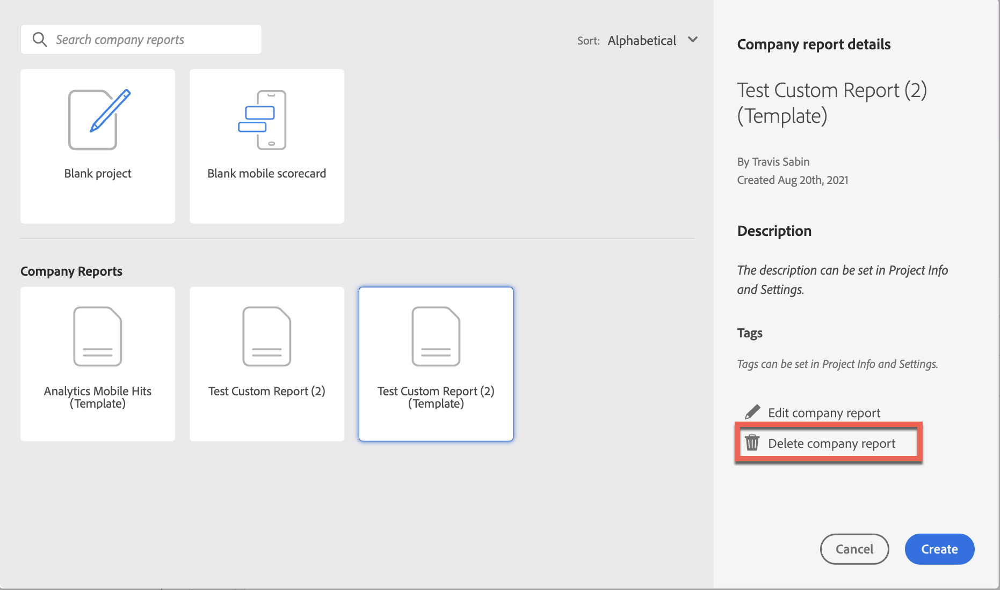

# Créer et gérer des modèles d’entreprise

Vous pouvez créer des rapports personnalisés et les enregistrer pour que d’autres personnes de votre société de connexion puissent les utiliser. Vous pouvez choisir les modèles d’entreprise lors de la création d’un projet, comme décrit dans la section [Créer un projet à partir d’un projet vide ou d’un rapport](/help/analyze/analysis-workspace/build-workspace-project/create-projects.md#create-a-project-from-a-blank-project-or-a-report) de l’article [Créer des projets dans Analysis Workspace](/help/analyze/analysis-workspace/build-workspace-project/create-projects.md).

## Création d’un modèle d’entreprise personnalisé

Pour créer un modèle d’entreprise :

1. Créez un projet dans Analysis Workspace à l’état souhaité.
1. Sélectionnez [!UICONTROL **Projet**] > **[!UICONTROL Enregistrer comme modèle de société...]**.

   

1. Mettez à jour le nom du rapport, ajoutez une description et ajoutez des balises, puis sélectionnez [!UICONTROL **Enregistrer comme modèle de société**].

   Le modèle est ajouté à la liste des modèles d’entreprise dans le modal Créer un projet et est disponible pour les utilisateurs de votre société de connexion.

   Pour plus d’informations sur la façon dont les utilisateurs peuvent créer un projet à partir d’un modèle d’entreprise, voir &quot;Création d’un projet à partir d’un projet vierge ou d’un rapport&quot; dans [Création de projets](/help/analyze/analysis-workspace/build-workspace-project/create-projects.md).

## Gestion des modèles d’entreprise

Les administrateurs peuvent filtrer la liste des projets pour afficher et gérer les modèles d’entreprise. Les éléments épinglés restent épinglés, suivis de la liste des modèles d’entreprise identifiés par l’icône de rapport . Dans cet affichage, vous pouvez supprimer, renommer, baliser ou approuver un ou plusieurs rapports.

Pour afficher et gérer des modèles d’entreprise :

1. Dans le rail de filtre, sélectionnez **AUTRES FILTRES**, puis **Modèles d’entreprise**.

   Une liste des modèles d&#39;entreprise s&#39;affiche. Aucun projet standard ne s’affiche sauf ceux épinglés.

   

   Avec les modèles d’entreprise affichés, les administrateurs peuvent supprimer, renommer, ajouter une balise ou approuver le rapport.

1. Dans la liste des rapports, sélectionnez un ou plusieurs rapports.

1. Cliquez sur l’icône des points de suspension **…** en regard d’un rapport pour afficher les options disponibles (Supprimer, Renommer, Baliser et Approuver).

   

1. Sélectionnez une option (Supprimer, Renommer, Baliser et Approuver).

1. Pour revenir à la vue normale une fois que vous avez terminé, désélectionnez à nouveau l’option Modèles d’entreprise dans le rail de filtrage.

### Suppression d’un modèle d’entreprise

Les administrateurs peuvent supprimer un rapport à l’aide de l’option de liste Modèles d’entreprise (décrite ci-dessus) ou supprimer un rapport du modal Créer un projet .

