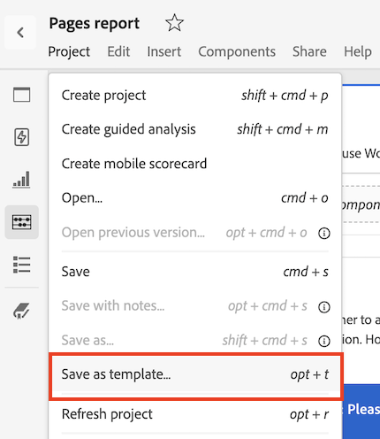
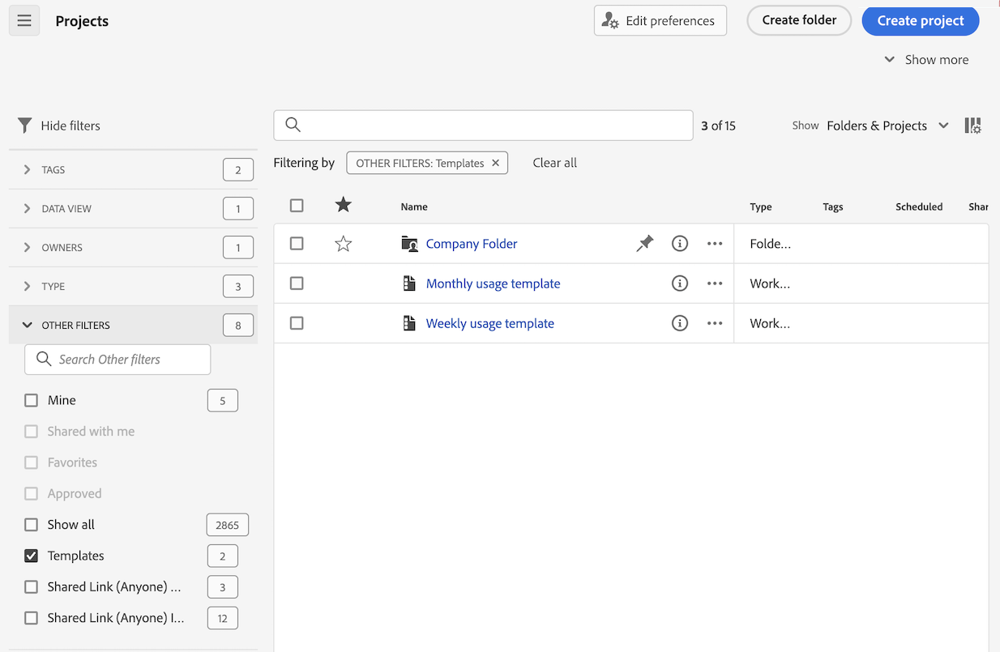

# Créer et gérer des modèles

Les administrateurs et administratrices peuvent créer des modèles et les enregistrer pour que d’autres personnes de leur société de connexion puissent les utiliser.

Les membres de la société de connexion peuvent utiliser ces modèles d’entreprise comme décrit dans la section [Utiliser des modèles](/help/analyze/analysis-workspace/templates/use-templates.md).

## Créer un modèle

Pour créer un modèle pouvant être utilisé par des personnes de votre société de connexion, procédez comme suit :

1. Dans Analysis Workspace, créez un projet à l’état souhaité.

1. Sélectionnez [!UICONTROL **Projet**] > **[!UICONTROL Enregistrer en tant que modèle...]**.

   

1. Spécifiez les informations suivantes dans la boîte de dialogue [!UICONTROL Enregistrer en tant que modèle] :

   | Champ | Description |
   |---------|----------|
   | **[!UICONTROL Nom]** | Attribuez un nom explicite au modèle. |
   | **[!UICONTROL Description]** | Fournissez une brève description du modèle qui décrit ses utilisations prévues. |
   | **[!UICONTROL Pourquoi utiliser ce modèle]** | Fournissez une brève explication pour informer les personnes de l’organisation sur la manière dont ce modèle peut être utilisé. Cette explication s’affiche sur la page Aperçu du modèle. |
   | **[!UICONTROL Cas d’utilisation]** | Sélectionnez tous les cas d’utilisation qui s’appliquent à ce modèle. Vous pouvez sélectionner plusieurs cas d’utilisation : **[!UICONTROL Engagement]**, **[!UICONTROL Conversion]**, **[!UICONTROL Audience]** et **[!UICONTROL Acquisition]**. 
Les sélections que vous choisissez déterminent l’emplacement d’affichage du modèle et les filtres qui s’appliquent aux personnes qui y accèdent à partir de la page Modèles d’organisation.
 |
   | **[!UICONTROL Balises]** | Spécifiez les balises à appliquer au modèle. Les personnes peuvent filtrer la liste des modèles en fonction des balises que vous ajoutez. |

1. Sélectionnez [!UICONTROL **Enregistrer en tant que modèle**].

Pour plus d’informations sur la façon dont les utilisateurs et utilisatrices peuvent créer un projet basé sur un modèle, consultez [Créer un projet basé sur un modèle](/help/analyze/analysis-workspace/templates/use-templates.md#create-a-project-based-on-a-template) dans [Utiliser des modèles](/help/analyze/analysis-workspace/templates/use-templates.md).

## Modifier ou supprimer un modèle

Les administrateurs et administratrices peuvent modifier ou supprimer des modèles d’entreprise.

1. Dans Analysis Workspace, sélectionnez l’onglet [!UICONTROL **Workspace**], puis sélectionnez les **[!UICONTROL _modèles login_company_name _]**.

1. Si vous affichez des modèles dans une vue Colonnes , procédez comme suit :

   1. Accédez au modèle à modifier ou supprimer, puis sélectionnez l’icône d’informations en regard du nom du modèle.

      

   1. Sélectionnez **[!UICONTROL Prévisualisation]**.

   1. Sélectionnez l’icône Plus, puis sélectionnez **[!UICONTROL Modifier]** ou **[!UICONTROL Supprimer]**.

      

1. Si vous affichez des modèles dans un mode Carte , procédez comme suit :

   1. Recherchez le modèle à modifier ou à supprimer.

      

   1. Sélectionnez l’icône Plus, puis **[!UICONTROL Modifier]** ou **[!UICONTROL Supprimer]**.

      

1. Si vous modifiez un modèle, apportez les modifications souhaitées, puis sélectionnez [!UICONTROL **Projet**] > **[!UICONTROL Enregistrer en tant que modèle...]**.

   

1. Spécifiez les informations suivantes dans la boîte de dialogue [!UICONTROL Enregistrer en tant que modèle] :

   | Champ | Description |
   |---------|----------|
   | **[!UICONTROL Nom]** | Attribuez un nom explicite au modèle. |
   | **[!UICONTROL Description]** | Fournissez une brève description du modèle qui décrit ses utilisations prévues. |
   | **[!UICONTROL Pourquoi utiliser ce modèle]** | Fournissez une brève explication pour informer les personnes de l’organisation sur la manière dont ce modèle peut être utilisé. Cette explication s’affiche sur la page Aperçu du modèle. |
   | **[!UICONTROL Cas d’utilisation]** | Sélectionnez tous les cas d’utilisation qui s’appliquent à ce modèle. Vous pouvez sélectionner plusieurs cas d’utilisation : **[!UICONTROL Engagement]**, **[!UICONTROL Conversion]**, **[!UICONTROL Audience]** et **[!UICONTROL Acquisition]**. 
Les sélections que vous choisissez déterminent l’emplacement d’affichage du modèle et les filtres qui s’appliquent aux personnes qui y accèdent à partir de la page Modèles d’organisation.
 |
   | **[!UICONTROL Balises]** | Spécifiez les balises à appliquer au modèle. Les personnes peuvent filtrer la liste des modèles en fonction des balises que vous ajoutez. |

1. Sélectionnez [!UICONTROL **Enregistrer en tant que modèle**]/

## Renommer, baliser ou approuver des modèles

Les administrateurs et administratrices peuvent renommer, baliser et approuver les modèles d’entreprise.

1. Dans Analysis Workspace, sélectionnez l’onglet [!UICONTROL **Workspace**], puis **[!UICONTROL Projets]** dans le rail de gauche.

1. Sélectionnez l’icône de filtre pour filtrer la liste des projets.

1. Dans le rail de filtrage, sélectionnez **AUTRES FILTRES**, puis **Modèles d’entreprise**.

   Une liste des modèles d’entreprise s’affiche. Aucun projet standard ne s’affiche sauf ceux épinglés.

   Les modèles d’entreprise peuvent être identifiés par l’ qui précède le nom du modèle.

   

1. Cliquez sur l’icône des points de suspension **...** en regard d’un modèle pour afficher les options disponibles.

   

1. Sélectionnez **[!UICONTROL Renommer]**, **[!UICONTROL Balise]** ou **[!UICONTROL Approuver]**.

   Vous pouvez également modifier un modèle, ou en supprimer un, comme décrit dans la section [Modifier ou supprimer des modèles](#edit-or-delete-templates).

1. (Facultatif) Pour revenir à la vue normale, dans le rail de filtre, désélectionnez **[!UICONTROL Modèles d’entreprise]**.

## Accéder à un modèle d’entreprise

Comme pour les modèles fournis par Adobe, les utilisateurs et utilisatrices de l’entreprise peuvent accéder aux modèles créés par les administrateurs et administratrices.

Pour plus d’informations sur l’accès à un modèle d’entreprise, consultez [Accès et exécution d’un modèle](/help/analyze/analysis-workspace/templates/use-templates.md#access-and-run-a-template) dans [Utilisation de modèles](/help/analyze/analysis-workspace/templates/use-templates.md).

## Masquer lʼonglet Modèles {#hide-reports}

Les administrateurs et administratrices peuvent masquer l’onglet Modèles pour tous les utilisateurs et utilisatrices de leur organisation.

1. Accédez à **[!UICONTROL Analytics]** > **[!UICONTROL Composants]** > **[!UICONTROL Préférences]** > **[!UICONTROL Société]**.
1. Sélectionnez l’option **[!UICONTROL Masquer l’onglet Modèles]**.
