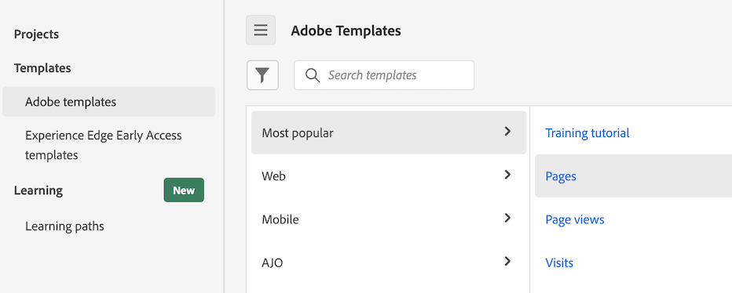

# Utiliser les modèles

Les modèles (ou modèles d’entreprise) dans Analysis Workspace fournissent des informations rapides sur les scénarios de création de rapports les plus courants. Voici quelques exemples de questions auxquelles vous pouvez répondre à l’aide de modèles :

* Nombre de visiteurs sur votre site
* Nombre de ces visiteurs qui sont uniques (comptabilisés une seule fois)
* Leur acheminement vers le site (s’ils ont suivi un lien ou se sont rendus directement dessus)
* Mots-clés utilisés par les visiteurs pour rechercher le contenu du site
* Leur durée passée sur une page donnée ou sur le site entier
* Liens sur lesquels les visiteurs ont cliqué et le moment où ils ont quitté le site
* Les canaux marketing les plus efficaces pour générer des recettes ou des événements de conversion
* Le temps passé à regarder une vidéo
* Les navigateurs et appareils utilisés pour consulter votre site

Les informations suivantes décrivent comment accéder aux modèles et les utiliser à partir de l’onglet [!UICONTROL Modèles] dans Analysis Workspace.

## Accès et exécution d’un modèle

1. Dans Analysis Workspace, sélectionnez l’onglet [!UICONTROL **Workspace**].

   <!--update screenshot -->

   

1. Dans la section [!UICONTROL **Modèles**] , sélectionnez l’un des onglets suivants :

   * **[!UICONTROL Modèles d’Adobe]** : affiche tous les modèles fournis par Adobe.

   * **[!UICONTROL _nom_société_de_connexion _modèles]**: affiche tous les modèles d’entreprise qui ont été créés pour votre organisation.

     Les modèles d’entreprise ne peuvent être créés que par un administrateur. Pour plus d’informations sur la création d’un modèle d’entreprise, voir [Création et gestion de modèles](/help/analyze/analysis-workspace/reports/create-company-reports.md).

1. Utilisez l’une des options suivantes pour modifier l’affichage des modèles disponibles :

   * Choisissez d’afficher les modèles en mode Colonne ou Carte en sélectionnant soit l’icône  ou l’icône .

   * Lors de l’utilisation de l’affichage Carte , choisissez l’un des ordres de tri suivants : **[!UICONTROL Le plus récemment utilisé]**, **[!UICONTROL Le plus populaire]**, **[!UICONTROL Alphabétique]**, **[!UICONTROL Catégoriel]**.

1. Dans le champ de recherche, commencez à saisir le nom du modèle à rechercher, puis sélectionnez-le dans la liste des modèles. Vous pouvez également rechercher la liste de modèles par numéro de prop, d’eVar et d’événement. <!-- still true? -->

   Ou

   Sélectionnez la catégorie du modèle à afficher, puis choisissez le modèle dans la liste des modèles.

   >[!TIP]
   >
   >Pour naviguer dans le menu à l’aide des touches fléchées, appuyez sur la touche Barre oblique (/), puis sur la touche Flèche vers le bas. Appuyez sur Entrée pour charger le modèle sélectionné.

   Pour obtenir la liste des modèles disponibles, reportez-vous à la section [Modèles disponibles](#available-reports) ci-dessous.

## Créer un projet à partir d’un modèle {#use-reports}

Un modèle peut ne pas répondre exactement à vos besoins, mais il peut vous rapprocher. Dans ce cas, vous pouvez utiliser le modèle comme point de départ, puis le personnaliser selon vos besoins spécifiques.

Si vous quittez un modèle après avoir apporté des modifications, vous êtes invité à enregistrer ou ignorer vos modifications. L’enregistrement des modifications dans un modèle enregistre le modèle en tant que nouveau projet.

Pour personnaliser un modèle et l’enregistrer en tant que projet :

1. Dans Adobe Analytics, sélectionnez l’onglet [!UICONTROL **Workspace**].

1. Sélectionnez l’onglet [!UICONTROL **Modèles**] .

1. Sélectionnez le modèle à afficher. Par exemple, sous [!UICONTROL **Le plus populaire**], sélectionnez le modèle [!UICONTROL **Pages**] .

   

1. Le modèle Pages, tel qu’il s’affiche dans Analysis Workspace, affiche deux [ visualisations](/help/analyze/analysis-workspace/visualizations/freeform-analysis-visualizations.md) ([Graphique à barres](/help/analyze/analysis-workspace/visualizations/bar.md) et [Numéro de résumé](/help/analyze/analysis-workspace/visualizations/summary-number-change.md)) et un [tableau à structure libre](/help/analyze/analysis-workspace/visualizations/freeform-table/freeform-table.md). La mesure utilisée est Occurrences.
1. Effectuez l’une des opérations suivantes :

   * Affichez le modèle.
   * Faites glisser un ou plusieurs segments dans la zone de dépôt de segments située en haut. Par exemple, faites glisser le segment [!UICONTROL **Clients mobiles**] et observez les résultats.
   * Modifiez la période en accédant au calendrier en haut à droite.
   * Ajoutez des ventilations de dimension, faites glisser d’autres mesures et personnalisez généralement le modèle en fonction de vos besoins.

1. (Facultatif) Enregistrez le modèle en tant que projet en sélectionnant [!UICONTROL **Projet**] > [!UICONTROL **Enregistrer**].

   Le modèle est enregistré comme un nouveau projet ; il ne modifie pas le modèle existant. Pour plus d’informations sur l’enregistrement des projets, voir [Enregistrement des projets](/help/analyze/analysis-workspace/build-workspace-project/save-projects.md).

## Modèles disponibles

Pour accéder à tous les modèles prédéfinis disponibles :

1. Dans Adobe Analytics, sélectionnez l’onglet [!UICONTROL **Workspace**], puis l’onglet [!UICONTROL **Modèles**].

   Les modèles prédéfinis sont organisés par catégorie.

   <!--add screenshot-->

1. Sélectionnez une catégorie pour afficher les modèles qu’elle contient.

   Les sections suivantes correspondent aux catégories disponibles et fournissent des informations sur chaque modèle.

   * [[!UICONTROL ](#most-popular)

   * [[!UICONTROL ](#engagement)

### Les plus populaires {#most-popular}

<!-- markdownlint-disable MD034 -->

>[!CONTEXTUALHELP]
>id="aa-template--training"
>title="Modèle de tutoriel de formation"
>abstract="Découvrez la terminologie et les étapes courantes d’Analysis Workspace pour créer votre première analyse."

<!-- markdownlint-enable MD034 -->

<!-- markdownlint-disable MD034 -->

>[!CONTEXTUALHELP]
>id="aa-template--pagesRankedReport"
>title="Identifiez les pages les plus populaires et les moins populaires."
>abstract="**Cela peut vous aider** à mieux comprendre votre audience et le type d’informations qui l’intéresse le plus. **En fonction de ce que vous apprenez, vous pouvez** effectuer un certain nombre d’opérations, comme ajuster les métadonnées de page afin d’améliorer la visibilité sur les pages moins consultées ou passer du temps à améliorer le contenu de vos pages les plus consultées. Ce modèle utilise la dimension Page et la mesure Pages vues."

<!-- markdownlint-enable MD034 -->

<!-- markdownlint-disable MD034 -->

>[!CONTEXTUALHELP]
>id="aa-template--pageViewsOvertimeReport"
>title="Affichez le nombre total de pages vues. Les données sont affichées sur une période donnée et comparées à des périodes antérieures. "
>abstract="**Cela peut vous aider** à mieux comprendre comment le trafic sur votre site peut augmenter ou diminuer au fil du temps. **En fonction de ce que vous apprenez, vous pouvez** effectuer un certain nombre d’opérations, comme évaluer l’efficacité d’une campagne marketing récemment lancée en comparant le trafic du site avant et après le lancement de la campagne. Vous pouvez également comparer le trafic pendant les fêtes d’une année à l’autre. Ce modèle utilise la dimension Jour et la mesure Pages vues."

<!-- markdownlint-enable MD034 -->

<!-- markdownlint-disable MD034 -->

>[!CONTEXTUALHELP]
>id="aa-template--visitsOvertimeReport"
>title="Affichez le nombre total de visites. Les données sont affichées sur une période donnée et comparées à des périodes antérieures."
>abstract="**Cela peut vous aider** à mieux comprendre comment le trafic sur votre site peut augmenter ou diminuer au fil du temps. **En fonction de ce que vous apprenez, vous pouvez** effectuer un certain nombre d’opérations, comme évaluer l’efficacité d’une campagne marketing récemment lancée en comparant le trafic du site avant et après le lancement de la campagne. Vous pouvez également comparer le trafic pendant les fêtes d’une année à l’autre. Ce modèle utilise la dimension Jour et la mesure Visites."

<!-- markdownlint-enable MD034 -->

<!-- markdownlint-disable MD034 -->

>[!CONTEXTUALHELP]
>id="aa-template--visitorsOvertimeReport"
>title="Affichez le nombre total de visiteurs et visiteuses uniques. Les données sont affichées sur une période donnée et comparées à des périodes antérieures. "
>abstract="**Cela peut vous aider** à mieux comprendre comment la portée et la taille de l’audience de votre site augmentent ou diminuent au fil du temps ou par rapport à une période précédente. **En fonction de ce que vous apprenez, vous pouvez** effectuer un certain nombre d’opérations, par exemple évaluer si une campagne marketing récemment lancée a réussi à attirer de nouvelles personnes sur le site en comparant les visiteurs et visiteuses uniques avant et après le lancement de la campagne. Vous pouvez également comparer le nombre de personnes qui visitent le site pendant les fêtes d’une année à l’autre. Ce modèle utilise la dimension Jour et la mesure Visiteurs et visiteuses uniques. "

<!-- markdownlint-enable MD034 -->

<!-- markdownlint-disable MD034 -->

>[!CONTEXTUALHELP]
>id="aa-template--keyMetricsReport"
>title="Affichez un rapport qui affiche côte à côte les mesures Pages vues, Visites et Visiteurs et visiteuses uniques. Les données sont affichées sur une période donnée et comparées à des périodes antérieures."
>abstract="**Cela peut vous aider** à comparer ces mesures importantes pour obtenir une image plus complète du nombre de personnes uniques sur le site, du nombre de visites de pages et du nombre de sessions. **En fonction de ce que vous apprenez, vous pouvez** effectuer un certain nombre d’opérations, comme évaluer le nombre moyen de pages consultées par chaque personne lors de sa visite sur le site au cours d’une semaine ou d’un mois donné, et la manière dont cela a changé à certains moments de l’année ou avant et après l’exécution des campagnes marketing.  Ce modèle utilise la dimension Jour, la mesure Pages vues, la mesure Visites et la mesure Visiteurs et visiteuses uniques."

<!-- markdownlint-enable MD034 -->

<!-- markdownlint-disable MD034 -->

>[!CONTEXTUALHELP]
>id="aa-template--siteSectionRankedReport"
>title="Affichez les sections les plus populaires ou les plus performantes de votre site."
>abstract="**Cela peut vous aider** à mieux comprendre quelles sections de votre site sont les plus visitées. **En fonction de ce que vous apprenez, vous pouvez** effectuer un certain nombre d’opérations, par exemple évaluer les produits ou services que vous fournissez qui suscitent le plus d’intérêt. Ce modèle utilise la dimension Section du site et la mesure Visites."

<!-- markdownlint-enable MD034 -->

<!-- markdownlint-disable MD034 -->

>[!CONTEXTUALHELP]
>id="aa-template--next-page-report"
>title="Affichez les emplacements les plus courants où les personnes se rendent immédiatement après leur visite ou juste avant de visiter un certain emplacement."
>abstract="**Cela peut vous aider** à comprendre comment le trafic passe d’une page donnée à d’autres parties de votre site, et comprendre les chemins empruntés par les personnes pour atteindre une page donnée. **En fonction de ce que vous apprenez, vous pouvez** effectuer un certain nombre d’opérations, par exemple évaluer si la conception ou la mise en page peut être optimisée pour diriger les personnes vers des pages plus souhaitables, telles qu’une page pour effectuer un achat ou laisser un avis. Ou évaluez si les informations de la page active sont susceptibles de fournir la direction ou les actions que les personnes recherchent lorsqu’elles arrivent des pages précédentes. Vous pouvez également déterminer si les pages qui ne s’affichent pas comme des pages précédentes ont besoin de liens plus importants vers la page actuelle. Ce modèle utilise le panneau d’éléments Suivant ou Précédent."

<!-- markdownlint-enable MD034 -->

<!-- markdownlint-disable MD034 -->

>[!CONTEXTUALHELP]
>id="aa-template--campaignRankedReport"
>title="Affichez les liens qui ont généré le plus de trafic vers votre site."
>abstract="**Cela peut vous aider** à mieux comprendre les codes de suivi (et les liens auxquels ils sont associés) qui ont été les plus utilisés pour accéder à votre site. **En fonction de ce que vous apprenez, vous pouvez** effectuer un certain nombre d’opérations, comme ajuster votre stratégie en fonction de l’endroit où vous ajoutez des liens à votre site. Ce modèle utilise la dimension Code de suivi et la mesure Visites."

<!-- markdownlint-enable MD034 -->

<!-- markdownlint-disable MD034 -->

>[!CONTEXTUALHELP]
>id="aa-template--productsRankedReport"
>title="Affichez le nombre de commandes par produit. Les données s’affichent sur une période donnée."
>abstract="**Cela peut vous aider** à comprendre les produits présentant la demande la plus élevée ou la plus faible. **En fonction de ce que vous apprenez, vous pouvez** effectuer un certain nombre d’opérations, comme ajuster vos stratégies marketing pour promouvoir des produits hautement performants, ou améliorer ou arrêter les produits peu performants. Vous pouvez également ajuster votre inventaire de produits en fonction de votre analyse des données. Ce modèle utilise la dimension Produit et la mesure Commandes."

<!-- markdownlint-enable MD034 -->

<!-- markdownlint-disable MD034 -->

>[!CONTEXTUALHELP]
>id="aa-template--lastTouchChannelRankedReport"
>title="Affichez les canaux marketing les plus récents auxquels les personnes correspondent pendant leur période d’engagement (30 jours par défaut)."
>abstract="**Cela peut vous aider** à comprendre les canaux marketing les plus efficaces pour amener des personnes sur votre site qui génèrent des conversions. **En fonction de ce que vous apprenez, vous pouvez** effectuer un certain nombre d’opérations, comme allouer plus de ressources à des canaux hautement performants ou allouer moins de ressources à des canaux peu performants. Ce modèle utilise la dimension Canal Dernière touche et la mesure Visiteurs et visiteuses uniques."

<!-- markdownlint-enable MD034 -->

<!-- markdownlint-disable MD034 -->

>[!CONTEXTUALHELP]
>id="aa-template--lastTouchChannelDetailRankedReport"
>title="Affichez les détails sur les canaux marketing les plus récents auxquels les personnes correspondent pendant leur période d’engagement (30 jours par défaut)."
>abstract="**Cela peut vous aider** à comprendre non seulement les canaux marketing les plus efficaces pour amener des personnes sur votre site qui génèrent des conversions, mais aussi des détails sur ces canaux marketing. Par exemple, si un visiteur arrive sur votre site et correspond au canal marketing « Référencement payant », vous pouvez utiliser les détails du canal pour identifier le moteur de recherche utilisé ou le mot-clé recherché. **En fonction de ce que vous apprenez, vous pouvez** effectuer un certain nombre d’opérations, comme allouer plus de ressources à des canaux hautement performants ou allouer moins de ressources à des canaux peu performants. Ce modèle utilise la dimension Détails du canal Dernière touche et la mesure Visiteurs et visiteuses uniques. "

<!-- markdownlint-enable MD034 -->

<!-- markdownlint-disable MD034 -->

>[!CONTEXTUALHELP]
>id="aa-template--revenueOvertimeReport"
>title="Affichez la valeur monétaire des produits achetés dans l’ensemble des commandes. Les données sont affichées sur une période donnée et comparées à des périodes antérieures."
>abstract="**Cela peut vous aider** à comprendre comment le chiffre d’affaires augmente ou diminue au fil du temps. Vous pouvez associer cette mesure à n’importe quelle dimension pour déterminer les éléments de dimension ayant contribué au chiffre d’affaires. **En fonction de ce que vous apprenez, vous pouvez** effectuer un certain nombre d’opérations, telles que projeter le chiffre d’affaires futur basé sur les tendances précédentes. Vous pouvez également ajouter une autre dimension, comme la dimension Code de suivi, pour savoir quelles campagnes génèrent le plus de chiffre d’affaires. Ce modèle utilise la dimension Jour et la mesure Chiffre d’affaires."

<!-- markdownlint-enable MD034 -->

<!-- markdownlint-disable MD034 -->

>[!CONTEXTUALHELP]
>id="aa-template--ordersOvertimeReport"
>title="Affichez le nombre total d’événements d’achat. Les données sont affichées sur une période donnée et comparées à des périodes antérieures."
>abstract="**Cela peut vous aider** à mieux comprendre comment l’intérêt pour vos produits et services augmente ou diminue au fil du temps. Vous pouvez appliquer un segment pour identifier les personnes ou les zones géographiques qui passent le plus de commandes et déterminer les tendances de ces commandes au fil du temps. **En fonction de ce que vous apprenez, vous pouvez** effectuer un certain nombre d’opérations, par exemple évaluer l’efficacité d’une campagne marketing récemment lancée en comparant les commandes avant et après le lancement de la campagne. Vous pouvez également comparer les commandes passées pendant les fêtes d’une année à l’autre. Ce modèle utilise la dimension Jour et la mesure Commandes."

<!-- markdownlint-enable MD034 -->

<!-- markdownlint-disable MD034 -->

>[!CONTEXTUALHELP]
>id="cja-template--unitsOvertimeReport"
>title="Affichez le nombre total d’unités achetées pour toutes les commandes. Les données sont affichées sur une période donnée et comparées à des périodes antérieures."
>abstract="**Cela peut vous aider** à comprendre comment les ventes unitaires augmentent ou diminuent au fil du temps. Vous pouvez appliquer un segment pour identifier les personnes ou les zones géographiques qui achètent le plus d’unités et déterminer les tendances de ces ventes unitaires au fil du temps. **En fonction de ce que vous apprenez, vous pouvez** effectuer un certain nombre d’opérations, comme évaluer l’efficacité d’une campagne marketing récemment lancée en comparant les ventes unitaires du site avant et après le lancement de la campagne. Vous pouvez aussi comparer les ventes unitaires d’une année à l’autre pendant les fêtes. Ce modèle utilise la dimension Jour et la mesure Unités."

<!-- markdownlint-enable MD034 -->

Les modèles suivants sont disponibles :

| Nom du modèle | Pourquoi utiliser ce modèle <!-- What do you do with it? What can it help you learn? and What are the potential actions? --> |
| --- | --- | 
| [!UICONTROL **Tutoriel de formation**] | Découvrez la terminologie et les étapes courantes d’Analysis Workspace pour créer votre première analyse |
| [!UICONTROL **Pages**] | <!--duplicated in Engagement section--> Identifiez les pages les plus populaires et les moins populaires. 
**Cela peut vous aider** à mieux comprendre votre audience et le type d’informations qui l’intéresse le plus.

**En fonction de ce que vous apprenez, vous pouvez** effectuer un certain nombre d’opérations, comme ajuster les métadonnées de page afin d’améliorer la visibilité sur les pages moins consultées ou passer du temps à améliorer le contenu de vos pages les plus consultées.

Ce modèle utilise la [dimension Page](/help/components/dimensions/page.md) et la [ mesure Pages vues](/help/components/metrics/page-views.md).
 |
| [!UICONTROL **Pages vues**] | <!--duplicated in Engagement section--> Affichez le nombre total de pages vues. Les données sont affichées sur une période donnée et comparées à des périodes antérieures. 
**Cela peut vous aider** à mieux comprendre comment le trafic sur votre site peut augmenter ou diminuer au fil du temps.

**En fonction de ce que vous apprenez, vous pouvez** effectuer un certain nombre d’opérations, comme évaluer l’efficacité d’une campagne marketing récemment lancée en comparant le trafic du site avant et après le lancement de la campagne. Vous pouvez également comparer le trafic pendant les fêtes d’une année à l’autre.

Ce modèle utilise la [dimension Jour](/help/components/dimensions/day.md) et la [ mesure Pages vues](/help/components/metrics/page-views.md).
 |
| [!UICONTROL **Visites**] | <!--duplicated in Engagement section--> Affichez le nombre total de visites. Les données sont affichées sur une période donnée et comparées à des périodes antérieures. 
**Cela peut vous aider** à mieux comprendre comment le trafic sur votre site peut augmenter ou diminuer au fil du temps.

**En fonction de ce que vous apprenez, vous pouvez** effectuer un certain nombre d’opérations, comme évaluer l’efficacité d’une campagne marketing récemment lancée en comparant le trafic du site avant et après le lancement de la campagne. Vous pouvez également comparer le trafic pendant les fêtes d’une année à l’autre.

Ce modèle utilise la [dimension Jour](/help/components/dimensions/day.md) et la [mesure Visites](/help/components/metrics/visits.md).
 |
| [!UICONTROL **Visiteurs**] | <!--duplicated in Engagement section--> Affichez le nombre total de visiteurs et visiteuses uniques. Les données sont affichées sur une période donnée et comparées à des périodes antérieures. 
**Cela peut vous aider** à mieux comprendre comment la portée et la taille de l’audience de votre site augmentent ou diminuent au fil du temps ou par rapport à une période précédente.

**En fonction de ce que vous apprenez, vous pouvez** effectuer un certain nombre d’opérations, par exemple évaluer si une campagne marketing récemment lancée a réussi à attirer de nouvelles personnes sur le site en comparant les visiteurs et visiteuses uniques avant et après le lancement de la campagne. Vous pouvez également comparer le nombre de personnes qui visitent le site pendant les fêtes d’une année à l’autre.

Ce modèle utilise la [dimension Jour](/help/components/dimensions/day.md) et la [ mesure Visiteurs uniques](/help/components/metrics/unique-visitors.md).
 |
| [!UICONTROL **Mesures clés**] | <!--duplicated in Engagement section--> Affichez un rapport qui affiche côte à côte les mesures Pages vues, Visites et Visiteurs et visiteuses uniques. Les données sont affichées sur une période donnée et comparées à des périodes antérieures. 
**Cela peut vous aider** à comparer ces mesures importantes pour obtenir une image plus complète du nombre de personnes uniques sur le site, du nombre de visites de pages et du nombre de sessions.

**En fonction de ce que vous apprenez, vous pouvez** effectuer un certain nombre d’opérations, comme évaluer le nombre moyen de pages consultées par chaque personne lors de sa visite sur le site au cours d’une semaine ou d’un mois donné, et la manière dont cela a changé à certains moments de l’année ou avant et après l’exécution des campagnes marketing. 

Ce modèle utilise la [dimension Jour](/help/components/dimensions/day.md), la [mesure Pages vues](/help/components/metrics/page-views.md), la [mesure Visites](/help/components/metrics/visits.md) et la [mesure Visiteurs uniques](/help/components/metrics/unique-visitors.md).
 |
| [!UICONTROL **Sections du site**] | Affichez les sections les plus populaires ou les plus performantes de votre site. 
**Cela peut vous aider** à mieux comprendre quelles sections de votre site sont les plus visitées.

**En fonction de ce que vous apprenez, vous pouvez** effectuer un certain nombre d’opérations, par exemple évaluer les produits ou services que vous fournissez qui suscitent le plus d’intérêt.
 
Ce modèle utilise la [dimension Section du site](/help/components/dimensions/site-section.md) et la [mesure Visites](/help/components/metrics/visits.md).
 |
| [!UICONTROL **Page suivante et page précédente**] | Affichez les emplacements les plus courants où les personnes se rendent immédiatement après leur visite ou juste avant de visiter un certain emplacement. 
**Cela peut vous aider** à comprendre comment le trafic passe d’une page donnée à d’autres parties de votre site, et comprendre les chemins empruntés par les personnes pour atteindre une page donnée.

**En fonction de ce que vous apprenez, vous pouvez** effectuer un certain nombre d’opérations, par exemple évaluer si la conception ou la mise en page peut être optimisée pour diriger les personnes vers des pages plus souhaitables, telles qu’une page pour effectuer un achat ou laisser un avis. Ou évaluez si les informations de la page active sont susceptibles de fournir la direction ou les actions que les personnes recherchent lorsqu’elles arrivent des pages précédentes. Vous pouvez également déterminer si les pages qui ne s’affichent pas comme des pages précédentes ont besoin de liens plus importants vers la page actuelle.

Ce modèle utilise le [panneau d’élément suivant ou précédent](/help/analyze/analysis-workspace/c-panels/next-previous.md).
 |
| [!UICONTROL **Campagnes (Code de suivi)**] | Affichez les liens qui ont généré le plus de trafic vers votre site. 
**Cela peut vous aider** à mieux comprendre les codes de suivi (et les liens auxquels ils sont associés) qui ont été les plus utilisés pour accéder à votre site.

**En fonction de ce que vous apprenez, vous pouvez** effectuer un certain nombre d’opérations, comme ajuster votre stratégie en fonction de l’endroit où vous ajoutez des liens à votre site.

Ce modèle utilise la [dimension Code de suivi](/help/components/dimensions/tracking-code.md) et la [mesure Visites](/help/components/metrics/visits.md).
 |
| [!UICONTROL **Produits**] | Affichez le nombre de commandes par produit. Les données s’affichent sur une période donnée. 
**Cela peut vous aider** à comprendre les produits présentant la demande la plus élevée ou la plus faible.

**En fonction de ce que vous apprenez, vous pouvez** effectuer un certain nombre d’opérations, comme ajuster vos stratégies marketing pour promouvoir des produits hautement performants, ou améliorer ou arrêter les produits peu performants. Vous pouvez également ajuster votre inventaire de produits en fonction de votre analyse des données.

Ce modèle utilise la [dimension Produit](/help/components/dimensions/product.md) et la [mesure Commandes](/help/components/metrics/orders.md).
 |
| [!UICONTROL **Canal Dernière touche**] | Affichez les canaux marketing les plus récents auxquels les personnes correspondent pendant leur période d’engagement (30 jours par défaut).
**Cela peut vous aider** à comprendre les canaux marketing les plus efficaces pour amener des personnes sur votre site qui génèrent des conversions.

**En fonction de ce que vous apprenez, vous pouvez** effectuer un certain nombre d’opérations, comme allouer plus de ressources à des canaux hautement performants ou allouer moins de ressources à des canaux peu performants.

Ce modèle utilise la [dimension Canal Dernière touche](/help/components/dimensions/last-touch-channel.md) et la [mesure Visiteurs uniques](/help/components/metrics/unique-visitors.md).
 |
| [!UICONTROL **Détails du canal Dernière touche**] | Affichez les détails sur les canaux marketing les plus récents auxquels les personnes correspondent pendant leur période d’engagement (30 jours par défaut).
**Cela peut vous aider** à comprendre non seulement les canaux marketing les plus efficaces pour amener des personnes sur votre site qui génèrent des conversions, mais aussi des détails sur ces canaux marketing. Par exemple, si un visiteur arrive sur votre site et correspond au canal marketing « Référencement payant », vous pouvez utiliser les détails du canal pour identifier le moteur de recherche utilisé ou le mot-clé recherché.

**En fonction de ce que vous apprenez, vous pouvez** effectuer un certain nombre d’opérations, comme allouer plus de ressources à des canaux hautement performants ou allouer moins de ressources à des canaux peu performants.

Ce modèle utilise la [dimension Détails du canal Dernière touche](/help/components/dimensions/last-touch-detail.md) et la [mesure Visiteurs uniques](/help/components/metrics/unique-visitors.md).
 |
| [!UICONTROL **Recettes**] | Affichez la valeur monétaire des produits achetés dans l’ensemble des commandes. Les données sont affichées sur une période donnée et comparées à des périodes antérieures.
**Cela peut vous aider** à comprendre comment le chiffre d’affaires augmente ou diminue au fil du temps. Vous pouvez associer cette mesure à n’importe quelle dimension pour déterminer les éléments de dimension ayant contribué au chiffre d’affaires.

**En fonction de ce que vous apprenez, vous pouvez** effectuer un certain nombre d’opérations, telles que projeter le chiffre d’affaires futur basé sur les tendances précédentes. Vous pouvez également ajouter une autre dimension, comme la dimension Code de suivi, pour savoir quelles campagnes génèrent le plus de chiffre d’affaires.

Ce modèle utilise la [dimension Jour](/help/components/dimensions/day.md) et la [mesure Recettes](/help/components/metrics/revenue.md).
 |
| [!UICONTROL **Commandes**] | Affichez le nombre total d’événements d’achat. Les données sont affichées sur une période donnée et comparées à des périodes antérieures. 
**Cela peut vous aider** à mieux comprendre comment l’intérêt pour vos produits et services augmente ou diminue au fil du temps. Vous pouvez appliquer un segment pour identifier les personnes ou les zones géographiques qui passent le plus de commandes et déterminer les tendances de ces commandes au fil du temps.

**En fonction de ce que vous apprenez, vous pouvez** effectuer un certain nombre d’opérations, par exemple évaluer l’efficacité d’une campagne marketing récemment lancée en comparant les commandes avant et après le lancement de la campagne. Vous pouvez également comparer les commandes passées pendant les fêtes d’une année à l’autre.

Ce modèle utilise la [dimension Jour](/help/components/dimensions/day.md) et la [mesure Commandes](/help/components/metrics/orders.md).
 |
| [!UICONTROL **Unités**] | Affichez le nombre total d’unités achetées pour toutes les commandes. Les données sont affichées sur une période donnée et comparées à des périodes antérieures. 
**Cela peut vous aider** à comprendre comment les ventes unitaires augmentent ou diminuent au fil du temps. Vous pouvez appliquer un segment pour identifier les personnes ou les zones géographiques qui achètent le plus d’unités et déterminer les tendances de ces ventes unitaires au fil du temps.

**En fonction de ce que vous apprenez, vous pouvez** effectuer un certain nombre d’opérations, comme évaluer l’efficacité d’une campagne marketing récemment lancée en comparant les ventes unitaires du site avant et après le lancement de la campagne. Vous pouvez aussi comparer les ventes unitaires d’une année à l’autre pendant les fêtes.

Ce modèle utilise la [dimension Jour](/help/components/dimensions/day.md) et la [mesure Unités](/help/components/metrics/units.md).
 |

### Engagement {#web-engagement}

<!-- markdownlint-disable MD034 -->

>[!CONTEXTUALHELP]
>id="aa-template--timeSpentVisitOvertimeReport"
>title="Affichez la durée moyenne des visiteurs et visiteuses sur votre site lors de chaque visite. Les données sont affichées sur une période donnée et comparées à des périodes antérieures."
>abstract="**Cela peut vous aider** à mieux comprendre les niveaux d’engagement des visiteurs et visiteuses et leur temps passé sur le site. **En fonction de ce que vous apprenez, vous pouvez** effectuer un certain nombre d’opérations, comme évaluer si les modifications apportées à votre site amènent les visiteurs et visiteuses à passer plus de temps sur le site. Ce modèle utilise la dimension Jour et la mesure Durée de la visite (secondes)."

<!-- markdownlint-enable MD034 -->

<!-- markdownlint-disable MD034 -->

>[!CONTEXTUALHELP]
>id="aa-template--timePriorRankedReport"
>title="Affichez la durée moyenne des utilisateurs et utilisatrices sur le site avant un événement de succès."
>abstract="**Cela peut vous aider** à mieux comprendre le temps nécessaire aux visiteurs et visiteuses pour effectuer l’action souhaitée, comme effectuer un achat. **En fonction de ce que vous apprenez, vous pouvez** effectuer un certain nombre d’opérations, par exemple évaluer si les modifications apportées à votre site améliorent la capacité des personnes à atteindre rapidement un événement de succès. Ce modèle utilise la dimension Durée avant événement et la mesure Visiteurs et visiteuses uniques."

<!-- markdownlint-enable MD034 -->

<!-- markdownlint-disable MD034 -->

>[!CONTEXTUALHELP]
>id="aa-template--web-content-consumption"
>title="Affichez le contenu web le plus consommé et qui engage les utilisateurs et utilisatrices."
>abstract="**Cela peut vous aider** à mieux comprendre où se rendent les personnes qui accèdent au site pour la première fois, les sections du site les plus consultées et les pages les plus susceptibles de les éloigner du site. **En fonction de ce que vous apprenez, vous pouvez** effectuer un certain nombre d’opérations, comme déterminer les chemins empruntés par le site pour diriger les personnes vers les pages les plus importantes et les pages les plus susceptibles de les éloigner du site. Ce modèle utilise la dimension Page et la mesure Pages vues, la mesure Visites, la mesure Visiteurs et visiteuses uniques, la mesure Taux d’entrée, la mesure Taux de rebond, la mesure Taux de sortie et la mesure Vitesse du contenu. Il utilise également les visualisations Flux pour les sections d’entrée, de sortie et supérieure."

<!-- markdownlint-enable MD034 -->

<!-- markdownlint-disable MD034 -->

>[!CONTEXTUALHELP]
>id="aa-template--media-content-consumption"
>title="Affichez le contenu multimédia le plus consommé et qui engage les utilisateurs et utilisatrices."
>abstract="**Cela peut vous aider** à mieux comprendre où se rendent les personnes qui accèdent au site pour la première fois, les sections du site les plus consultées et les pages les plus susceptibles de les éloigner du site. **En fonction de ce que vous apprenez, vous pouvez** effectuer un certain nombre d’opérations, comme déterminer les chemins empruntés par le site pour diriger les personnes vers les pages les plus importantes et les pages les plus susceptibles de les éloigner du site. Ce modèle utilise la dimension Page et la mesure Pages vues, la mesure Visites, la mesure Visiteurs et visiteuses uniques, la mesure Taux d’entrée, la mesure Taux de rebonds, la mesure Taux de sortie et la mesure Vitesse du contenu. Il utilise également les visualisations de flux pour les sections d’entrée, de sortie et supérieure ; une visualisation de graphique à nuages de points qui présente les pages vues pour les pages les plus courantes ; une visualisation de graphique en barres qui présente les pages vues par intervalle de temps regroupé ; et une visualisation de graphique linéaire qui affiche une vue de tendance de la durée moyenne passée sur le site."

<!-- markdownlint-enable MD034 -->

<!-- markdownlint-disable MD034 -->

>[!CONTEXTUALHELP]
>id="aa-template--falloutReport"
>title="Affichez les endroits où les personnes abandonnent ou poursuivent une séquence de pages prédéfinie."
>abstract="**Cela peut vous aider** à mieux comprendre où les personnes sortent du parcours d’utilisateur ou d’utilisatrice. **En fonction de ce que vous apprenez, vous pouvez** effectuer un certain nombre d’opérations, comme analyser les taux de conversion par le biais de processus spécifiques sur votre site (tels qu’un processus d’achat ou d’enregistrement) ou analyser les corrélations entre les événements de votre site. (Par exemple, quel pourcentage de personnes qui ont consulté votre politique de confidentialité ont ensuite acheter un produit.) Vous pouvez également utiliser ce modèle pour effectuer des comparaisons côte à côte de deux segments différents dans le même rapport. Ce modèle utilise la visualisation Abandons."

<!-- markdownlint-enable MD034 -->

<!-- markdownlint-disable MD034 -->

>[!CONTEXTUALHELP]
>id="aa-template--cross-device-analysis"
>title="Affichez les appareils utilisés par les visiteurs et visiteuses à tous les stades du parcours."
>abstract="**Cela peut vous aider** à mieux comprendre le nombre de personnes qui interagissent avec votre marque, les types d’appareils qu’elles utilisent et la manière dont leur utilisation de plusieurs appareils affecte leur expérience. Par exemple, quelle est fréquence à laquelle les personnes commencent une tâche sur un appareil mobile avant de passer à un PC de bureau pour terminer la tâche ? Quels sont les chemins les plus courants empruntés par les utilisateurs d’un appareil à l’autre ? Où abandonnent-ils ? Où réussissent-ils ? Et ainsi de suite. **En fonction de ce que vous apprenez, vous pouvez** effectuer un certain nombre d’opérations, comme optimiser le parcours d’utilisateur et d’utilisatrice d’une expérience mobile. Ce modèle utilise la visualisation Flux, la visualisation Abandon, l’analyse de cohortes, la mesure Personnes et la mesure Appareils uniques."

<!-- markdownlint-enable MD034 -->

<!-- markdownlint-disable MD034 -->

>[!CONTEXTUALHELP]
>id="aa-template--web-retention"
>title="Identifiez vos fidèles utilisateurs et utilisatrices et leurs activités sur votre site."
>abstract="**Cela peut vous aider** à mieux comprendre le nombre de fois où une personne lambda visite votre site, la fréquence à laquelle les personnes reviennent sur le site et le nombre de jours entre les visites. **En fonction de ce que vous apprenez, vous pouvez** effectuer un certain nombre d’opérations, comme analyser le contenu le plus efficace pour inciter les visiteurs et visiteuses à revenir sur le site. Ce modèle utilise la mesures Visites et la mesure Visiteurs et visiteuses uniques."

<!-- markdownlint-enable MD034 -->

<!-- markdownlint-disable MD034 -->

>[!CONTEXTUALHELP]
>id="aa-template--audio-consumption-template"
>title="Affichez les tendances et les principales mesures de la consommation de média audio sur tous les appareils numériques."
>abstract="**Cela peut vous aider** à mieux comprendre comment les visiteurs et visiteuses consomment du contenu audio sur votre site. **En fonction de ce que vous apprenez, vous pouvez** effectuer un certain nombre d’opérations, comme analyser le contenu le plus efficace. Ce modèle utilise la mesures Visites et la mesure Visiteurs et visiteuses uniques."

<!-- markdownlint-enable MD034 -->

<!-- markdownlint-disable MD034 -->

>[!CONTEXTUALHELP]
>id="aa-template--media-recency-frequency-loyalty"
>title="Affichez les tendances et les principales mesures de la consommation de média sur tous les appareils numériques."
>abstract="**Cela peut vous aider** à mieux comprendre le nombre de fois où une personne lambda visite votre site, la fréquence à laquelle les personnes reviennent sur le site et le nombre de jours entre les visites. **En fonction de ce que vous apprenez, vous pouvez** effectuer un certain nombre d’opérations, comme analyser le contenu le plus efficace pour inciter les visiteurs et visiteuses à revenir sur le site. Ce modèle utilise la mesures Visites et la mesure Visiteurs et visiteuses uniques."

<!-- markdownlint-enable MD034 -->

<!-- markdownlint-disable MD034 -->

>[!CONTEXTUALHELP]
>id="aa-template--page-summary-report"
>title="Affichez la durée moyenne des visiteurs et visiteuses sur votre site lors de chaque visite. Les données sont affichées sur une période donnée et comparées à des périodes antérieures."
>abstract="**Cela peut vous aider** à mieux comprendre les niveaux d’engagement des visiteurs et visiteuses et leur temps passé sur le site. **En fonction de ce que vous apprenez, vous pouvez** effectuer un certain nombre d’opérations, comme évaluer si les modifications apportées à votre site amènent les visiteurs et visiteuses à passer plus de temps sur le site. Ce modèle utilise la dimension Jour et la mesure Durée de la visite (secondes)."

<!-- markdownlint-enable MD034 -->

<!-- markdownlint-disable MD034 -->

>[!CONTEXTUALHELP]
>id="aa-template--reloadsRankedReport"
>title="Affichez le nombre de fois où un élément de dimension était présent au cours d’une actualisation. Un visiteur actualisant son navigateur est la méthode la plus courante pour déclencher une actualisation."
>abstract="**Cela peut vous aider** à identifier le moment où des problèmes peuvent se produire sur une page donnée et inciter un visiteur à charger à nouveau la page. **En fonction de ce que vous apprenez, vous pouvez** effectuer un certain nombre d’opérations, comme évaluer quelles pages présentent des problèmes qui doivent être résolus. Ce modèle utilise la mesure Rechargement."

<!-- markdownlint-enable MD034 -->

<!-- markdownlint-disable MD034 -->

>[!CONTEXTUALHELP]
>id="aa-template--timeSpentPageRankedReport"
>title="Affichez la durée moyenne des visiteurs et visiteuses sur votre site lors de chaque visite. Les données sont affichées sur une période donnée et comparées à des périodes antérieures."
>abstract="**Cela peut vous aider** à mieux comprendre les niveaux d’engagement des visiteurs et visiteuses et leur temps passé sur le site. **En fonction de ce que vous apprenez, vous pouvez** effectuer un certain nombre d’opérations, comme évaluer si les modifications apportées à votre site amènent les visiteurs et visiteuses à passer plus de temps sur le site. Ce modèle utilise la dimension Jour et la mesure Durée de la visite (secondes)."

<!-- markdownlint-enable MD034 -->

<!-- markdownlint-disable MD034 -->

>[!CONTEXTUALHELP]
>id="aa-template--entryPageRankedReport"
>title="Affichez les principales pages auxquelles les personnes accèdent à la première visite de votre site."
>abstract="**Cela peut vous aider** à mieux comprendre les pages qui génèrent le plus de trafic sur votre site, ainsi que les premières impressions des personnes quant à votre site. **En fonction de ce que vous apprenez, vous pouvez** effectuer un certain nombre d’opérations, telles que l’optimisation de l’expérience initiale des personnes accédant au site, ou vous assurer que les premières pages consultées dès la connexion sont accueillantes et fournissent les liens nécessaires vers d’autres zones de votre site. Ce modèle utilise la mesure Sessions. Il utilise également la visualisation de graphique en barres et la visualisation en tableau à structure libre."

<!-- markdownlint-enable MD034 -->

<!-- markdownlint-disable MD034 -->

>[!CONTEXTUALHELP]
>id="aa-template--entryPageOriginalRankedReport"
>title="Affichez les principales pages auxquelles les personnes accèdent à la première visite de votre site, sur la durée de vie d’un visiteur ou d’une visiteuse."
>abstract="**Cela peut vous aider** à mieux comprendre les pages qui génèrent le plus de trafic sur votre site, ainsi que les premières impressions des personnes quant à votre site. **En fonction de ce que vous apprenez, vous pouvez** effectuer un certain nombre d’opérations, telles que l’optimisation de l’expérience initiale des personnes accédant au site, ou vous assurer que les premières pages consultées dès la connexion sont accueillantes et fournissent les liens nécessaires vers d’autres zones de votre site. Ce modèle utilise la mesure Sessions. Il utilise également la visualisation de graphique en barres et la visualisation en tableau à structure libre."

<!-- markdownlint-enable MD034 -->

<!-- markdownlint-disable MD034 -->

>[!CONTEXTUALHELP]
>id="aa-template--singlePageVisitsRankedReport"
>title="Affichez le nombre de visites composées d’une page unique."
>abstract="**Cela peut vous aider** à mieux comprendre les niveaux d’engagement des visiteurs et visiteuses et leur temps passé sur le site. **En fonction de ce que vous apprenez, vous pouvez** effectuer un certain nombre d’opérations, comme évaluer si les modifications apportées à votre site amènent les visiteurs et visiteuses à passer plus de temps sur le site. Ce modèle utilise la dimension Visites de page unique."

<!-- markdownlint-enable MD034 -->

<!-- markdownlint-disable MD034 -->

>[!CONTEXTUALHELP]
>id="aa-template--exitPageRankedReport"
>title="Affichez les principales pages auxquelles les personnes accèdent immédiatement avant de quitter votre site."
>abstract="**Cela peut vous aider** à mieux comprendre les pages qui font quitter le site.  **En fonction de ce que vous apprenez, vous pouvez** effectuer un certain nombre d’opérations, telles que la mise à jour de pages de sortie courantes afin d’optimiser l’expérience des personnes avant qu’elles quittent le site, ou inclure du contenu et des liens pour encourager les personnes à rester sur votre site. Ce modèle utilise la mesure Sessions. Il utilise également la visualisation de graphique en barres et la visualisation en tableau à structure libre."

<!-- markdownlint-enable MD034 -->

<!-- markdownlint-disable MD034 -->

>[!CONTEXTUALHELP]
>id="aa-template--sitePerformanceOverview"
>title="Affichez les données de performances de votre site Adobe Experience Manager."
>abstract="**Cela peut vous aider** à mieux comprendre la réalisation de valeurs à partir d’Adobe Experience Manager. **En fonction de ce que vous apprenez, vous pouvez** effectuer un certain nombre d’opérations, comme optimiser vos paramètres Experience Manager."

<!-- markdownlint-enable MD034 -->

<!-- markdownlint-disable MD034 -->

>[!CONTEXTUALHELP]
>id="aa-template--itp-impact"
>title="Affichez et analysez les effets de l’ITP (Intelligent Tracking Prevention) sur la collecte de données et la création de rapports."
>abstract="**Cela peut vous aider** à mieux comprendre la perte potentielle de données en raison des restrictions de cookies imposées par l’ITP. **En fonction de ce que vous apprenez, vous pouvez** effectuer un certain nombre d’opérations, comme adapter la configuration de votre analyse afin de minimiser l’impact de l’ITP."

<!-- markdownlint-enable MD034 -->

Les modèles suivants sont disponibles :

| Nom du modèle | Pourquoi utiliser ce modèle <!-- What do you do with it? What can it help you learn? and What are the potential actions? --> |
| --- | --- | 
| [!UICONTROL **Mesures clés**] | <!--duplicated in Most popular section--> Affichez un rapport qui affiche côte à côte les mesures Pages vues, Visites et Visiteurs et visiteuses uniques. Les données sont affichées sur une période donnée et comparées à des périodes antérieures. 
**Cela peut vous aider** à comparer ces mesures importantes pour obtenir une image plus complète du nombre de personnes uniques sur le site, du nombre de visites de pages et du nombre de sessions.

**En fonction de ce que vous apprenez, vous pouvez** effectuer un certain nombre d’opérations, comme évaluer le nombre moyen de pages consultées par chaque personne lors de sa visite sur le site au cours d’une semaine ou d’un mois donné, et la manière dont cela a changé à certains moments de l’année ou avant et après l’exécution des campagnes marketing. 

Ce modèle utilise la [dimension Jour](/help/components/dimensions/day.md), la [mesure Pages vues](/help/components/metrics/page-views.md), la [mesure Visites](/help/components/metrics/visits.md) et la [mesure Visiteurs uniques](/help/components/metrics/unique-visitors.md).
 |
| [!UICONTROL **Pages vues**] | <!--duplicated in Most popular section-->Affichez le nombre total de pages vues. Les données sont affichées sur une période donnée et comparées à des périodes antérieures. 
**Cela peut vous aider** à mieux comprendre comment le trafic sur votre site peut augmenter ou diminuer au fil du temps.

**En fonction de ce que vous apprenez, vous pouvez** effectuer un certain nombre d’opérations, comme évaluer l’efficacité d’une campagne marketing récemment lancée en comparant le trafic du site avant et après le lancement de la campagne. Vous pouvez également comparer le trafic pendant les fêtes d’une année à l’autre.

Ce modèle utilise la [dimension Jour](/help/components/dimensions/day.md) et la [ mesure Pages vues](/help/components/metrics/page-views.md).
 |
| [!UICONTROL **Pages**] | <!--duplicated in Most popular section-->Identifiez les pages les plus populaires et les moins populaires. 
**Cela peut vous aider** à mieux comprendre votre audience et le type d’informations qui l’intéresse le plus.

**En fonction de ce que vous apprenez, vous pouvez** effectuer un certain nombre d’opérations, comme ajuster les métadonnées de page afin d’améliorer la visibilité sur les pages moins consultées ou passer du temps à améliorer le contenu de vos pages les plus consultées.

Ce modèle utilise la [dimension Page](/help/components/dimensions/page.md) et la [ mesure Pages vues](/help/components/metrics/page-views.md).
 |
| [!UICONTROL **Visites**] | <!--duplicated in Most popular section-->Affichez le nombre total de visites. Les données sont affichées sur une période donnée et comparées à des périodes antérieures. 
**Cela peut vous aider** à mieux comprendre comment le trafic sur votre site peut augmenter ou diminuer au fil du temps.

**En fonction de ce que vous apprenez, vous pouvez** effectuer un certain nombre d’opérations, comme évaluer l’efficacité d’une campagne marketing récemment lancée en comparant le trafic du site avant et après le lancement de la campagne. Vous pouvez également comparer le trafic pendant les fêtes d’une année à l’autre.

Ce modèle utilise la [dimension Jour](/help/components/dimensions/day.md) et la [mesure Visites](/help/components/metrics/visits.md).
 |
| [!UICONTROL **Visiteurs**] | <!--duplicated in Most popular section-->Affichez le nombre total de visiteurs et visiteuses uniques. Les données sont affichées sur une période donnée et comparées à des périodes antérieures. 
**Cela peut vous aider** à mieux comprendre comment la portée et la taille de l’audience de votre site augmentent ou diminuent au fil du temps ou par rapport à une période précédente.

**En fonction de ce que vous apprenez, vous pouvez** effectuer un certain nombre d’opérations, par exemple évaluer si une campagne marketing récemment lancée a réussi à attirer de nouvelles personnes sur le site en comparant les visiteurs et visiteuses uniques avant et après le lancement de la campagne. Vous pouvez également comparer le nombre de personnes qui visitent le site pendant les fêtes d’une année à l’autre.

Ce modèle utilise la [dimension Jour](/help/components/dimensions/day.md) et la [ mesure Visiteurs uniques](/help/components/metrics/unique-visitors.md).
 |
| [!UICONTROL **Durée de la visite**] | Affichez la durée moyenne des visiteurs et visiteuses sur votre site lors de chaque visite. Les données sont affichées sur une période donnée et comparées à des périodes antérieures. 
**Cela peut vous aider** à mieux comprendre les niveaux d’engagement des visiteurs et visiteuses et leur temps passé sur le site.

**En fonction de ce que vous apprenez, vous pouvez** effectuer un certain nombre d’opérations, comme évaluer si les modifications apportées à votre site amènent les visiteurs et visiteuses à passer plus de temps sur le site.

Ce modèle utilise la [dimension Jour](/help/components/dimensions/day.md) et la mesure [Durée de la visite (secondes)](/help/components/metrics/time-spent-per-visit.md).
 |
| [!UICONTROL **Durée avant événement**] | Affichez la durée moyenne des utilisateurs et utilisatrices sur le site avant un événement de succès. 
**Cela peut vous aider** à mieux comprendre le temps nécessaire aux visiteurs et visiteuses pour effectuer l’action souhaitée, comme effectuer un achat.

**En fonction de ce que vous apprenez, vous pouvez** effectuer un certain nombre d’opérations, par exemple évaluer si les modifications apportées à votre site améliorent la capacité des personnes à atteindre rapidement un événement de succès.

Ce modèle utilise la dimension [Durée avant l’événement](/help/components/dimensions/time-prior-to-event.md) et la mesure [ Visiteurs uniques](/help/components/metrics/unique-visitors.md).
 |
| [!UICONTROL **Sections du site**] | <!--duplicated in Most popular section-->Affichez les sections les plus populaires ou les plus performantes de votre site. 
**Cela peut vous aider** à mieux comprendre quelles sections de votre site sont les plus visitées.

**En fonction de ce que vous apprenez, vous pouvez** effectuer un certain nombre d’opérations, par exemple évaluer les produits ou services que vous fournissez qui suscitent le plus d’intérêt.
 
Ce modèle utilise la [dimension Section du site](/help/components/dimensions/site-section.md) et la [mesure Visites](/help/components/metrics/visits.md).
 |
| [!UICONTROL **Temps réel**] | Affichez les dimensions et les mesures actuellement collectées sur votre site. 
**Cela peut vous aider** à mieux comprendre les tendances de votre site.

**En fonction de ce que vous apprenez, vous pouvez** répondre et gérer activement les performances de votre contenu et de vos campagnes marketing actuels.
 
Ce modèle utilise le [rapport en temps réel](/help/admin/admin/c-manage-report-suites/c-edit-report-suites/realtime/realtime.md).
 |
| [!UICONTROL **Consommation de contenu web**] | Affichez le contenu web le plus consommé et qui engage les utilisateurs et utilisatrices.
**Cela peut vous aider** à mieux comprendre où se rendent les personnes qui accèdent au site pour la première fois, les sections du site les plus consultées et les pages les plus susceptibles de les éloigner du site.

**En fonction de ce que vous apprenez, vous pouvez** effectuer un certain nombre d’opérations, comme déterminer les chemins empruntés par le site pour diriger les visiteurs vers les pages les plus importantes et les pages les plus susceptibles de les éloigner du site <!-- not sure about these takeaways... -->.
 
Ce modèle utilise la [dimension Page](/help/components/dimensions/page.md) et la [mesure Pages vues](/help/components/metrics/page-views.md), la [mesure Visites](/help/components/metrics/visits.md), la [mesure Visiteurs uniques](/help/components/metrics/unique-visitors.md), la [mesure Taux d’entrée](/help/components/metrics/entries.md), la [mesure Taux de rebond](/help/components/metrics/bounce-rate.md), la [mesure Taux de sortie](/help/components/metrics/exits.md) et la [vitesse de contenu mesure ocity](/help/components/metrics/content-velocity.md). Il utilise également les [visualisations du flux](/help/analyze/analysis-workspace/visualizations/c-flow/flow.md) pour les sections d’entrée, de sortie et supérieure.
 |
| [!UICONTROL **Consommation de contenu multimédia**] | Affichez le contenu multimédia le plus consommé et qui engage les utilisateurs et utilisatrices.
**Cela peut vous aider** à mieux comprendre où se rendent les personnes qui accèdent au site pour la première fois, les sections du site les plus consultées et les pages les plus susceptibles de les éloigner du site.

**En fonction de ce que vous apprenez, vous pouvez** effectuer un certain nombre d’opérations, comme déterminer les chemins empruntés par le site pour diriger les visiteurs vers les pages les plus importantes et les pages les plus susceptibles de les éloigner du site <!-- not sure about these takeaways... -->.
 
Ce modèle utilise la [dimension Page](/help/components/dimensions/page.md) et la [mesure Pages vues](/help/components/metrics/page-views.md), la [mesure Visites](/help/components/metrics/visits.md), la [mesure Visiteurs uniques](/help/components/metrics/unique-visitors.md), la [mesure Taux d’entrée](/help/components/metrics/entries.md), la [mesure Taux de rebond](/help/components/metrics/bounce-rate.md), la [mesure Taux de sortie](/help/components/metrics/exits.md) et la [vitesse de contenu mesure ocity](/help/components/metrics/content-velocity.md). Il utilise également des [visualisations du flux](/help/analyze/analysis-workspace/visualizations/c-flow/flow.md) pour les sections d’entrée, de sortie et du haut ; une [ visualisation de graphique à 36°](/help/analyze/analysis-workspace/visualizations/scatterplot.md) qui affiche les pages vues pour les pages les plus courantes ; une [visualisation en barres](/help/analyze/analysis-workspace/visualizations/bar.md) qui affiche les pages vues par intervalle ; et une [visualisation en ligne](/help/analyze/analysis-workspace/visualizations/line.md) qui affiche une vue de tendance de la durée moyenne passée sur le site.
 |
| [!UICONTROL **Flux de page suivante et précédente**] | Afficher les endroits les plus courants où les gens se rendent avant ou après avoir visité un certain endroit.
**Cela peut vous aider** à mieux comprendre où se rendent les personnes qui consultent le site pour la première fois, les sections du site les plus consultées et les pages les plus susceptibles de le faire avant de quitter le site.

**En fonction de ce que vous apprenez, vous pouvez** effectuer un certain nombre d’opérations, comme déterminer les chemins empruntés par le site pour diriger les visiteurs vers les pages les plus importantes et les pages les plus susceptibles de les éloigner du site <!-- not sure about these takeaways... -->.
 
Ce modèle utilise la [dimension Page](/help/components/dimensions/page.md) et la [mesure Pages vues](/help/components/metrics/page-views.md), la [mesure Visites](/help/components/metrics/visits.md), la [mesure Visiteurs uniques](/help/components/metrics/unique-visitors.md), la [mesure Taux d’entrée](/help/components/metrics/entries.md), la [mesure Taux de rebond](/help/components/metrics/bounce-rate.md), la [mesure Taux de sortie](/help/components/metrics/exits.md) et la [vitesse de contenu mesure ocity](/help/components/metrics/content-velocity.md). Il utilise également des [ visualisations de flux ](/help/analyze/analysis-workspace/visualizations/c-flow/flow.md) pour les sections d’entrée, de sortie et du haut, une [ visualisation de dispersion](/help/analyze/analysis-workspace/visualizations/scatterplot.md) qui affiche les pages vues pour les pages les plus courantes, une [visualisation en barres](/help/analyze/analysis-workspace/visualizations/bar.md) qui affiche les pages vues par intervalle de temps regroupé et une [ visualisation en ligne ](/help/analyze/analysis-workspace/visualizations/line.md) qui affiche une vue de tendance de la durée moyenne passée sur le site.
 |
| [!UICONTROL **Abandon**] | Affichez les endroits où les personnes abandonnent ou poursuivent une séquence de pages prédéfinie.
**Cela peut vous aider** à mieux comprendre où les personnes sortent du parcours d’utilisateur ou d’utilisatrice.

**En fonction de ce que vous apprenez, vous pouvez** effectuer un certain nombre d’opérations, comme analyser les taux de conversion par le biais de processus spécifiques sur votre site (tels qu’un processus d’achat ou d’enregistrement) ou analyser les corrélations entre les événements de votre site. (Par exemple, quel pourcentage de personnes qui ont consulté votre politique de confidentialité ont ensuite acheter un produit.) Vous pouvez également utiliser ce modèle pour effectuer des comparaisons côte à côte de deux segments différents dans le même rapport.
 
Ce modèle utilise la [visualisation Abandons](/help/analyze/analysis-workspace/visualizations/fallout/fallout-flow.md).
 |
| [!UICONTROL **Analyse entre appareils**] | Affichez les appareils utilisés par les visiteurs et visiteuses à tous les stades du parcours.
**Cela peut vous aider** à mieux comprendre le nombre de personnes qui interagissent avec votre marque, les types d’appareils qu’elles utilisent et la manière dont leur utilisation de plusieurs appareils affecte leur expérience. Par exemple, quelle est fréquence à laquelle les personnes commencent une tâche sur un appareil mobile avant de passer à un PC de bureau pour terminer la tâche ? Quels sont les chemins les plus courants empruntés par les utilisateurs d’un appareil à l’autre ? Où abandonnent-ils ? Où réussissent-ils ? Et ainsi de suite.

**En fonction de ce que vous apprenez, vous pouvez** effectuer un certain nombre d’opérations, comme optimiser le parcours d’utilisateur et d’utilisatrice d’une expérience mobile.
 
Ce modèle utilise la [visualisation Flux](/help/analyze/analysis-workspace/visualizations/c-flow/flow.md), la [visualisation Abandons](/help/analyze/analysis-workspace/visualizations/fallout/fallout-flow.md), l&#39;[analyse des cohortes](/help/analyze/analysis-workspace/visualizations/cohort-table/cohort-analysis.md), la [mesure Personnes](/help/components/metrics/people.md) et la [mesure Appareils uniques](/help/components/metrics/unique-devices.md).
 |
| [!UICONTROL **Conservation Web**] | Identifiez vos fidèles utilisateurs et utilisatrices et leurs activités sur votre site.
**Cela peut vous aider** à mieux comprendre le nombre de fois où une personne lambda visite votre site, la fréquence à laquelle les personnes reviennent sur le site et le nombre de jours entre les visites.

**En fonction de ce que vous apprenez, vous pouvez** effectuer un certain nombre d’opérations, comme analyser le contenu le plus efficace pour inciter les visiteurs et visiteuses à revenir sur le site.
Ce modèle utilise la [mesure Visites](/help/components/metrics/visits.md) et la [ mesure Visiteurs uniques](/help/components/metrics/unique-visitors.md).
 |
| [!UICONTROL **Consommation audio du média**] | Affichez les tendances et les principales mesures de la consommation de média audio sur tous les appareils numériques.
**Cela peut vous aider** à mieux comprendre comment les visiteurs et visiteuses consomment du contenu audio sur votre site.

**En fonction de ce que vous apprenez, vous pouvez** effectuer un certain nombre d’opérations, comme analyser le contenu le plus efficace.
Ce modèle utilise la [mesure Visites](/help/components/metrics/visits.md) et la [ mesure Visiteurs uniques](/help/components/metrics/unique-visitors.md).
 |
| [!UICONTROL **Récence des médias, fréquence, fidélité**] | Affichez les tendances et les principales mesures de la consommation de média sur tous les appareils numériques.
**Cela peut vous aider** à mieux comprendre le nombre de fois où une personne lambda visite votre site, la fréquence à laquelle les personnes reviennent sur le site et le nombre de jours entre les visites.

**En fonction de ce que vous apprenez, vous pouvez** effectuer un certain nombre d’opérations, comme analyser le contenu le plus efficace pour inciter les visiteurs et visiteuses à revenir sur le site.
Ce modèle utilise la [mesure Visites](/help/components/metrics/visits.md) et la [ mesure Visiteurs uniques](/help/components/metrics/unique-visitors.md).
 |
| **[!UICONTROL Analyse de page]** > [!UICONTROL **Résumé de page**] | Affichez la durée moyenne des visiteurs et visiteuses sur votre site lors de chaque visite. Les données sont affichées sur une période donnée et comparées à des périodes antérieures. 
**Cela peut vous aider** à mieux comprendre les niveaux d’engagement des visiteurs et visiteuses et leur temps passé sur le site.

**En fonction de ce que vous apprenez, vous pouvez** effectuer un certain nombre d’opérations, comme évaluer si les modifications apportées à votre site amènent les visiteurs et visiteuses à passer plus de temps sur le site.

Ce modèle utilise la [dimension Jour](/help/components/dimensions/day.md) et la mesure [Durée de la visite (secondes)](/help/components/metrics/time-spent-per-visit.md).
 |
| **[!UICONTROL Analyse de page]** > [!UICONTROL **Actualisations**] | Affichez le nombre de fois où un élément de dimension était présent au cours d’une actualisation. Un visiteur actualisant son navigateur est la méthode la plus courante pour déclencher une actualisation. 
**Cela peut vous aider** à identifier le moment où des problèmes peuvent se produire sur une page donnée et inciter un visiteur à charger à nouveau la page.

**En fonction de ce que vous apprenez, vous pouvez** effectuer un certain nombre d’opérations, comme évaluer quelles pages présentent des problèmes qui doivent être résolus.

Ce modèle utilise la [mesure Actualisations](https://experienceleague.adobe.com/en/docs/analytics/components/metrics/reloads).
 |
| **[!UICONTROL Analyse de page]** > [!UICONTROL **Durée de consultation de la page**] | Affichez la durée moyenne des visiteurs et visiteuses sur votre site lors de chaque visite. Les données sont affichées sur une période donnée et comparées à des périodes antérieures. 
**Cela peut vous aider** à mieux comprendre les niveaux d’engagement des visiteurs et visiteuses et leur temps passé sur le site.

**En fonction de ce que vous apprenez, vous pouvez** effectuer un certain nombre d’opérations, comme évaluer si les modifications apportées à votre site amènent les visiteurs et visiteuses à passer plus de temps sur le site.

Ce modèle utilise la [dimension Jour](/help/components/dimensions/day.md) et la mesure [Durée de la visite (secondes)](/help/components/metrics/time-spent-per-visit.md).
 |
| **[!UICONTROL Entrées et sorties]** > [!UICONTROL **Pages d’entrée**] | Affichez les principales pages auxquelles les visiteurs accèdent la première fois qu’ils consultent votre site pour une session donnée. 
**Cela peut vous aider** à mieux comprendre les pages qui génèrent le plus de trafic sur votre site, ainsi que les premières impressions des personnes quant à votre site.

**En fonction de ce que vous apprenez, vous pouvez** effectuer un certain nombre d’opérations, telles que l’optimisation de l’expérience initiale des personnes accédant au site, ou vous assurer que les premières pages consultées dès la connexion sont accueillantes et fournissent les liens nécessaires vers d’autres zones de votre site.

Ce modèle utilise la mesure Sessions . Il utilise également la visualisation de graphique en barres et la visualisation en tableau à structure libre.
 |
| **[!UICONTROL Entrées et sorties]** > [!UICONTROL **Pages d’entrée originales**] | Affichez les principales pages auxquelles les personnes accèdent à la première visite de votre site, sur la durée de vie d’un visiteur ou d’une visiteuse. 
**Cela peut vous aider** à mieux comprendre les pages qui génèrent le plus de trafic sur votre site, ainsi que les premières impressions des personnes quant à votre site.

**En fonction de ce que vous apprenez, vous pouvez** effectuer un certain nombre d’opérations, telles que l’optimisation de l’expérience initiale des personnes accédant au site, ou vous assurer que les premières pages consultées dès la connexion sont accueillantes et fournissent les liens nécessaires vers d’autres zones de votre site.

Ce modèle utilise la mesure Sessions . Il utilise également la visualisation de graphique en barres et la visualisation en tableau à structure libre.
 |
| **[!UICONTROL Entrées et sorties]** > [!UICONTROL **Visites sur une seule page**] | Affichez le nombre de visites composées d’une page unique. 
**Cela peut vous aider** à mieux comprendre les niveaux d’engagement des visiteurs et visiteuses et leur temps passé sur le site.

**En fonction de ce que vous apprenez, vous pouvez** effectuer un certain nombre d’opérations, comme évaluer si les modifications apportées à votre site amènent les visiteurs et visiteuses à passer plus de temps sur le site.

Ce modèle utilise la [ dimension Visites de page unique](https://experienceleague.adobe.com/en/docs/analytics/components/dimensions/single-page-visits).
 |
| **[!UICONTROL Entrées et sorties]** > [!UICONTROL **Pages de sortie**] | Affichez les principales pages auxquelles les personnes accèdent immédiatement avant de quitter votre site.
**Cela peut vous aider** à mieux comprendre les pages qui éloignent les visiteurs du site. 

**En fonction de ce que vous apprenez, vous pouvez** effectuer un certain nombre d’opérations, telles que la mise à jour de pages de sortie courantes afin d’optimiser l’expérience des personnes avant qu’elles quittent le site, ou inclure du contenu et des liens pour encourager les personnes à rester sur votre site.

Ce modèle utilise la mesure Sessions . Il utilise également la visualisation de graphique en barres et la visualisation en tableau à structure libre.
 |
| [!UICONTROL **AEM**] > [!UICONTROL **Performances du site**] > [!UICONTROL **Performances du site AEM**] | Affichez les données de performances de votre site Adobe Experience Manager.  
**Cela peut vous aider** à mieux comprendre la réalisation de valeurs à partir d’Adobe Experience Manager.

**En fonction de ce que vous apprenez, vous pouvez** effectuer un certain nombre d’opérations, comme optimiser vos paramètres Experience Manager.
 |
| [!UICONTROL **Impact ITP**] | Affichez et analysez les effets de l’ITP (Intelligent Tracking Prevention) sur la collecte de données et la création de rapports. 
**Cela peut vous aider** à mieux comprendre la perte potentielle de données en raison des restrictions de cookies imposées par l’ITP.

**En fonction de ce que vous apprenez, vous pouvez** effectuer un certain nombre d’opérations, comme adapter la configuration de votre analyse afin de minimiser l’impact de l’ITP.
 |

Ignorer en dessous

| Élément de menu | Rapports relevant de cet élément de menu |
| --- | --- | 
| **[!UICONTROL Plus populaires]** | <ul><li>Tutoriel de formation (modèle d’espace de travail préexistant)</li><li>Pages (quelles sont mes pages les plus vues ?)</li><li>Vues de page (combien de vues de pages est-ce que je génère ?)</li><li>Visites (combien de visites est-ce que jʼobtiens ?)</li><li>Visiteurs (combien de visiteurs est-ce que jʼai ?)</li><li>Mesures clés (comment se portent mes mesures les plus importantes ?)</li><li>Sections du site (quelles sections de mon site ont généré le plus de vues de page ?)</li><li>Temps réel (quelles sont les tendances sur mon site et pourquoi ?)</li><li>Page suivante (quelles sont les pages suivantes consultées par mes visiteurs ?)</li><li>Page précédente (quelles sont les pages précédentes consultées par mes visiteurs ?)</li><li>Campagnes (quelles campagnes génèrent mes mesures clés ?)</li><li>Produits (quels produits génèrent mes mesures clés ?)</li><li>Canal Dernière touche (quel canal Dernière touche est le plus performant ?)</li><li>Détails du canal Dernière touche (quel canal Dernière touche spécifique est plus performant que les autres ?)</li><li>Chiffre dʼaffaires (comment se porte mon chiffre dʼaffaires ?)</li><li>Commandes (comment se portent mes commandes ?)</li><li>Unités (combien dʼunités est-ce que je vends ?)</li></ul> |
| **[!UICONTROL Engagement]** | <ul><li>Mesures clés (comment se portent mes mesures les plus importantes ?)</li><li>Vues de page (combien de vues de pages est-ce que je génère ?)</li><li>Pages (quelles sont mes pages les plus vues ?)</li><li>Visites (combien de visites est-ce que jʼobtiens ?)</li><li>Visiteurs (combien de visiteurs est-ce que jʼai ?)</li><li>Durée de la visite (combien de temps mes utilisateurs passent-ils par visite ?)</li><li>Durée avant événement (combien de temps mes utilisateurs passent-ils avant un événement de succès ?)</li><li>Sections du site (quelles sections de mon site ont généré le plus de vues de page ?)</li><li>Consommation de contenu web (quel contenu est le plus consommé et attire le plus dʼutilisateurs ?)</li><li>Consommation de contenu multimédia (quel contenu est le plus consommé et attire le plus dʼutilisateurs ?)</li><li>Flux de pages suivantes et précédentes (quels sont/étaient les chemins suivants/précédents empruntés par mes visiteurs ?)</li><li>Abandon (où puis-je voir lʼabandon dans mes propriétés numériques ?)</li><li>Analyse entre appareils (utilisation de lʼanalyse entre appareils dans Analysis Workspace)</li><li>Rétention web (qui sont mes utilisateurs fidèles et que font-ils ?)</li><li>Consommation de médias audio (quelles sont les tendances et les principales mesures de la consommation audio ?)</li><li>Récence de médias, fréquence, fidélité (qui sont mes lecteurs fidèles ?)</li><li>Analyse de page > Actualisations (quelles sont les pages les plus actualisées ?)</li><li>Analyse de page > Durée de consultation de page (combien de temps les utilisateurs passent-ils sur mes pages ?)</li><li>Entrées et sorties > Pages dʼaccès (quelles sont mes principales pages dʼaccès ?)</li><li>Entrées et sorties > Pages dʼaccès dʼorigine (à partir de quelle page mon visiteur est-il entré ?)</li><li>Entrées et sorties > Visites sur une seule page (quelles pages ont généré le plus de visites sur une seule page ?)</li><li>Entrées et sorties > Pages de sortie (quelles sont mes principales pages de sortie ?)</li><li>Analyse de page > Résumé de la page</li></ul> |
| **[!UICONTROL Conversion]** | <ul><li>Produits > Produits (quels produits génèrent mes mesures clés ?)</li><li>Produits > Performances des produits (quels sont les produits qui ont les meilleures performances ?)</li><li>Produits > Catégories (quelles sont mes catégories de produits qui ont les meilleures performances ?)</li><li>Panier > Paniers (combien dʼutilisateurs ont ajouté un produit au panier ?)</li><li>Panier > Consultations du panier (combien de fois mes visiteurs ont-ils consulté leur panier ?)</li><li>Panier > Ajouts au panier (à quelle fréquence les utilisateurs ajoutent-ils un produit à leur panier ?)</li><li>Panier > Retraits du panier (à quelle fréquence les utilisateurs suppriment-ils un produit de leur panier ?)</li><li>Achats > Chiffre dʼaffaires (comment mon chiffre dʼaffaires se porte-t-il ?)</li><li>Achats > Commandes (comment mes commandes se portent-elles ?)</li><li>Achats > Unités (combien dʼunités est-ce que je vends ?)</li><li>[Magento : marketing et commerce](https://experienceleague.adobe.com/docs/analytics/analyze/analysis-workspace/build-workspace-project/starter-projects.html?lang=fr#commerce)</li></ul> |
| **[!UICONTROL Audience]** | <ul><li>Mesure relative aux personnes (combien de personnes interagissent avec ma marque ?)</li><li>Profil du visiteur > Aperçu de lʼemplacement (quels sont les emplacements qui génèrent le plus dʼutilisation parmi les utilisateurs ?)</li><li>Profil du visiteur > Segmentation géographique > Départements, états américains, régions, villes, DMA États-Unis (dʼoù mes utilisateurs viennent-ils ?)</li><li>Profil du visiteur > Langues (quelle langue mes utilisateurs préfèrent-ils ?)</li><li>Profil du visiteur > Fuseaux horaires (quels sont les fuseaux horaires de mes visiteurs ?)</li><li>Profil du visiteur > Domaines (quels FAI mes visiteurs utilisent-ils pour accéder à mon site ?)</li><li>Profil du visiteur > Domaines de niveau supérieur (quels domaines génèrent du trafic sur mon site ?)</li><li>Profil du visiteur > Technologie > Aperçu des technologies (quelles technologies mes visiteurs utilisent-ils pour accéder à mon site ?)</li><li>Profil du visiteur > Technologie > Navigateurs, type de navigateur, largeur du navigateur, hauteur du navigateur (quelles sont lʼentreprise propriétaire, la version, la largeur et la hauteur du navigateur utilisé par les personnes qui accèdent à mon site ?)</li><li>Profil du visiteur > Technologie > Système dʼexploitation, types de systèmes dʼexploitation (quel système dʼexploitation et quelle version les visiteurs utilisent-ils ?)</li><li>Profil du visiteur > Technologie > Opérateur de téléphonie mobile (quels opérateurs de téléphonie mobile les visiteurs utilisent-ils pour accéder à mon site ?)</li><li>Rétention des visiteurs > Fréquence des retours (combien de temps sʼécoule-t-il entre la visite actuelle de mon utilisateur et ses visites précédentes ?)</li><li>Rétention des visiteurs > Visites récurrentes (combien de mes visites concernent des utilisateurs ayant précédemment accédé à mon site ?)</li><li>Rétention des visiteurs > Nombre de visites (quel nombre de visites génère-t-il la plupart de mes mesures clés ?)</li><li>Rétention des visiteurs > Cycle de vente > Fidélisation des clients (à quel segment de fidélité appartiennent mes utilisateurs ?)</li><li>Rétention des visiteurs > Cycle de vente > Jours avant le premier achat (combien de jours se sont écoulés entre la première visite de mes utilisateurs et leur premier achat ?)</li><li>Rétention des visiteurs > Cycle de vente > Jours depuis le dernier achat (combien de jours se sont écoulés entre la visite actuelle de mes utilisateurs et leur dernier achat ?) )</li><li>Rétention des visiteurs > Mobile > Appareils et types dʼappareils (quels appareils et types dʼappareils mes visiteurs utilisent-ils ?)</li><li>Rétention des visiteurs > Mobile > Fabricant (quel fabricant d’appareil mobile mes visiteurs utilisent-ils ?)</li><li>Rétention des visiteurs > Mobile > Taille dʼécran, hauteur dʼécran, largeur dʼécran (quelle est la taille, la hauteur et la largeur de lʼécran mobile de mes visiteurs ?)</li><li>Rétention des visiteurs > Mobile > [Utilisation des applications mobiles](https://experienceleague.adobe.com/docs/analytics/analyze/analysis-workspace/build-workspace-project/starter-projects.html?lang=fr#mobile)</li><li>Rétention des visiteurs > Mobile > [Parcours sur les application mobiles](https://experienceleague.adobe.com/docs/analytics/analyze/analysis-workspace/build-workspace-project/starter-projects.html?lang=fr#mobile)</li><li>Rétention des visiteurs > Mobile > [Mesures dʼapplications mobiles](https://experienceleague.adobe.com/docs/analytics/analyze/analysis-workspace/build-workspace-project/starter-projects.html?lang=fr#mobile)</li><li>Rétention des visiteurs > Mobile > [Messages sur les applications mobiles](https://experienceleague.adobe.com/docs/analytics/analyze/analysis-workspace/build-workspace-project/starter-projects.html?lang=fr#mobile)</li><li>Rétention des visiteurs > Mobile > [Performances des applications mobiles](https://experienceleague.adobe.com/docs/analytics/analyze/analysis-workspace/build-workspace-project/starter-projects.html?lang=fr#mobile)</li><li>Rétention des visiteurs > Mobile > [Rétention des applications mobiles](https://experienceleague.adobe.com/docs/analytics/analyze/analysis-workspace/build-workspace-project/starter-projects.html?lang=fr#mobile)</li></ul> |
| **[!UICONTROL Acquisition]** | <ul><li>Canaux marketing > Canal Première touche, détails du canal Première touche (quel canal Première touche, et quel canal Première touche spécifique est le plus performant ?)</li><li>Canaux marketing > Canal Dernière touche, détails du canal Dernière touche (quel canal Dernière touche, et quel canal Dernière touche spécifique est le plus performant ?)</li><li>Campagnes > Campagnes (quelles campagnes génèrent mes mesures clés ?)</li><li>Campagnes > Performances de la campagne (quelles campagnes génèrent le plus de chiffre d’affaires ?)</li><li>Campagnes > Code de suivi (quels sont les codes de suivi de campagne les plus performants ?)</li><li>[Acquisition web](https://experienceleague.adobe.com/docs/analytics/analyze/analysis-workspace/build-workspace-project/starter-projects.html?lang=fr#web)</li><li>[Acquisition mobile](https://experienceleague.adobe.com/docs/analytics/analyze/analysis-workspace/build-workspace-project/starter-projects.html?lang=fr#mobile)</li><li>[Advertising Analytics : référencement payant](https://experienceleague.adobe.com/docs/analytics/analyze/analysis-workspace/build-workspace-project/starter-projects.html?lang=fr#advertising)</li><li>Mots-clés de recherche - tous, payants, naturels (quels mots-clés de recherche et mots-clés de référencement payant/naturel offrent les meilleures performances pour mes mesures clés ?)</li><li>Moteurs de recherche - tous, payants, naturels (quels sont les moteurs de recherche et les moteurs de référencement payant/naturel qui offrent les meilleures performances pour mes mesures clés ?)</li><li>Classement de toutes les pages de recherche (de quelle page de recherche mes utilisateurs proviennent-ils ?)</li><li>Domaines référents (quels domaines génèrent du trafic sur mon site ?)</li><li>Domaines référents d’origine (sur quel premier domaine les utilisateurs se trouvaient-ils avant de visiter mon site ?)</li><li>Référents (sur quelles URL mes visiteurs se trouvaient-ils avant de naviguer vers mon site ?)</li><li>Types de référents (à quelle catégorie mes URL de référence appartiennent-elles ?)</li></ul> |

### Conversion {#web-conversion}

<!-- markdownlint-disable MD034 -->

>[!CONTEXTUALHELP]
>id="aa-template--productConversionReport"
>title="Modèle Entonnoir de conversion de produits"
>abstract=""

<!-- markdownlint-enable MD034 -->

<!-- markdownlint-disable MD034 -->

>[!CONTEXTUALHELP]
>id="aa-template--retail-products-template"
>title="Identifiez les produits les plus performants."
>abstract="**Cela peut vous aider** à mieux comprendre les produits les plus performants. **En fonction de ce que vous apprenez, vous pouvez** effectuer un certain nombre de tâches, telles que l’augmentation du financement des produits performants et la diminution du financement des produits moins performants. Ce modèle utilise les mesures Vues de produits, Ajouts au panier, Commandes, Revenus et Unités. Il utilise également la dimension Produit."

<!-- markdownlint-enable MD034 -->

<!-- markdownlint-disable MD034 -->

>[!CONTEXTUALHELP]
>id="aa-template--categoryRankedReport"
>title="."
>abstract=""

<!-- markdownlint-enable MD034 -->

<!-- markdownlint-disable MD034 -->

>[!CONTEXTUALHELP]
>id="aa-template--cartConversionReport"
>title="Permet d’afficher le nombre de fois où des personnes ont effectué des événements de passage en caisse clés, tels que l’ajout d’articles dans leur panier, l’affichage de leur panier, la suppression d’articles de leur panier et le paiement."
>abstract="**Cela peut vous aider** à mieux comprendre quelles parties de l’entonnoir du processus de passage en caisse mènent à la conversion et lesquelles sont plus susceptibles de provoquer un abandon de panier. **En fonction de ce que vous apprenez, vous pouvez** effectuer un certain nombre d’opérations, comme réduire le point de friction à certaines étapes du processus de passage en caisse. Ce modèle utilise la"

<!-- markdownlint-enable MD034 -->

<!-- markdownlint-disable MD034 -->

>[!CONTEXTUALHELP]
>id="aa-template--cartsOvertimeReport"
>title="vue du nombre de personnes qui ont ajouté un produit à leur panier."
>abstract="**Cela peut vous aider** à mieux comprendre le nombre de personnes qui ajoutent un produit à leur panier, par opposition au nombre total de produits qui sont ajoutés à un panier. **En fonction de ce que vous apprenez, vous pouvez** effectuer un certain nombre d’actions, comme mesurer l’efficacité de vos pages de produits. Ce modèle utilise la mesure Paniers."

<!-- markdownlint-enable MD034 -->

<!-- markdownlint-disable MD034 -->

>[!CONTEXTUALHELP]
>id="aa-template--cartViewsOvertimeReport"
>title="Permet d’afficher le nombre de fois où les personnes ont consulté leur panier."
>abstract="**Cela peut vous aider** à mieux comprendre l’expérience de passage en caisse afin de réduire les taux d’abandon de panier ou d’analyser le temps entre les ajouts au panier et les passages en caisse pour différents produits. **En fonction de ce que vous apprenez, vous pouvez** effectuer un certain nombre d’actions, telles que des promotions d’offres pour les produits qui restent dans le panier le plus longtemps et qui présentent le plus grand risque d’abandon. Ce modèle utilise la mesure Vues du panier."

<!-- markdownlint-enable MD034 -->

<!-- markdownlint-disable MD034 -->

>[!CONTEXTUALHELP]
>id="aa-template--cartAdditionsOvertimeReport"
>title="Affichez le nombre de fois où des personnes ont ajouté un article à leur panier."
>abstract="**Cela peut vous aider** à mieux comprendre la partie de l’entonnoir de conversion dans laquelle l’intérêt pour un produit est suffisamment élevé pour que les personnes l’ajoutent au panier. **En fonction de ce que vous apprenez, vous pouvez** effectuer un certain nombre d’opérations, comme améliorer les recommandations de produits pour l’ensemble de la clientèle. Pour ce faire, vous pouvez analyser les produits qui sont fréquemment ajoutés au même panier et suggérer les produits associés en fonction des articles déjà présents dans le panier."

<!-- markdownlint-enable MD034 -->

<!-- markdownlint-disable MD034 -->

>[!CONTEXTUALHELP]
>id="aa-template--cartRemovalsOvertimeReport"
>title="Affichez le nombre de fois où des personnes ont supprimé un article de leur panier."
>abstract="**Cela peut vous aider** à mieux comprendre la partie de l’entonnoir de conversion dans laquelle les personnes ne sont plus intéressées par un produit, ou encore vous aider à comprendre où des problèmes peuvent se produire dans le processus de passage en caisse. **En fonction de ce que vous apprenez, vous pouvez** effectuer un certain nombre d’opérations, comme supprimer les obstacles potentiels qui peuvent exister dans le processus de passage en caisse, comme une expérience client compliquée. Ce modèle utilise la mesure Retraits du panier."

<!-- markdownlint-enable MD034 -->

<!-- markdownlint-disable MD034 -->

>[!CONTEXTUALHELP]
>id="aa-template--purchaseConversionReport"
>title="Modèle Entonnoir de conversion d’achat"
>abstract=""

<!-- markdownlint-enable MD034 -->

<!-- markdownlint-disable MD034 -->

>[!CONTEXTUALHELP]
>id="aa-template--commerce-and-marketing-management"
>title="Consultez les informations préconfigurées pour les détaillants sur vos activités commerciales afin de contribuer à l’amélioration de vos ventes. Il s’adresse principalement aux utilisateurs et utilisatrices de Magento, mais n’importe quel détaillant en ligne peut l’utiliser."
>abstract="**Cela peut vous aider** à mieux comprendre comment vos activités commerciales contribuent aux chiffres de vente. **En fonction de ce que vous apprenez, vous pouvez** effectuer un certain nombre d’opérations, comme ajuster les budgets aux activités qui obtiennent le plus de retour sur investissement."

<!-- markdownlint-enable MD034 -->

Les modèles suivants sont disponibles :

| Nom du modèle | Pourquoi utiliser ce modèle <!-- What do you do with it? What can it help you learn? and What are the potential actions? --> |
| --- | --- | 
| [!UICONTROL **Entonnoir de conversion de produit**] | 
**Cela peut vous aider** à mieux comprendre

**En fonction de ce que vous apprenez, vous pouvez** effectuer un certain nombre de tâches, comme 

Ce modèle utilise la méthode |
| **Produits** | Permet de déterminer les produits qui génèrent des mesures clés, telles que les articles les plus vendus ou les plus consultés. 
**Cela peut vous aider** à mieux comprendre les produits les plus performants.

**En fonction de ce que vous apprenez, vous pouvez** effectuer un certain nombre de tâches, telles que l’augmentation du financement des produits performants et la diminution du financement des produits moins performants.

Ce modèle utilise la mesure Commandes et la dimension Produit . |
| **Performance du produit** | Identifiez les produits les plus performants.
**Cela peut vous aider** à mieux comprendre les produits les plus performants.

**En fonction de ce que vous apprenez, vous pouvez** effectuer un certain nombre de tâches, telles que l’augmentation du financement des produits performants et la diminution du financement des produits moins performants.

Ce modèle utilise les mesures Consultations produits, Ajouts au panier, Commandes, Recettes et Unités. Il utilise également la dimension Produit. |
| **Catégories** |  |
| **Entonnoirs de conversion de panier** | Permet d’afficher le nombre de fois où des personnes ont effectué des événements de passage en caisse clés, tels que l’ajout d’articles dans leur panier, l’affichage de leur panier, la suppression d’articles de leur panier et le paiement. 
**Cela peut vous aider** à mieux comprendre quelles parties de l’entonnoir du processus de passage en caisse mènent à la conversion et lesquelles sont plus susceptibles de provoquer un abandon de panier.

**En fonction de ce que vous apprenez, vous pouvez** effectuer un certain nombre d’opérations, comme réduire le point de friction à certaines étapes du processus de passage en caisse.

Ce modèle utilise la méthode |
| **Paniers** | vue du nombre de personnes qui ont ajouté un produit à leur panier.
**Cela peut vous aider** à mieux comprendre le nombre de personnes qui ajoutent un produit à leur panier, par opposition au nombre total de produits qui sont ajoutés à un panier.

**En fonction de ce que vous apprenez, vous pouvez** effectuer un certain nombre d’actions, comme mesurer l’efficacité de vos pages de produits.

Ce modèle utilise la mesure Paniers . |
| **Consultations du panier** | Permet d’afficher le nombre de fois où les personnes ont consulté leur panier. 
**Cela peut vous aider** à mieux comprendre l’expérience de passage en caisse afin de réduire les taux d’abandon de panier ou d’analyser le temps entre les ajouts au panier et les passages en caisse pour différents produits.

**En fonction de ce que vous apprenez, vous pouvez** effectuer un certain nombre d’actions, telles que des promotions d’offres pour les produits qui restent dans le panier le plus longtemps et qui présentent le plus grand risque d’abandon.

Ce modèle utilise la mesure Consultations du panier. |
| **Ajouts au panier** | Affichez le nombre de fois où des personnes ont ajouté un article à leur panier. 
**Cela peut vous aider** à mieux comprendre la partie de l’entonnoir de conversion dans laquelle l’intérêt pour un produit est suffisamment élevé pour que les personnes l’ajoutent au panier.

**En fonction de ce que vous apprenez, vous pouvez** effectuer un certain nombre d’opérations, comme améliorer les recommandations de produits pour l’ensemble de la clientèle. Pour ce faire, vous pouvez analyser les produits qui sont fréquemment ajoutés au même panier et suggérer les produits associés en fonction des articles déjà présents dans le panier. |
| **Retraits du panier** | Affichez le nombre de fois où des personnes ont supprimé un article de leur panier.
**Cela peut vous aider** à mieux comprendre la partie de l’entonnoir de conversion dans laquelle les personnes ne sont plus intéressées par un produit, ou encore vous aider à comprendre où des problèmes peuvent se produire dans le processus de passage en caisse.

**En fonction de ce que vous apprenez, vous pouvez** effectuer un certain nombre d’opérations, comme supprimer les obstacles potentiels qui peuvent exister dans le processus de passage en caisse, comme une expérience client compliquée.

Ce modèle utilise la mesure Retraits du panier . |
| **Entonnoir de conversion d’achat** | 
**Cela peut vous aider** à mieux comprendre

**En fonction de ce que vous apprenez, vous pouvez** effectuer un certain nombre de tâches, comme 

Ce modèle utilise la méthode |
| **Recettes** | <!--duplicated in Most popular section-->Afficher la valeur monétaire des produits achetés dans toutes les commandes.
**Cela peut vous aider** à mieux comprendre les éléments de dimension qui ont contribué aux recettes, en combinant la mesure Recettes à n’importe quelle dimension. Par exemple, vous pouvez afficher les principales campagnes (à l’aide de la dimension Code de suivi ) ayant contribué aux recettes. 

**En fonction de ce que vous apprenez, vous pouvez** effectuer un certain nombre d’opérations, par exemple ajuster les campagnes qui ne répondent pas aux objectifs de recettes attendues.

Ce modèle utilise la mesure Recettes. |
| **Commandes** | <!--duplicated in Most popular section-->Permet d’afficher le nombre total d’événements d’achat effectués sur votre site. 
**Cela peut vous aider** à mieux comprendre les éléments de dimension ayant contribué à une commande, en combinant la mesure Commandes à n’importe quelle dimension. Par exemple, vous pouvez afficher les principales campagnes (à l’aide de la dimension Code de suivi ) ayant contribué aux achats.

**En fonction de ce que vous apprenez, vous pouvez** effectuer un certain nombre d’opérations, comme ajuster les campagnes qui ne répondent pas aux cibles d’achat attendues. 

Ce modèle utilise la mesure Commandes . |
| [!UICONTROL **Unités**] | Affichez le nombre total d’unités achetées pour toutes les commandes. Les données sont affichées sur une période donnée et comparées à des périodes antérieures. 
**Cela peut vous aider** à comprendre comment les ventes unitaires augmentent ou diminuent au fil du temps. Vous pouvez appliquer un segment pour identifier les personnes ou les zones géographiques qui achètent le plus d’unités et déterminer les tendances de ces ventes unitaires au fil du temps.

**En fonction de ce que vous apprenez, vous pouvez** effectuer un certain nombre d’opérations, comme évaluer l’efficacité d’une campagne marketing récemment lancée en comparant les ventes unitaires du site avant et après le lancement de la campagne. Vous pouvez aussi comparer les ventes unitaires d’une année à l’autre pendant les fêtes.

Ce modèle utilise la [dimension Jour](/help/components/dimensions/day.md) et la [mesure Unités](/help/components/metrics/units.md).
 |
| [!UICONTROL **Magento : marketing et Commerce**] | Consultez les informations préconfigurées pour les détaillants sur vos activités commerciales afin de contribuer à l’amélioration de vos ventes. Il s’adresse principalement aux utilisateurs et utilisatrices de Magento, mais n’importe quel détaillant en ligne peut l’utiliser. 
**Cela peut vous aider** à mieux comprendre comment vos activités commerciales contribuent aux chiffres de vente.

**En fonction de ce que vous apprenez, vous pouvez** effectuer un certain nombre d’opérations, comme ajuster les budgets aux activités qui obtiennent le plus de retour sur investissement.
 |

### Audience {#web-audience}

<!-- markdownlint-disable MD034 -->

>[!CONTEXTUALHELP]
>id="cja-template--countryGeoReport"
>title="Permet d’afficher le pays d’origine des personnes consultant le site."
>abstract="**Cela peut vous aider** à mieux comprendre les pays les plus populaires d’où proviennent les personnes accédant à votre site. **En fonction de ce que vous apprenez, vous pouvez** effectuer un certain nombre d’opérations, comme utiliser les données pour vous concentrer sur les efforts marketing dans ces pays ou vous assurer que l’expérience de votre site est optimale dans les pays qui ont des langues principales différentes. Ce modèle utilise la dimension Pays."

<!-- markdownlint-enable MD034 -->

<!-- markdownlint-disable MD034 -->

>[!CONTEXTUALHELP]
>id="cja-template--stateGeoReport"
>title="Affichez l’État d’origine des personnes accédant au site (aux États-Unis). Cette fonction est similaire au modèle Géocalisation des régions, sauf qu’il est propre aux États-Unis."
>abstract="**Cela peut vous aider** à mieux comprendre les États nord-américains les plus populaires d’où proviennent les personnes accédant à votre site. **En fonction de ce que vous apprenez, vous pouvez** effectuer un certain nombre d’opérations, comme utiliser les données pour vous concentrer sur les efforts marketing dans ces États. Ce modèle utilise la dimension États."

<!-- markdownlint-enable MD034 -->

<!-- markdownlint-disable MD034 -->

>[!CONTEXTUALHELP]
>id="cja-template--regionGeoReport"
>title="Affichez la région géographique des personnes consultant le site. Une région est une zone géographique plus petite qu’un pays, mais plus grande qu’une ville. Dans certains pays, une région est un état, une province ou une préfecture. Dans d’autres, il peut s’agir d’un pays constitutif, d’un département ou d’une région métropolitaine. "
>abstract="**Cela peut vous aider** à mieux comprendre les régions les plus populaires d’où proviennent les personnes accédant à votre site. **En fonction de ce que vous apprenez, vous pouvez** effectuer un certain nombre d’opérations, comme utiliser les données pour vous concentrer sur les efforts marketing dans ces régions ou vous assurer que l’expérience de votre site est optimale dans des régions qui ont des langues principales différentes.  Ce modèle utilise les dimensions ID(variables/geocountry) et Régions. "

<!-- markdownlint-enable MD034 -->

<!-- markdownlint-disable MD034 -->

>[!CONTEXTUALHELP]
>id="cja-template--cityGeoReport"
>title="Permet d’afficher la ville d’origine des personnes consultant le site."
>abstract="**Cela peut vous aider** à mieux comprendre les villes les plus populaires d’où proviennent les personnes accédant à votre site. **En fonction de ce que vous apprenez, vous pouvez** effectuer un certain nombre d’opérations, comme utiliser les données pour vous concentrer sur les efforts marketing dans ces villes.  Ce modèle utilise la dimension Villes."

<!-- markdownlint-enable MD034 -->

<!-- markdownlint-disable MD034 -->

>[!CONTEXTUALHELP]
>id="cja-template--dmaGeoReport"
>title="Affichez les zones marketing désignées (DMA) aux États-Unis d’où proviennent les personnes qui visitent le site."
>abstract="**Cela peut vous aider** à mieux comprendre les régions les plus populaires d’où proviennent les personnes qui visitent votre site. **En fonction de ce que vous apprenez, vous pouvez** effectuer un certain nombre d’opérations, comme utiliser les données pour vous concentrer sur les efforts marketing dans les régions les plus performantes. "

<!-- markdownlint-enable MD034 -->

<!-- markdownlint-disable MD034 -->

>[!CONTEXTUALHELP]
>id="cja-template--languageRankedReport"
>title="Affichez les principales langues dans lesquelles les personnes préfèrent voir le contenu."
>abstract="**Cela peut vous aider** à mieux comprendre les langues les plus fréquemment préférées des personnes. **En fonction de ce que vous apprenez, vous pouvez** effectuer un certain nombre d’opérations, telles que des actions de localisation ou de marketing pour les langues les plus populaires. Ce modèle utilise la dimension Langue."

<!-- markdownlint-enable MD034 -->

<!-- markdownlint-disable MD034 -->

>[!CONTEXTUALHELP]
>id="aa-template--timeZoneRankedReport"
>title="Affichez les fuseaux horaires supérieurs des visiteurs et visiteuses qui accèdent à votre site."
>abstract="**Cela peut vous aider** à mieux comprendre dans quels fuseaux horaires vivent vos visiteurs. **En fonction de ce que vous apprenez, vous pouvez** effectuer un certain nombre d’opérations, comme ajuster les activités de maintenance du site à des moments qui affecteront le moins de personnes possible."

<!-- markdownlint-enable MD034 -->

<!-- markdownlint-disable MD034 -->

>[!CONTEXTUALHELP]
>id="aa-template--domainRankedReport"
>title="Afficher les principaux domaines des visiteurs qui accèdent à votre site."
>abstract="**Cela peut vous aider** à mieux comprendre de quelles organisations proviennent vos visiteurs. **En fonction de ce que vous apprenez, vous pouvez** effectuer un certain nombre d’opérations, comme cibler votre contenu pour vos clientes et clients les plus importants."

<!-- markdownlint-enable MD034 -->

<!-- markdownlint-disable MD034 -->

>[!CONTEXTUALHELP]
>id="aa-template--topLevelDomainRankedReport"
>title="Afficher les principaux domaines des visiteurs qui accèdent à votre site."
>abstract="**Cela peut vous aider** à mieux comprendre de quelles organisations proviennent vos visiteurs. **En fonction de ce que vous apprenez, vous pouvez** effectuer un certain nombre d’opérations, comme cibler votre contenu pour vos clientes et clients les plus importants."

<!-- markdownlint-enable MD034 -->

<!-- markdownlint-disable MD034 -->

>[!CONTEXTUALHELP]
>id="cja-template--web-technology-template"
>title="Vue d’ensemble de la technologie"
>abstract=""

<!-- markdownlint-enable MD034 -->

<!-- markdownlint-disable MD034 -->

>[!CONTEXTUALHELP]
>id="cja-template--browserRankedReport"
>title="Affichez le nom et la version des principaux navigateurs utilisés par les personnes pour accéder à votre site."
>abstract="**Cela peut vous aider** à mieux comprendre les navigateurs les plus courants utilisés par les personnes. **En fonction de ce que vous apprenez, vous pouvez** effectuer un certain nombre d’opérations, comme améliorer la qualité du site en testant de nouvelles versions de votre site à l’aide des navigateurs les plus performants. Cela permet de maximiser les efforts de contrôle de la qualité. Ce modèle utilise la dimension Navigateur."

<!-- markdownlint-enable MD034 -->

<!-- markdownlint-disable MD034 -->

>[!CONTEXTUALHELP]
>id="cja-template--browserTypeRankedReport"
>title="Affichez les noms des organisations qui ont créé les principaux navigateurs que les personnes utilisent pour accéder à votre site. Cela diffère du modèle Navigateurs dans la mesure où il ne répertorie pas les différentes versions d’un même navigateur comme des éléments de dimension distincts."
>abstract="**Cela peut vous aider** à mieux comprendre les navigateurs les plus courants que les personnes utilisent. **En fonction de ce que vous apprenez, vous pouvez** effectuer un certain nombre d’opérations, comme améliorer la qualité du site en testant de nouvelles versions de votre site à l’aide des navigateurs les plus performants. Cela permet de maximiser les efforts de contrôle de la qualité.  Ce modèle utilise la dimension Type de navigateur. "

<!-- markdownlint-enable MD034 -->

<!-- markdownlint-disable MD034 -->

>[!CONTEXTUALHELP]
>id="aa-template--browserWidthRankedReport"
>title="Affichez les principales largeurs de navigateur que les visiteurs utilisent pour accéder à votre site."
>abstract="**Cela peut vous aider** à mieux comprendre comment le contenu s’affiche pour les visiteurs et visiteuses. **En fonction de ce que vous apprenez, vous pouvez** effectuer un certain nombre d’opérations, comme améliorer la qualité du site en testant de nouvelles versions de votre site à l’aide des largeurs de navigateur les plus courantes. Cela permet de maximiser les efforts de contrôle de la qualité. Ce modèle utilise la dimension Navigateur."

<!-- markdownlint-enable MD034 -->

<!-- markdownlint-disable MD034 -->

>[!CONTEXTUALHELP]
>id="aa-template--browserHeightRankedReport"
>title="Affichez les principales hauteurs de navigateur que les visiteurs utilisent pour accéder à votre site."
>abstract="**Cela peut vous aider** à mieux comprendre comment le contenu s’affiche pour les visiteurs et visiteuses. **En fonction de ce que vous apprenez, vous pouvez** effectuer un certain nombre d’opérations, comme améliorer la qualité du site en testant de nouvelles versions de votre site à l’aide des hauteurs de navigateur les plus courantes. Cela permet de maximiser les efforts de contrôle de la qualité. Ce modèle utilise la dimension Navigateur. "

<!-- markdownlint-enable MD034 -->

<!-- markdownlint-disable MD034 -->

>[!CONTEXTUALHELP]
>id="aa-template--operatingSystemRankedReport"
>title="Affichez le nom des systèmes d’exploitation et de la version utilisés par les visiteurs et visiteuses pour accéder à votre site."
>abstract="**Cela peut vous aider** à mieux comprendre les versions et les systèmes d’exploitation les plus courants utilisés par les visiteurs et visiteuses. **En fonction de ce que vous apprenez, vous pouvez** effectuer un certain nombre d’opérations, comme améliorer la qualité du site en testant de nouvelles versions de votre site à l’aide des principaux systèmes d’exploitation et des principales versions. Cela permet de maximiser les efforts de contrôle de la qualité."

<!-- markdownlint-enable MD034 -->

<!-- markdownlint-disable MD034 -->

>[!CONTEXTUALHELP]
>id="aa-template--operatingSystemTypeRankedReport"
>title="Affichez le nom des systèmes d’exploitation utilisés par les personnes pour accéder à votre site."
>abstract="**Cela peut vous aider** à mieux comprendre les systèmes d’exploitation les plus courants utilisés par les visiteurs et visiteuses. **En fonction de ce que vous apprenez, vous pouvez** effectuer un certain nombre d’opérations, comme améliorer la qualité du site en testant de nouvelles versions de votre site à l’aide des principaux systèmes d’exploitation. Cela permet de maximiser les efforts de contrôle de la qualité."

<!-- markdownlint-enable MD034 -->

<!-- markdownlint-disable MD034 -->

>[!CONTEXTUALHELP]
>id="aa-template--mobileCarrierRankedReport"
>title="Affichez la société de télécommunications qui fournit une connexion réseau cellulaire aux appareils mobiles que les personnes utilisent pour accéder à votre site."
>abstract="**Cela peut vous aider** à mieux comprendre les opérateurs de téléphonie mobile les plus appréciés parmi votre base d’utilisateurs et d’utilisatrices. **En fonction de ce que vous apprenez, vous pouvez** effectuer un certain nombre d’opérations, comme personnaliser la diffusion de contenu en fonction des fonctionnalités réseau de différents opérateurs afin d’assurer une expérience client fluide. Ce modèle utilise la dimension Opérateur de téléphonie mobile."

<!-- markdownlint-enable MD034 -->

<!-- markdownlint-disable MD034 -->

>[!CONTEXTUALHELP]
>id="aa-template--returnFrequencyRankedReport"
>title="Affichez la société de télécommunications qui fournit une connexion réseau cellulaire aux appareils mobiles que les personnes utilisent pour accéder à votre site."
>abstract="**Cela peut vous aider** à mieux comprendre les opérateurs de téléphonie mobile les plus appréciés parmi votre base d’utilisateurs et d’utilisatrices. **En fonction de ce que vous apprenez, vous pouvez** effectuer un certain nombre d’opérations, comme personnaliser la diffusion de contenu en fonction des fonctionnalités réseau de différents opérateurs afin d’assurer une expérience client fluide. Ce modèle utilise la dimension Opérateur de téléphonie mobile."

<!-- markdownlint-enable MD034 -->

<!-- markdownlint-disable MD034 -->

>[!CONTEXTUALHELP]
>id="aa-template--returnVisitorsOvertimeReport"
>title="Affichez la société de télécommunications qui fournit une connexion réseau cellulaire aux appareils mobiles que les personnes utilisent pour accéder à votre site."
>abstract="**Cela peut vous aider** à mieux comprendre les opérateurs de téléphonie mobile les plus appréciés parmi votre base d’utilisateurs et d’utilisatrices. **En fonction de ce que vous apprenez, vous pouvez** effectuer un certain nombre d’opérations, comme personnaliser la diffusion de contenu en fonction des fonctionnalités réseau de différents opérateurs afin d’assurer une expérience client fluide. Ce modèle utilise la dimension Opérateur de téléphonie mobile."

<!-- markdownlint-enable MD034 -->

<!-- markdownlint-disable MD034 -->

>[!CONTEXTUALHELP]
>id="aa-template--visitNumberRankedReport"
>title="Affichez le nombre de visites d’une personne sur le site."
>abstract="**Cela peut vous aider** à mieux comprendre l’engagement des visiteurs et visiteuses lors de leur retour sur votre site. Cela s’applique à la durée de vie du visiteur ou de la visiteuse, quelle que soit la période du projet. **En fonction de ce que vous apprenez, vous pouvez** effectuer un certain nombre d’opérations, comme ajuster les efforts marketing pour les visiteurs et visiteuses réguliers. Ce modèle utilise la dimension Nombre de visites."

<!-- markdownlint-enable MD034 -->

<!-- markdownlint-disable MD034 -->

>[!CONTEXTUALHELP]
>id="aa-template--customerLoyaltyRankedReport"
>title="Affichez le nombre de visiteurs et de visiteuses de votre site qui ont effectué 0 achat auparavant, 1 achat auparavant, 2 achats auparavant ou 3 achats ou plus auparavant."
>abstract="**Cela peut vous aider** à mieux comprendre comment votre site affecte le comportement d’achat. **En fonction de ce que vous apprenez, vous pouvez** effectuer un certain nombre d’opérations, comme vous concentrer sur les visiteurs et visiteuses qui reviennent effectuer un achat, afin d’encourager un comportement similaire pour les nouveaux visiteurs et visiteuses. Ce modèle utilise la dimension Fidélisation de la clientèle."

<!-- markdownlint-enable MD034 -->

<!-- markdownlint-disable MD034 -->

>[!CONTEXTUALHELP]
>id="aa-template--daysBeforeFirstPurchaseRankedReport"
>title="Affichez le nombre de jours entre la première visite des clientes et clients sur votre site et la date de leur achat. Par exemple, si un visiteur ou une visiteuse effectue un achat un jour après sa première visite, l’ensemble des visites ou événements ultérieurs appartiennent à l’élément de dimension 1 jour."
>abstract="**Cela peut vous aider** à mieux comprendre le temps nécessaire aux visiteurs et visiteuses pour effectuer un achat. **En fonction de ce que vous apprenez, vous pouvez** effectuer un certain nombre d’opérations, comme mettre à jour votre site pour favoriser une acquisition plus rapide. Ce modèle utilise la dimension Jours avant le premier achat."

<!-- markdownlint-enable MD034 -->

<!-- markdownlint-disable MD034 -->

>[!CONTEXTUALHELP]
>id="aa-template--daysSinceLastPurchaseRankedReport"
>title="Affichez le temps écoulé entre l’accès actuel du visiteur ou de la visiteuse et son dernier achat à ce moment-là."
>abstract="**Cela peut vous aider** à mieux comprendre le comportement des visiteurs et visiteuses après leur achat sur votre site. **En fonction de ce que vous apprenez, vous pouvez** effectuer un certain nombre d’opérations, comme mettre à jour votre site pour favoriser les achats ultérieurs. Ce modèle utilise la dimension Jours depuis le dernier achat."

<!-- markdownlint-enable MD034 -->

<!-- markdownlint-disable MD034 -->

>[!CONTEXTUALHELP]
>id="aa-template--mobileDeviceNameRankedReport"
>title="Affichez la marque et le modèle des appareils mobiles que les personnes utilisent pour accéder à votre site."
>abstract="**Cela peut vous aider** à mieux comprendre les périphériques mobiles les plus populaires parmi votre base d’utilisateurs et d’utilisatrices. **En fonction de ce que vous apprenez, vous pouvez** effectuer un certain nombre d’opérations, comme optimiser le rendu de votre site pour les appareils mobiles les plus courants. Ce modèle utilise la dimension Nom de l’appareil mobile."

<!-- markdownlint-enable MD034 -->

<!-- markdownlint-disable MD034 -->

>[!CONTEXTUALHELP]
>id="aa-template--mobileDeviceTypeRankedReport"
>title="Affichez les types d’appareils mobiles que les personnes utilisent pour accéder à votre site, tels que les téléphones et tablettes."
>abstract="**Cela peut vous aider** à mieux comprendre les différents types d’appareils mobiles utilisés pour accéder à votre site. **En fonction de ce que vous apprenez, vous pouvez** effectuer un certain nombre d’opérations, comme optimiser votre site pour les types d’appareils mobiles les plus utilisés. Ce modèle utilise la dimension Type d’appareil mobile."

<!-- markdownlint-enable MD034 -->

<!-- markdownlint-disable MD034 -->

>[!CONTEXTUALHELP]
>id="aa-template--mobileManufacturerRankedReport"
>title="Affichez les fabricants qui produisent les appareils mobiles que les personnes utilisent pour accéder à votre site, comme Apple et Samsung."
>abstract="**Cela peut vous aider** à mieux comprendre les fabricants les plus populaires parmi votre base d’utilisateurs et d’utilisatrices. **En fonction de ce que vous apprenez, vous pouvez** effectuer un certain nombre d’opérations, comme personnaliser la diffusion de contenu en fonction des capacités de différents fabricants afin d’assurer une expérience client fluide. Ce modèle utilise la dimension Fabricant mobile."

<!-- markdownlint-enable MD034 -->

<!-- markdownlint-disable MD034 -->

>[!CONTEXTUALHELP]
>id="aa-template--mobileScreenSizeRankedReport"
>title="Affichez les principales tailles d’écran des appareils mobiles que les personnes utilisent pour accéder à votre site."
>abstract="**Cela peut vous aider** à mieux comprendre comment le contenu s’affiche pour les visiteurs et visiteuses. **En fonction de ce que vous apprenez, vous pouvez** effectuer un certain nombre d’opérations, comme améliorer la qualité du site en testant de nouvelles versions de votre site à l’aide des tailles d’écran des appareils mobiles les plus courantes. Cela permet de maximiser les efforts de contrôle de la qualité."

<!-- markdownlint-enable MD034 -->

<!-- markdownlint-disable MD034 -->

>[!CONTEXTUALHELP]
>id="aa-template--mobileScreenHeightRankedReport"
>title="Affichez les principales hauteurs d’écran d’appareils mobiles que les personnes utilisent pour accéder à votre site."
>abstract="**Cela peut vous aider** à mieux comprendre comment le contenu s’affiche pour les visiteurs et visiteuses. **En fonction de ce que vous apprenez, vous pouvez** effectuer un certain nombre d’opérations, comme améliorer la qualité du site en testant de nouvelles versions de votre site à l’aide des hauteurs d’écran d’appareils mobiles les plus courantes. Cela permet de maximiser les efforts de contrôle de la qualité."

<!-- markdownlint-enable MD034 -->

<!-- markdownlint-disable MD034 -->

>[!CONTEXTUALHELP]
>id="aa-template--mobileScreenWidthRankedReport"
>title="Affichez les principales largeurs d’écran d’appareils mobiles que les personnes utilisent pour accéder à votre site."
>abstract="**Cela peut vous aider** à mieux comprendre comment le contenu s’affiche pour les visiteurs et visiteuses. **En fonction de ce que vous apprenez, vous pouvez** effectuer un certain nombre d’opérations, comme améliorer la qualité du site en testant de nouvelles versions de votre site à l’aide des largeurs d’écran d’appareils mobiles les plus courantes. Cela permet de maximiser les efforts de contrôle de la qualité."

<!-- markdownlint-enable MD034 -->

<!-- markdownlint-disable MD034 -->

>[!CONTEXTUALHELP]
>id="aa-template--mobile-lifecycle-metrics-app-usage-template"
>title="Affichez le nombre d’utilisateurs et d’utilisatrices, de lancements et de premiers lancements sur votre application, ainsi que la durée de session moyenne."
>abstract="**Cela peut vous aider** à mieux comprendre l’utilisation de votre application.  **En fonction de ce que vous apprenez, vous pouvez** effectuer un certain nombre d’opérations, comme améliorer les performances de l’application, afin qu’elle puisse s’adapter à la quantité d’utilisation."

<!-- markdownlint-enable MD034 -->

<!-- markdownlint-disable MD034 -->

>[!CONTEXTUALHELP]
>id="aa-template--mobile-app-journeys"
>title="Affichez les schémas d’utilisation dominants de votre application mobile."
>abstract="**Cela peut vous aider** à mieux comprendre comment les personnes utilisent votre application.  **En fonction de ce que vous apprenez, vous pouvez** effectuer un certain nombre d’opérations, comme améliorer la façon dont les personnes peuvent passer d’un écran à un autre pour cibler les workflows les plus courants."

<!-- markdownlint-enable MD034 -->

<!-- markdownlint-disable MD034 -->

>[!CONTEXTUALHELP]
>id="aa-template--mobile-app-key-metrics"
>title="Affichez certaines des mesures d’application mobile les plus courantes."
>abstract="**Cela peut vous aider** à mieux comprendre les performances de base de votre application mobile. **En fonction de ce que vous apprenez, vous pouvez** effectuer un certain nombre d’opérations, comme évaluer l’intégrité globale et les performances de votre application."

<!-- markdownlint-enable MD034 -->

<!-- markdownlint-disable MD034 -->

>[!CONTEXTUALHELP]
>id="aa-template--mobile-app-messaging"
>title="Affichez les données de performances pour les messages in-app et les notifications push de votre application."
>abstract="**Cela peut vous aider** à mieux comprendre comment les personnes utilisent les fonctionnalités de messages in-app, ainsi que l’efficacité des notifications push qui génèrent du trafic vers votre application. **En fonction de ce que vous apprenez, vous pouvez** effectuer un certain nombre d’opérations, comme améliorer l’expérience des notifications push et des messages in-app."

<!-- markdownlint-enable MD034 -->

<!-- markdownlint-disable MD034 -->

>[!CONTEXTUALHELP]
>id="aa-template--mobile-app-performance-template"
>title="Affichez les performances de votre application et l’endroit où les utilisateurs et utilisatrices rencontrent des problèmes."
>abstract="**Cela peut vous aider** à mieux comprendre si les personnes qui utilisent votre application rencontrent une lenteur ou une dégradation des performances.  **En fonction de ce que vous apprenez, vous pouvez** effectuer un certain nombre d’opérations, comme résoudre des problèmes existants ou améliorer les performances de l’application avant que des problèmes ne se produisent."

<!-- markdownlint-enable MD034 -->

<!-- markdownlint-disable MD034 -->

>[!CONTEXTUALHELP]
>id="aa-template--mobile-app-retention"
>title="Identifiez les plus fidèles utilisateurs et utilisatrices à votre application et leurs activités dans l’application."
>abstract="**Cela peut vous aider** à mieux comprendre comment vos plus fidèles utilisateurs et utilisatrices utilisent votre application. **En fonction de ce que vous apprenez, vous pouvez** effectuer un certain nombre d’opérations, comme améliorer vos efforts de marketing pour les fonctionnalités utilisées par vos plus fidèles utilisateurs et utilisatrices."

<!-- markdownlint-enable MD034 -->

Les modèles suivants sont disponibles :

| Nom du modèle | Pourquoi utiliser ce modèle <!-- What do you do with it? What can it help you learn? and What are the potential actions? --> |
| --- | --- | 
| [!UICONTROL **Mesure Personnes**] | Permet d’afficher le nombre de personnes qui interagissent avec votre marque. 
**Cela peut vous aider** à mieux comprendre les tendances d’utilisation de votre site.

**En fonction de ce que vous apprenez, vous pouvez** effectuer un certain nombre d’opérations, telles que mesurer l’efficacité des efforts marketing récents pour générer de nouveaux visiteurs sur votre site.
 |
| **Profil du visiteur** > **Aperçu de l’emplacement** | Affichez un aperçu de l’emplacement du visiteur dans une visualisation de carte.
**Cela peut vous aider** à mieux comprendre où se trouvent les visiteurs qui visitent votre site. 

**En fonction de ce que vous apprenez, vous pouvez** effectuer un certain nombre d’opérations, comme concentrer les ressources marketing dans les emplacements où vous constatez le plus d’intérêt et d’opportunité.
<!-- This template uses the --> |
| **Profil du visiteur** > **Pays géographiques** | Permet d’afficher le pays d’origine des personnes consultant le site.
**Cela peut vous aider** à mieux comprendre les pays les plus populaires d’où proviennent les personnes accédant à votre site.

**En fonction de ce que vous apprenez, vous pouvez** effectuer un certain nombre d’opérations, comme utiliser les données pour vous concentrer sur les efforts marketing dans ces pays ou vous assurer que l’expérience de votre site est optimale dans les pays qui ont des langues principales différentes.

Ce modèle utilise la dimension Pays . 
 |
| **Profil du visiteur** > **États géo-américains** | Affichez l’État d’origine des personnes accédant au site (aux États-Unis). Cette fonction est similaire au modèle Géocalisation des régions, sauf qu’il est propre aux États-Unis.
**Cela peut vous aider** à mieux comprendre les États nord-américains les plus populaires d’où proviennent les personnes accédant à votre site.

**En fonction de ce que vous apprenez, vous pouvez** effectuer un certain nombre d’opérations, comme utiliser les données pour vous concentrer sur les efforts marketing dans ces États.

Ce modèle utilise la dimension États américains. 
 |
| **Profil du visiteur** > **Régions géographiques** | Affichez la région géographique des personnes consultant le site. Une région est une zone géographique plus petite qu’un pays, mais plus grande qu’une ville. Dans certains pays, une région est un état, une province ou une préfecture. Dans d’autres, il peut s’agir d’un pays constitutif, d’un département ou d’une région métropolitaine. 
**Cela peut vous aider** à mieux comprendre les régions les plus populaires d’où proviennent les personnes accédant à votre site.

**En fonction de ce que vous apprenez, vous pouvez** effectuer un certain nombre d’opérations, comme utiliser les données pour vous concentrer sur les efforts marketing dans ces régions ou vous assurer que l’expérience de votre site est optimale dans des régions qui ont des langues primaires différentes. 

Ce modèle utilise les dimensions ID (variables/pays) et Régions . 
 |
| **Profil du visiteur** > **Géovilles** | Permet d’afficher la ville d’origine des personnes consultant le site. 
**Cela peut vous aider** à mieux comprendre les villes les plus populaires d’où proviennent les personnes accédant à votre site.

**En fonction de ce que vous apprenez, vous pouvez** effectuer un certain nombre d’opérations, comme utiliser les données pour vous concentrer sur les efforts marketing dans ces villes. 

Ce modèle utilise la dimension Villes . 
 |
| **Profil du visiteur** > **Geo US DMA** | Affichez les zones marketing désignées (DMA) aux États-Unis d’où proviennent les personnes qui visitent le site.
**Cela peut vous aider** à mieux comprendre les régions les plus populaires d’où proviennent les personnes qui visitent votre site.

**En fonction de ce que vous apprenez, vous pouvez** effectuer un certain nombre d’opérations, comme utiliser les données pour vous concentrer sur les efforts marketing dans les régions les plus performantes. 
<!-- This template uses the --> |
| **Profil du visiteur** > **Langues** | Affichez les principales langues dans lesquelles les personnes préfèrent voir le contenu. 
**Cela peut vous aider** à mieux comprendre les langues les plus fréquemment préférées des personnes.

**En fonction de ce que vous apprenez, vous pouvez** effectuer un certain nombre d’opérations, telles que des actions de localisation ou de marketing pour les langues les plus populaires.

Ce modèle utilise la dimension Langue .
 |
| **Profil du visiteur** > **Fuseaux horaires** | Affichez les fuseaux horaires supérieurs des visiteurs et visiteuses qui accèdent à votre site. 
**Cela peut vous aider** à mieux comprendre dans quels fuseaux horaires vivent vos visiteurs.

**En fonction de ce que vous apprenez, vous pouvez** effectuer un certain nombre d’opérations, comme ajuster les activités de maintenance du site à des moments qui affecteront le moins de personnes possible.
 |
| **Profil du visiteur** > **Domaines** | Afficher les principaux domaines des visiteurs qui accèdent à votre site. 
**Cela peut vous aider** à mieux comprendre de quelles organisations proviennent vos visiteurs.

**En fonction de ce que vous apprenez, vous pouvez** effectuer un certain nombre d’opérations, comme cibler votre contenu pour vos clientes et clients les plus importants.
 |
| **Profil du visiteur** > **Domaines de haut niveau** | Afficher les domaines de niveau supérieur des visiteurs qui accèdent à votre site. 
**Cela peut vous aider** à mieux comprendre de quelles organisations proviennent vos visiteurs.

**En fonction de ce que vous apprenez, vous pouvez** effectuer un certain nombre d’opérations, comme cibler votre contenu pour vos clientes et clients les plus importants.
 |
| **Profil du visiteur** > **Technologie** > **Présentation de la technologie** | 
**Cela peut vous aider** à mieux comprendre

**En fonction de ce que vous apprenez, vous pouvez** effectuer un certain nombre de tâches, comme 

Ce modèle utilise la méthode 
 |
| **Profil du visiteur** > **Technologie** > **Navigateurs** | Affichez le nom et la version des principaux navigateurs utilisés par les personnes pour accéder à votre site.
**Cela peut vous aider** à mieux comprendre les navigateurs les plus courants utilisés par les personnes.

**En fonction de ce que vous apprenez, vous pouvez** effectuer un certain nombre d’opérations, comme améliorer la qualité du site en testant de nouvelles versions de votre site à l’aide des navigateurs les plus performants. Cela permet de maximiser les efforts de contrôle de la qualité.

Ce modèle utilise la dimension Navigateur . 
 |
| **Profil du visiteur** > **Technologie** > **Types de navigateur** | Affichez les noms des organisations qui ont créé les principaux navigateurs que les personnes utilisent pour accéder à votre site. Cela diffère du modèle Navigateurs dans la mesure où il ne répertorie pas les différentes versions d’un même navigateur comme des éléments de dimension distincts.
**Cela peut vous aider** à mieux comprendre les navigateurs les plus courants utilisés par les visiteurs

**En fonction de ce que vous apprenez, vous pouvez** effectuer un certain nombre d’opérations, comme améliorer la qualité du site en testant de nouvelles versions de votre site à l’aide des navigateurs les plus performants. Cela permet de maximiser les efforts de contrôle de la qualité. 

Ce modèle utilise la dimension Type de navigateur . 
 |
| **Profil du visiteur** > **Technologie** > **Largeur du navigateur** | Affichez les principales largeurs de navigateur que les visiteurs utilisent pour accéder à votre site.
**Cela peut vous aider** à mieux comprendre comment le contenu s’affiche pour les visiteurs et visiteuses.

**En fonction de ce que vous apprenez, vous pouvez** effectuer un certain nombre d’opérations, comme améliorer la qualité du site en testant de nouvelles versions de votre site à l’aide des largeurs de navigateur les plus courantes. Cela permet de maximiser les efforts de contrôle de la qualité.

Ce modèle utilise la dimension Navigateur . 
 |
| **Profil du visiteur** > **Technologie** > **Hauteur du navigateur** | Affichez les principales hauteurs de navigateur que les visiteurs utilisent pour accéder à votre site.
**Cela peut vous aider** à mieux comprendre comment le contenu s’affiche pour les visiteurs et visiteuses.

**En fonction de ce que vous apprenez, vous pouvez** effectuer un certain nombre d’opérations, comme améliorer la qualité du site en testant de nouvelles versions de votre site à l’aide des hauteurs de navigateur les plus courantes. Cela permet de maximiser les efforts de contrôle de la qualité.

Ce modèle utilise la dimension Navigateur . 
 |
| **Profil du visiteur** > **Technologie** > **Système d’exploitation** | Affichez le nom des systèmes d’exploitation et de la version utilisés par les visiteurs et visiteuses pour accéder à votre site.
**Cela peut vous aider** à mieux comprendre les versions et les systèmes d’exploitation les plus courants utilisés par les visiteurs et visiteuses.

**En fonction de ce que vous apprenez, vous pouvez** effectuer un certain nombre d’opérations, comme améliorer la qualité du site en testant de nouvelles versions de votre site à l’aide des principaux systèmes d’exploitation et des principales versions. Cela permet de maximiser les efforts de contrôle de la qualité.
 |
| **Profil du visiteur** > **Technologie** > **Types de système d’exploitation** | Affichez le nom des systèmes d’exploitation utilisés par les personnes pour accéder à votre site.
**Cela peut vous aider** à mieux comprendre les systèmes d’exploitation les plus courants utilisés par les visiteurs et visiteuses.

**En fonction de ce que vous apprenez, vous pouvez** effectuer un certain nombre d’opérations, comme améliorer la qualité du site en testant de nouvelles versions de votre site à l’aide des principaux systèmes d’exploitation. Cela permet de maximiser les efforts de contrôle de la qualité.
 |
| **Profil du visiteur** > **Technologie** > [!UICONTROL **Opérateur de téléphonie mobile**] | Affichez la société de télécommunications qui fournit une connexion réseau cellulaire aux appareils mobiles que les personnes utilisent pour accéder à votre site.
**Cela peut vous aider** à mieux comprendre les opérateurs de téléphonie mobile les plus appréciés parmi votre base d’utilisateurs et d’utilisatrices.

**En fonction de ce que vous apprenez, vous pouvez** effectuer un certain nombre d’opérations, comme personnaliser la diffusion de contenu en fonction des fonctionnalités réseau de différents opérateurs afin d’assurer une expérience client fluide.

Ce modèle utilise la dimension Opérateur de téléphonie mobile .
 |
| **Rétention des visiteurs** > **Fréquence des retours** | Affichez la société de télécommunications qui fournit une connexion réseau cellulaire aux appareils mobiles que les personnes utilisent pour accéder à votre site.
**Cela peut vous aider** à mieux comprendre les opérateurs de téléphonie mobile les plus appréciés parmi votre base d’utilisateurs et d’utilisatrices.

**En fonction de ce que vous apprenez, vous pouvez** effectuer un certain nombre d’opérations, comme personnaliser la diffusion de contenu en fonction des fonctionnalités réseau de différents opérateurs afin d’assurer une expérience client fluide.

Ce modèle utilise la dimension Opérateur de téléphonie mobile .
 |
| **Rétention des visiteurs** > **Visites retours** | Affichez la société de télécommunications qui fournit une connexion réseau cellulaire aux appareils mobiles que les personnes utilisent pour accéder à votre site.
**Cela peut vous aider** à mieux comprendre les opérateurs de téléphonie mobile les plus appréciés parmi votre base d’utilisateurs et d’utilisatrices.

**En fonction de ce que vous apprenez, vous pouvez** effectuer un certain nombre d’opérations, comme personnaliser la diffusion de contenu en fonction des fonctionnalités réseau de différents opérateurs afin d’assurer une expérience client fluide.

Ce modèle utilise la dimension Opérateur de téléphonie mobile .
 |
| **Rétention des visiteurs** > **Nombre de visites** | Affichez le nombre de visites d’une personne sur le site.
**Cela peut vous aider** à mieux comprendre l’engagement des visiteurs et visiteuses lors de leur retour sur votre site. Cela s’applique à la durée de vie du visiteur ou de la visiteuse, quelle que soit la période du projet.

**En fonction de ce que vous apprenez, vous pouvez** effectuer un certain nombre d’opérations, comme ajuster les efforts marketing pour les visiteurs et visiteuses réguliers.

Ce modèle utilise la dimension Nombre de visites .
 |
| **Rétention des visiteurs** > **Cycle des ventes** > **Fidélité de la clientèle** | Affichez le nombre de visiteurs et de visiteuses de votre site qui ont effectué 0 achat auparavant, 1 achat auparavant, 2 achats auparavant ou 3 achats ou plus auparavant. 
**Cela peut vous aider** à mieux comprendre comment votre site affecte le comportement d’achat.

**En fonction de ce que vous apprenez, vous pouvez** effectuer un certain nombre d’opérations, comme vous concentrer sur les visiteurs et visiteuses qui reviennent effectuer un achat, afin d’encourager un comportement similaire pour les nouveaux visiteurs et visiteuses.

Ce modèle utilise la dimension Fidélisation des clients .
 |
| **Rétention des visiteurs** > **Cycle des ventes** > **Jours avant le premier achat** | Affichez le nombre de jours entre la première visite des clientes et clients sur votre site et la date de leur achat. Par exemple, si un visiteur effectue un achat un jour après sa première visite, l’ensemble des visites ou événements ultérieurs appartiennent à l’élément de dimension « 1 jour ».
**Cela peut vous aider** à mieux comprendre le temps nécessaire aux visiteurs et visiteuses pour effectuer un achat.

**En fonction de ce que vous apprenez, vous pouvez** effectuer un certain nombre d’opérations, comme mettre à jour votre site pour favoriser une acquisition plus rapide.

Ce modèle utilise la dimension Jours avant le premier achat .
 |
| **Rétention des visiteurs** > **Cycle des ventes** > **Jours depuis le dernier achat** | Affichez le temps écoulé entre l’accès actuel du visiteur ou de la visiteuse et son dernier achat à ce moment-là.
**Cela peut vous aider** à mieux comprendre le comportement des visiteurs et visiteuses après leur achat sur votre site.

**En fonction de ce que vous apprenez, vous pouvez** effectuer un certain nombre d’opérations, comme mettre à jour votre site pour favoriser les achats ultérieurs.

Ce modèle utilise la dimension Jours depuis le dernier achat .
 |
| **Mobile** > **Périphériques mobiles** | Affichez la marque et le modèle des appareils mobiles que les personnes utilisent pour accéder à votre site.
**Cela peut vous aider** à mieux comprendre les périphériques mobiles les plus populaires parmi votre base d’utilisateurs et d’utilisatrices.

**En fonction de ce que vous apprenez, vous pouvez** effectuer un certain nombre d’opérations, comme optimiser le rendu de votre site pour les appareils mobiles les plus courants.

Ce modèle utilise la dimension Nom de l’appareil mobile .
 |
| **Mobile** > **Type de périphérique mobile** | Affichez les types d’appareils mobiles que les personnes utilisent pour accéder à votre site, tels que les téléphones et tablettes.
**Cela peut vous aider** à mieux comprendre les différents types d’appareils mobiles utilisés pour accéder à votre site.

**En fonction de ce que vous apprenez, vous pouvez** effectuer un certain nombre d’opérations, comme optimiser votre site pour les types d’appareils mobiles les plus utilisés.

Ce modèle utilise la dimension Type de périphérique mobile .
 |
| **Mobile** > **Fabricant** | Affichez les fabricants qui produisent les appareils mobiles que les personnes utilisent pour accéder à votre site, comme Apple et Samsung.
**Cela peut vous aider** à mieux comprendre les fabricants les plus populaires parmi votre base d’utilisateurs et d’utilisatrices.

**En fonction de ce que vous apprenez, vous pouvez** effectuer un certain nombre d’opérations, comme personnaliser la diffusion de contenu en fonction des capacités de différents fabricants afin d’assurer une expérience client fluide.

Ce modèle utilise la dimension Fabricant mobile .
 |
| **Mobile** > **Taille d’écran** | Affichez les principales tailles d’écran des appareils mobiles que les personnes utilisent pour accéder à votre site.
**Cela peut vous aider** à mieux comprendre comment le contenu s’affiche pour les visiteurs et visiteuses.

**En fonction de ce que vous apprenez, vous pouvez** effectuer un certain nombre d’opérations, comme améliorer la qualité du site en testant de nouvelles versions de votre site à l’aide des tailles d’écran des appareils mobiles les plus courantes. Cela permet de maximiser les efforts de contrôle de la qualité.
 |
| **Mobile** > **Hauteur d’écran** | Affichez les principales hauteurs d’écran d’appareils mobiles que les personnes utilisent pour accéder à votre site.
**Cela peut vous aider** à mieux comprendre comment le contenu s’affiche pour les visiteurs et visiteuses.

**En fonction de ce que vous apprenez, vous pouvez** effectuer un certain nombre d’opérations, comme améliorer la qualité du site en testant de nouvelles versions de votre site à l’aide des hauteurs d’écran d’appareils mobiles les plus courantes. Cela permet de maximiser les efforts de contrôle de la qualité.
 |
| **Mobile** > **Largeur d’écran** | Affichez les principales largeurs d’écran d’appareils mobiles que les personnes utilisent pour accéder à votre site.
**Cela peut vous aider** à mieux comprendre comment le contenu s’affiche pour les visiteurs et visiteuses.

**En fonction de ce que vous apprenez, vous pouvez** effectuer un certain nombre d’opérations, comme améliorer la qualité du site en testant de nouvelles versions de votre site à l’aide des largeurs d’écran d’appareils mobiles les plus courantes. Cela permet de maximiser les efforts de contrôle de la qualité.
 |
| **Mobile** > **Utilisation de l’application mobile** | Affichez le nombre d’utilisateurs et d’utilisatrices, de lancements et de premiers lancements sur votre application, ainsi que la durée de session moyenne.
**Cela peut vous aider** à mieux comprendre combien votre application est utilisée. 

**En fonction de ce que vous apprenez, vous pouvez** effectuer un certain nombre d’opérations, comme améliorer les performances de l’application, afin qu’elle puisse s’adapter à la quantité d’utilisation.
<!-- This template uses the --> |
| **Mobile** > **Parcours d’applications mobiles** | Affichez les schémas d’utilisation dominants de votre application mobile. 
**Cela peut vous aider** à mieux comprendre comment les personnes utilisent votre application. 

**En fonction de ce que vous apprenez, vous pouvez** effectuer un certain nombre d’opérations, comme améliorer la façon dont les personnes peuvent passer d’un écran à un autre pour cibler les workflows les plus courants. 
<!-- This template uses the --> |
| **Mobile** > **Mesures d’application mobile** | Affichez certaines des mesures d’application mobile les plus courantes. 
**Cela peut vous aider** à mieux comprendre les performances de base de votre application mobile.

**En fonction de ce que vous apprenez, vous pouvez** effectuer un certain nombre d’opérations, comme évaluer l’intégrité globale et les performances de votre application.
<!-- This template uses the --> |
| **Mobile** > **Messagerie d’application mobile** | Affichez les données de performances pour les messages in-app et les notifications push de votre application.
**Cela peut vous aider** à mieux comprendre comment les personnes utilisent les fonctionnalités de messages in-app, ainsi que l’efficacité des notifications push qui génèrent du trafic vers votre application.

**En fonction de ce que vous apprenez, vous pouvez** effectuer un certain nombre d’opérations, comme améliorer l’expérience des notifications push et des messages in-app.
<!-- This template uses the --> |
| **Mobile** > **Performance de l’application mobile** | Affichez les performances de votre application et l’endroit où les utilisateurs et utilisatrices rencontrent des problèmes. 
**Cela peut vous aider** à mieux comprendre si les utilisateurs de votre application rencontrent une lenteur ou une dégradation des performances. 

**En fonction de ce que vous apprenez, vous pouvez** effectuer un certain nombre d’opérations, comme résoudre des problèmes existants ou améliorer les performances de l’application avant que des problèmes ne se produisent.
<!-- This template uses the --> |
| **Mobile** > **Rétention des applications mobiles** | Identifiez les plus fidèles utilisateurs et utilisatrices à votre application et leurs activités dans l’application. 
**Cela peut vous aider** à mieux comprendre comment vos plus fidèles utilisateurs et utilisatrices utilisent votre application.

**En fonction de ce que vous apprenez, vous pouvez** effectuer un certain nombre d’opérations, comme améliorer vos efforts de marketing pour les fonctionnalités utilisées par vos plus fidèles utilisateurs et utilisatrices.
<!-- This template uses the --> |

### Adquisición {#web-acquisition}

<!-- markdownlint-disable MD034 -->

>[!CONTEXTUALHELP]
>id="cja-template--marketing-channel-overview-template"
>title="Lors de l’utilisation de l’attribution personnalisée, ce modèle indique comment les personnes arrivent sur votre site."
>abstract="**Cela peut vous aider** à mieux comprendre les canaux marketing les plus efficaces. **En fonction de ce que vous apprenez, vous pouvez** effectuer un certain nombre d’opérations, par exemple investir plus massivement dans des canaux marketing efficaces et désinvestir des canaux marketing moins efficaces. Ce modèle utilise la dimension ID (variables/marketingchannel) et la mesure Chiffre d’affaires."

<!-- markdownlint-enable MD034 -->

<!-- markdownlint-disable MD034 -->

>[!CONTEXTUALHELP]
>id="cja-template--firstouchChannelRankedReport"
>title="Affichez le premier canal marketing auquel une personne correspond au cours de la période d’engagement de cette personne (30 jours par défaut)."
>abstract="**Cela peut vous aider** à mieux comprendre quels canaux marketing génèrent le trafic initial vers votre site. **En fonction de ce que vous apprenez, vous pouvez** effectuer un certain nombre d’opérations, comme concentrer les efforts de marketing dans les domaines les plus efficaces. Ce modèle utilise la dimension Canal Première touche."

<!-- markdownlint-enable MD034 -->

<!-- markdownlint-disable MD034 -->

>[!CONTEXTUALHELP]
>id="cja-template--firstouchChannelDetailRankedReport"
>title="Affichez des détails sur le premier canal marketing auquel une personne correspond au cours de la période d’engagement de cette personne (30 jours par défaut)."
>abstract="**Cela peut vous aider** à mieux comprendre ce qui a contribué à la correspondance des accès avec un canal marketing. Par exemple, si un visiteur arrive sur votre site et correspond au canal marketing « Référencement payant », vous pouvez utiliser les détails du canal pour identifier le moteur de recherche utilisé ou le mot-clé recherché. **En fonction de ce que vous apprenez, vous pouvez** effectuer un certain nombre d’opérations, comme concentrer les efforts de marketing dans les domaines les plus efficaces. Ce modèle utilise la dimension Détails du canal Première touche."

<!-- markdownlint-enable MD034 -->

<!-- markdownlint-disable MD034 -->

>[!CONTEXTUALHELP]
>id="cja-template--campaignConversionReport"
>title="Entonnoir de conversion de campagne"
>abstract=""

<!-- markdownlint-enable MD034 -->

<!-- markdownlint-disable MD034 -->

>[!CONTEXTUALHELP]
>id="cja-template--retail-campaign-performance-template"
>title="Affichez les détails sur les performances de vos campagnes marketing."
>abstract="**Cela peut vous aider** à mieux comprendre les différents indicateurs de succès associés aux campagnes, tels que le chiffre dʼaffaires, les affichages de produits, les commandes, etc. **En fonction de ce que vous apprenez, vous pouvez** effectuer un certain nombre d’opérations, comme concentrer les efforts de marketing sur les campagnes qui génèrent le plus de chiffre dʼaffaires.  Ce modèle utilise la mesure Chiffre dʼaffaires, la mesure Vues de produits, la mesure Ajouts au panier, la mesure Commandes et la mesure Unités. Il utilise également la dimension Code de suivi et la dimension Domaine référent."

<!-- markdownlint-enable MD034 -->

<!-- markdownlint-disable MD034 -->

>[!CONTEXTUALHELP]
>id="aa-template--mobile-app-acquisition-template"
>title="Affichez la manière dont votre site web obtient les visiteurs et visiteuses sur des appareils mobiles."
>abstract="**Cela peut vous aider** à mieux comprendre les différents facteurs qui mènent à l’acquisition, tels que les mots-clés de recherche, le domaine référent, etc. **En fonction de ce que vous apprenez, vous pouvez** effectuer un certain nombre d’opérations, comme concentrer les efforts marketing sur les canaux les plus efficaces. Ce modèle utilise la mesure Taux de rebond et la mesure Rebonds. Il utilise également la dimension Moteur de recherche, la dimension Mot-clé de recherche, la dimension Page d’accès, la dimension Domaine référent, la dimension Code de suivi et la dimension Référent."

<!-- markdownlint-enable MD034 -->

<!-- markdownlint-disable MD034 -->

>[!CONTEXTUALHELP]
>id="aa-template--web-acquisition-template"
>title="Affichez la manière dont votre site web gagne des visiteurs et visiteuse."
>abstract="**Cela peut vous aider** à mieux comprendre les différents facteurs qui mènent à l’acquisition, tels que les mots-clés de recherche, le domaine référent, etc. **En fonction de ce que vous apprenez, vous pouvez** effectuer un certain nombre d’opérations, comme concentrer les efforts marketing sur les canaux les plus efficaces. Ce modèle utilise la mesure Taux de rebond et la mesure Rebonds. Il utilise également la dimension Moteur de recherche, la dimension Mot-clé de recherche, la dimension Page d’accès, la dimension Domaine référent, la dimension Code de suivi et la dimension Référent."

<!-- markdownlint-enable MD034 -->

<!-- markdownlint-disable MD034 -->

>[!CONTEXTUALHELP]
>id="aa-template--advertisingAnalyticsPaidSearch"
>title="Affichez côte à côte toutes vos données de référencement payant Google et Bing."
>abstract="**Cela peut vous aider** à mieux comprendre le volume de trafic envoyé vers votre site et si les clientes et clients se convertissent. **En fonction de ce que vous apprenez, vous pouvez** effectuer un certain nombre d’opérations, comme estimer le rapport coût-efficacité d’une campagne publicitaire."

<!-- markdownlint-enable MD034 -->

<!-- markdownlint-disable MD034 -->

>[!CONTEXTUALHELP]
>id="cja-template--searchKeywordRankedReport"
>title="Affichez les mots-clés de recherche que les personnes utilisent pour accéder à votre site, qu’ils soient payants ou naturels."
>abstract="**Cela peut vous aider** à mieux comprendre les mots-clés que les personnes utilisent dans les recherches qui génèrent du trafic sur le site.  **En fonction de ce que vous apprenez, vous pouvez** effectuer un certain nombre d’opérations, comme identifier et remplir les trous d’optimisation du moteur de recherche (SEO) entre les mots-clés utilisés et ceux qui génèrent du trafic sur le site. Ce modèle utilise la dimension Mot-clé de recherche."

<!-- markdownlint-enable MD034 -->

<!-- markdownlint-disable MD034 -->

>[!CONTEXTUALHELP]
>id="cja-template--searchPaidKeywordRankedReport"
>title="Affichez les mots-clés de recherche que les personnes utilisent pour accéder à votre site, qui correspondent à la détection de référencement payant."
>abstract="**Cela peut vous aider** à mieux comprendre les mots-clés que les personnes utilisent dans les recherches qui génèrent du trafic sur le site. **En fonction de ce que vous apprenez, vous pouvez** effectuer un certain nombre d’opérations, comme identifier et remplir les trous d’optimisation du moteur de recherche (SEO) entre les mots-clés utilisés et ceux qui génèrent du trafic sur le site.  Ce modèle utilise la dimension Mot-clé de recherche - Payant. "

<!-- markdownlint-enable MD034 -->

<!-- markdownlint-disable MD034 -->

>[!CONTEXTUALHELP]
>id="cja-template--searchNaturalKeywordRankedReport"
>title="Affichez les mots-clés de recherche que les personnes utilisent pour accéder à votre site, qui ne correspondent pas à la détection de référencement payant."
>abstract="**Cela peut vous aider** à mieux comprendre les mots-clés que les personnes utilisent dans les recherches qui génèrent du trafic sur le site. **En fonction de ce que vous apprenez, vous pouvez** effectuer un certain nombre d’opérations, comme identifier et remplir les trous d’optimisation du moteur de recherche (SEO) entre les mots-clés utilisés et ceux qui génèrent du trafic sur le site. Ce modèle utilise la dimension Mot-clé de recherche - Naturel. "

<!-- markdownlint-enable MD034 -->

<!-- markdownlint-disable MD034 -->

>[!CONTEXTUALHELP]
>id="cja-template--searchRankedReport"
>title="Affichez les moteurs de recherche que les personnes utilisent pour accéder à votre site, que cela soit payant ou naturel."
>abstract="**Cela peut vous aider** à mieux comprendre les moteurs de recherche que les personnes utilisent pour générer du trafic sur le site.  **En fonction de ce que vous apprenez, vous pouvez** effectuer un certain nombre d’opérations, comme concentrer vos efforts d’optimisation du moteur de recherche (SEO) sur les moteurs de recherche qui génèrent le plus de trafic sur le site. Ce modèle utilise la dimension Moteur de recherche. "

<!-- markdownlint-enable MD034 -->

<!-- markdownlint-disable MD034 -->

>[!CONTEXTUALHELP]
>id="cja-template--searchPaidRankedReport"
>title="Affichez les moteurs de recherche que les personnes utilisent pour accéder à votre site, qui correspondent à la détection de référencement payant."
>abstract="**Cela peut vous aider** à mieux comprendre les moteurs de recherche que les personnes utilisent pour générer du trafic sur le site. **En fonction de ce que vous apprenez, vous pouvez** effectuer un certain nombre d’opérations, comme concentrer vos efforts d’optimisation du moteur de recherche (SEO) sur les moteurs de recherche qui génèrent le plus de trafic sur le site.  Ce modèle utilise la dimension Moteur de recherche - Payant."

<!-- markdownlint-enable MD034 -->

<!-- markdownlint-disable MD034 -->

>[!CONTEXTUALHELP]
>id="cja-template--searchNaturalRankedReport"
>title="Affichez les mots-clés de recherche que les personnes utilisent pour accéder à votre site, qui ne correspondent pas à la détection de référencement payant."
>abstract="**Cela peut vous aider** à mieux comprendre les moteurs de recherche que les personnes utilisent pour générer du trafic sur le site. **En fonction de ce que vous apprenez, vous pouvez** effectuer un certain nombre d’opérations, comme concentrer vos efforts d’optimisation du moteur de recherche (SEO) sur les moteurs de recherche qui génèrent le plus de trafic sur le site. Ce modèle utilise la dimension Moteur de recherche - Naturel."

<!-- markdownlint-enable MD034 -->

<!-- markdownlint-disable MD034 -->

>[!CONTEXTUALHELP]
>id="aa-template--searchEngineRankRankedReport"
>title="Affichez la page des résultats de recherche sur laquelle un visiteur ou une visiteuse a cliqué pour accéder à votre site. Par exemple, si votre site apparaît sur la deuxième page de résultats d’un moteur de recherche, l’élément de dimension de cette variable est Page de recherche 2."
>abstract="**Cela peut vous aider** à mieux comprendre le classement de vos pages dans les résultats de recherche. **En fonction de ce que vous apprenez, vous pouvez** effectuer un certain nombre d’opérations, commc améliorer votre stratégie SEO pour vous assurer que votre contenu s’affiche sur la première page des résultats de la recherche."

<!-- markdownlint-enable MD034 -->

<!-- markdownlint-disable MD034 -->

>[!CONTEXTUALHELP]
>id="cja-template--referringDomainRankedReport"
>title="Affichez les domaines sur lesquels les personnes cliquent pour accéder à votre site."
>abstract="**Cela peut vous aider** à mieux comprendre quels sites tiers génèrent le plus de trafic vers le vôtre. (Un lien doit exister sur le site externe et une personne doit cliquer sur celui-ci pour afficher l’élément de dimension.) **En fonction de ce que vous apprenez, vous pouvez** effectuer un certain nombre d’opérations, comme créer ou ajuster le contenu pour mieux vous aligner sur les intérêts des personnes provenant des principaux domaines référents.  Ce modèle utilise la dimension Domaine référent."

<!-- markdownlint-enable MD034 -->

<!-- markdownlint-disable MD034 -->

>[!CONTEXTUALHELP]
>id="cja-template--referringDomainOriginalRankedReport"
>title="Affichez le premier domaine référent sur lequel les personnes ont cliqué pour accéder à votre site. (Un fois défini, il contient la même valeur pour toute la durée de vie de cet identifiant visiteur.)"
>abstract="**Cela peut vous aider** à mieux comprendre quels sites tiers génèrent le plus de trafic vers le vôtre. **En fonction de ce que vous apprenez, vous pouvez** effectuer un certain nombre d’opérations, comme créer ou ajuster le contenu pour mieux vous aligner sur les intérêts des personnes provenant des principaux domaines référents d’origine.  Ce modèle utilise la dimension Domaine référent d’origine."

<!-- markdownlint-enable MD034 -->

<!-- markdownlint-disable MD034 -->

>[!CONTEXTUALHELP]
>id="cja-template--referrerRankedReport"
>title="Affichez les URL sur lesquelles se trouvaient les personnes lorsqu’elles ont effectué un clic pour accéder à votre site. (Un lien doit exister sur l’URL externe et une personne doit cliquer sur celui-ci pour afficher l’élément de dimension.)"
>abstract="**Cela peut vous aider** à mieux comprendre quelles URL spécifiques génèrent le plus de trafic vers votre site. **En fonction de ce que vous apprenez, vous pouvez** effectuer un certain nombre d’opérations, comme créer ou ajuster le contenu pour mieux vous aligner sur les intérêts des personnes provenant des principales URL.  Ce modèle utilise la dimension Domaine référent.
"

<!-- markdownlint-enable MD034 -->

<!-- markdownlint-disable MD034 -->

>[!CONTEXTUALHELP]
>id="cja-template--referrerTypeRankedReport"
>title="Affichez les canaux génériques sur lesquels les personnes ont cliqué pour arriver sur votre site. Adobe conserve les règles pour chaque canal. Les canaux possibles sont les moteurs de recherche, les réseaux sociaux, d’autres sites web, le disque dur ou les e-mails."
>abstract="**Cela peut vous aider** à mieux comprendre quel type de référents génère le plus de trafic vers votre site. **En fonction de ce que vous apprenez, vous pouvez** effectuer un certain nombre d’opérations, comme créer ou ajuster le contenu pour mieux vous aligner sur les intérêts des personnes provenant d’un certain canal. Ce modèle utilise la dimension Type de référent."

<!-- markdownlint-enable MD034 -->

Les modèles suivants sont disponibles :

| Nom du modèle | Pourquoi utiliser ce modèle <!-- What do you do with it? What can it help you learn? and What are the potential actions? --> |
| --- | --- | 
| [!UICONTROL **Canaux marketing**] > [!UICONTROL **Rapport Présentation du canal marketing**] | Lors de l’utilisation de l’attribution personnalisée, ce modèle indique comment les personnes arrivent sur votre site.
**Cela peut vous aider** à mieux comprendre les canaux marketing les plus efficaces.

**En fonction de ce que vous apprenez, vous pouvez** effectuer un certain nombre d’opérations, par exemple investir plus massivement dans des canaux marketing efficaces et désinvestir des canaux marketing moins efficaces.

Ce modèle utilise la dimension ID(variables/marketingChannel) et la mesure Recettes.
 |
| [!UICONTROL **Canaux marketing**] > [!UICONTROL **Canal marketing Première touche**] | Affichez le premier canal marketing auquel une personne correspond au cours de la période d’engagement de cette personne (30 jours par défaut). 
**Cela peut vous aider** à mieux comprendre quels canaux marketing génèrent le trafic initial vers votre site.

**En fonction de ce que vous apprenez, vous pouvez** effectuer un certain nombre d’opérations, comme concentrer les efforts de marketing dans les domaines les plus efficaces.

Ce modèle utilise la dimension Canal Première touche .
 |
| [!UICONTROL **Canaux marketing**] > [!UICONTROL **Détails du canal marketing Première touche**] | Affichez des détails sur le premier canal marketing auquel une personne correspond au cours de la période d’engagement de cette personne (30 jours par défaut).
**Cela peut vous aider** à mieux comprendre ce qui a contribué à la correspondance des accès avec un canal marketing. Par exemple, si un visiteur arrive sur votre site et correspond au canal marketing « Référencement payant », vous pouvez utiliser les détails du canal pour identifier le moteur de recherche utilisé ou le mot-clé recherché.

**En fonction de ce que vous apprenez, vous pouvez** effectuer un certain nombre d’opérations, comme concentrer les efforts de marketing dans les domaines les plus efficaces.

Ce modèle utilise la dimension Détails du canal Première touche .
 |
| [!UICONTROL **Canaux marketing**] > [!UICONTROL **Canal marketing Dernière touche**] | Affichez le canal marketing le plus récent avec lequel un visiteur correspond au cours de la période d’engagement de ce visiteur (30 jours par défaut).
**Cela peut vous aider** à mieux comprendre quels canaux marketing génèrent du trafic sur votre site qui génèrent des conversions.

**En fonction de ce que vous apprenez, vous pouvez** effectuer un certain nombre d’opérations, comme concentrer les efforts de marketing dans les domaines les plus efficaces.

Ce modèle utilise la dimension Canal Dernière touche .  
 |
| [!UICONTROL **Canaux marketing**] > [!UICONTROL **Détails du canal marketing Dernière touche**] | Afficher les détails sur le canal marketing le plus récent auquel un visiteur correspond au cours de la période d’engagement de ce visiteur (30 jours par défaut)
**Cela peut vous aider** à mieux comprendre ce qui a contribué à la correspondance des accès avec un canal marketing. Par exemple, si un visiteur arrive sur votre site et correspond au canal marketing « Référencement payant », vous pouvez utiliser les détails du canal pour identifier le moteur de recherche utilisé ou le mot-clé recherché.

**En fonction de ce que vous apprenez, vous pouvez** effectuer un certain nombre d’opérations, comme concentrer les efforts de marketing dans les domaines les plus efficaces. 

Ce modèle utilise la dimension Détails du canal Dernière touche . 
 |
| [!UICONTROL **Campagnes**] > [!UICONTROL **Campagnes (Code de suivi)**] | Affichez les noms des codes de suivi sur votre site. Vous pouvez placer des liens avec différentes valeurs de paramètre de chaîne de requête à différents endroits sur Internet.
**Cela peut vous aider** à mieux comprendre les liens qui ont généré le plus de trafic vers votre site. L’ajout de chaînes de requête de code de suivi est courant dans les emails, les publicités, les publications de médias sociaux et d’autres efforts marketing que votre entreprise utilise.

**En fonction de ce que vous apprenez, vous pouvez** effectuer un certain nombre d’opérations, comme concentrer les efforts de marketing sur les campagnes qui génèrent le plus de recettes.

Ce modèle utilise la dimension Code de suivi . 
 |
| [!UICONTROL **Campagnes**] > [!UICONTROL **Entonnoir de conversion de campagne**] | 
**Cela peut vous aider** à mieux comprendre

**En fonction de ce que vous apprenez, vous pouvez** effectuer un certain nombre de tâches, comme 

Ce modèle utilise la méthode  
 |
| [!UICONTROL **Campagnes**] > [!UICONTROL **Performances de la campagne**] | Affichez les détails sur les performances de vos campagnes marketing.
**Cela peut vous aider** à mieux comprendre les différents indicateurs de succès associés aux campagnes, tels que le chiffre dʼaffaires, les affichages de produits, les commandes, etc.

**En fonction de ce que vous apprenez, vous pouvez** effectuer un certain nombre d’opérations, comme concentrer les efforts de marketing sur les campagnes qui génèrent le plus de recettes. 

Ce modèle utilise les mesures Recettes, Consultations produits, Ajouts au panier, Commandes et Unités. Il utilise également la dimension Code de suivi et la dimension Domaine référent. 
 |
| **Acquisition mobile** | Permet d’afficher la manière dont votre site reçoit des visiteurs sur des périphériques mobiles.
**Cela peut vous aider** à mieux comprendre les différents facteurs qui mènent à l’acquisition, tels que les mots-clés de recherche, le domaine référent, etc.

**En fonction de ce que vous apprenez, vous pouvez** effectuer un certain nombre d’opérations, comme concentrer les efforts marketing sur les canaux les plus efficaces.

Ce modèle utilise la mesure Taux de rebond et la mesure Rebonds. Il utilise également la dimension Moteur de recherche, la dimension Mot-clé de recherche, la dimension Page d’accès, la dimension Domaine référent, la dimension Code de suivi et la dimension Référent.  
 |
| **Acquisition Web** | Affichez la manière dont votre site web gagne des visiteurs et visiteuse.
**Cela peut vous aider** à mieux comprendre les différents facteurs qui mènent à l’acquisition, tels que les mots-clés de recherche, le domaine référent, etc.

**En fonction de ce que vous apprenez, vous pouvez** effectuer un certain nombre d’opérations, comme concentrer les efforts marketing sur les canaux les plus efficaces.

Ce modèle utilise la mesure Taux de rebond et la mesure Rebonds. Il utilise également la dimension Moteur de recherche, la dimension Mot-clé de recherche, la dimension Page d’accès, la dimension Domaine référent, la dimension Code de suivi et la dimension Référent.  
 |
| **Advertising Analytics : Recherche payante** | Affichez côte à côte toutes vos données de référencement payant Google et Bing. 
**Cela peut vous aider** à mieux comprendre le volume de trafic envoyé vers votre site et si les clientes et clients se convertissent.

**En fonction de ce que vous apprenez, vous pouvez** effectuer un certain nombre d’opérations, comme estimer le rapport coût-efficacité d’une campagne publicitaire.
 |
| **Mots-clés de recherche-tous** | Affichez les mots-clés de recherche que les personnes utilisent pour accéder à votre site, qu’ils soient payants ou naturels. 
**Cela peut vous aider** à mieux comprendre les mots-clés que les personnes utilisent dans les recherches qui génèrent du trafic sur le site. 

**En fonction de ce que vous apprenez, vous pouvez** effectuer un certain nombre d’opérations, comme identifier et remplir les trous d’optimisation du moteur de recherche (SEO) entre les mots-clés utilisés et ceux qui génèrent du trafic sur le site.

Ce modèle utilise la dimension Mot-clé de recherche . 
 |
| **Mots-clés de recherche-payante** | Affichez les mots-clés de recherche que les personnes utilisent pour accéder à votre site, qui correspondent à la détection de référencement payant.
**Cela peut vous aider** à mieux comprendre les mots-clés que les personnes utilisent dans les recherches qui génèrent du trafic sur le site.

**En fonction de ce que vous apprenez, vous pouvez** effectuer un certain nombre d’opérations, comme identifier et remplir les trous d’optimisation du moteur de recherche (SEO) entre les mots-clés utilisés et ceux qui génèrent du trafic sur le site. 

Ce modèle utilise la dimension Mots-clés de recherche - Payée . 
 |
| **Mots-clés de recherche-Naturelle** | Affichez les mots-clés de recherche que les personnes utilisent pour accéder à votre site, qui ne correspondent pas à la détection de référencement payant.
**Cela peut vous aider** à mieux comprendre les mots-clés que les personnes utilisent dans les recherches qui génèrent du trafic sur le site.

**En fonction de ce que vous apprenez, vous pouvez** effectuer un certain nombre d’opérations, comme identifier et remplir les trous d’optimisation du moteur de recherche (SEO) entre les mots-clés utilisés et ceux qui génèrent du trafic sur le site.

Ce modèle utilise la dimension Mot-clé de recherche - Naturelle . 
 |
| **Moteurs de recherche -Tous** | Affichez les moteurs de recherche que les personnes utilisent pour accéder à votre site, que cela soit payant ou naturel. 
**Cela peut vous aider** à mieux comprendre les moteurs de recherche que les personnes utilisent pour générer du trafic sur le site. 

**En fonction de ce que vous apprenez, vous pouvez** effectuer un certain nombre d’opérations, comme concentrer vos efforts d’optimisation du moteur de recherche (SEO) sur les moteurs de recherche qui génèrent le plus de trafic sur le site.

Ce modèle utilise la dimension Moteur de recherche . 
 |
| **Moteurs de recherche payants** | Affichez les moteurs de recherche que les personnes utilisent pour accéder à votre site, qui correspondent à la détection de référencement payant.
**Cela peut vous aider** à mieux comprendre les moteurs de recherche que les personnes utilisent pour générer du trafic sur le site.

**En fonction de ce que vous apprenez, vous pouvez** effectuer un certain nombre d’opérations, comme concentrer vos efforts d’optimisation du moteur de recherche (SEO) sur les moteurs de recherche qui génèrent le plus de trafic sur le site. 

Ce modèle utilise la dimension Moteur de recherche - Payé . 
 |
| **Moteurs de recherche - Naturelle** | Affichez les mots-clés de recherche que les personnes utilisent pour accéder à votre site, qui ne correspondent pas à la détection de référencement payant.
**Cela peut vous aider** à mieux comprendre les moteurs de recherche que les personnes utilisent pour générer du trafic sur le site.

**En fonction de ce que vous apprenez, vous pouvez** effectuer un certain nombre d’opérations, comme concentrer vos efforts d’optimisation du moteur de recherche (SEO) sur les moteurs de recherche qui génèrent le plus de trafic sur le site.

Ce modèle utilise la dimension Moteur de recherche - Naturelle . 
 |
| **Classement de toutes les pages de recherche** | Affichez la page des résultats de recherche sur laquelle un visiteur ou une visiteuse a cliqué pour accéder à votre site. Par exemple, si votre site apparaît sur la deuxième page de résultats d’un moteur de recherche, l’élément de dimension de cette variable est « Page de recherche 2 ».
**Cela peut vous aider** à mieux comprendre le classement de vos pages dans les résultats de recherche.

**En fonction de ce que vous apprenez, vous pouvez** effectuer un certain nombre d’opérations, commc améliorer votre stratégie SEO pour vous assurer que votre contenu s’affiche sur la première page des résultats de la recherche. 
 |
| **Domaines référents** | Affichez les domaines sur lesquels les personnes cliquent pour accéder à votre site.
**Cela peut vous aider** à mieux comprendre quels sites tiers génèrent le plus de trafic vers le vôtre. (Un lien doit exister sur le site externe et une personne doit cliquer sur celui-ci pour afficher l’élément de dimension.)

**En fonction de ce que vous apprenez, vous pouvez** effectuer un certain nombre d’opérations, comme créer ou ajuster le contenu pour mieux vous aligner sur les intérêts des visiteurs provenant des principaux domaines référents. 

Ce modèle utilise la dimension Domaine référent . 
 |
| **Domaines référents d’origine** | Affichez le premier domaine référent sur lequel les personnes ont cliqué pour accéder à votre site. (Un fois défini, il contient la même valeur pour toute la durée de vie de cet identifiant visiteur.)
**Cela peut vous aider** à mieux comprendre quels sites tiers génèrent le plus de trafic vers le vôtre.

**En fonction de ce que vous apprenez, vous pouvez** effectuer un certain nombre d’opérations, comme créer ou ajuster le contenu pour mieux vous aligner sur les intérêts des visiteurs provenant des principaux domaines référents d’origine. 

Ce modèle utilise la dimension Domaine référent initial . 
 |
| **Référents** | Affichez les URL sur lesquelles se trouvaient les personnes lorsqu’elles ont effectué un clic pour accéder à votre site. (Un lien doit exister sur l’URL externe et une personne doit cliquer sur celui-ci pour afficher l’élément de dimension.)  
**Cela peut vous aider** à mieux comprendre quelles URL spécifiques génèrent le plus de trafic vers votre site.

**En fonction de ce que vous apprenez, vous pouvez** effectuer un certain nombre d’opérations, comme créer ou ajuster le contenu pour mieux vous aligner sur les intérêts des visiteurs provenant des principales URL. 

Ce modèle utilise la dimension Domaine référent . 

Ce modèle utilise la dimension Référent . 
 |
| **Types de référents** | Affichez les canaux génériques sur lesquels les personnes ont cliqué pour arriver sur votre site. Adobe conserve les règles pour chaque canal. Les canaux possibles sont les moteurs de recherche, les réseaux sociaux, d’autres sites web, le disque dur ou les e-mails.
**Cela peut vous aider** à mieux comprendre quel type de référents génère le plus de trafic vers votre site.

**En fonction de ce que vous apprenez, vous pouvez** effectuer un certain nombre d’opérations, comme créer ou ajuster le contenu pour mieux vous aligner sur les intérêts des personnes provenant d’un certain canal.

Ce modèle utilise la dimension Type de référent .
 |
