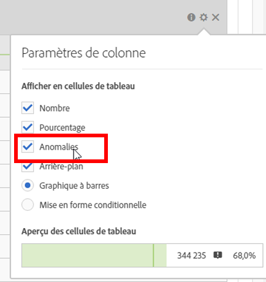

# Désactivation de la détection des anomalies

Pour désactiver la détection des anomalies au niveau de la colonne, désactivez l’option **[!UICONTROL Anomalies dans les paramètres de la colonne]**.

