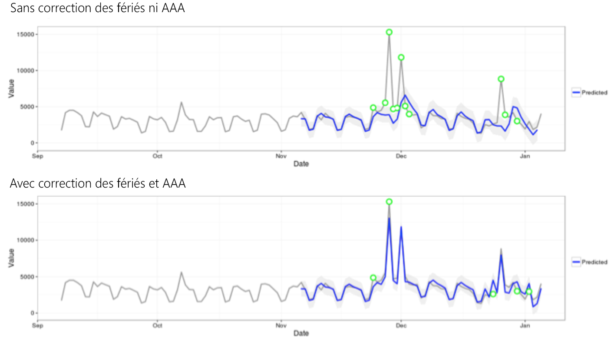

# Techniques statistiques de la détection des anomalies

Dans Analysis Workspace, la détection des anomalies applique différentes techniques statistiques avancées afin de déterminer si une observation doit être considérée comme anormale.

Selon la granularité de date du rapport, trois différentes techniques statistiques sont utilisées, en particulier pour la détection des anomalies horaire, quotidienne, hebdomadaire ou mensuelle. Chacune de ces techniques statistiques est décrite ci-dessous.

## Détection des anomalies avec une granularité quotidienne {#section_758ACA3C0A6B4D399563ECABFB8316FA}

Dans les rapports avec une granularité quotidienne, l’algorithme prend en compte plusieurs facteurs importants afin de produire les résultats les plus exacts possible. L’algorithme détermine tout d’abord le type de modèle à appliquer, en fonction des données disponibles d’après lesquelles vous sélectionnez une classe : un modèle de série chronologique ou un modèle de détection des valeurs aberrantes (filtrage fonctionnel).

Le modèle de série chronologique repose sur les combinaisons suivantes de type d’erreur, de tendance et de caractère saisonnier, comme décrit par [Hyndman et al. (2008)](https://www.springer.com/us/book/9783540719168). Plus particulièrement, l’algorithme tente les combinaisons suivantes :

1. Erreur additive, aucune tendance, caractère saisonnier additif (ANA)
1. Erreur additive, tendance additive, caractère saisonnier additif (AAA)
1. Erreur multiplicative, aucune tendance, caractère saisonnier multiplicatif (MNM)
1. Erreur multiplicative, aucune tendance, caractère saisonnier additif (MNA)
1. Erreur additive, tendance additive, aucun caractère saisonnier (AAN)

L’algorithme teste l’adéquation de chacune de ces combinaisons en sélectionnant celle qui génère la meilleure erreur en pourcentage absolu de la moyenne. Toutefois, le filtrage fonctionnel est appliqué si l’erreur en pourcentage absolu de la moyenne du meilleur modèle de série chronologique est supérieure à 15 %. En général, les données présentant un degré de répétition élevé (par ex. semaine après semaine ou mois après mois) sont mieux adaptées à un modèle de série chronologique.

Une fois le modèle sélectionné, l’algorithme adapte les résultats en fonction des jours fériés et du caractère saisonnier d’un exercice à l’autre. En ce qui concerne les jours fériés, l’algorithme vérifie si les jours fériés suivants sont présents dans la période de création de rapports :

* Jour du Souvenir (États-Unis)
* 4 juillet (États-Unis)
* Thanksgiving (États-Unis)
* Black Friday (États-Unis)
* Cyber Monday (États-Unis)
* 24-26 décembre
* Janvier 1
* 31 décembre

Ces jours fériés ont été choisis en fonction d’une analyse statistique approfondie de nombreux points de données de clients afin d’identifier les jours fériés les plus importants pour le plus grand nombre de groupes de tendances des clients. Cette liste n’est pas exhaustive pour tous les clients ou cycles opérationnels. Nous avons toutefois déterminé que l’application de ces jours fériés améliorait considérablement les performances générales de l’algorithme pour la plupart des jeux de données de clients (aux États-Unis).

Une fois le modèle sélectionné et les jours fériés identifiés dans la période de création des rapports, l’algorithme s’exécute comme suit :

1. Établissez la période de référence des anomalies comprenant jusqu’à 35 jours avant la période de création des rapports, ainsi qu’une période correspondante un an auparavant (en tenant compte des années bissextiles si nécessaire et des jours fériés applicables pouvant avoir eu lieu un autre jour de l’année précédente).
1. Vérifiez si les jours fériés de la période actuelle (à l’exclusion de l’année précédente) sont anormaux en fonction des données les plus récentes.
1. Si le jour férié dans la période actuelle est anormal, adaptez la valeur attendue et l’intervalle de confiance du jour férié actuel étant donné le jour férié de l’année précédente (avec une marge de deux jours avant et après). La correction des jours fériés actuels repose sur l’erreur en pourcentage absolu de la moyenne la plus faible de :

   1. Effets additifs
   1. Effets multiplicatifs
   1. Différence d’une année sur l’autre

Dans l’exemple suivant, observez l’amélioration drastique des performances le jour de Noël et du Nouvel An :

## Détection des anomalies avec une granularité horaire {#section_014C9E9209AF43F8A03D5D46E3B3AEE7}

Pour les données horaires, on applique le même algorithme de série chronologique qu’avec l’algorithme de granularité quotidienne. Toutefois, il repose principalement sur deux modèles de tendance : un cycle de 24 heures ainsi qu’un cycle week-end/jour de semaine. Afin de capturer ces deux effets saisonniers, l’algorithme horaire crée deux modèles distincts (week-end et jour de semaine) en appliquant la même approche que celle décrite ci-dessus.

Le créneau de formation des tendances horaires repose sur un intervalle de recherche en amont de 336 heures.

## Détection des anomalies avec une granularité horaire ou mensuelle {#section_5D421576BFBC4B24A58DFCC0A6407545}

Les tendances hebdomadaires et mensuelles diffèrent des tendances hebdomadaires ou quotidiennes déterminées avec une granularité quotidienne ou horaire, de sorte qu’un algorithme distinct est appliqué. Pour les tendances hebdomadaires et mensuelles, une approche en deux étapes de détection des valeurs aberrantes est appliquée, connue sous le nom de test GESD (Generalized Extreme Studentized Deviate). Ce test tient compte du nombre maximum d’anomalies attendues combiné à l’approche ajustée de diagrammes en boîte (méthode non paramétrique de détection des valeurs aberrantes) afin de déterminer le nombre maximum de valeurs aberrantes. Les deux étapes sont les suivantes :

1. Fonction ajustée de diagrammes en boîte : détermine le nombre maximum d’anomalies étant donné les données d’entrée.
1. Fonction GESD : appliquée aux données d’entrée avec le résultat de l’étape 1.

L’étape de détection des anomalies du caractère saisonnier d’une année à l’autre et des jours fériés soustrait ensuite les données de l’an dernier des données de cette année, puis parcourt à nouveau les données en appliquant le processus à deux étapes ci-dessus afin de vérifier que les anomalies sont appropriées pour le caractère saisonnier. Chacune de ces granularités de date utilise une recherche en amont de 15 périodes, y compris la période de création de rapports sélectionnée (15 mois ou 15 semaines) et une période correspondante un an auparavant pour la formation.
