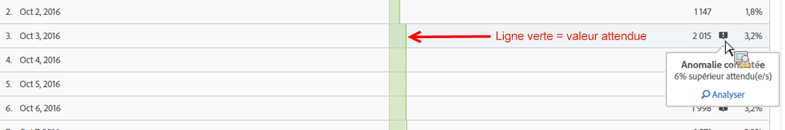
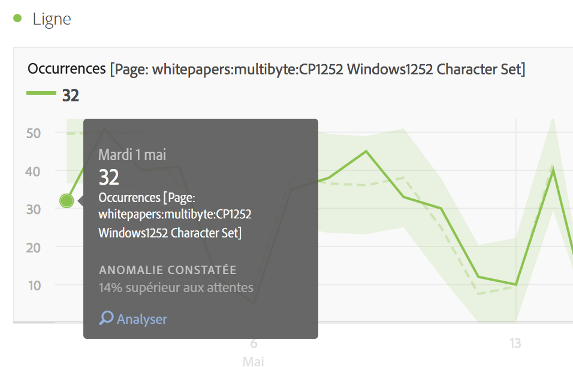
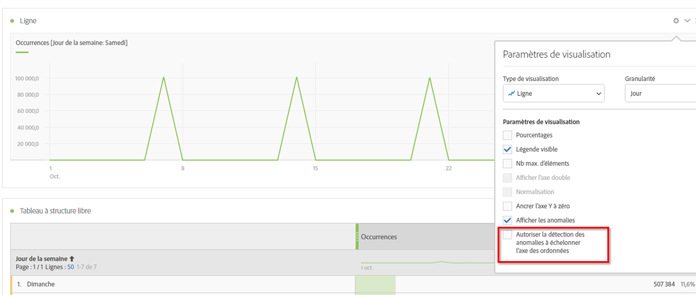

# Affichage des anomalies dans Analysis Workspace

Vous pouvez afficher les anomalies dans un tableau ou un graphique en courbes.

## View anomalies in a table {#section_869A87B92B574A38B017A980ED8A29C5}

Dans un tableau à structure libre à série chronologique, chaque ligne présentant une anomalie des données est maintenant automatiquement désignée par un point d’exclamation gris foncé.

La ligne grise verticale dans chaque ligne indique la valeur attendue. Pointez la souris sur le point d’exclamation pour connaître l’étendue de l’anomalie par rapport à la valeur attendue (en + ou - %).

## View anomalies in a line chart {#section_7C1192AFDB4345A8A2CCFB3AE0C47D82}

Le graphique en courbes présente la marge de confiance en vert clair ; les valeurs anormales sont désignées par des points blancs.

Si vous cliquez sur un point blanc, il se change en vert et affiche :

* la date à laquelle l’anomalie s’est produite ;
* la valeur brute de l’anomalie ;
* la valeur en pourcentage au dessus ou en dessous de la valeur attendue, représentée par une ligne continue vert foncé ;
* le lien Analyser permettant de lancer [l’analyse des contributions](../../../../analyze/analysis-workspace/virtual-analyst/contribution-analysis/ca-tokens.md).

Si le graphique en courbes comporte plusieurs mesures, seules les anomalies sont présentées et vous devez pointer sur chacune d’elles pour en connaître la marge de confiance.

L’intervalle de confiance Détection des anomalies ne met pas automatiquement à l’échelle l’axe des ordonnées d’une visualisation afin de rendre le graphique potentiellement plus lisible.

Vous avez la possibilité de configurer l’intervalle de confiance pour qu’il mette le graphique à l’échelle. Cliquez simplement sur l’icône d’engrenage Paramètres et cochez l’option **[!UICONTROL Autoriser la détection des anomalies pour mettre à l’échelle l’axe des ordonnées]**.

