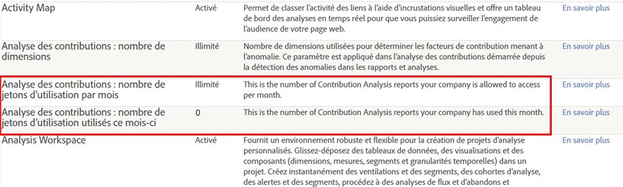

# Analyse des contributions - Aperçu

L’analyse des contributions détecte les comportements latents au sein de vos données qui expliquent les anomalies statistiques et identifie les corrélations sous-jacentes aux actions inattendues des clients, aux valeurs hors limites et aux pics et creux soudains de certaines mesures à l’échelle des segments d’audience convergents.

Quelque chose s’est produit. Pourquoi ? Votre rapport Détection des anomalies présente un pic inhabituel des commandes. Vous souhaitez en connaître la raison. Que s’est-il passé ? Qui réagit à cette campagne ou à cette référence ? Quelque chose est-il devenu viral ? Quels facteurs spécifiques ont contribué à cette anomalie ? Et plus important peut-être : comment récupérer les informations importantes au sujet de mon client et répéter cette performance ? (Ou, en cas de creux dans une mesure ou de hausse d’une mesure négative, comment l’éviter à l’avenir ?)

L’analyse des contributions permet d’évaluer immédiatement les données afin de déterminer la cause d’une anomalie. Elle ventile en quelques secondes les contributions à une anomalie, là où il fallait autrefois plusieurs semaines, isole des schémas pour les segments d’audience et aide à élaborer une narration relative aux interactions des clients. Appliquez l’analyse des contributions de manière stratégique afin de détecter et de capturer des associations significatives pour élaborer de nouveaux segments d’audience ou avec tact pour identifier les activités extraordinaires ou frauduleuses qui ont déclenché une alerte.

La [détection des anomalies](/help/analyze/analysis-workspace/virtual-analyst/c-anomaly-detection/anomaly-detection.md) identifie les pics de données et les creux statistiques extrêmes d’après les mesures et les segments d’audience sélectionnés. Elle établit une norme historique d’après une période de formation, puis trace les décalages extrêmes en corrélation avec les événements spécifiques. Elle peut repérer une hausse soudaine d’une mesure positive de commandes ou d’une mesure négative de rebonds, ou les creux dans les deux cas, afin de capturer les points de données statistiquement pertinents qui seront évalués par l’analyse des contributions. Une fois une anomalie statistique identifiée, l’analyse des contributions permet d’analyser davantage et d’évaluer les variables de campagne et de marketing pertinentes à l’échelle de tous les points de données irréguliers. Elle exécute des algorithmes et des processus d’apprentissage automatiques élaborés afin d’évaluer les associations qui ont contribué à un pic ou à un creux significatif. Ces  calculs sont ensuite présentés dans des visualisations interactives qui illustrent différentes perspectives afin de vous aider à déterminer la raison d’un événement et ce que vous pouvez faire à ce sujet.

L’analyse des contributions permet d’élaborer une narration afin de décrire la raison d’une anomalie et la manière d’y réagir, en capturant les mesures pertinentes et en repérant les points latents qui présentent une raison globale aux interactions des audiences et aux tendances des intérêts des clients. Il est parfois aisé de repérer et de corriger une anomalie, par exemple une commande ponctuelle de 2 000 kayaks. Cela peut aussi être complexe, par exemple en identifiant une tendance émergente sur une période donnée dans une région donnée, qui réagit uniquement à une campagne ciblée spécifique. L’assemblage d’éléments de contribution à l’échelle de mesures pour diverses dimensions et de leurs associations vous donne une idée générale des interactions de votre audience et vous aide à préciser un contexte pour les points de données irréguliers.

Voici quelques idées :

* Identifiez le potentiel de remarketing en surveillant les changements en termes de demande d’un produit.
* Améliorez les conditions d’utilisation des clients en réagissant à des intérêts spécifiques de l’audience.
* Repérez les commandes frauduleuses rapidement au moyen d’un rapport sur les hors limite.
* Protégez-vous contre l’espionnage industriel en détectant les taux élevés d’utilisation et de téléchargements.
* Surveillez les opérations, par exemple à l’aide de rapports où il manque des balises JavaScript.

Après une analyse exhaustive d’une anomalie, un résumé des contributions est généré pour les principaux éléments classés en fonction du nombre total d’occurrences et du pourcentage des valeurs de contribution des éléments. Une note de contribution normalisée permet de facilement comparer, contraster et associer les éléments à d’autres éléments de dimension significatifs.

## Jetons d’analyse des contributions - Aperçu {#section_3EF8D2BBCE6E4C309D753BCF04A453D0}

>[!IMPORTANT]
>
>L’analyse des contributions a été supprimée de l’ensemble de fonctionnalités Reports &amp; Analytics et est désormais disponible uniquement via Analysis Workspace.

Tous les clients autorisés à utiliser l’analyse des contributions peuvent exécuter une analyse complète un nombre limité de fois par mois dans Analysis Workspace. Cela **exclut** les clients (SiteCatalyst 15) du produit, les clients d’Analytics Foundation et les clients d’Analytics Select, qui n’obtiennent aucune analyse de contributions.

Le nombre d’exécutions par société est limité à un certain nombre de jetons mensuels attribués en fonction du produit Adobe Analytics acquis par la société. Cela inclut la possibilité de restreindre l’accès à l’analyse des contributions pour éviter l’usage impropre des jetons.

## Questions fréquentes {#section_11D0431AD2014B96AB9561CA66A367CE}

<table id="table_357775E5058644099E26B15A6790E8AF"> 
 <thead> 
  <tr> 
   <th colname="col1" class="entry"> Question </th> 
   <th colname="col2" class="entry"> Réponse </th> 
  </tr>
 </thead>
 <tbody> 
  <tr> 
   <td colname="col1"> 
<b>Pourquoi Adobe a-t-il introduit des jetons ? </b> 
 </td> 
   <td colname="col2"> 
L’analyse des contributions a été l’une des fonctionnalités les plus intéressantes d’Adobe Analytics depuis sa sortie en 2015. En autorisant un petit nombre d’exécutions « complètes » par mois (plutôt que seulement trois dimensions pour certains produits Analytics), vous pouvez mieux voir ce que l’analyse des contributions complète illimitée peut vous apporter. 
 </td> 
  </tr> 
  <tr> 
   <td colname="col1"> 
<b>Comment fonctionnent les jetons dans l’analyse des contributions ? Le chargement d’un projet avec une analyse des contributions existante coûte-t-il un jeton ? Ou ce coût existe-t-il uniquement lors de l’exécution d’une nouvelle analyse ?</b> 
 </td> 
   <td colname="col2"> 
Chaque société de connexion (et non chaque utilisateur) obtient un certain nombre de jetons par mois, ce qui permet d’exécuter une analyse des contributions « complète » dans Analysis Workspace. 
 
Chaque fois que vous générez une nouvelle analyse des contributions, vous payez un jeton. Le chargement de projets avec des analyses des contributions pré-exécutées ne coûte pas de jeton. 
 </td> 
  </tr> 
  <tr> 
   <td colname="col1"> 
<b>Les jetons s’appliquent-ils à l’analyse des contributions dans les Reports &amp; Analytics ?</b> 
 </td> 
   <td colname="col2"> 
Non. L’analyse des contributions n’est plus disponible dans les Reports &amp; Analytics à compter de la version d’avril 2018. 
 </td> 
  </tr> 
  <tr> 
   <td colname="col1"> 
<b>Si ma société n’a plus de jetons et souhaite exécuter des analyses des contributions supplémentaires, que pouvons-nous faire ?</b> 
 </td> 
   <td colname="col2"> 
Vous pouvez passer à une autre version d’Adobe Analytics, par exemple de Standard (2 jetons/mois) à Ultimate (20 jetons/mois). Vous ne pouvez pas acheter plus de jetons : vous devez effectuer une mise à niveau dans le cadre de la structure de package existante. 
 </td> 
  </tr> 
  <tr> 
   <td colname="col1"> 
<b>Comment puis-je restreindre l’accès à l’analyse des contributions ?</b> 
 </td> 
   <td colname="col2"> 
Par défaut, seuls les administrateurs ont accès à l’exécution des analyses des contributions, mais les administrateurs peuvent accorder l’accès à d’autres utilisateurs en créant un groupe d’autorisations dans <a href="https://docs.adobe.com/content/help/fr-FR/core-services/interface/manage-users-and-products/admin-getting-started.html"  >Admin Console</a>. Donnez l’autorisation d’utiliser l’analyse des contributions uniquement aux utilisateurs qui ont une raison légitime de l’utiliser et à qui vous accordez votre confiance pour ne pas en abuser. 
 
L’autorisation est appelée « Analyse des contributions » sous Analytics &gt; Admin &gt; Gestion utilisateur &gt; Modifier les groupes &gt; Modifier l’accès à tous les rapports &gt; Personnaliser les outils de suites de rapports &gt; Outils et rapports. 
 </td> 
  </tr> 
  <tr> 
   <td colname="col1"> 
<b>Comment puis-je connaître le nombre de jetons auxquels ma société a droit par mois et combien de jetons avons-nous utilisés durant le mois en cours ?</b> 
 </td> 
   <td colname="col2"> 
Accédez à Admin &gt; Paramètres de la société &gt; Afficher les niveaux d’accès aux fonctions. Cette page comporte 2 nouveaux éléments : 
 
 
 </td> 
  </tr> 
 </tbody> 
</table>

## Autorisations pour la détection des anomalies et l’analyse des contributions {#section_9278D58F21A840AA9B1ED1BD07A1EF0A}

Vous trouverez ci-dessous une liste des autorisations détaillées pour la détection des anomalies et l’analyse des contributions dans Analysis Workspace.

>[!IMPORTANT]
>
>La détection des anomalies et l’analyse des contributions ont été supprimées de l’ensemble de fonctionnalités Reports &amp; Analytics et sont désormais disponibles uniquement via Analysis Workspace. Remarque : les clients Adobe Analytics Select et Adobe Analytics Foundation ne profitent que d’une détection des anomalies « à granularité journalière » dans Workspace.

<table id="table_5C9B7E4AE82640B5A913519E576889B5"> 
 <thead> 
  <tr> 
   <th colname="col1" class="entry"> Droit Adobe Analytics </th> 
   <th colname="col2" class="entry"> Détection des anomalies </th> 
   <th colname="col3" class="entry"> Analyse des contributions </th> 
  </tr>
 </thead>
 <tbody> 
  <tr> 
   <td colname="col1"> 
Foundation 
 </td> 
   <td colname="col2"> 
Granularité quotidienne uniquement 
 </td> 
   <td colname="col3" colsep="1"> 
Aucun jeton 
 </td> 
  </tr> 
  <tr> 
   <td colname="col1"> 
<a href="https://www.adobe.com/fr/data-analytics-cloud/analytics/select.html?promoid=B4XQ3X7G&amp;mv=other"  >Select</a> 
 </td> 
   <td colname="col2"> 
Granularité quotidienne uniquement 
 </td> 
   <td colname="col3"> 
Aucun jeton 
 </td> 
  </tr> 
  <tr> 
   <td colname="col1"> 
<a href="https://www.adobe.com/fr/data-analytics-cloud/analytics/prime.html?promoid=91BF51TR&amp;mv=other"  >Prime</a> 
 </td> 
   <td colname="col2"> 
Oui 
 </td> 
   <td colname="col3"> 
10 jetons par mois 
 </td> 
  </tr> 
  <tr> 
   <td colname="col1"> 
<a href="https://www.adobe.com/fr/data-analytics-cloud/analytics/ultimate.html?promoid=8N4B5F1V&amp;mv=other"  > Ultimate</a> 
 </td> 
   <td colname="col2"> 
Oui 
 </td> 
   <td colname="col3"> 
20 jetons par mois 
 </td> 
  </tr> 
  <tr> 
   <td colname="col1"> 
+Predictive Workbench 
 </td> 
   <td colname="col2"> 
Oui 
 </td> 
   <td colname="col3"> 
Jetons illimités 
 </td> 
  </tr> 
  <tr> 
   <td colname="col1"> 
Standard 
 
    <ul id="ul_73D52020793B44868C9CE0F90893075D"> 
     <li id="li_21EE0871C87E43C8B781219B2BA0FA74">Adobe Analytics Core </li> 
     <li id="li_AB3593200F33439BAEE8FEB13CAE57F4">Adobe Analytics OD </li> 
     <li id="li_2B7D625519BC4A4CB598C95F15D3029B">Adobe Analytics MA </li> 
    </ul> </td> 
   <td colname="col2"> 
Oui 
 </td> 
   <td colname="col3"> 
2 jetons par mois 
 </td> 
  </tr> 
  <tr> 
   <td colname="col1"> 
Premium (360, Attribution) 
 </td> 
   <td colname="col2"> 
Oui 
 </td> 
   <td colname="col3"> 
2 jetons par mois 
 </td> 
  </tr> 
  <tr> 
   <td colname="col1"> 
Premium (Complete, <a href="https://www.adobe.com/fr/data-analytics-cloud/analytics/predictive-intelligence.html"  >Predictive Intelligence</a>) 
 </td> 
   <td colname="col2"> 
Oui 
 </td> 
   <td colname="col3"> 
Jetons illimités 
 </td> 
  </tr> 
 </tbody> 
</table>
