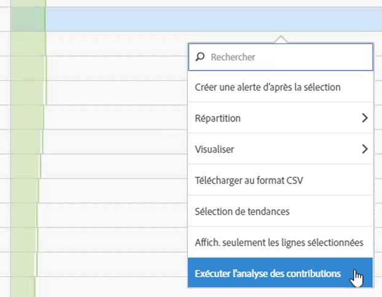
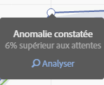
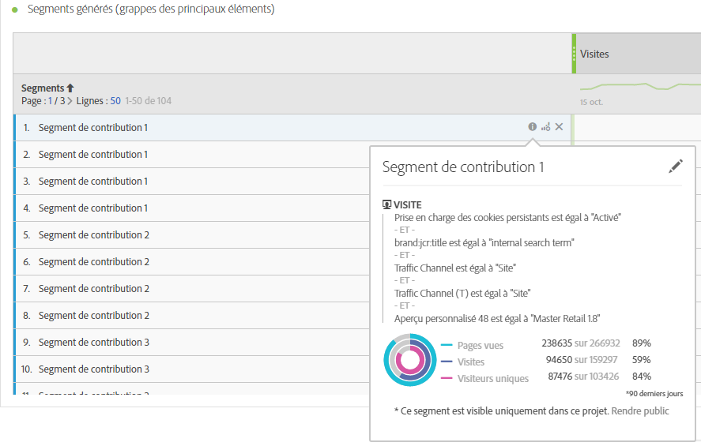
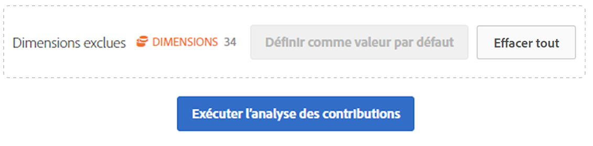
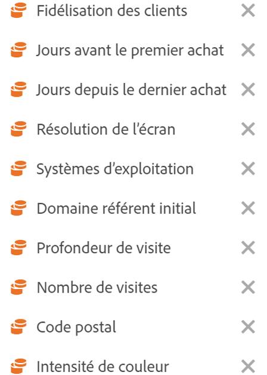

# Exécution de l’analyse des contributions

L’analyse des contributions est un processus intensif d’apprentissage automatique, conçu pour déterminer quels facteurs sont à l’origine d’une anomalie observée dans Adobe Analytics. L&#39;objectif est d&#39;aider l&#39;utilisateur à trouver des domaines d&#39;intérêt ou des opportunités pour d&#39;autres  beaucoup plus rapidement qu&#39;il ne serait autrement possible.

## Exécution de l’analyse des contributions {#section_7D2C5E48A5664727941DF4C90976D9DC}

Dans un projet, vous pouvez invoquer l’analyse des contributions de deux façons :

* In a freeform table with daily granularity, right-click any row and select **[!UICONTROL Run Contribution Analysis]**. Vous pouvez également l’exécuter sur les lignes qui ne présentent aucune anomalie.

   >[!NOTE]
   >
   >Actuellement, seule l’analyse des contributions avec une granularité quotidienne est prise en charge.

   

* Dans un graphique en courbes, pointez avec la souris sur un point de données présentant une anomalie. Click the **[!UICONTROL Analyze]** link that appears.

   

1. (Optional) After you have clicked **[!UICONTROL Run Contribution Analysis]** in either the line chart or a table, you can narrow the scope of (and thus speed up) the analysis by [excluding dimensions](/help/analyze/analysis-workspace/virtual-analyst/contribution-analysis/run-contribution-analysis.md#section_F6932F4BF74544B5872164E7B1E0C6FC).

1. Patientez pendant le chargement de l’analyse des contributions. Selon la taille de la suite de rapports et le nombre de dimensions, cette opération peut être longue. Le de  de contribution  effectue  sur les 50 000 premiers éléments par dimension.
1. Analysis Workspace charge ensuite un nouveau panneau Analyse des contributions directement dans ce projet. Vous noterez de nombreux panneaux familiers si vous avez déjà utilisé les  de contribution  dans les rapports et analyses avant :

   * Visualisation qui montre le nombre de **visites** ce jour-là.
   * Ligne **de tendance des** visites mensuelles pour le contexte.
   * **Principaux éléments** qui ont contribué à cette anomalie, triés par le score [de](https://marketing.adobe.com/resources/help/fr_FR/analytics/contribution/ca_contribution_score.html)contribution, plus la mesure en question, et une mesure unique pour mettre la mesure en contexte du point de vue de la taille.

   * Le tableau [Segments générés](https://marketing.adobe.com/resources/help/fr_FR/analytics/contribution/ca_workflow_premium.html) (grappes des principaux éléments) identifie les associations des principaux éléments en fonction de la note de contribution, des occurrences de l’anomalie et du pourcentage global contribuant à la mesure anormale. Ces données sont ensuite regroupées dans un segment d’audience (Segment de contribution 1, Segment de contribution 2, etc.). En cliquant sur le bouton &quot;i&quot; (informations), vous obtenez un  de la définition de chaque segment automatique, y compris les principaux éléments qui le composent :

      

1. Comme la contribution   fait désormais partie de l’Espace de travail de de , vous pouvez tirer parti d’un certain nombre de ses fonctionnalités à partir du menu contextuel d’un tableau pour rendre votre encore plus significatif, comme par exemple :

   * [Ventiler chaque élément de dimension par une autre dimension.](/help/analyze/analysis-workspace/components/dimensions/t-breakdown-fa.md)
   * [Déterminer la tendance d’une ou de plusieurs lignes](/help/analyze/analysis-workspace/analysis-workspace-features.md#section_34930C967C104C2B9092BA8DCF2BF81A)
   * [Ajouter de nouvelles visualisations.](/help/analyze/analysis-workspace/visualizations/freeform-analysis-visualizations.md)
   * [Créer des alertes.](/help/components/c-alerts/intellligent-alerts.md)
   * [Créer ou comparer des segments.](/help/analyze/analysis-workspace/c-panels/c-segment-comparison/segment-comparison.md)

>[!NOTE] L’anomalie en cours d’analyse est mise en évidence au moyen d’un point bleu dans l’analyse des contributions et les projets avec alertes intelligentes qui y sont liés. Ceci permet d’indiquer plus clairement l’anomalie en cours d’analyse.

## Exclusion de dimensions de l’analyse des contributions {#section_F6932F4BF74544B5872164E7B1E0C6FC}

Il peut arriver que vous souhaitiez exclure certaines dimensions de l’ de  de contribution. Par exemple, vous pouvez ne pas vous soucier du tout des dimensions liées au navigateur ou au matériel, et vous souhaitez accélérer   en les supprimant.

1. Une fois que vous avez cliqué **[!UICONTROL Run Contribution Analysis]** (ou **[!UICONTROL Analyze]** dans un graphique en courbes), le **[!UICONTROL Excluded Dimensions]** panneau s’affiche.

1. Faites glisser les dimensions indésirables dans le **[!UICONTROL Excluded Dimensions]** panneau, puis enregistrez le  en cliquant **[!UICONTROL Set as Default]**. Or, click **[!UICONTROL Clear All]** to start over with selecting dimensions to exclude.

   

1. After you have added dimensions to exclude (or chosen not to), click **[!UICONTROL Run Contribution Analysis]** again.
1. Si vous avez besoin de réviser la liste des dimensions exclues, double-cliquez simplement sur Dimensions, et la liste des dimensions exclues s’affiche :

   

1. Just delete any unwanted dimensions by clicking the x next to them, then save the list by clicking **[!UICONTROL Set as Default]**.

