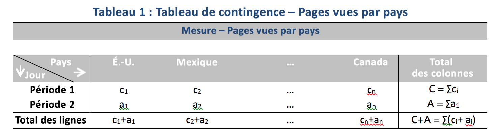

# Techniques statistiques utilisées dans l'analyse des contributions

L’analyse des contributions est un processus intensif d’apprentissage automatique, conçu pour déterminer quels facteurs sont à l’origine d’une anomalie observée dans Adobe Analytics. Elle permet à l’utilisateur de repérer, bien plus rapidement qu’il ne serait normalement possible, les opportunités ou les centres d’intérêt justifiant une analyse supplémentaire.

Pour y parvenir, l’analyse des contributions exécute un algorithme en deux étapes à chaque élément de dimension disponible pour le rapport d’analyse des contributions de l’utilisateur. L’algorithme s’exécute dans cet ordre :

1. Pour chaque dimension, il calcule le V de Cramer. Dans l’exemple suivant, on utilise une table de contingence avec les pages vues par pays au cours de deux périodes :

   

   Dans le tableau 1, le V de Cramer peut être appliqué afin de mesurer l’association entre les pages vues par pays pour la période 1 (historique, par exemple) et la période 2 (jour où l’anomalie a eu lieu, par exemple). Une valeur faible implique un faible niveau de l’association. Le V de Cramer est compris entre 0 (aucune association) et 1 (association terminée). Le V de Cramer peut être calculé comme suit :

   

1. Pour chaque élément de dimension, le résiduel par personne sert à mesurer l’association entre la mesure anormale et chaque élément de dimension. Le résiduel par personne applique une distribution normale standard, ce qui permet à l’algorithme de comparer cette valeur pour deux variables aléatoires même si l’écart n’est pas comparable. En pratique, l’erreur est indéterminée et est estimée en appliquant une correction d’échantillonnage finie.

   Dans le tableau 1 du précédent exemple, le résiduel par personne, avec la correction d’échantillonnage finie pour le pays i et la période 2 est calculé comme suit :

   

   Ici,

   

   (Une formule semblable peut être obtenue pour la période 1.)

   Afin de calculer les résultats finaux, le score pour chaque élément de dimension est ensuite pondéré par le V de Cramer et remis à l’échelle en fonction d’un facteur compris entre 0 et 1 afin de générer le score de contribution.

