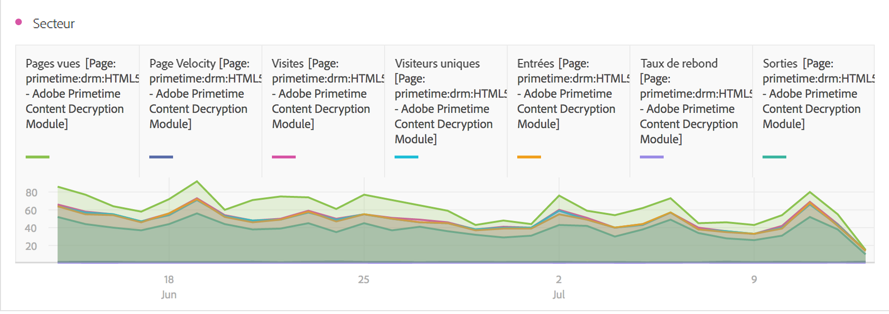
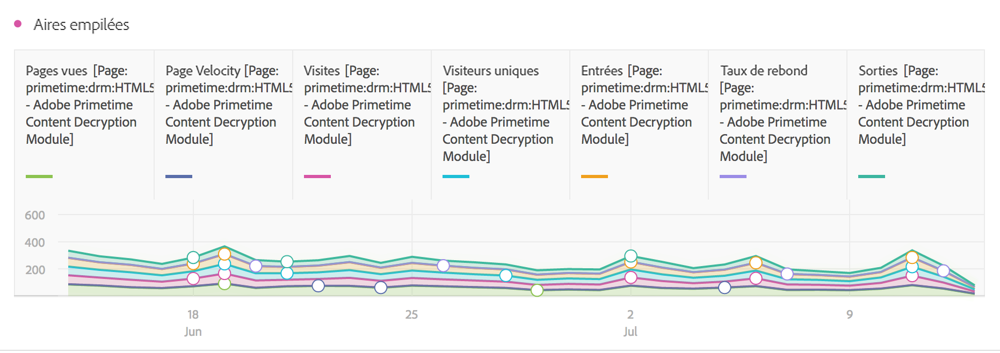
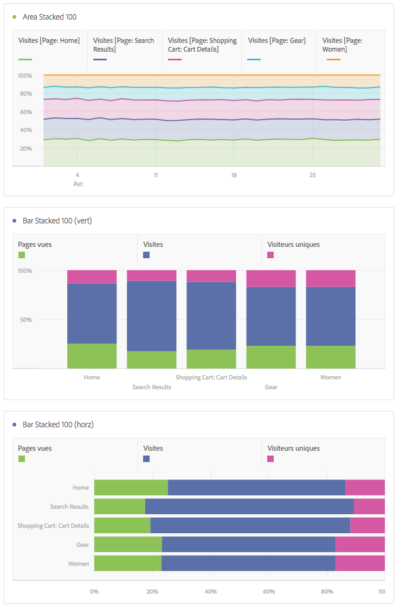

# Surface et aires empilées

## Surface {#section_FDC4B6AA944F4F8AAAEAA5E17359F28A}

Cette visualisation est semblable à un graphique linéaire, mais avec une zone colorée sous la ligne. Utilisez un diagramme de surface si vous avez plusieurs mesures et souhaitez visualiser la zone exprimée par l’intersection de plusieurs mesures.

## Aires empilées {#section_922BBC5A6D254778A050DF710B0BD8D9}

Cette visualisation est semblable à un diagramme de surface, mais chaque série commence en haut de la série précédente.

Un nouveau paramètre d’affichage appliqué aux graphiques à zones empilées offre un aperçu « 100 % empilé » du diagramme.

