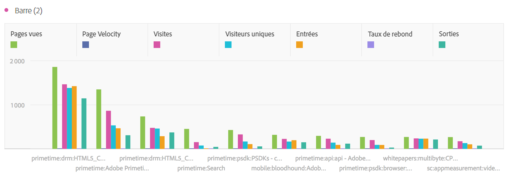
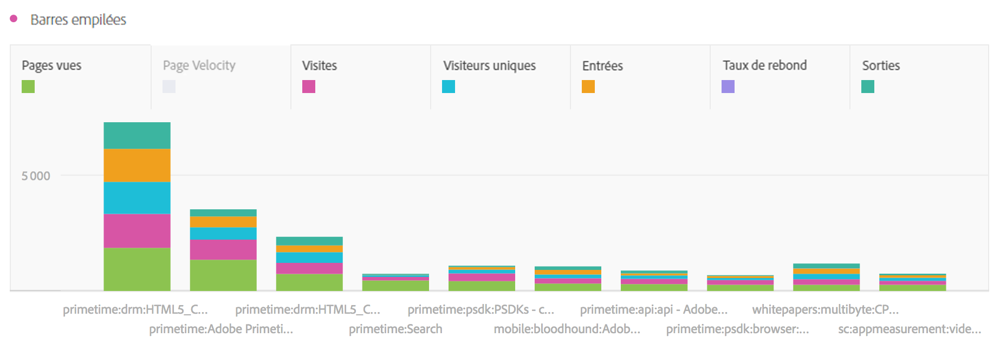

# Barre et barres empilées

## Barre {#section_2E96E55D4E8E488CBCA6A3508DDF3918}

Dans cette visualisation, des barres verticales représentent plusieurs valeurs pour une ou plusieurs mesures.

Une liste déroulante de granularité accessible dans les paramètres de visualisation permet de modifier une visualisation avec suivi des tendances (ex. ligne, barre) de chaque jour à chaque mois, etc.

## Barres empilées {#section_9EA83779AE964635907EE5031A785A49}

Dans cette visualisation semblable à un graphique à barres, les barres des séries sont empilées les unes au-dessus des autres.

Un nouveau paramètre d’affichage appliqué aux graphiques à barres empilées offre un aperçu « 100 % empilé » du diagramme :

