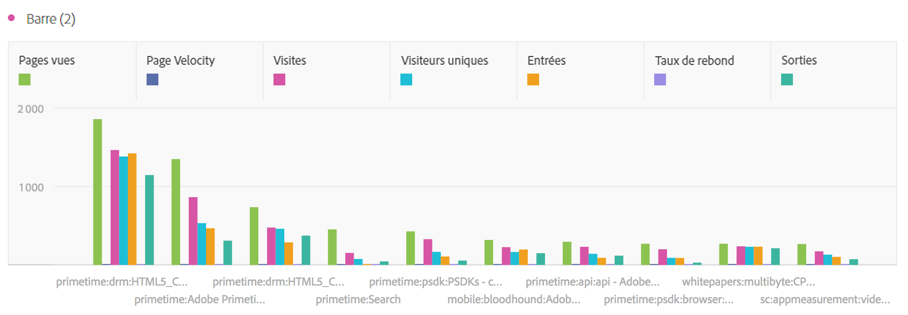
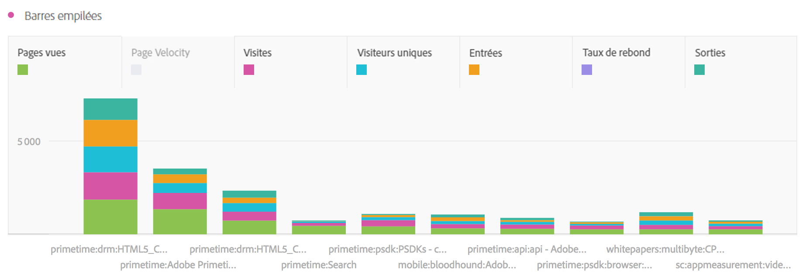

# Barres (empilées)

>[!BEGINSHADEBOX]

_Cet article présente les visualisations à barres et barres empilées dans_  _**Adobe Analytics**._ _Voir [Barres et barres empilées](https://experienceleague.adobe.com/fr/docs/analytics-platform/using/cja-workspace/visualizations/bar) pour la version_  _**Customer Journey Analytics** de cet article._

>[!ENDSHADEBOX]

La visualisation Barres comporte une option Standard et Empilées.

## Barre {#bar}

<!-- markdownlint-disable MD034 -->

>[!CONTEXTUALHELP]
>id="workspace_bar_button"
>title="Barre"
>abstract="Créez une visualisation à barres pour représenter différentes valeurs pour une ou plusieurs mesures."

<!-- markdownlint-enable MD034 -->

La visualisation  **[!UICONTROL Barres]** affiche des barres verticales représentant plusieurs valeurs pour une ou plusieurs mesures.

Une liste déroulante de granularité accessible dans les paramètres de visualisation permet de modifier une visualisation avec suivi des tendances (par exemple sous forme de ligne ou de barres) de quotidienne, mensuelle, etc.

## Barres empilées {#bar-stacked}

<!-- markdownlint-disable MD034 -->

>[!CONTEXTUALHELP]
>id="workspace_barstacked_button"
>title="Barres empilées"
>abstract="Créez une visualisation à barres pour représenter différentes valeurs pour une ou plusieurs mesures empilées."

<!-- markdownlint-enable MD034 -->

La visualisation  **[!UICONTROL Barres empilées]** est semblable à un graphique à barres, mais les barres des séries sont empilées les unes au-dessus des autres.

Utilisez l’option **[!UICONTROL Empilé à 100 %]** dans  **[!UICONTROL Paramètres]** pour transformer le graphique en visualisation empilée à 100 %.

>[!MORELIKETHIS]
>
>[Ajouter une visualisation à un panneau](/help/analyze/analysis-workspace/visualizations/freeform-analysis-visualizations.md#add-visualizations-to-a-panel)
>[Paramètres de visualisation](/help/analyze/analysis-workspace/visualizations/freeform-analysis-visualizations.md#settings)
>[Menu contextuel de visualisation](/help/analyze/analysis-workspace/visualizations/freeform-analysis-visualizations.md#context-menu)
>