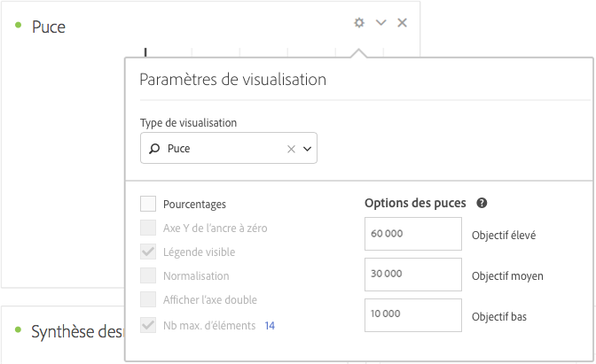

# Graphique à puces

Permet de comparer ou de mesurer une valeur qui vous intéresse par rapport à d’autres plages de performances (objectifs).

Le graphique à puces présente une mesure principale unique (par exemple, le chiffre d’affaires de l’année en cours jusqu’à ce jour) et vous permet de saisir des plages de performances qualitatives (par exemple, par rapport au chiffre d’affaires cible). Vous pouvez spécifier des valeurs élevées, moyennes et faibles. Vous pouvez indiquer des plages d’objectifs dans les [!UICONTROL Paramètres de visualisation].
