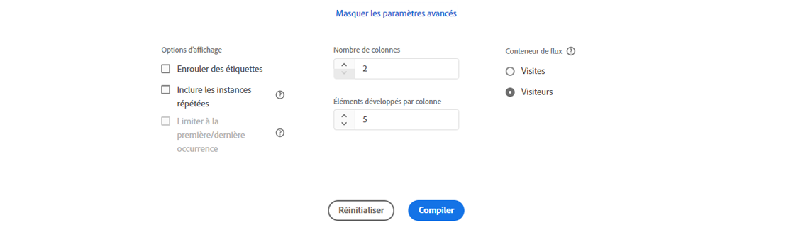

# Configuration d’une visualisation de flux

>[!NOTE]
>
>Cette nouvelle version de la fonction [!UICONTROL Flux] la visualisation est actuellement en version bêta privée. Voir [cette page](/help/analyze/analysis-workspace/visualizations/c-flow/creating-flow-report.md) pour la fonctionnalité actuelle.

La visualisation Flux mise à jour vous permet de comprendre le parcours qui résulte d’un événement de conversion spécifique ou qui en résulte sur votre site web ou votre application. Il trace un chemin d’accès à travers vos dimensions (et éléments de dimension) ou mesures. Le flux vous permet de configurer le début ou la fin du chemin qui vous intéresse, ou d’analyser tous les chemins qui traversent une dimension ou un élément de dimension.

La nouvelle [!UICONTROL flow] expérience améliore votre workflow de plusieurs façons :

* Vous pouvez désormais choisir de commencer ou de terminer votre chemin par la combinaison d’une mesure et d’une dimension de cheminement.
* Contient [!UICONTROL Paramètres avancés] pour vous permettre de personnaliser davantage le [!UICONTROL flow].
* Le nouveau bouton &quot;Créer&quot; permet de gagner du temps dans l’analyse en vous permettant de configurer le parcours en une seule fois, puis d’effectuer des requêtes, puis de créer automatiquement plusieurs colonnes et noeuds à la fois &#x200B;.

## Étapes de configuration {#configure}

1. Pour commencer à créer un diagramme de flux, ajoutez un panneau vierge à votre projet, puis cliquez sur l’icône Visualisations dans le rail de gauche. Faites ensuite glisser la visualisation Flux dans le panneau. Ou faites glisser le [!UICONTROL Flux] visualisation dans un projet existant.

1. Ancrer votre visualisation Flux à l’aide de l’une des trois options suivantes :

   * [!UICONTROL Commence par] (mesures, dimensions ou éléments) ou
   * [!UICONTROL Contient] (dimensions ou éléments) ou
   * [!UICONTROL Se termine par] (mesures, dimensions ou éléments)

   Chacune de ces catégories est présentée à l’écran comme une « zone de dépôt ». Faites glisser des éléments de la liste de dimensions ou de mesures et déposez-les dans la zone de dépôt de votre choix.

   Supposons, par exemple, que vous souhaitiez tracer tout ce qui mène à un événement de passage en caisse. Faites glisser une dimension ou une mesure liée à l’extraction (telle que [!UICONTROL L’ordre existe]) dans le **[!UICONTROL Se termine par]** zone de dépôt.

1. Si vous choisissez une mesure, vous devez également fournir une [!UICONTROL Dimension de cheminement], comme illustré ici, que vous utiliserez pour créer le chemin. La valeur par défaut est [!UICONTROL Page].

   

1. (Facultatif) Cliquez sur **[!UICONTROL Afficher les paramètres avancés]** pour configurer les paramètres avancés :

   

   | Paramètre | Description |
   | --- | --- |
   | **[!UICONTROL Inclure les instances répétées]** | Les visualisations de flux sont basées sur des instances d’une dimension. Ce paramètre vous donne la possibilité d’inclure ou d’exclure des instances de répétition, telles que des rechargements de page. Toutefois, les répétitions ne peuvent pas être supprimées des visualisations de flux qui incluent des dimensions à valeurs multiples, comme des listVars, listProps, s.product, eVars de marchandisage, etc. Valeur par défaut = non coché. |
   | **[!UICONTROL Envoi d’étiquettes]** | Habituellement, les étiquettes sur les éléments de flux sont tronquées pour gagner de l’espace à l’écran, mais vous pouvez afficher l’étiquette complète en cochant cette case.  Valeur par défaut = non coché. |
   | **[!UICONTROL Limiter à la première/dernière occurrence]** | Limitez les chemins à ceux qui commencent/se terminent par la première/dernière occurrence d’une dimension/élément/mesure. |
   | **[!UICONTROL Nombre de colonnes]** | Détermine le nombre de colonnes souhaité dans le diagramme Flux. |
   | **[!UICONTROL Éléments développés par colonne]** | Nombre d’éléments à inclure dans chaque colonne. |
   | **[!UICONTROL Conteneur de flux]** | <ul><li>Visite</li><li>Visiteur</li></ul> Permet de basculer entre Visite et Visiteur afin d’analyser le cheminement du visiteur. Ces paramètres permettent de comprendre l’engagement des visiteurs au niveau des visiteurs (à l’échelle de toutes visites) ou de contraindre l’analyse à une seule visite. |

1. Cliquez sur **[!UICONTROL Créer]**.

## Affichage et modification de la sortie Flux {#output}

Un résumé de la configuration Flux s’affiche en haut du diagramme. Les tracés dans le diagramme sont proportionnels. Les tracés plus épais sont ceux pour lesquels l’activité est la plus intense.

Pour approfondir l’analyse des données, vous disposez de plusieurs options :

* Le diagramme de flux est interactif. Pointez sur le diagramme pour modifier les détails présentés.

* Si vous cliquez sur un nœud du diagramme, les détails correspondants s’affichent. Cliquez à nouveau sur le noeud pour le réduire.

   

* Vous pouvez filtrer une colonne pour n’afficher que certains résultats, tels que l’inclusion et l’exclusion, la spécification de critères, etc.

* Cliquez sur le signe plus (+) à gauche pour développer une colonne.

* Utilisez les options de clic droit décrites ci-dessous pour personnaliser davantage la sortie.

* Cliquez sur l’icône en forme de crayon en regard du résumé de la configuration pour modifier davantage le flux ou le recréer avec différentes options.

* Vous pouvez également exporter le diagramme Flux pour procéder à une analyse approfondie dans un fichier CSV de projet en sélectionnant **[!UICONTROL Projet]** > **[!UICONTROL Télécharger CSV]**.

## Options du menu contextuel {#right-click}

| Option | Description |
|--- |--- |
| [!UICONTROL Se concentrer sur ce nœud] | Fait la mise au point sur le nœud sélectionné. Le nœud d’intérêt s’affiche au centre du diagramme Flux. |
| [!UICONTROL Recommencer] | Vous renvoie au générateur de diagrammes Structure libre, d’où vous pouvez créer un autre diagramme Flux. |
| [!UICONTROL Créer un segment à partir de ce point du flux] | Création d’un segment. Ouvre le Créateur de segments, d’où vous pouvez configurer le nouveau segment. |
| [!UICONTROL Ventilation] | Permet de ventiler le nœud d’après les dimensions, les mesures ou le temps disponibles. |
| [!UICONTROL Tendance] | Permet de créer un diagramme de tendance pour le nœud. |
| [!UICONTROL Développer toute la colonne] | Permet de développer une colonne pour afficher tous les nœuds. Par défaut, seuls les cinq premiers nœuds sont présentés. |
| [!UICONTROL Réduire toute la colonne] | Permet de masquer tous les nœuds d’une colonne. |
