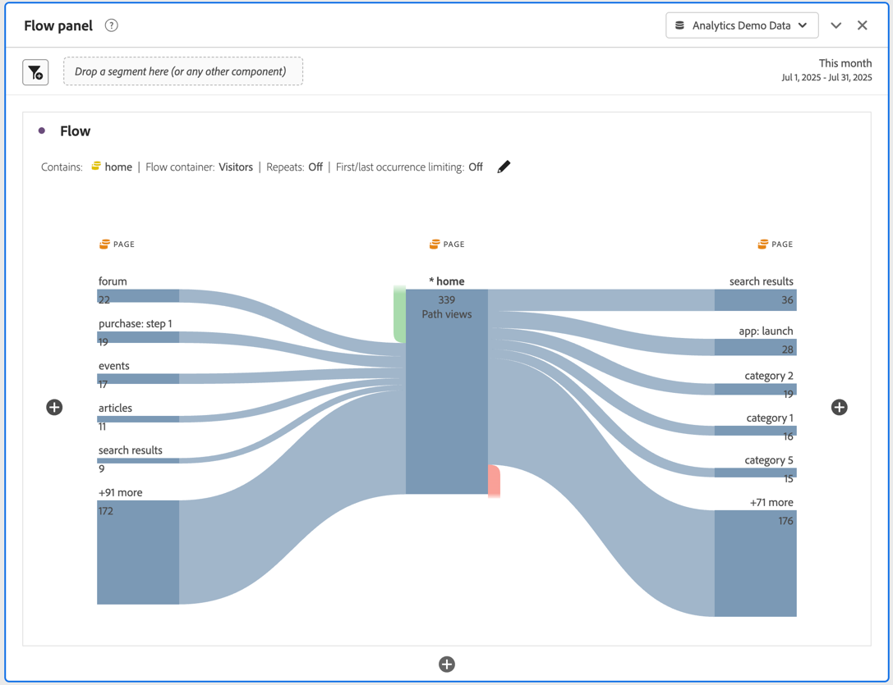

# Configurer une visualisation de flux {#configure-a-flow-visualization}

>[!CONTEXTUALHELP]
>id="workspace_flow_startswith"
>title="Commence par"
>abstract="Ce champ peut uniquement être défini dans la version initiale. Pour mettre à jour ce champ, sélectionnez **[!UICONTROL Réinitialiser]** pour créer une visualisation Flux."

>[!CONTEXTUALHELP]
>id="workspace_flow_contains"
>title="Contient"
>abstract="Ce champ peut uniquement être défini dans la version initiale. Pour mettre à jour ce champ, sélectionnez **[!UICONTROL Réinitialiser]** pour créer une visualisation Flux."

>[!CONTEXTUALHELP]
>id="workspace_flow_endswith"
>title="Se termine par"
>abstract="Ce champ peut uniquement être défini dans la version initiale. Pour mettre à jour ce champ, sélectionnez **[!UICONTROL Réinitialiser]** pour créer une visualisation Flux."

>[!CONTEXTUALHELP]
>id="workspace_flow_pathingdimension"
>title="Dimension du cheminement"
>abstract="Sélectionnez une dimension à utiliser comme chemin d’accès ou de sortie du composant sélectionné."

>[!CONTEXTUALHELP]
>id="workspace_flow_container"
>title="Conteneur de flux"
>abstract="Sélectionnez le conteneur à utiliser pour afficher (les nombres du) le cheminement."

>[!CONTEXTUALHELP]
>id="workspace_flow_include_repeats_disabled"
>title="Inclure les répétitions (désactivé)"
>abstract="Les répétitions ne peuvent pas être supprimées des visualisations Flux qui incluent des dimensions à valeurs multiples."

>[!CONTEXTUALHELP]
>id="workspace_flow_include_repeats_default"
>title="Inclure les répétitions"
>abstract="Les visualisations Flux sont basées sur des instances d’une dimension. Ce paramètre vous donne la possibilité d’inclure ou d’exclure des instances répétées, des rechargements de page, par exemple."

>[!CONTEXTUALHELP]
>id="workspace_flow_limit_occurrence"
>title="Limiter à la première/dernière occurrence"
>abstract="Les résultats sont limités aux chemins d’accès lorsque le premier/dernier point de contact est une entrée/sortie."

>[!CONTEXTUALHELP]
>id="workspace_flow_numberofcolumns"
>title="Nombre de colonnes"
>abstract="Ce champ peut uniquement être défini dans la version initiale. Pour mettre à jour ce champ, sélectionnez **[!UICONTROL Réinitialiser]** pour créer une visualisation Flux."

>[!CONTEXTUALHELP]
>id="workspace_flow_itemsexpandedpercolumn"
>title="Éléments développés par colonne"
>abstract="Ce champ peut uniquement être défini dans la version initiale. Pour mettre à jour ce champ, sélectionnez **[!UICONTROL Réinitialiser]** pour créer une visualisation Flux."

>[!CONTEXTUALHELP]
>id="workspace_flow_resettoupdate"
>title="Réinitialiser pour mettre à jour"
>abstract="Ce champ peut uniquement être défini dans la version initiale. Pour mettre à jour ce champ, sélectionnez **[!UICONTROL Réinitialiser]** pour créer une visualisation Flux."

Les visualisations de flux vous aident à comprendre le parcours provenant d’un événement de conversion spécifique sur votre site web ou votre application. Ou menant à un événement de conversion spécifique. La visualisation trace un chemin d’accès à travers vos dimensions (et éléments de dimension) ou mesures.

Vous pouvez configurer le début ou la fin du chemin qui vous intéresse. Vous pouvez également analyser tous les chemins qui traversent une dimension ou un élément de dimension.

## Utilisation

1. Ajoutez une visualisation  **[!UICONTROL Flux]**. Voir [Ajouter une visualisation à un panneau](../freeform-analysis-visualizations.md#add-visualizations-to-a-panel).

1. Ancrez votre visualisation de flux à l’aide de l’une des options suivantes :

   * [!UICONTROL **Commence par**] (mesures, dimensions ou éléments) ou
   * [!UICONTROL **Contient**] (dimensions ou éléments) ou
   * [!UICONTROL **Se termine par**] (mesures, dimensions ou éléments)

   Chacune de ces catégories est présentée à l’écran comme une *zone de dépôt*. Il existe 3 manières de renseigner la zone de dépôt :

   * Utiliser le menu déroulant pour sélectionner des mesures ou des dimensions.
   * Faites glisser et déposez les dimensions ou les mesures à partir du panneau de gauche.
   * Commencez à saisir le nom d’une dimension ou d’une mesure, puis sélectionnez-la lorsqu’elle apparaît dans la liste déroulante.

   >[!IMPORTANT]
   >
   >Les mesures calculées ne peuvent pas être utilisées dans les champs **[!UICONTROL Commence par]** ou **[!UICONTROL Se termine par]**.

1. Si vous choisissez une mesure, vous devez également fournir une [!UICONTROL **Dimension de cheminement**] à utiliser comme chemin d’accès menant au composant sélectionné ou en provenant, comme illustré ici. La valeur par défaut est [!UICONTROL **Page**].

   

1. (Facultatif) Sélectionnez **[!UICONTROL Afficher les paramètres avancés]** pour configurer l’une des options suivantes :

   | Paramètre | Description |
   | --- | --- |
   | **[!UICONTROL Développer les étiquettes]** | Habituellement, les étiquettes sur les éléments de flux sont tronquées pour gagner de l’espace à l’écran, mais vous pouvez afficher l’étiquette complète en cochant cette case.  Valeur par défaut = non coché. |
   | **[!UICONTROL Inclure des instances de répétition]** | Les visualisations Flux sont basées sur des instances d’une dimension. Ce paramètre vous donne la possibilité d’inclure ou d’exclure des instances de répétition, telles que des actualisations de page. Toutefois, les répétitions ne peuvent pas être supprimées des visualisations Flux qui incluent des dimensions à valeurs multiples, comme des listVars, listProps, s.product, eVars de marchandisage, etc. 
Par défaut, cette option est désactivée.
 |
   | **[!UICONTROL Limiter à la première/dernière occurrence]** | Limitez les chemins à ceux qui commencent ou se terminent par la première ou la dernière occurrence d’une dimension, d’un élément ou d’une mesure. Voir [Limiter à la première/dernière occurrence](#example-scenario-for-limit-to-firstlast-occurrence) pour obtenir une explication plus détaillée. |
   | **[!UICONTROL Nombre de colonnes]** | Nombre de colonnes souhaité dans le diagramme de flux. Vous pouvez spéficier 5 colonnes maximum. |
   | **[!UICONTROL Éléments développés par colonne]** | Nombre d’éléments à inclure dans chaque colonne. Vous pouvez spécifier un maximum de 10 éléments développés par colonne. |
   | **[!UICONTROL Conteneur de flux]** | Vous pouvez basculer entre **[!UICONTROL Session]** et **[!UICONTROL Personne]** afin d’analyser le cheminement. Ces paramètres permettent de comprendre l’engagement des personnes au niveau des personnes (sur les sessions) ou de contraindre l’analyse à une seule session. |

   >[!IMPORTANT]
   >
   >La combinaison du **[!UICONTROL Nombre de colonnes]** et des **[!UICONTROL Éléments développés par colonne]** détermine le nombre de requêtes sous-jacentes requises pour créer la visualisation de flux. Plus ces nombres sont élevés, plus le rendu d’une visualisation prend du temps.

1. Sélectionnez la **[!UICONTROL Version]**.

### Exemple

Supposons que vous souhaitiez tracer le chemin suivi par les utilisateurs et utilisatrices vers et depuis les pages les plus appréciées de votre site.

1. Créez une visualisation Flux comme décrit ci-dessus.
1. Faire glisser la dimension [!UICONTROL **Page**] dans le champ **[!UICONTROL Contient]**, puis sélectionner la [!UICONTROL **Version**].
1. La visualisation Flux s’appuie sur la page la plus vue, visible dans le nœud activé, au centre de la visualisation. Vous pouvez également voir les pages principales qui mènent à cette page (à gauche du nœud activé) ainsi que les pages principales qui mènent hors de cette page (à droite du nœud activé).
1. Analysez les données du flux, comme décrit dans la section [Configurer](#configure).

## Configurer

Un résumé de la configuration Flux s’affiche en haut des visualisations. Les tracés dans le diagramme sont proportionnels. Les tracés plus épais sont ceux pour lesquels l’activité est la plus intense.

Pour approfondir l’analyse des données, vous disposez de plusieurs options :

* Le diagramme de flux est interactif. Pointez sur le diagramme pour modifier les détails présentés.

* Si vous sélectionnez un nœud du diagramme, les détails correspondants s’affichent. Sélectionnez de nouveau le nœud pour le réduire.

  

* Vous pouvez filtrer une colonne pour n’afficher que certains résultats, tels que l’inclusion et l’exclusion, la spécification de critères, etc.

* Sélectionnez  sur le côté gauche ou droit pour développer une colonne.

* Pour personnaliser la sortie, utilisez les options du [menu contextuel](#context-menu).

* Pour modifier le flux ou le recréer avec différentes options, sélectionnez  en regard du résumé de la configuration.

## Filtre

Un filtre  apparaît au-dessus de chaque colonne lorsque vous pointez dessus. En sélectionnant le filtre, vous verrez s’afficher une boîte de dialogue de filtre identique à celle qui se trouve actuellement dans le tableau à structure libre. Voir [Filtrer et trier](freeform-table/../../freeform-table/filter-and-sort.md).

* Utilisez **[!UICONTROL Afficher les paramètres avancés]** pour configurer les paramètres avancés afin d’inclure ou d’exclure certains critères avec une liste d’opérateurs. Voir [Filtres et tri](../freeform-table/filter-and-sort.md) pour plus d’informations.
* Une fois que vous avez filtré une colonne, cette dernière reflète le filtrage. Un  bleu indique que la colonne est filtrée.  Le filtre réduit la colonne pour afficher uniquement l’élément autorisé dans le filtre. Ou il supprime tous les éléments, à l’exception de celui que vous souhaitez dans le filtre.
* Toutes les colonnes en aval et en amont doivent être conservées tant que les données alimentent les nœuds restants.
* Pour supprimer un filtre, sélectionnez  pour en ouvrir le menu. Supprimez les filtres appliqués, puis sélectionnez **[!UICONTROL Enregistrer]**. Le flux doit revenir à son état précédent, c’est-à-dire non filtré.

## Menu contextuel

Utilisez un menu contextuel sur n’importe quel nœud de la visualisation Flux avec les options suivantes :

| Option | Description |
|--- |--- |
| **[!UICONTROL Se concentrer sur ce nœud]** | Fait la mise au point sur le nœud sélectionné. Le nœud d’intérêt s’affiche au centre du diagramme Flux. |
| **[!UICONTROL Recommencer]** | Vous renvoie au créateur de diagrammes à structure libre, dans lequel vous pouvez créer un autre diagramme de flux. |
| **[!UICONTROL Créer un filtre pour ce chemin]** | Création d’un filtre. Cette sélection vous redirige vers le créateur de filtres, dans lequel vous pouvez configurer le nouveau filtre. |
| **[!UICONTROL Répartition]** | Permet de ventiler le nœud d’après les dimensions, les mesures ou le temps disponibles. |
| **[!UICONTROL Filtrer la colonne]** | Les mêmes options de filtre que celles disponibles dans le tableau à structure libre s’affichent. Pour plus d’informations sur les options disponibles, reportez-vous à la section « Appliquer un filtre simple ou avancé à un tableau » de la section [Filtrer et trier des tableaux](/help/analyze/analysis-workspace/visualizations/freeform-table/filter-and-sort.md). |
| **[!UICONTROL Exclure un élément]** ou **[!UICONTROL Restaurer les éléments exclus]** | Supprime un nœud donné de la colonne et le transforme automatiquement en filtre en haut de la colonne. Pour restaurer l’élément exclu, sélectionnez **[!UICONTROL Restaurer un élément exclu]** dans le menu contextuel. Vous pouvez également ouvrir le filtre en haut de la colonne et supprimer le rectangle contenant l’élément que vous venez d’exclure. |
| **[!UICONTROL Tendance]** | Permet de créer un diagramme de tendance pour le nœud. |
| **[!UICONTROL Afficher la colonne suivante]**/**[!UICONTROL Afficher la colonne précédente]** | Affiche la colonne suivante (à droite) ou précédente (à gauche) de la visualisation. |
| **[!UICONTROL Masquer la colonne]**&#x200B;n | Masque la colonne sélectionnée dans la visualisation. |
| **[!UICONTROL Développer toute la colonne]** | Permet de développer une colonne pour afficher tous les nœuds. Par défaut, seuls les cinq premiers nœuds sont présentés. |
| **[!UICONTROL Créer une audience à partir de la sélection]** | Crée une audience en fonction de la colonne sélectionnée. |
| **[!UICONTROL Réduire toute la colonne]** | Permet de masquer tous les nœuds d’une colonne. |

## Limiter à la première/dernière occurrence

Lorsque vous utilisez cette option, gardez à l’esprit que :

* **[!UICONTROL Limiter à la première/dernière occurrence]** compte uniquement la première ou la dernière occurrence de la série. Toutes les autres occurrences du critère **[!UICONTROL Commence par]** ou **[!UICONTROL Se termine par]** sont ignorées.
* Si vous utilisez cette option avec un flux **[!UICONTROL Commence par]**, seule la première occurrence correspondant au critère de début est incluse.
Dans l’exemple ci-dessous, **toutes** les occurrences des éléments *Ajouter au panier* et *Catégorie principale de produit* dans chaque étape du flux sont incluses.
  

  Dans l’exemple ci-dessous, seules les **premières** occurrences des éléments *Ajouter au panier* et *Catégorie principale de produit* dans chaque étape du flux sont incluses.
  
* Si vous utilisez cette option avec un flux **[!UICONTROL Se termine par]**, seule la dernière occurrence correspondant au critère de fin est incluse.
Dans l’exemple ci-dessous, **toutes** les occurrences des éléments *Catégorie principale de produit* et *Ajouter au panier* dans chaque étape du flux sont incluses.
  

  Dans l’exemple ci-dessous, seules les **dernières** occurrences des éléments *Catégorie principale de produit* et *Ajouter au panier* à chaque étape du flux sont incluses.
  
* La série utilisée diffère en fonction du conteneur. Si vous utilisez le conteneur **[!UICONTROL Personne]**, la série d’événements correspond à la session. Si vous utilisez le conteneur **[!UICONTROL Session]**, la série d’événements correspond à tous les événements d’une personne donnée dans la période fournie.
* L’option **[!UICONTROL Limiter à la première/dernière occurrence]** peut être configurée dans les paramètres avancés lors de l’utilisation d’une mesure ou d’un élément de dimension dans les champs **[!UICONTROL Commence par]** ou **[!UICONTROL Se termine par]**.

>[!MORELIKETHIS]
>
>[Ajouter une visualisation à un panneau](/help/analyze/analysis-workspace/visualizations/freeform-analysis-visualizations.md#add-visualizations-to-a-panel)
>&#x200B;>[Paramètres de visualisation](/help/analyze/analysis-workspace/visualizations/freeform-analysis-visualizations.md#settings)
>&#x200B;>[Menu contextuel de visualisation](/help/analyze/analysis-workspace/visualizations/freeform-analysis-visualizations.md#context-menu)
>

<!--
## Create a flow visualization {#configure}

1. Add a blank panel to your project and click the visualizations icon in the left rail. 

   Or
   
   Add a visualization in any of the ways described in the "Add visualizations to a panel" section in [Visualizations overview](/help/analyze/analysis-workspace/visualizations/freeform-analysis-visualizations.md).

1. Anchor your Flow visualization using one of the following options:

   * [!UICONTROL **Starts with**] (metrics, dimensions, or items), or
   * [!UICONTROL **Contains**] (dimensions, or items), or
   * [!UICONTROL **Ends with**] (metrics, dimensions, or items)

   Each of these categories is shown onscreen as a "drop zone." You can populate the drop zone in 3 ways:

   * Use the drop-down menu to select metrics or dimensions.
   * Drag dimensions or metrics from the left rail.
   * Begin typing the name of a dimension or metric, then select it when it appears in the drop-down list.

   >[!IMPORTANT]
   >
   >Calculated metrics cannot be used in the  **[!UICONTROL Starts with]** or **[!UICONTROL Ends with]** fields.

1. If you choose a metric, you also need to provide a [!UICONTROL **Pathing Dimension**] to use as your path leading to or coming from your selected component, as shown here. The default is [!UICONTROL **Page**].

   

1. (Optional) Select **[!UICONTROL Show advanced settings]** to configure any of the following options:

   

   | Setting | Description |
   | --- | --- |
   | **[!UICONTROL Wrap labels]** | Normally, the labels on the Flow elements are truncated to save screen real estate, but you can make the entire label visible by checking this box.  Default = unchecked. |
   | **[!UICONTROL Include repeat instances]** | Flow visualizations are based on instances of a dimension. This setting gives you the option to include or exclude repeated instances, e.g. Page reloads. However, repeats cannot be removed from Flow visualizations that include multi-valued dimensions, such as listVars, listProps, s.product, merchandising eVars, etc. 
This option is disabled by default.
 |
   | **[!UICONTROL Limit to first/last occurrence]** | Limit paths to those that start/end with the first/last occurrence of a dimension/item/metric. See the section below, [Example scenario for 'limit to first/last occurrence'](#example-scenario-for-limit-to-firstlast-occurrence), for a more detailed explanation. |
   | **[!UICONTROL Number of columns]** | The number of columns you want in your Flow diagram. You can specify a maximum of 5 columns. |
   | **[!UICONTROL Items expanded per column]** | The number of items you want in each column. You can specify a maximum of 10 items expanded per column.  |
   | **[!UICONTROL Flow container]** | <ul><li>Visit</li><li>Visitor</li></ul> Lets you switch between Visit and Visitor to analyze visitor pathing. These settings help you understand visitor engagement at the visitor level (across visits), or constrain the analysis to a single visit.|

   >[!IMPORTANT]
   >
   >The combination of **[!UICONTROL Number of columns]** and **[!UICONTROL Items expanded per column]** determine the number of underlying requests required to create the flow visualization. The higher those numbers, the longer it takes to render a visualization.

1. Select **[!UICONTROL Build]**.

>[!INFO]
>
>**Example:** Suppose that you want to trace the path that users took both to and from the most popular pages on your site.
>
>To do this, you would
> 
>1. Begin creating a flow visualization as described above.
>1. Drag the [!UICONTROL **Page**] dimension into the **[!UICONTROL Contains]** field, then select [!UICONTROL **Build**].
>1. The Flow visualization builds with the most-viewed page visible in the focus node in the center of the visualization. You also see the top pages leading into that page (to the left of the focus node) as well as the top pages leading out of that page (to the right of the focus node).
>1. Analyze data in the flow, as described in [View and change the Flow output](#view-and-change-the-flow-output).

## View and change the Flow output {#output}

A summary of the Flow configuration appears at the top of the diagram. The thickness of a path in the diagram is proportional to its activity, with paths with more activity appearing thicker than those with less activity.

To drill down further into the data, you have several options:

* The flow diagram is interactive. Mouse over the diagram to change the details that are shown.

* When you select on a node in the diagram, the details for that node appear. Select on the node again to collapse it.

   

* You can filter a column to display only certain results, such as including and excluding, specifying criteria, and so forth.

* Select the plus sign (+) on the left to expand a column.

* Use the right-click options explained below to further customize the output.

* Select the pencil icon next to the configuration summary to further edit the flow or rebuild it with different options.

* You can also export and further analyze your Flow diagram as part of a project's .CSV file by going to **[!UICONTROL Project]** > **[!UICONTROL Download CSV]**.

## Filtering

Above each column, a filter appears when you hover over it. By selecting the filter, you get the same filter dialog that exists in the Freeform table today. This filter works the same as it does in the Freeform table.

* Use advanced settings to include or exclude certain criteria with our list of operators.
* Once you have filtered an item from the list, that specific column will reflect the filtering. (The filter either reduces it to only show the item allowed in the filter, or it removes all items except for the one item you want in the filter.
* All downstream and upstream columns should persist, as long as there is data flowing into the remaining nodes.
* Once applied, the filter icon appears in blue above the column it is filtering.
* To remove a filter, select the filter icon to open the filter menu. Remove any filters applied and then select **[!UICONTROL Save]**. The flow should return to its previous, unfiltered state.

## Right-click options {#right-click}

| Option | Description |
|--- |--- |
| [!UICONTROL Start over] | Returns you to the Freeform diagram builder, where you can build a new Flow diagram. |
| [!UICONTROL Create segment for this path] | Create a segment. This takes you into the Segment Builder, where you can configure the new segment. |
| [!UICONTROL Breakdown] | Break the node down by available Dimensions, Metrics, or Time. |
| [!UICONTROL Trend] | Create a trended diagram for the node. |
| Show next column / Show previous column | Reveals the next (right) or previous (left) column of the visualization. |
| Hide column | Hides the selected column from the visualization. | 
| [!UICONTROL Expand entire column] | Expand a column to show all nodes. By default, only the top five nodes display. |

## Example scenario for 'limit to first/last occurrence'

When using this option, keep in mind that:

* **[!UICONTROL Limit to first/last occurrence]** counts only the first/last occurrence in the series. All other occurrences of the **[!UICONTROL Starts with]** or **[!UICONTROL Ends with]** criteria are discarded.
* If used with a **[!UICONTROL Starts with]** flow, only the first occurrence that matches the start criteria is included.
* If used with an **[!UICONTROL Ends with]** flow, only the last occurrence that matches the end criteria will be included.
* The series used differs based on the container. If using the **[!UICONTROL Visit]** container, the series of hits will be the session. If using the **[!UICONTROL Visitor]** container, the series of hits will be all the hits for a given user in the provided date range.
* The **[!UICONTROL Limit to first/last occurrence]** option can be configured in the advanced settings when using a Metric or Dimension Item in the "Starts with" or "Ends with" fields.

Example series of hits:

Home > Products > Add to cart > Products > Add to Cart > Billing > Order Confirmation

### Consider a flow analysis using the following settings:

* Start with[!UICONTROL  Add to cart] (Dimension Item)
* [!UICONTROL Page] pathing dimension
* [!UICONTROL Visit] container

If **[!UICONTROL Limit to first/last occurrence]** is *disabled*, then this single series of hits counts 2 occurrences of "Add to Cart".
Expected Flow Output:
"Add to Cart" (2) —> "Products" (1)
                  -> "Billing" (1)

However, if **[!UICONTROL Limit to first/last occurrence]** is *enabled*, only the first occurrence of "Add to cart" is included in the analysis.
Expected Flow Output:
"Add to Cart" (1) —> "Products" (1)

### Consider the same series of hits but using the following settings:

* Ends with [!UICONTROL Add to cart] (Dimension Item)
* [!UICONTROL Page] pathing dimension
* [!UICONTROL Visit] container

If **[!UICONTROL Limit to first/last occurrence]** is *disabled*, then this single series of hits would count 2 occurrences of "Add to Cart".
Expected Flow Output:
"Products" (2) <— "Add to cart" (2)

However, if **[!UICONTROL Limit to first/last occurrence]** is *enabled*, only the last occurrence of [!UICONTROL Add to cart] would be included in the analysis.
Expected Flow Output:
"Products" (1) <— "Add to cart" (1)

-->