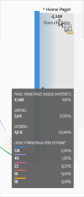
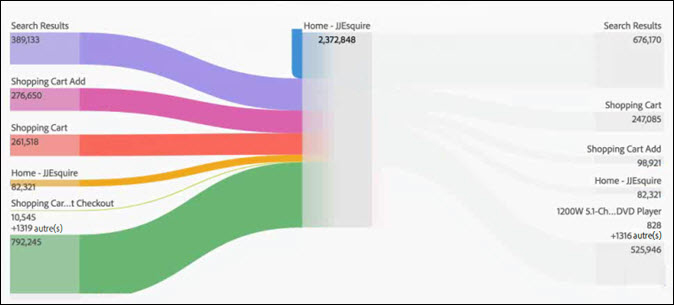

# Configuration d’une visualisation de flux

Grâce au flux, vous pouvez effectuer un suivi sur le cheminement des utilisateurs dans vos pages et dimensions, telles les eVars :

* Entrée (dimensions seulement)
* Dimensions ou éléments
* Sortie (dimensions seulement)

Chacune de ces catégories est présentée à l’écran comme une « zone de dépôt ». Faites glisser les éléments de la liste et déplacez-les dans la zone de dépôt de votre choix. Les pages et autres éléments qui ne sont pas des dimensions peuvent uniquement être placés dans la zone de dépôt centrale. Si vous déplacez une dimension dans la zone centrale, un rapport est automatiquement généré avec les principaux éléments de cette dimension.

Quand vous faites glisser un élément sur une zone de dépôt, le diagramme Flux s’ouvre. Le contenu de ce diagramme dépend de la zone où vous déposez une dimension ou un élément. Les catégories Sortie et Entrée présentent tous les éléments de la dimension (pages, par exemple) que vous déposez dans la zone Entrée ou Sortie. Si, par exemple, vous déposez une dimension dans la zone de dépôt centrale, le diagramme de flux correspondant s’ouvre.

Pointez sur le Nœud d’intérêt au centre du diagramme pour afficher les informations correspondantes.

Le diagramme de flux est interactif. Pointez sur le diagramme pour modifier les détails présentés.

Les tracés dans le diagramme sont proportionnels. Les tracés plus épais sont ceux pour lesquels l’activité est la plus intense.

Si vous cliquez sur un nœud du diagramme, les détails correspondants s’affichent. For example, if you click **[!UICONTROL Search Results]** at the top right in the top diagram above, the diagram expands to show more details about the search results node. Cliquez de nouveau sur le nœud pour le réduire.

Par défaut, le diagramme présente les cinq premiers flux. If you click on the **[!UICONTROL More]** node at the bottom of the diagram, the diagram expands down to show five more flows. Continue clicking **[!UICONTROL More]** to expand until there are no additional flows to show.

Il n’existe aucune limite quant à la façon d’explorer le diagramme Flux.

You can also export and further analyze your Flow diagram as part of a project&#39;s .CSV file by going to **[!UICONTROL Project]** > **[!UICONTROL Download CSV]**.
