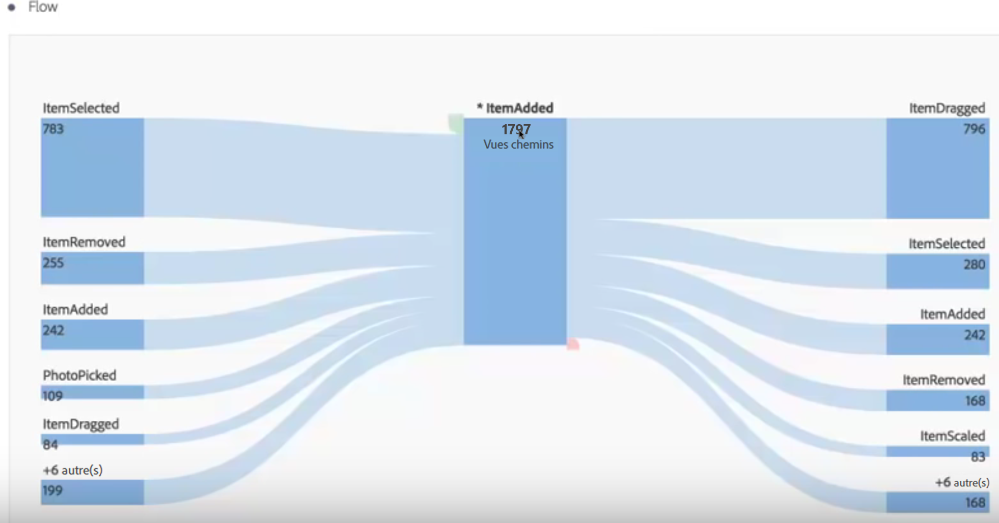
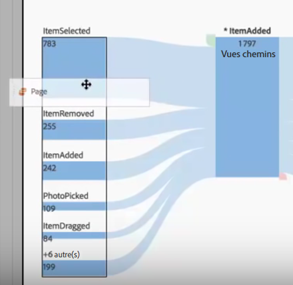
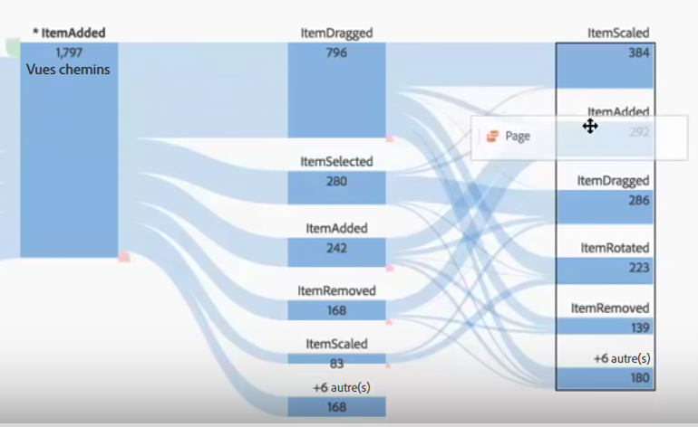
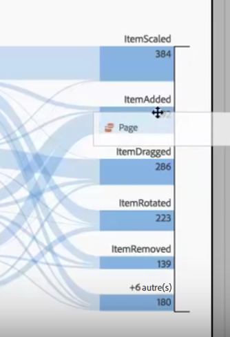
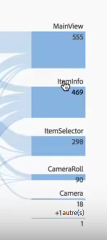
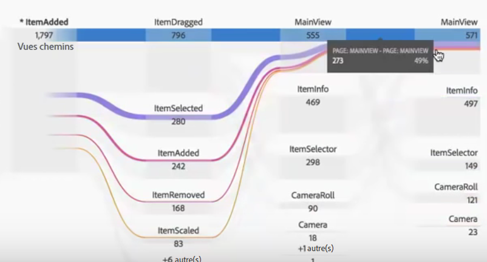
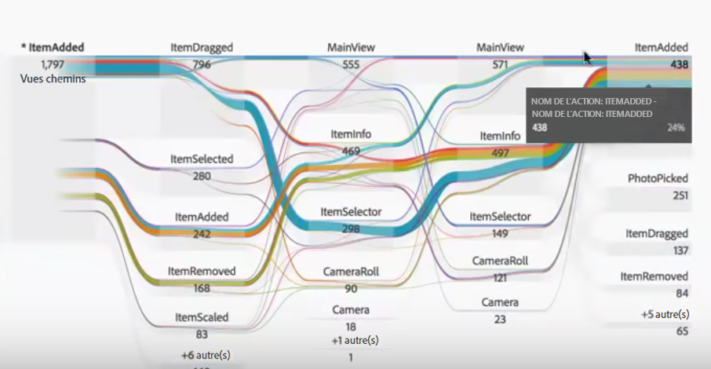
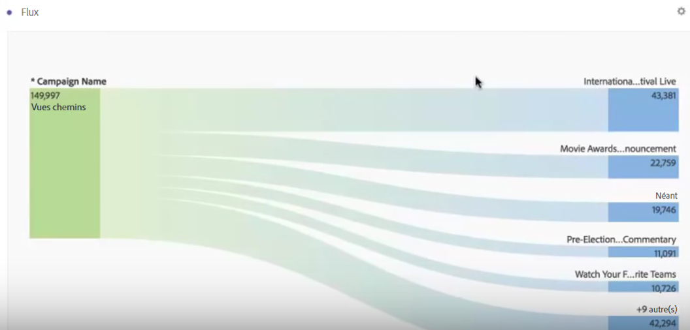
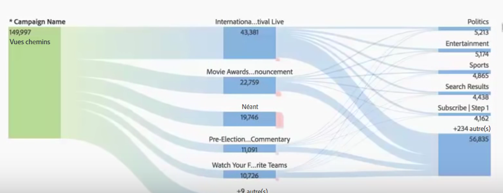

# Flux interdimensionnels

Dans un flux interdimensionnel, vous pouvez examiner le cheminement des utilisateurs dans plusieurs dimensions.

Un libellé de dimension dans la partie supérieure de chaque colonne Flux rend l’utilisation de plusieurs dimensions dans une visualisation de flux plus intuitive :

Nous allons étudier deux exemples d’utilisation : sur le web et dans une application.

## Cas d’utilisation 1 : app {#section_3D31D37B9C9F4134AE46C96291E41294}

La dimension [!UICONTROL Nom de l’action] a été ajoutée au flux, le premier élément renvoyé étant [!UICONTROL ItemAdded] :

Afin d’explorer l’interaction entre les écrans et pages et les actions dans cette application, faites glisser la dimension de page à plusieurs emplacements, selon ce que vous souhaitez savoir :

* Faites-la glisser à l’une des extrémités de la zone de dépôt (dans la zone rectangulaire bordée de noir qui apparaît) pour **remplacer** les principaux résultats correspondants :

    

* Faites-la glisser sur l’espace blanc à l’extrémité (remarquez la parenthèse noire) pour **l’ajouter** à la visualisation :

   

Voici le résultat si vous décidez de remplacer l’élément ItemScaled dans la colonne de droite avec la dimension Page. Le premier résultat correspond maintenant au premier résultat de la dimension Page :

Vous pouvez maintenant voir de quelle façon vos clients se déplacent dans les actions et les pages. Pour explorer le flux plus en détail, cliquez sur les différents nœuds :

Voici ce qui se passe si vous faites glisser une autre dimension Nom de l’action sur la fin de la visualisation :

Vous avez ainsi accès à des statistiques plus détaillées et aux changements possibles à apporter à l’application que vous analysez.

## Cas d’utilisation 2 : web {#section_8D55983FA0C84926995270052AE01CD8}

Cet exemple d’utilisation illustre la façon de déterminer quelles campagnes génèrent le plus d’entrées sur un site web.

Faites glisser la dimension Nom de la campagne dans un nouveau flux :

Je souhaite maintenant savoir quelles pages de ces campagnes attirent le plus de trafic ; je fais donc glisser la dimension Page sur la droite des résultats du flux pour l’ajouter à la visualisation :

Vous pouvez ensuite ventiler ce résultat selon d’autres dimensions ou mesures (recettes, visites, etc.).
