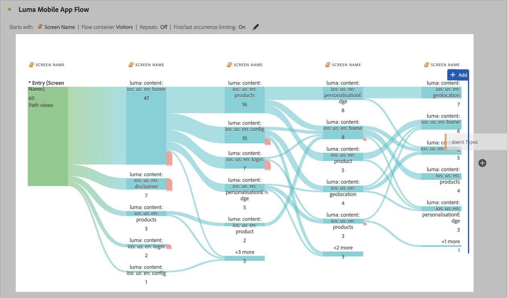

# Flux interdimensionnels

Dans un flux interdimensionnel, vous pouvez examiner le cheminement des utilisateurs dans plusieurs dimensions.

>[!BEGINSHADEBOX]

Voir  [Flux interdimensionnels](https://video.tv.adobe.com/v/24041?quality=12&learn=on){target="_blank"} pour une vidéo de démonstration.

>[!ENDSHADEBOX]

Cet article montre comment utiliser ce flux pour deux cas d’utilisation : les interactions et les événements d’applications mobiles, et la manière dont les campagnes génèrent des visites web.

## Interactions et événements des applications mobiles

La dimension [!UICONTROL Nom de l’écran] est utilisée dans cet exemple de flux pour voir comment les utilisateurs utilisent les différents écrans (scènes) dans l’application. L’écran supérieur renvoyé est **[!UICONTROL luma : content : ios : en : home]**, qui est la page d’accueil de l’application :

Pour explorer l’interaction entre les écrans et les types d’événement (tels que l’ajout au panier, les achats, etc.) dans cette application, effectuez un glisser-déposer de la dimension **[!UICONTROL Types d’événement]** :

* En plus de toute étape disponible dans le flux, pour remplacer cette dimension :

  

* En dehors de la visualisation de flux actuelle, pour ajouter la dimension :

  

La visualisation de flux ci-dessous montre le résultat de l’ajout de la dimension **[!UICONTROL Types d’événement]**. La visualisation fournit des informations sur la manière dont les utilisateurs et utilisatrices d’applications mobiles se déplacent sur différents écrans de l’application avant d’ajouter des produits à un panier, de fermer l’application, de se voir présenter une offre, etc.

## Comment les campagnes génèrent des visites web

Vous souhaitez analyser les campagnes qui génèrent des visites sur le site web. Vous créez une visualisation de flux avec la dimension **[!UICONTROL Nom de la campagne]**

Vous remplacez la dernière dimension **[!UICONTROL Nom de la campagne]** par la dimension **[!UICONTROL Nom de page formaté]** et ajoutez une autre dimension **[!UICONTROL Nom de page formaté]** à la fin de la visualisation de flux.

Vous pouvez pointer sur n’importe quel flux pour afficher plus de détails. Par exemple, les campagnes qui ont généré un passage en caisse du panier.

