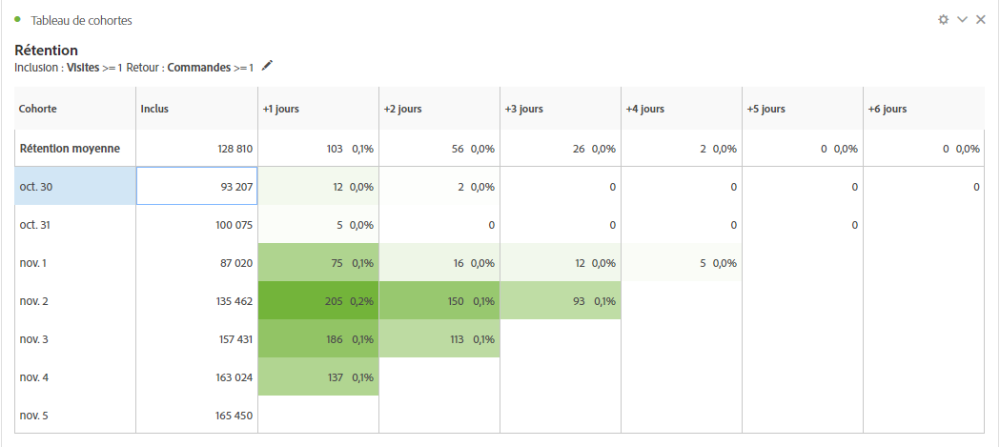
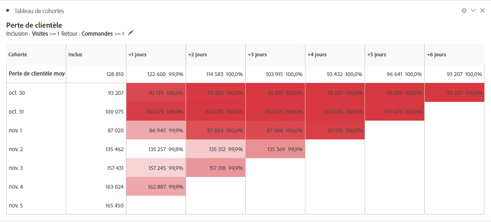
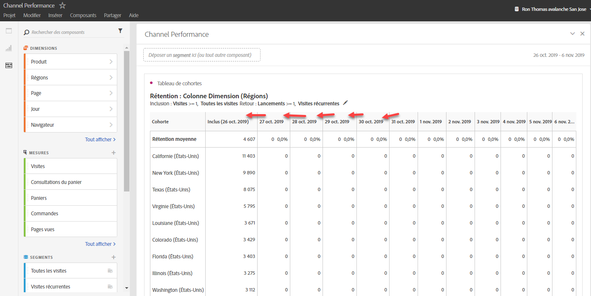
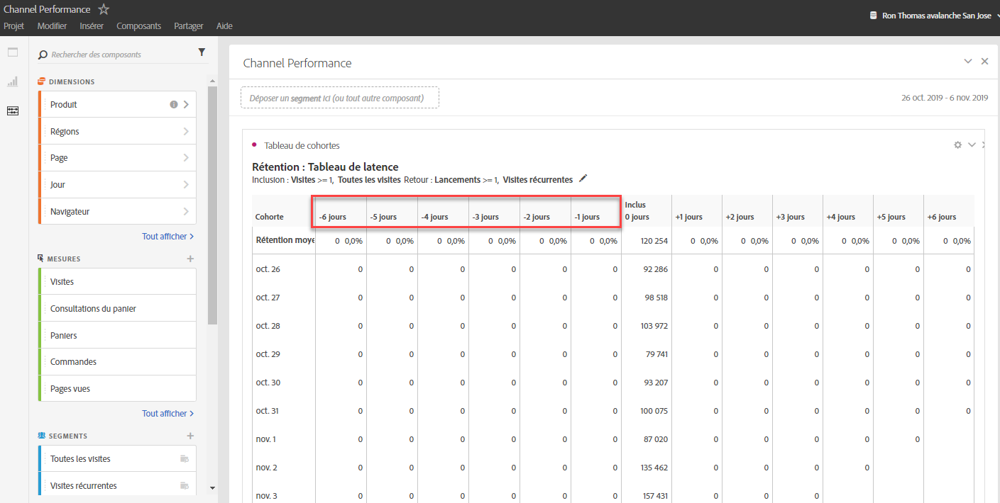
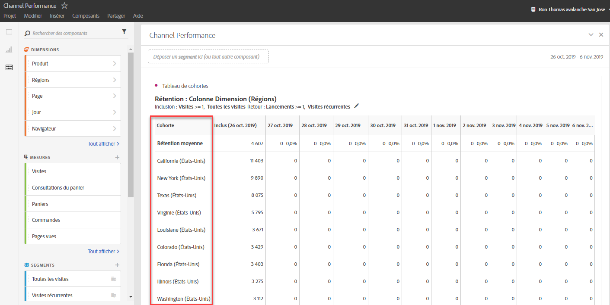

# Qu’est-ce que l’analyse des cohortes ?

Une *`cohort`* est un groupe de personnes partageant des caractéristiques communes au cours d’une période spécifique. L’analyse des cohortes s’avère utile, par exemple, pour savoir de quelle façon une cohorte réagit par rapport à une marque. Vous pouvez facilement déceler des changements de tendances, pour y réagir en conséquence. (Vous trouverez des explications sur l’analyse des cohortes sur le Web, tel le cours [Cohort Analysis 101](https://en.wikipedia.org/wiki/Cohort_analysis) (en anglais).)

Après avoir créé un rapport de cohorte, vous pouvez en traiter les composants (dimensions, mesures et segments spécifiques), puis partager le rapport avec les personnes de votre choix. Voir  [Traitement et partage](/help/analyze/analysis-workspace/curate-share/curate.md).

Exemples d’utilisation de l’analyse des cohortes :

* Lancez des campagnes conçues pour déclencher une action spécifique.
* Ajustez le budget marketing exactement au bon moment au cours du cycle de vie des clients.
* Reconnaissez quand terminer un essai ou une offre pour en optimiser la valeur.
* Trouvez des idées de test A/B dans des domaines tels que le prix, le cheminement de mise à niveau, etc.
* Affichez un rapport d’analyse des cohortes au sein d’un rapport d’analyse guidée.
* Reconnaissez quand terminer un essai ou une offre pour en optimiser la valeur.
* Trouvez des idées de test A/B dans des domaines tels que le prix, le cheminement de mise à niveau, etc.

L’analyse des cohortes est disponible pour tous les clients Analytics avec des droits d’accès à Analysis Workspace.

[Analyse des cohortes sur YouTube](https://www.youtube.com/watch?v=kqOIYrvV-co&amp;index=45&amp;list=PL2tCx83mn7GuNnQdYGOtlyCu0V5mEZ8sS) (4:36)

>[!IMPORTANT]
>
>L’analyse des cohortes ne prend pas en charge les mesures calculées.

## Fonctions de l’analyse des cohortes

En janvier 2019, Adobe a publié une nouvelle version considérablement améliorée de l’analyse des cohortes. Celle-ci offre un contrôle plus affiné sur les cohortes que vous créez. Voici les améliorations présentées :

### Tableau de rétention

Voici un rapport de cohorte sur les visiteurs récurrents : chaque cellule indique le nombre brut et le pourcentage de visiteurs dans la cohorte qui ont effectué l’action durant cette période. Vous pouvez inclure jusqu’à 3 mesures et 10 segments.

### Tableau de perte de clientèle

Une cohorte de perte de clientèle est l’inverse d’un tableau de rétention. Elle indique le visiteur qui a abandonné ou n’a jamais rempli les critères de retour de votre cohorte au fil du temps. Vous pouvez inclure jusqu’à 3 mesures et 10 segments.

### Calcul variable

Permet de calculer la rétention ou la perte de clientèle en fonction de la colonne précédente, et non de la colonne Inclus.

### Tableau de latence

Mesure le temps qui s’est écoulé avant et après l’événement d’inclusion. Il s’agit d’un excellent outil pré-/post-analyse. La colonne « Inclus » se trouve au centre du tableau, tandis que les périodes avant et après l’événement d’inclusion sont affichées des deux côtés.

### Cohorte de dimension personnalisée

Créez des cohortes sur la base d’une dimension sélectionnée, et non des cohortes en fonction du temps, qui sont les cohortes par défaut. Utilisez des dimensions telles que le canal marketing, la campagne, le produit, la page, la région ou toute autre dimension dans Adobe Analytics de façon à afficher l’évolution de la rétention en fonction des différentes valeurs de ces dimensions.

Pour savoir comment configurer et exécuter un rapport de cohorte, accédez à  [Configuration d’un rapport d’analyse des cohortes](/help/analyze/analysis-workspace/visualizations/cohort-table/t-cohort.md).

