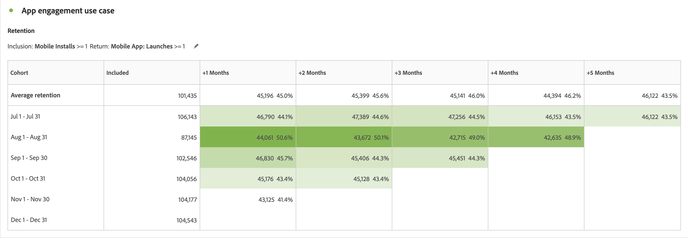
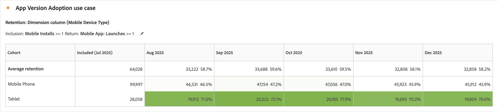

# Cas d’utilisation de l’analyse des cohortes

Cet article présente plusieurs cas d’utilisation standard pour lesquels les tableaux de cohortes sont utiles pour fournir des informations utiles afin de prendre des mesures suivantes.

## Engagement de l’application

Supposons que vous souhaitiez analyser la manière dont les utilisateurs et utilisatrices qui installent votre application interagissent avec celle-ci au fil du temps. Les utilisateurs installent-ils l’application et ne l’utilisent-ils jamais par la suite ? Ou utilisent-ils l&#39;application pendant un certain temps, puis cessent-ils de l&#39;utiliser? Ou les utilisateurs restent-ils engagés au fil du temps ?

Vous pouvez créer une analyse des cohortes sur six mois. Les visiteurs ne sont pas comptabilisés comme *`engaged`* au cours des mois suivants, sauf si ces utilisateurs disposent d’une session ou lancent au moins l’application. [!UICONTROL L’analyse des cohortes] présenterait alors les différents schémas d’utilisation où *`App Install`* survient toujours durant le mois 0. Vous remarquerez peut-être une baisse de l’utilisation au mois 2, quelle que soit la date à laquelle les utilisateurs ont installé l’application. Cette analyse permet d’envoyer un e-mail ou un message push à tous les utilisateurs au cours du deuxième mois suivant l’installation de l’application pour leur rappeler d’utiliser l’application.

+++ Exemple de visualisation de tableau de cohorte

+++

## Abonnement

Vous travaillez chez Adobe.com et proposez un abonnement gratuit à Creative Cloud, avec pour objectif que les utilisateurs passent de la version gratuite à la version d’évaluation de 30 jours voire à la version payante.

Utilisez [!UICONTROL Analyse des cohortes] pour comprendre, par exemple, qu’entre 8 et 10 % des utilisateurs de Creative Cloud bénéficient d’une mise à niveau gratuite au cours du premier mois suivant l’installation, quelle que soit la date à laquelle ils l’ont installée. Ensuite, mise à niveau de 12 à 15 % au cours du deuxième mois d’utilisation. Ensuite, les taux de mise à niveau chutent considérablement : entre 4 et 5 % au mois 3, entre 3 et 4 % au mois 4, et entre 1 et 2 % au mois 5.

Comme vous ne souhaitez pas perdre de clients potentiels au troisième mois, vous avez mis en place une campagne par e-mail conçue pour être envoyée au milieu du troisième mois à un échantillon d’utilisateurs. Dans cette campagne, vous offrez un coupon de 50 $ aux utilisateurs qui n’ont pas encore effectué la mise à niveau.

Revenez avec votre analyse des cohortes quelques mois plus tard. Pour les cohortes formées après le lancement de la campagne, la conversion en abonnements Creative Cloud payants au troisième mois a augmenté de 4-5 % à 13-14 %. La conversion se traduit par des centaines de milliers de dollars par cohorte, pour chaque cohorte mensuelle qui atteint le troisième mois à partir de ce moment.

+++ Exemple de visualisation de tableau de cohorte

+++

## Segments de cohortes complexes

Vous effectuez une analyse pour une grande chaîne hôtelière qui cible plusieurs groupes de clients pour les promotions et suivez les groupes de clients par rapport aux performances. Pour identifier les meilleurs groupes de cohortes d’utilisateurs à cibler, vous devez créer des groupes de cohortes très spécifiques. Utilisez les critères augmentés [!UICONTROL Inclusion] et [!UICONTROL Retour] dans les tableaux [!UICONTROL Cohorte] pour définir exactement les groupements de cohortes adaptés avec plusieurs mesures et segments. Cette analyse vous aide à identifier les groupes de clients qui ne sont pas assez performants afin de les cibler avec des promotions et des offres pour augmenter les réservations.

+++ Exemple de visualisation de tableau de cohorte

+++

## Adoption de la version de l’application

Vous êtes l’analyste d’une grande compagnie d’assurance qui stimule l’engagement des clients grâce à l’utilisation de son application mobile. À mesure que de nouvelles fonctionnalités sont ajoutées à l’application, les clients doivent effectuer une mise à niveau vers la dernière version de l’application. Vous pouvez analyser et comparer les versions d’application côte à côte à l’aide de la cohorte [!UICONTROL Custom Dimension] pour identifier les clients sur la version d’application à cibler. De plus, vous pouvez effectuer le suivi de la rétention et de l’attrition pour voir si des versions d’application spécifiques dissuadent les clients d’utiliser l’application au fil du temps. Grâce aux efforts de messagerie mobile, vous pouvez réengager ces utilisateurs afin qu&#39;ils puissent effectuer la mise à niveau vers la dernière version pour tirer parti des dernières fonctionnalités.

+++ Exemple de visualisation de tableau de cohorte

+++

## Affinité de la campagne

Vous êtes l’analyste d’une société multimédia multinationale qui utilise des campagnes ciblées pour orienter les utilisateurs vers leurs différentes plateformes afin de stimuler l’engagement. Les dépenses publicitaires par plateforme sont basées sur l’engagement et la fidélisation de la clientèle. Le succès des campagnes est essentiel au succès de l’entreprise. Utilisez la nouvelle fonctionnalité de cohorte [!UICONTROL Custom Dimension] des tableaux [!UICONTROL de cohortes] pour comparer côte à côte différentes campagnes afin d’identifier les campagnes les plus efficaces pour acquérir et fidéliser les utilisateurs et utilisatrices afin d’augmenter l’engagement. Vous pouvez ensuite identifier les aspects qui font le succès d’une campagne et appliquer ces connaissances à d’autres campagnes pour augmenter l’engagement sur différentes plateformes.

+++ Exemple de visualisation de tableau de cohorte

+++

## Lancement du produit

Vous êtes l’analyste d’un grand retailer de vêtements qui comporte de nombreux segments de clients spécifiques qui génèrent de grandes parties du chiffre d’affaires pour leur entreprise. Chaque segment présente des produits spécifiques conçus et créés avec le segment à l’esprit. Avec chaque lancement de produit, vous voulez savoir comment le nouveau produit a stimulé les ventes à diverses cohortes au fil du temps. Grâce au nouveau paramètre [!UICONTROL Tableau de latence] dans [!UICONTROL Analyse des cohortes], vous pouvez analyser le comportement et le chiffre d’affaires avant et après le lancement d’un segment client donné. Grâce à ces informations, vous pouvez identifier les produits qui génèrent de nouveaux revenus et ceux qui ne suscitent pas l’intérêt des clients.

+++ Exemple de visualisation de tableau de cohorte

+++

## Attractivité individuelle - utilisateurs les plus fidèles

Vous êtes l&#39;analyste d&#39;une grande compagnie aérienne qui tire la majeure partie de son succès et de ses revenus de clients fidèles et réguliers. Dans de nombreux cas, les voyageurs fidèles représentent la majeure partie des recettes et il est essentiel de fidéliser ces clients pour réussir à long terme. L’identification des clients les plus fidèles et les plus cohérents peut souvent s’avérer difficile. Cependant, le nouveau paramètre [!UICONTROL Calcul variable] dans [!UICONTROL Analyse des cohortes] vous permet d’analyser les segments de clients fidèles et de déterminer les voyageurs récurrents mois après mois. Vous pouvez ensuite cibler ces voyageurs avec des récompenses et des avantages pour les remercier de leur fidélité. En outre, en passant le type de cohorte de rétention à perte de clientèle, vous pouvez également identifier les clients qui n’étaient pas des acheteurs récurrents mois après mois. Vous pouvez ensuite cibler ces segments avec des promotions afin de réengager ces clients et clientes pour qu’ils restent fidèles à l’avenir.

+++ Exemples de visualisations de tableau de cohorte

+++
