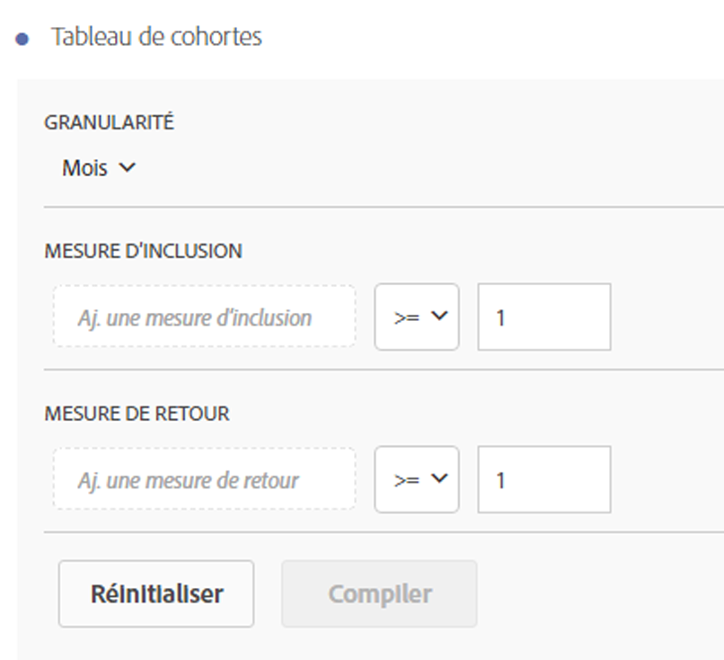
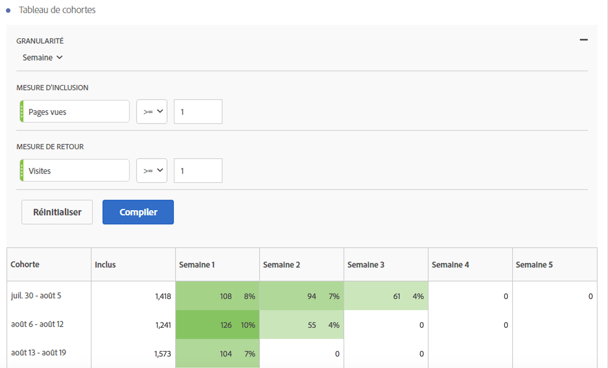

# Configuration d’un rapport d’[!UICONTROL analyse des cohortes]

Créez une cohorte et générez un rapport d’[!UICONTROL analyse des cohortes] dans Analysis Workspace.

1. Dans Analysis Workspace, cliquez sur l’icône **[!UICONTROL Visualisations]** du rail de gauche et faites glisser un **[!UICONTROL tableau de cohortes]** sur la zone de travail.

   

1. Définissez les **[!UICONTROL critères d’inclusion]**, **[!UICONTROL les critères de retour]**, **[!UICONTROL le type de cohorte]** et **[!UICONTROL les paramètres]** tel qu’illustré dans le tableau ci-dessous.

   | Élément | Description |
   |--- |--- |
   | **[!UICONTROL Critères d’inclusion]** | Vous pouvez appliquer jusqu’à dix segments d’inclusion et trois mesures d’inclusion. La mesure spécifie ce qui place un utilisateur dans une cohorte. Par exemple, si la mesure d’inclusion est Commandes, seuls les utilisateurs qui ont passé une commande durant la période de l’analyse des cohortes seront inclus dans la cohorte initiale. L’opérateur par défaut entre les mesures est AND, mais vous pouvez le changer en OR. En outre, vous pouvez ajouter un filtrage numérique à ces mesures. Par exemple : « Visites >= 1 ».  |
   | **[!UICONTROL Critères de retour]** | Vous pouvez appliquer jusqu’à dix segments de retour et trois mesures de retour. La mesure indique si l’utilisateur a été fidélisé (rétention) ou non (perte de clientèle). Si, par exemple, la mesure de retour est Affichages de vidéos, seuls les utilisateurs qui ont affiché les vidéos durant des périodes consécutives (après la période pendant laquelle ils ont été ajoutés à une cohorte) seront représentés comme fidélisés. La mesure Visites quantifie également la fidélisation des utilisateurs. |
   | **[!UICONTROL Granularité]** | Granularité temporelle : jour, semaine, mois, trimestre ou année. |
   | **[!UICONTROL Type]** | **[!UICONTROL Rétention]** (par défaut) : une cohorte de rétention mesure si vos cohortes de visiteurs retournent sur votre propriété au cours du temps. Il s’agit de la cohorte standard que nous avons toujours proposée et qui indique le comportement des utilisateurs réguliers et récurrents. Une cohorte de [!UICONTROL rétention] est indiquée par la couleur verte dans le tableau. **[!UICONTROL Perte de clientèle ]** : une cohorte de perte de clientèle (également appelée « attrition » ou « abandon ») mesure la façon dont vos cohortes de visiteurs abandonnent votre propriété au cours du temps. Perte de clientèle = 1 - rétention. La [!UICONTROL perte de clientèle] est une bonne mesure de l’attractivité et de l’opportunité, car elle vous indique la fréquence à laquelle les clients ne reviennent pas. Vous pouvez utiliser la perte de clientèle pour analyser et identifier les zones d’intérêt, c’est-à-dire les segments de cohortes qui pourraient avoir besoin d’attention. Une cohorte de [!UICONTROL perte de clientèle] est indiquée par la couleur rouge dans le tableau (semblable à l’abandon dans notre visualisation **[!UICONTROL  Flux ]**).  |
   | **[!UICONTROL Paramètres]** | **[!UICONTROL Calcul variable]** : calculez la rétention ou la perte de clientèle en fonction de la colonne précédente, plutôt que de la colonne Inclus (par défaut). Le [!UICONTROL calcul variable] change la méthode de calcul pour vos périodes de « retour ». Le calcul normal trouve de manière indépendante les utilisateurs qui répondent aux critères de « retour » et faisaient partie de la période d’inclusion, qu’ils aient ou non fait partie de la cohorte pendant la période précédente. Au lieu de cela, le [!UICONTROL calcul variable] trouve les utilisateurs qui répondent aux critères de « retour » et faisaient partie de la période précédente. Par conséquent, le [!UICONTROL calcul variable] filtre et fait passer par des entonnoirs les utilisateurs qui répondent continuellement aux critères de « retour », période après période. Les critères de [!UICONTROL retour] sont appliqués à chacune des périodes menant à la période sélectionnée.   **[!UICONTROL Tableau de latence ]** : un tableau de [!UICONTROL latence] mesure le temps qui s’est écoulé avant et après l’événement d’inclusion. La [!UICONTROL latence] est très intéressante à utiliser en pré-/post-analyse. Par exemple, si vous allez lancer une campagne ou un produit et que vous voulez suivre le comportement avant et après le lancement, le tableau de [!UICONTROL latence] affiche le comportement avant et après côte à côte afin de voir l’impact direct. Les cellules de préinclusion dans le tableau de [!UICONTROL latence] sont calculées par les utilisateurs qui répondent aux critères d’[!UICONTROL inclusion] au cours de la période d’inclusion et répondent ensuite aux critères de [!UICONTROL retour] dans les périodes ultérieures à la période d’inclusion. Notez que les tables de [!UICONTROL latence] et la cohorte de [!UICONTROL dimension personnalisée] ne peuvent pas être utilisées conjointement.  **[!UICONTROL Cohorte de dimension personnalisée]** : créez des cohortes en fonction de la dimension sélectionnée, plutôt qu’en fonction du temps (par défaut). Nombre de clients veulent analyser leurs cohortes en fonction d’autres aspects que le temps. La nouvelle fonctionnalité Cohorte de dimension personnalisée vous fournit la flexibilité de créer des cohortes en fonction des dimensions de votre choix. Utilisez des dimensions telles que le canal marketing, la campagne, le produit, la page, la région ou toute autre dimension dans Adobe Analytics de façon à afficher l’évolution de la rétention en fonction des différentes valeurs de ces dimensions. La définition de segment de cohorte de [!UICONTROL dimension personnalisée] applique la dimension uniquement dans le cadre de la période d’inclusion, et non dans le cadre de la définition du renvoi.  Après avoir choisi l’option Cohorte de [!UICONTROL dimension personnalisée], vous pouvez faire glisser et déposer n’importe quelle dimension dans la zone de dépôt. Cela vous permet de comparer des éléments de dimension similaires sur la même période. Par exemple, vous pouvez comparer les performances des villes côte à côte, des produits, des campagnes, etc. Vous verrez vos 14 principaux éléments de dimension. Cependant, vous pouvez utiliser un filtre (accessible en survolant la partie droite de la dimension déposée) pour afficher uniquement les éléments de dimension désirés. Une cohorte de [!UICONTROL dimension personnalisée] ne peut pas être utilisée avec la fonctionnalité de tableau de [!UICONTROL latence].  |

1. (Facultatif) Ajustez les **[!UICONTROL paramètres du tableau de cohortes]** en cliquant sur l’icône en forme d’engrenage.

   | Paramètre | Description |
   |--- |--- |
   | Afficher uniquement le pourcentage | Supprime la valeur numérique et affiche uniquement le pourcentage. |
   | Arrondir le pourcentage à l’entier le plus proche | Arrondit la valeur de pourcentage à l’entier le plus proche au lieu d’afficher la valeur décimale. |
   | Afficher la ligne de pourcentage moyen | Insère une nouvelle ligne en haut du tableau, puis ajoute la moyenne des valeurs dans chaque colonne. |

## Création du rapport [!UICONTROL Analyse des cohortes]

1. Cliquez sur **[!UICONTROL Créer]**.

   

   Le rapport présente les visiteurs qui ont passé une commande (colonne *`Included`*) et qui sont revenus sur votre site au cours de visites consécutives. Une réduction des visites au fil du temps permet d’identifier les problèmes et d’agir.
1. (Facultatif) Créez un segment à partir d’une sélection.

   Sélectionnez des cellules (contiguës ou non), puis cliquez avec le bouton droit de la souris > **[!UICONTROL Créer un segment d’après la sélection]**.

1. Dans le [créateur de segments](/help/components/segmentation/segmentation-workflow/seg-build.md), modifiez davantage le segment, puis cliquez sur **[!UICONTROL Enregistrer]**.

   Le segment enregistré est disponible pour utilisation dans le panneau [!UICONTROL Segment] d’[!UICONTROL Analysis Workspace].
1. Nommez et enregistrez votre projet de cohorte.
1. (Facultatif) [Traitez et partagez](/help/analyze/analysis-workspace/curate-share/curate.md) les composants de projet.

   >[!NOTE]
   >
   >Vous devez enregistrer votre projet pour que la fonction de traitement soit disponible.

## Télécharger une visualisation de cohorte

Comme les autres visualisations dans Analysis Workspace, vous pouvez télécharger une visualisation de cohorte au format CSV ou fichier de PDF. Pour plus d’informations, voir [Téléchargement de fichiers PDF ou CSV](/help/analyze/analysis-workspace/curate-share/download-send.md).
