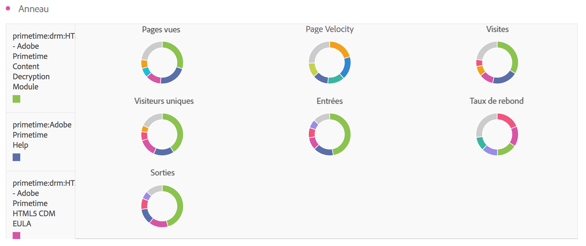

# Anneau

Semblable à un graphique circulaire, cette visualisation présente les données comme des portions ou des segments d’un tout. Utilisez un graphique en anneau pour comparer des pourcentages par rapport à un total comprenant peu d’éléments.

