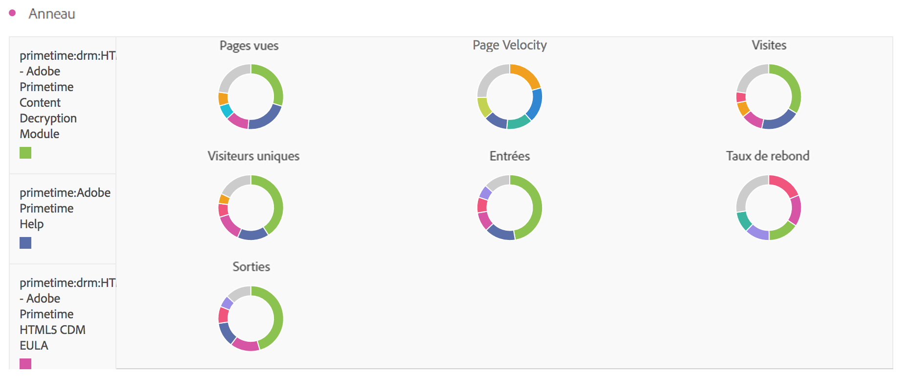

# [!UICONTROL Anneau] {#donut}

<!-- markdownlint-disable MD034 -->

>[!CONTEXTUALHELP]
>id="workspace_donut_button"
>title="Anneau"
>abstract="Créez un graphique en anneau pour comparer des pourcentages par rapport à un total comprenant généralement peu d’éléments."

<!-- markdownlint-enable MD034 -->

>[!BEGINSHADEBOX]

_Cet article présente la visualisation en anneau dans_  _**Adobe Analytics**._ _Voir [Anneau](https://experienceleague.adobe.com/fr/docs/analytics-platform/using/cja-workspace/visualizations/donut) pour la version_  _**Customer Journey Analytics** de cet article._

>[!ENDSHADEBOX]

Semblable à un graphique en secteurs, la visualisation  **[!UICONTROL Anneau]** présente les données comme des portions ou des filtres d’un tout. Utilisez une visualisation en anneau pour comparer des pourcentages par rapport à un total comprenant normalement peu d’éléments.

>[!BEGINSHADEBOX]

Consultez  [Ajouter une visualisation en anneau](https://experienceleague.adobe.com/en/docs/analytics-learn/tutorials/analysis-workspace/visualizations/using-the-donut-visualization){target="_blank"} pour une vidéo de démonstration.

>[!ENDSHADEBOX]

>[!MORELIKETHIS]
>
>[Ajouter une visualisation à un panneau](/help/analyze/analysis-workspace/visualizations/freeform-analysis-visualizations.md#add-visualizations-to-a-panel)
>[Paramètres de visualisation](/help/analyze/analysis-workspace/visualizations/freeform-analysis-visualizations.md#settings)
>[Menu contextuel de visualisation](/help/analyze/analysis-workspace/visualizations/freeform-analysis-visualizations.md#context-menu)
>

