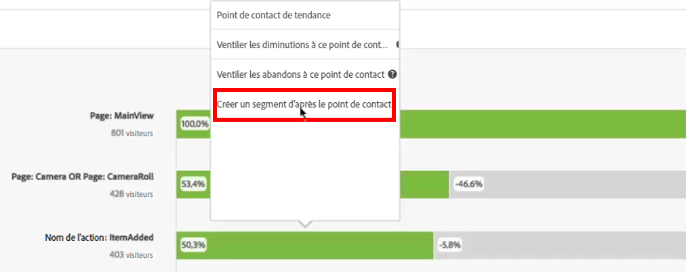
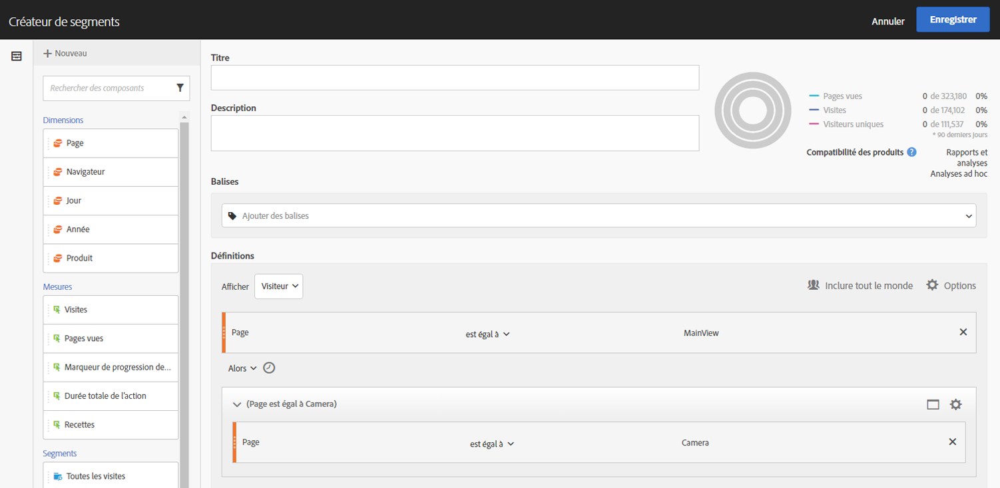
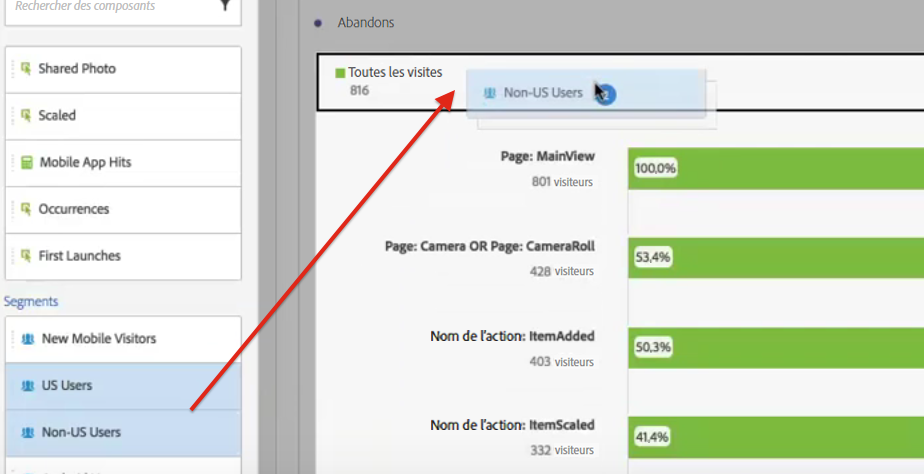
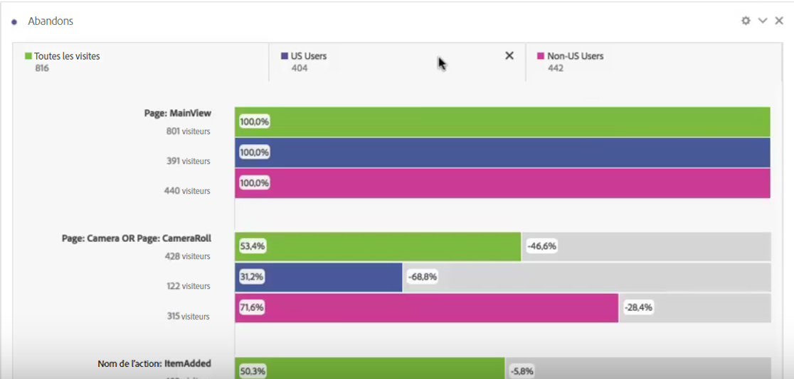

# Application de segments dans l’analyse des abandons

Dans Analysis Workspace, vous pouvez créer des segments d’après un point de contact, ajouter des segments comme point de contact et comparer des processus clés pour plusieurs segments.

>[!IMPORTANT] Les segments utilisés comme points de contrôle dans la visualisation Abandons doivent utiliser un conteneur qui se trouve à un niveau inférieur par rapport au contexte global de la visualisation Abandons. Dans le cas d’une visualisation Abandons sur base du visiteur, les segments utilisés comme points de contrôle doivent être des segments basés sur les visites ou les accès. Dans le cas d’une visualisation Abandons sur base de la visite, les segments utilisés comme point de contrôle doivent être des segments basés sur les accès. Si vous utilisez une combinaison non valide, les abandons seront de 100 %. Nous avons ajouté un avertissement à la visualisation Abandons qui s’affiche lorsque vous ajoutez un segment incompatible en tant que point de contact. Certaines combinaisons de conteneurs de segments non valides entraîneront des diagrammes Abandons non valides, tels que :

* l’utilisation d’un segment basé sur les visiteurs comme point de contact dans une visualisation Abandons sur base du visiteur
* l’utilisation d’un segment basé sur les visiteurs comme point de contact dans une visualisation Abandons sur base de la visite
* l’utilisation d’un segment basé sur les visites comme point de contact dans une visualisation Abandons sur base de la visite

## Création d’un segment à partir d’un point de contact {#section_915E8FBF35CD4F34828F860C1CCC2272}

1. Créez un segment d’après un point de contact donné qui vous intéresse particulièrement et qu’il peut être utile d’appliquer à d’autres rapports. Pour ce faire, cliquez avec le bouton droit sur le point de contact et sélectionnez **[!UICONTROL Create segment from touchpoint]**.

   

   Le créateur de segments s’ouvre, prérenseigné avec le segment séquentiel préconstruit qui correspond au point de contact que vous avez sélectionné :

   

1. Attribuez au segment un titre et une description, puis enregistrez-le.

   Vous pouvez désormais utiliser ce segment dans n’importe quel rapport.

## Ajout d’un segment comme point de contact {#section_17611C1A07444BE891DC21EE8FC03EFC}

Si vous souhaitez voir, par exemple, comment vos utilisateurs américains suivent la tendance et affectent les abandons, il vous suffit de faire glisser le segment des utilisateurs américains vers les abandons :

Vous pouvez également créer un point de contact ET en faisant glisser le segment des utilisateurs américains vers un autre point de contrôle.

## Comparaison des segments dans la visualisation Abandons {#section_E0B761A69B1545908B52E05379277B56}

Vous pouvez comparer un nombre illimité de segments dans la visualisation Abandons.

1. Sélectionnez les segments à comparer dans le [!UICONTROL Segments] rail de gauche. Dans notre exemple, nous avons sélectionné 2 segments : Utilisateurs américains et non américains.
1. Faites-les glisser dans la zone de dépôt Segment en haut.

   

1. Facultatif : Vous pouvez conserver &quot;Toutes les visites&quot; comme  par défaut ou le supprimer.

   

1. Vous pouvez désormais comparer les abandons entre les deux segments, par exemple lorsqu’un segment est plus performant qu’un autre, ou d’autres informations.
