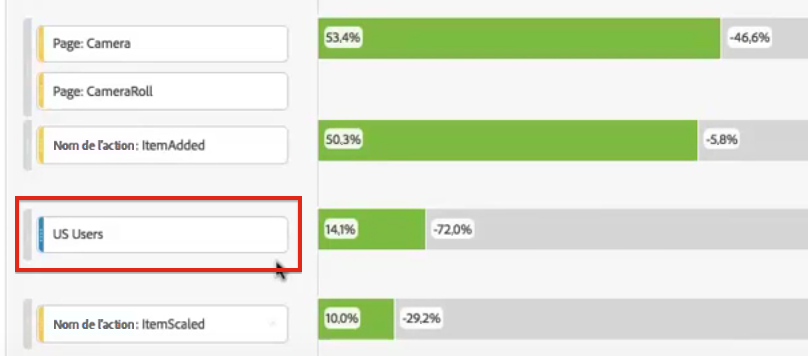

# Application de segments dans l’analyse des abandons

Dans Analysis Workspace, vous pouvez créer des segments d’après un point de contact, ajouter des segments comme point de contact et comparer des processus clés pour plusieurs segments.

>[!IMPORTANT]
>
>Les segments utilisés comme points de contrôle dans la visualisation Abandons doivent utiliser un conteneur qui se trouve à un niveau inférieur par rapport au contexte global de la visualisation Abandons. Dans le cas d’une visualisation Abandons sur base du visiteur, les segments utilisés comme points de contrôle doivent être des segments basés sur les visites ou les accès. Dans le cas d’une visualisation Abandons sur base de la visite, les segments utilisés comme point de contrôle doivent être des segments basés sur les accès. Si vous utilisez une combinaison non valide, les abandons seront de 100 %. Un avertissement s’affiche dans la visualisation des abandons lorsque vous ajoutez un segment incompatible comme point de contact. Certaines combinaisons de conteneurs de segments non valides entraîneront des diagrammes Abandons non valides, tels que :
>
>* Utilisation d’un segment basé sur les visiteurs comme point de contact dans une visualisation des abandons avec contexte de visiteur.
>* Utilisation d’un segment basé sur les visiteurs comme point de contact dans une visualisation des abandons avec contexte de visite.
>* Utilisation d’un segment basé sur les visites comme point de contact dans une visualisation des abandons avec contexte de visite.
>

## Création d’un segment à partir d’un point de contact

1. Créez un segment d’après un point de contact donné qui vous intéresse particulièrement et qu’il peut être utile d’appliquer à d’autres rapports. Pour ce faire, cliquez avec le bouton droit de la souris sur un point de contact, puis sélectionnez **[!UICONTROL Créer un segment d’après le point de contact]**.

   

   Le créateur de segments s’ouvre ; il est prérenseigné avec le segment séquentiel prédéfini qui correspond au point de contact que vous avez sélectionné :

   

1. Nommez et décrivez le segment, puis enregistrez-le.

   Vous pouvez désormais utiliser ce segment dans le projet de votre choix.

## Ajout d’un segment comme point de contact

Si vous souhaitez voir, par exemple, comment les accès aux applications mobiles ont tendance à affecter les abandons, faites glisser le segment Accès aux applications mobiles dans les abandons :

Vous pouvez également créer un point de contact AND en faisant glisser le segment Accès à l’application mobile sur un autre point de contrôle.

## Comparaison des segments dans la visualisation Abandons

Vous pouvez comparer un nombre illimité de segments dans la visualisation des abandons. (Notez que la vidéo ci-dessous indique que vous pouvez comparer jusqu’à 3 segments, ce qui est faux.)

>[!BEGINSHADEBOX]

Voir  [Comparer des segments dans une visualisation des abandons](https://video.tv.adobe.com/v/24046?quality=12&learn=on){target="_blank"} pour une vidéo de démonstration.

>[!ENDSHADEBOX]

1. Sélectionnez les segments à comparer dans le panneau [!UICONTROL Segment] à gauche. Dans l’exemple, deux segments sont sélectionnés : **[!UICONTROL iOS]** et **[!UICONTROL Android]**.
1. Faites glisser les trois segments sur la zone de dépôt de segments en haut de la visualisation.

   

1. Facultatif : vous pouvez conserver *Toutes les personnes* comme conteneur par défaut ou supprimer le conteneur.

1. Vous pouvez maintenant comparer les abandons entre les trois segments, par exemple pour savoir où un segment est plus performant qu’un autre, ou obtenir d’autres informations.
