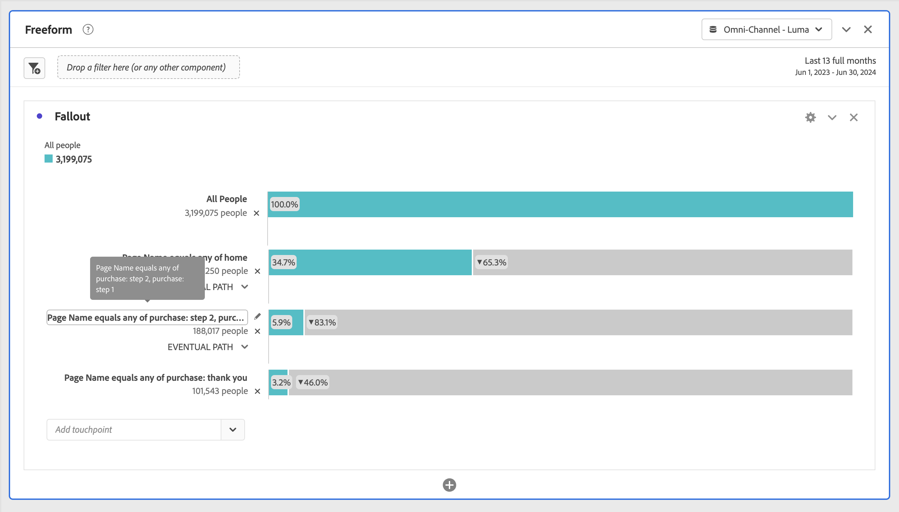

# Configuration d’une visualisation Abandons

Vous pouvez spécifier les points de contact d’après lesquels créer une séquence d’abandons multidimensionnelle. En général, un point de contact est une page sur votre site. Ils ne se limitent toutefois pas à cela. Vous pouvez par exemple ajouter des événements, tels que des unités, ainsi que des personnes uniques et des visites récurrentes. Vous pouvez aussi ajouter des dimensions, telles qu’une catégorie, un type de navigateur ou un terme de recherche interne.

Il est possible en outre d’ajouter des segments dans un point de contact, Par exemple, vous pourriez vouloir comparer des segments, comme les utilisateurs et utilisatrices d’iOS et d’Android™. Faites glisser les segments à comparer en haut de l’abandon pour ajouter des informations sur ces segments au rapport sur les abandons. Pour afficher seulement ces segments, supprimez la ligne de base Toutes les visites.

Il n’existe aucune restriction quant au nombre d’étapes pouvant être ajoutées ou au nombre de dimensions utilisées.

Vous pouvez effectuer un cheminement sur des dimensions, des mesures et des segments. Supposons par exemple qu’une personne consulte sur une page la séquence chaussures, chemise puis, sur la page suivante, la séquence chemise, chaussettes. Le prochain rapport de flux de produits généré à partir des chaussures portera sur chemise et chaussettes, SAUF chemise.

## Utilisation

1. Ajoutez une visualisation  **[!UICONTROL Abandon]**. Voir [Ajouter une visualisation à un panneau](../freeform-analysis-visualizations.md#add-visualizations-to-a-panel).
1. Faites glisser une page, par exemple l’accueil, de la dimension Page vers le menu déroulant *Ajouter un point de contact*.

   

   Pointez sur un point de contact pour afficher l’abandon et d’autres informations sur ce niveau, telles que le nom du point de contact et le nombre de personnes à ce point. Affichez ensuite le taux de succès de ce point de contact (et comparez le taux de succès à d’autres points de contact).

   Les nombres encadrés dans la partie grise de la barre correspondent aux abandons entre les points de contact (et non à l’ensemble des abandons à ce point). La visualisation **[!UICONTROL % point de contact]** présente les accès immédiats réussis de l’étape précédente à l’étape actuelle dans le rapport sur les abandons.

   Vous pouvez également ajouter une seule page au rapport des abandons, plutôt que la dimension entière. Cliquez sur la flèche droite  sur la dimension de page pour sélectionner la page à ajouter au rapport sur les abandons.

1. Continuez à ajouter des points de contact jusqu’à ce que votre séquence soit complète.

   Vous pouvez **combiner plusieurs points de contact** en les faisant glisser les uns sur les autres.

   >[!NOTE]
   >
   >Plusieurs segments sont reliés par l’opérateur ET, mais plusieurs éléments, tels que des éléments de dimension et les mesures, sont reliés par l’opérateur OU.

   

1. Vous pouvez également **limiter les points de contact individuels pour le prochain événement** au sein du chemin (par opposition à un aspect *définitif*). Chaque point de contact est assorti d’un sélecteur avec les options **[!UICONTROL Chemin définitif]** et **[!UICONTROL Prochain événement]**, comme illustré ici :

   

   | Option | Description |
   |---|---|
   | **[!UICONTROL Chemin définitif]** (par défaut) | Nombre de personnes qui *finiront* par accéder à la page suivante du chemin d’accès, mais pas nécessairement au prochain événement. |
   | **[!UICONTROL Événement suivant]** | Nombre de personnes qui accéderont à la page suivante du chemin dès le prochain événement. |

## Paramètres

Dans le cadre de la visualisation, des paramètres spécifiques sont disponibles.

| Conteneur d’abandons | Description |
|--- |--- |
| **[!UICONTROL Session]** ou **[!UICONTROL Personne]** | Permet de basculer entre [!UICONTROL Session] et [!UICONTROL Personne] afin d’analyser le cheminement de la personne. La valeur par défaut est [!UICONTROL Personne]. Ces paramètres permettent de comprendre l’engagement des personnes au niveau des personnes (sur les sessions) ou de contraindre l’analyse à une seule session. |

## Menu contextuel

Dans le cadre de la visualisation, des options de menu contextuel spécifiques sont disponibles.

| Option | Description |
|--- |--- |
| **[!UICONTROL Tendance du point de contact]** | Consultez dans un graphique linéaire les données sur les tendances d’un point de contact, avec quelques données de détection des anomalies prédéfinies. |
| **[!UICONTROL Tendance du point de contact (%)]** | Calcule la tendance du pourcentage total d’abandons. |
| **[!UICONTROL Tendance de tous les points de contact (%)]** | Calcule la tendance de tous les pourcentages des points de contact de l’abandon (sauf «**[!UICONTROL Toutes les personnes]** si inclus) sur le même graphique. |
| **[!UICONTROL Ventiler les abandons à ce point de contact]** | Vérifiez ce que les personnes ont fait entre deux points de contact (ce point de contact et le point de contact suivant) si elles ont continué jusqu’au point de contact suivant. Un tableau à structure libre présentant les dimensions est ainsi créé. Vous pouvez y remplacer les dimensions et d’autres éléments qui le composent. |
| **[!UICONTROL Ventiler les abandons à ce point de contact]** | Vérifiez quelles personnes qui n’ont pas franchi l’entonnoir l’ont fait immédiatement après l’étape sélectionnée. |
| **[!UICONTROL Créer un segment à partir du point de contact]** | Créez un segment à partir du point de contact sélectionné. |

>[!MORELIKETHIS]
>
>[Ajouter une visualisation à un panneau](/help/analyze/analysis-workspace/visualizations/freeform-analysis-visualizations.md#add-visualizations-to-a-panel)
>>[Paramètres de visualisation](/help/analyze/analysis-workspace/visualizations/freeform-analysis-visualizations.md#settings)
>>[Menu contextuel de visualisation](/help/analyze/analysis-workspace/visualizations/freeform-analysis-visualizations.md#context-menu)
>

