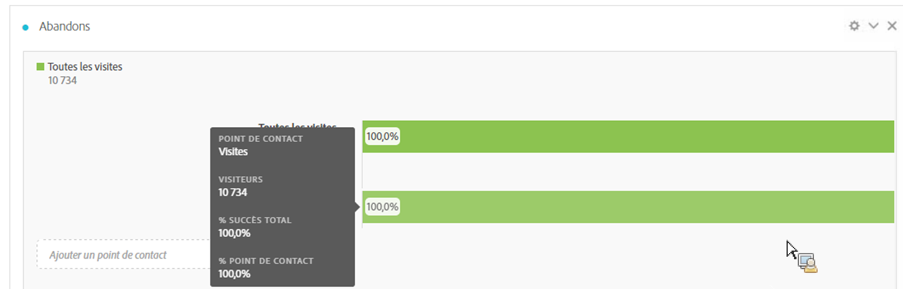
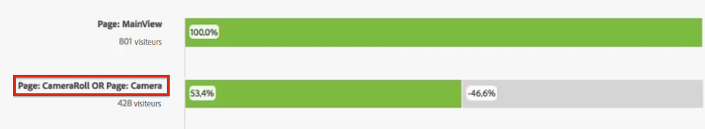
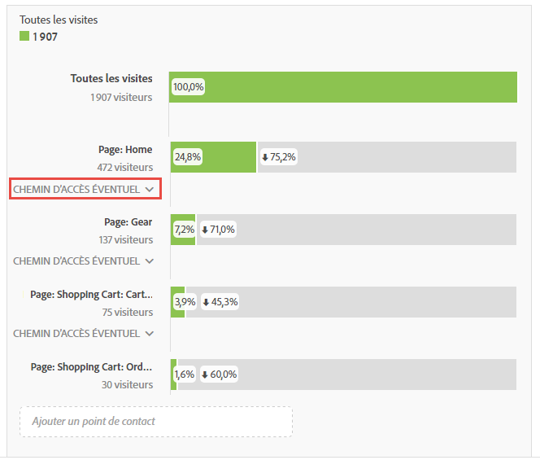

# Configuration d’une visualisation Abandons

Vous pouvez spécifier les points de contact d’après lesquels créer une séquence d’abandons multidimensionnelle. En général, un point de contact est une page sur votre site. Ils ne se limitent toutefois pas à cela. Vous pouvez par exemple ajouter des événements, tels que des unités, ainsi que des visiteurs uniques et des visites récurrentes. Vous pouvez aussi ajouter des dimensions, telles qu’une catégorie, un type de navigateur ou un terme de recherche interne.

Il est possible en outre d’ajouter des segments dans un point de contact, par exemple pour comparer les utilisateurs d’iOS à ceux d’Android. Faites glisser les segments à comparer en haut de l’abandon pour ajouter des informations sur ces segments au rapport sur les abandons. Pour afficher seulement ces segments, supprimez la ligne de base Toutes les visites.

Il n’existe aucune restriction quant au nombre d’étapes pouvant être ajoutées ou au nombre de dimensions utilisées.

Vous pouvez créer un rapport de cheminement sur les eVars, y compris les eVars de marchandisage et les [listVars](https://experienceleague.adobe.com/docs/analytics/implementation/vars/page-vars/page-variables.html?lang=fr) (variables pouvant avoir plusieurs valeurs par accès, tels les produits, listVars, les eVars de marchandisage et les props de liste). Supposons par exemple qu’un visiteur consulte sur une page la séquence chaussures, chemise puis, sur la page suivante, la séquence chemise, chaussettes. Le prochain rapport de flux de produits généré à partir des chaussures portera sur chemise et chaussettes, SAUF chemise.

1. Faites glisser une visualisation [!UICONTROL Abandons] de la liste déroulante des visualisations dans un [!UICONTROL tableau à structure libre].

1. Faites glisser la dimension Page dans le tableau à structure libre puis, de là, faites glisser une page (dans ce cas, Home - JJEsquire) sur le champ **[!UICONTROL Ajouter un point de contact]** comme premier point de contact.

   

   Pointez sur un point de contact afin d’afficher les abandons et autres informations sur ce niveau (nom du point de contact, nombre de visiteurs à ce point, etc.) puis consultez le taux de succès pour ce point de contact (et comparez-le à celui d’autres points de contact).

   Les nombres encadrés dans la partie grise de la barre correspondent aux abandons entre les points de contact (et non à l’ensemble des abandons à ce point). Le % point de contact présente les accès immédiats réussis de l’étape précédente à l’étape actuelle dans le rapport des abandons.

   Vous pouvez également ajouter une seule page au rapport des abandons, plutôt que la dimension entière. Cliquez sur la flèche droite (>) sur la dimension de page pour sélectionner la page à ajouter au rapport des abandons.

1. Continuez à ajouter des points de contact jusqu’à ce que votre séquence soit complète.

   Vous pouvez **combiner plusieurs points de contact** en les faisant glisser les uns sur les autres.

   >[!NOTE]
   >
   >Plusieurs segments sont reliés par l’opérateur AND, mais plusieurs éléments, tels que des éléments de dimension et des mesures, sont reliés par l’opérateur OR.

   

1. Vous pouvez également **limiter les points de contact individuels pour la prochaine procédure** au sein du chemin (par opposition à un aspect définitif). Chaque point de contact est assorti d’un sélecteur avec les options « Chemin d’accès éventuel » et « Prochain accès », comme illustré ici :

   

<table id="table_A91D99D9364B41929CC5A5BC907E8985"> 
 <tbody> 
  <tr> 
   <td colname="col1"> 
Chemin d’accès éventuel 
 
(Par défaut) 
 </td> 
   <td colname="col2"> 
Les visiteurs (ou les visites) sont comptés dès lors qu’ils arrivent sur le prochain point de contact du parcours. Les détours sont autorisés entre les points de contact. 
 </td> 
  </tr> 
  <tr> 
   <td colname="col1"> 
Prochain accès 
 </td> 
   <td colname="col2"> 
Les visiteurs (ou visites) sont comptés lorsqu’ils arrivent immédiatement sur le prochain point de contact du parcours. Le prochain accès comprend tous les types d’accès (pages vues ou liens). Les détours ne sont pas autorisés entre les points de contact. 
 </td> 
  </tr> 
 </tbody> 
</table>

## Paramètres d’abandon {#section_0C7C89D72F0B4D6EB467F278AC979093}

| Paramètre | Description |
|--- |--- |
| Conteneur d’abandons <ul><li>Visite</li><li>Visiteur</li></ul> | Permet de basculer entre Visite et Visiteur afin d’analyser le cheminement du visiteur. La valeur par défaut est Visiteur.  Ces paramètres permettent de comprendre l’engagement des visiteurs au niveau des visiteurs (à l’échelle de toutes visites) ou de contraindre l’analyse à une seule visite. |

Lorsque vous **cliquez avec le bouton droit de la souris sur un point de contact**, les options suivantes s’affichent :

| Option | Description |
|--- |--- |
| Point de contact de tendance | Consultez dans un graphique linéaire les données sur les tendances d’un point de contact, avec quelques données de détection des anomalies prédéfinies. |
| Point de contact de tendance (%) | Calcule la tendance du pourcentage total d’abandons. |
| Tendance tous points de contact (%) | Calcule la tendance de tous les pourcentages des points de contact de l’abandon (sauf « Toutes les visites » si inclus) sur le même graphique. |
| Ventiler les abandons à ce point de contact | Vérifiez ce que les visiteurs ont fait entre deux points de contact (ce point de contact et le point de contact suivant) s’ils ont continué jusqu’au point de contact suivant. Un tableau à structure libre présentant les dimensions est ainsi créé. Vous pouvez y remplacer les dimensions et d’autres éléments qui le composent. |
| Ventiler les abandons à ce point de contact | Vérifiez quelles personnes qui n’ont pas franchi l’entonnoir l’ont fait immédiatement après l’étape sélectionnée. |
| Créer un segment d’après le point de contact | Créez un segment à partir du point de contact sélectionné. |
