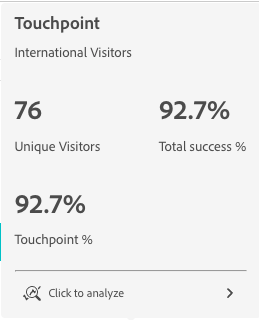

# Configuration d’une visualisation Abandons

Vous pouvez spécifier les points de contact d’après lesquels créer une séquence d’abandons multidimensionnelle. En général, un point de contact est une page sur votre site. Ils ne se limitent toutefois pas à cela. Vous pouvez par exemple ajouter des événements, tels que des unités, ainsi que des personnes uniques et des visites récurrentes. Vous pouvez aussi ajouter des dimensions, telles qu’une catégorie, un type de navigateur ou un terme de recherche interne.

Il est possible en outre d’ajouter des segments dans un point de contact, Par exemple, vous pourriez vouloir comparer des segments, comme les utilisateurs et utilisatrices d’iOS et d’Android™. Faites glisser les segments à comparer en haut de l’abandon pour ajouter des informations sur ces segments au rapport sur les abandons. Pour afficher seulement ces segments, supprimez la ligne de base Toutes les visites.

Il n’existe aucune restriction quant au nombre d’étapes pouvant être ajoutées ou au nombre de dimensions utilisées.

Vous pouvez effectuer un cheminement sur des dimensions, des mesures et des segments. Supposons par exemple qu’une personne consulte sur une page la séquence chaussures, chemise puis, sur la page suivante, la séquence chemise, chaussettes. Le prochain rapport de flux de produits généré à partir des chaussures portera sur chemise et chaussettes, SAUF chemise.

## Utilisation

1. Ajoutez une visualisation  **[!UICONTROL Abandon]**. Voir [Ajouter une visualisation à un panneau](../freeform-analysis-visualizations.md#add-visualizations-to-a-panel).
1. Faites glisser un composant vers le menu déroulant **[!UICONTROL Ajouter un point de contact]**.

   Par exemple, vous pouvez ajouter une seule page au rapport sur les abandons, plutôt que la dimension entière. Cliquez sur la flèche droite  sur la dimension de page pour sélectionner une page spécifique, telle que **[!UICONTROL accueil]**, à ajouter au rapport sur les abandons.

   

1. Continuez à ajouter des points de contact jusqu’à ce que votre séquence soit complète.

   Les nombres encadrés dans la partie grise de la barre correspondent aux abandons entre les points de contact (et non à l’ensemble des abandons à ce point). La visualisation **[!UICONTROL % point de contact]** présente les accès immédiats réussis de l’étape précédente à l’étape actuelle dans le rapport sur les abandons.

   

   Lors de l’ajout de points de contact, vous pouvez effectuer l’une des opérations suivantes :

   * Combinez plusieurs composants en faisant glisser un ou plusieurs composants supplémentaires sur un seul point de contact.

     >[!NOTE]
     >
     >Plusieurs segments sont reliés par l’opérateur ET, mais plusieurs éléments, tels que des éléments de dimension et les mesures, sont reliés par l’opérateur OU.

   * Réorganisez les points de contact en les faisant glisser vers un autre niveau dans la hiérarchie des abandons.

   * Combinez un point de contact avec un autre. Pour combiner des points de contact, faites glisser un point de contact sur un autre. Déposez-le lorsque vous voyez le mot **[!UICONTROL Combiner]**.

     

   * Contraindre des points de contact individuels à l’événement suivant (par opposition à *éventuellement*) dans le chemin. Sous chaque point de contact se trouve un sélecteur avec les options **[!UICONTROL Chemin éventuel]** et **[!UICONTROL Événement suivant]**, comme illustré ici :

     

     | Option | Description |
     |---|---|
     | **[!UICONTROL Chemin définitif]** (par défaut) | Les visiteurs qui *éventuellement* arriveront sur la page suivante du chemin, mais pas nécessairement sur l’événement suivant, sont comptés. |
     | **[!UICONTROL Événement suivant]** | Les visiteurs qui arriveront sur la page suivante du chemin lors du prochain événement sont comptés. |

   * Pointez sur un point de contact pour afficher l’abandon et d’autres informations sur ce niveau. Les informations incluent le nom du point de contact, le nombre de personnes et le taux de réussite. Vous pouvez également comparer le taux de succès à d’autres points de contact.

     

## Paramètres

Dans le cadre de la visualisation, des paramètres spécifiques sont disponibles.

| Conteneur d’abandons | Description |
|--- |--- |
| **[!UICONTROL Session]** ou **[!UICONTROL Personne]** | Permet de basculer entre [!UICONTROL Session] et [!UICONTROL Personne] afin d’analyser le cheminement de la personne. La valeur par défaut est [!UICONTROL Personne]. Ces paramètres permettent de comprendre l’engagement des personnes au niveau des personnes (sur les sessions) ou de contraindre l’analyse à une seule session. |

## Menu contextuel

Dans le cadre de la visualisation, des options de menu contextuel spécifiques sont disponibles.

### Accès au menu contextuel

Vous pouvez accéder au menu contextuel de l’une des manières suivantes :

* Pointez sur un point de contact dans la visualisation, puis sélectionnez **[!UICONTROL Cliquer pour analyser]**.

  

* Cliquez avec le bouton droit sur un point de contact dans la visualisation.

  

### Options du menu contextuel

Les options de menu contextuel suivantes sont disponibles :

| Option | Description |
|--- |--- |
| **[!UICONTROL Tendance du point de contact]** | Consultez dans un graphique linéaire les données sur les tendances d’un point de contact, avec quelques données de détection des anomalies prédéfinies. |
| **[!UICONTROL Tendance du point de contact (%)]** | Calcule la tendance du pourcentage total d’abandons. |
| **[!UICONTROL Tendance de tous les points de contact (%)]** | Calcule la tendance de tous les pourcentages des points de contact de l’abandon (sauf «**[!UICONTROL Toutes les personnes]** si inclus) sur le même graphique. |
| **[!UICONTROL Répartir les baisses à ce point de contact]** | Vérifiez ce que les visiteurs ont fait entre deux points de contact (ce point de contact et le point de contact suivant) s’ils ont continué jusqu’au point de contact suivant. Cette option crée un tableau à structure libre présentant vos dimensions. Vous pouvez remplacer des dimensions et d’autres éléments du tableau. Par exemple, un tableau intitulé **[!UICONTROL Abandon : tous les visiteurs > Page est égal à l’un des domaines d’accueil]** et contient **[!UICONTROL Page]** comme dimension et **[!UICONTROL Visiteurs uniques]** segmenté par la mesure [segment rapide de projet uniquement](/help/components/segmentation/segmentation-workflow/seg-quick.md) **[!UICONTROL Abandon : tous les visiteurs > Page est égal à l’un des domaines d’accueil]**. Inspectez le segment pour comprendre comment le segment de secours est déterminé. |
| **[!UICONTROL Répartir les abandons à ce point de contact]** | Affichez ce que les visiteurs et visiteuses qui n’ont pas réussi à faire via le funnel ont fait immédiatement après l’étape sélectionnée. Cette option crée un tableau à structure libre présentant vos dimensions. Vous pouvez remplacer des dimensions et d’autres éléments du tableau. Par exemple, un tableau intitulé **[!UICONTROL Abandon : tous les visiteurs > Page est égal à l’un des domaines d’accueil]** et contient **[!UICONTROL Page]** comme dimension et **[!UICONTROL Visiteurs uniques]** segmenté par la mesure [segment rapide de projet uniquement](/help/components/segmentation/segmentation-workflow/seg-quick.md) **[!UICONTROL Abandon : tous les visiteurs > Page est égal à l’un des domaines d’accueil]** segment comme mesure. Examinez le segment pour comprendre comment le segment d’abandon est déterminé. |
| **[!UICONTROL Créer un segment à partir du point de contact]** | Créez un segment à partir du point de contact sélectionné. |

>[!MORELIKETHIS]
>
>[Ajouter une visualisation à un panneau](/help/analyze/analysis-workspace/visualizations/freeform-analysis-visualizations.md#add-visualizations-to-a-panel)
>[Paramètres de visualisation](/help/analyze/analysis-workspace/visualizations/freeform-analysis-visualizations.md#settings)
>[Menu contextuel de visualisation](/help/analyze/analysis-workspace/visualizations/freeform-analysis-visualizations.md#context-menu)
>

