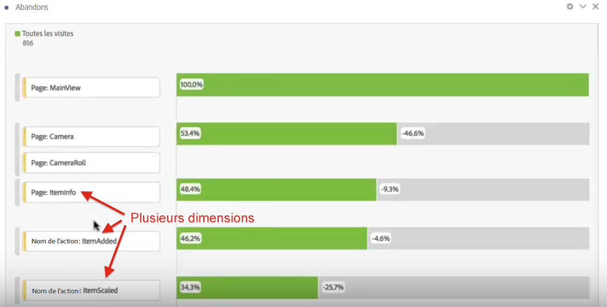
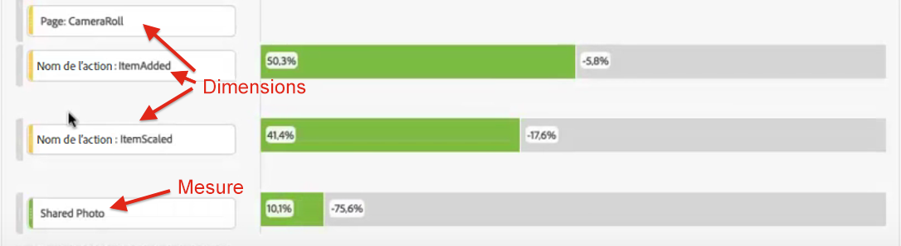
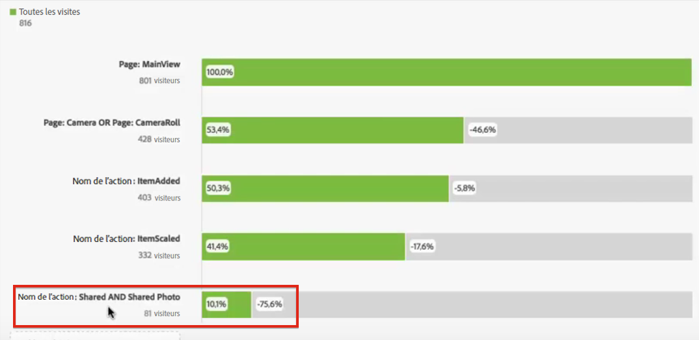

# Abandons multidimensionnels

Dans Analysis Workspace, utilisez les abandons pour combiner et associer des dimensions et des mesures comme points de contact dans les entonnoirs et les processus. Vous disposez ainsi d’une plus grande flexibilité pour définir les étapes des utilisateurs sur lesquelles vous souhaitez en savoir plus.

>[!BEGINSHADEBOX]

Voir  [Abandon multidimensionnel](https://video.tv.adobe.com/v/24043?quality=12&learn=on){target="_blank"} pour une vidéo de démonstration.

>[!ENDSHADEBOX]

**Exemple** : Outre, supposons, une dimension Page, vous pouvez ajouter à une visualisation Abandons des éléments de dimension basés sur l’action. Vous pouvez ainsi visualiser le rôle des pages et de certaines actions dans le parcours de vos clients.

La visualisation Abandons est mise à jour de manière dynamique et permet de visualiser les abandons à l’échelle de plusieurs dimensions.

Vous pouvez également ajouter des mesures à cette combinaison. Dans cet exemple, nous avons ajouté la mesure Photo partagée afin de déterminer le parcours suivi par les clients :

Par ailleurs, vous pouvez combiner différentes dimensions et mesures dans des points de contrôle AND. Faites simplement glisser une dimension ou une mesure sur une autre :

