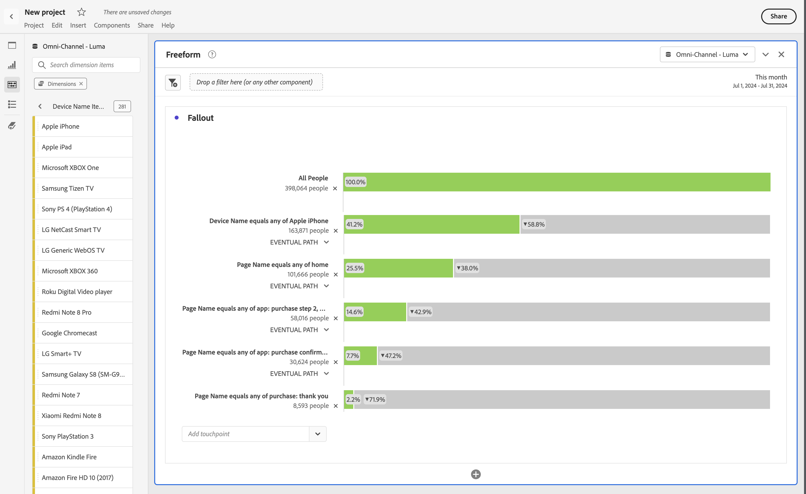

# Abandons interdimensionnels

Dans Analysis Workspace, l’abandon permet de combiner et de faire correspondre des dimensions et des mesures comme points de contact dans les entonnoirs et les workflows. Les abandons vous offrent davantage de flexibilité pour définir les étapes utilisateur sur lesquelles vous souhaitez en savoir plus.

Par exemple, en plus d’une dimension Page , vous pouvez ajouter d’autres éléments de dimension (comme un nom d’appareil spécifique à partir de la dimension Nom de l’appareil ) à une visualisation Abandons . La combinaison de dimensions vous permet de visualiser la façon dont les pages et certaines actions interagissent dans les chemins des clients.

>[!BEGINSHADEBOX]

Voir  [Abandon multidimensionnel](https://video.tv.adobe.com/v/327465?quality=12&learn=on&captions=fre_fr){target="_blank"} pour une vidéo de démonstration.

>[!ENDSHADEBOX]

Par exemple, en plus d’une dimension Page , vous pouvez ajouter d’autres éléments de dimension (comme un nom d’appareil spécifique à partir de la dimension Nom de l’appareil ) à une visualisation Abandons . La combinaison de dimensions vous permet de visualiser la façon dont les pages et certaines actions interagissent dans les chemins des clients.

La visualisation Abandons est mise à jour de manière dynamique et permet de visualiser les abandons à l’échelle de plusieurs dimensions.

Vous pouvez également ajouter des mesures. Par exemple, vous pouvez ajouter la mesure Appel pour n’afficher que les chemins des utilisateurs pour lesquels des appels existent et qui ont contacté le centre d’appels :

Vous pouvez combiner des dimensions et des mesures. Faites glisser une autre dimension ou mesure en plus d’une dimension existante. Par exemple, pour comprendre les conséquences pour les personnes qui disposent d’un iPhone et qui ont contacté le centre d’appel.

