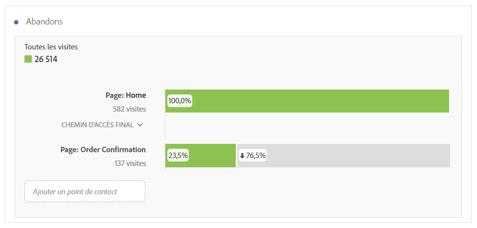
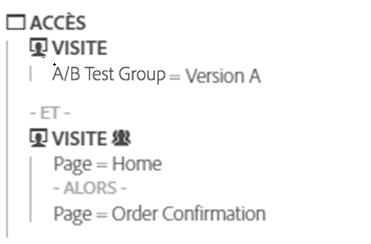
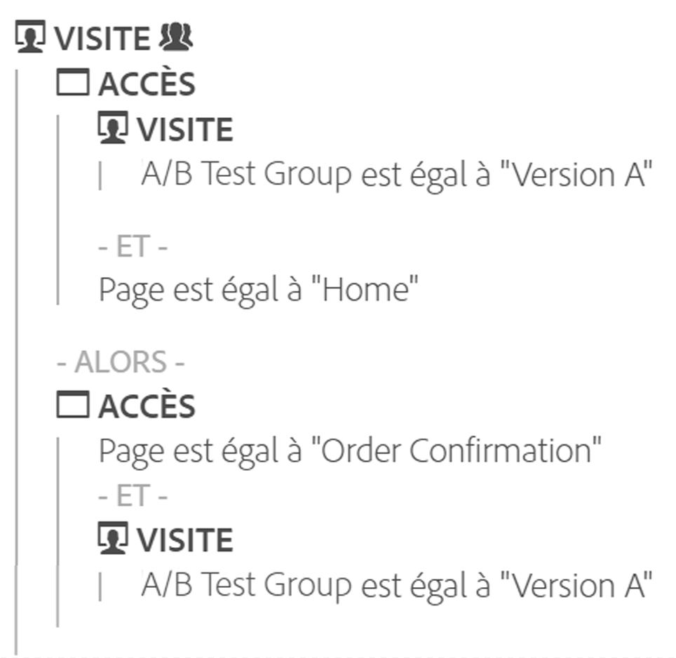

# Abandon - Aperçu

Dans les visualisations Abandons, vous trouverez davantage d’options pour créer des rapports sur les abandons. Ceux-ci indiquent où les visiteurs ont quitté (abandonné) une suite prédéfinie de pages et où ils ont poursuivi leur visite à travers ces pages (diminution). 

Grâce aux visualisations Abandons, vous pouvez :

* Comparer en vis-à-vis deux segments du même rapport
* Faire glisser, déposer et réorganiser les étapes de l’entonnoir (points de contact)
* Combiner et associer des valeurs issues de différentes dimensions et mesures
* Créer un rapport multidimensionnel sur les abandons
* Déterminer où se rendent les clients immédiatement après un abandon

La visualisation Abandons présente les taux de conversion et d’abandon entre chaque étape ou point de contact d’une séquence.

Vous pouvez, par exemple, effectuer le suivi des points d’abandon d’un visiteur au cours d’un processus d’achat. Il vous suffit de sélectionner un point de contact de départ et un autre de conclusion, puis d’ajouter des points de contact intermédiaires afin de créer un chemin de navigation sur le site web. Vous pouvez également effectuer un suivi sur les abandons multidimensionnels.

Une visualisation des abandons s’avère utile pour l’analyse des éléments suivants :

* Taux de conversion par le biais de processus particuliers sur votre site (tels qu’un processus d’achat ou d’enregistrement).
* Flux de trafic général de portée plus large : parmi les personnes qui ont consulté la page d’accueil, ce flux montre combien d’entre elles ont réalisé une recherche et combien d’entre elles ont consulté un article en particulier.
* Corrélations entre les événements de votre site. Les corrélations indiquent quel pourcentage de personnes ayant consulté votre politique de confidentialité ont continué leur visite jusqu’à l’achat d’un produit.

[Visualisation Abandons sur YouTube](https://www.youtube.com/watch?v=VcrfHSyIoj8&amp;index=52&amp;list=PL2tCx83mn7GuNnQdYGOtlyCu0V5mEZ8sS) (4:15)

## Segmentation comme base des flux et des abandons {#section_654F37A398C24DDDB1552A543EE29AA9}

Le fonctionnement des segments appliqués aux panneaux Workspace diffère légèrement de celui des segments appliqués aux rapports Abandons et Flux dans les Reports &amp; Analytics ou Ad Hoc Analysis. En général, ils génèrent exactement les mêmes résultats. La principale différence réside dans le fait que les Reports &amp; Analytics et Ad Hoc Analysis appliquent le segment à chaque étape de la séquence. C’est pourquoi il arrive que les résultats diffèrent légèrement.

Prenons l’exemple d’un abandon avec deux étapes :

Si vous appliquez un segment au niveau du panneau Workspace, il est combiné avec l’abandon comme suit :

En revanche, quand le segment est calculé par les Reports &amp; Analytics et Ad Hoc Analysis, il est combiné comme suit :

Les Reports &amp; Analytics et Ad Hoc Analysis combinent le segment à chaque étape. Si les conteneurs sont au même niveau que l’abandon (par exemple, visite ou visiteur), le nombre de visites ou de visiteurs reste identique.

Si, toutefois, le segment appliqué au panneau est à un niveau inférieur à celui de l’abandon (par exemple, niveau des accès), il produit des résultats différents en raison de la façon dont il est combiné par le rapport. En résumé, dans la plupart des cas, les résultats dans Analysis Workspace sont identiques à ceux des Reports &amp; Analytics et Ad Hoc Analysis. Ils ne seront **pas** identiques uniquement si toutes les conditions ci-après sont vraies :

* Le segment n’est pas au même niveau que l’abandon.
* Le segment contient une variable où le visiteur/la visite peut avoir plusieurs valeurs durant une visite/un visiteur.

Dans le rare cas où Analysis Workspace doit appliquer les segments aux abandons ou aux flux de la même façon que dans les Reports &amp; Analytics, il vous suffit de déposer le segment à chaque étape de l’abandon dans l’Workspace afin de générer les mêmes résultats.
